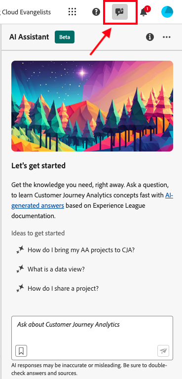

# AI Assistant för Adobe Customer Journey Analytics

AI Assistant är en konversationsupplevelse som gör det möjligt för yrkesverksamma att utföra uppgifter i snabb takt. Om uppgiften är att förstå begrepp, felsöka problem eller söka igenom information. Med AI Assistant kan även icke-experter utföra expertuppgifter och öka den övergripande kvaliteten på arbetet.

AI Assistant i Customer Journey Analytics är utbildad i sin Adobe Experience League-dokumentation. När AI Assistant tillfrågas om det finns ett användbart svar som gör att du snabbt kan lära dig mer.

Som nybörjare kan du använda AI Assistant för att lära dig Customer Journey Analytics koncept och ta in dig själv i produkter och funktioner som du inte känner till. Som erfaren användare kan du använda AI Assistant för att visa mer avancerade användningsexempel eller tips och tricks.

Några exempel på konceptfrågor är:

* Vad är skillnaden mellan batchinmatning och direktuppspelning?
* Vad är Customer Journey Analytics bäst för?
* Hur konfigurerar jag en datavy?

Frågor som inte omfattas av Customer Journey Analytics, t.ex. frågor om andra Adobe-produkter som Adobe Target och Adobe Creative Cloud Suite, kan inte besvaras.

AI Assistant för Customer Journey Analytics finns för alla produktnivåer.

## Produktkunskap {#knowledge}

| Produktkunskap | Exempel |
| --- | --- |
| Undervisning | <ul><li>Vad är skillnaden mellan Adobe Analytics och Customer Journey Analytics?</li><li>Hur bygger jag upp ett beräknat mätvärde?</li></ul> |
| Öppna identifiering | <ul><li>Hur exporterar jag ett Workspace-projekt?</li><li>Hur hittar jag duplicerade Workspace-komponenter?</li></ul> |
| Felsökning | <ul><li>Hur lång tid tar det innan data kommer in i CJA?</li><li>Hur många härledda fält kan jag ha i en Customer Journey Analytics-anslutning?</li></ul> |

## Dataanalys

Data Insights Agent, som är tillgängligt från AI Assistant i Customer Journey Analytics, är en generativ AI-konversationsagent som snabbt och effektivt besvarar frågor om dina data. Det bygger upp relevanta visualiseringar i Analysis Workspace med komponenter från datavyn och med era faktiska data.

Mer information om hur du använder Data Insights Agent i AI-assistenten finns i [Visa data med Data Insights Agent](/help/data-analysis-ai.md).

## Funktionsåtkomst

Följande parametrar styr åtkomsten till AI-assistentfunktionen:

* **Lösning**: AI-assistenten är tillgänglig i Customer Journey Analytics, men inte i Adobe Analytics. Det finns också i Adobe Experience Platform, Adobe Journey Optimizer, Adobe Real-Time CDP och andra Experience Platform-appar.

* **Contractual access**: Om du inte kan använda AI Assistant kontaktar du organisationens administratör eller Adobe Account Representant. Innan din organisation kan använda AI Assistant måste du godkänna vissa GenAI-relaterade juridiska villkor.

* **Behörigheter**: I [!UICONTROL Adobe Admin Console] avgör behörigheten [!UICONTROL Reporting Tools] **[!UICONTROL AI Assistant: Product Knowledge]** åtkomsten till det här verktyget. En [produktprofiladministratör](https://helpx.adobe.com/se/enterprise/using/manage-product-profiles.html) måste följa de här stegen i [!UICONTROL Admin Console]:
   1. Navigera till **[!UICONTROL Admin Console]** > **[!UICONTROL Products and services]** > **[!UICONTROL Customer Journey Analytics]** > **[!UICONTROL Product Profiles]**
   1. Välj titeln för den produktprofil som du vill ge åtkomst till [!UICONTROL AI Assistant: Product Knowledge].
   1. Välj **[!UICONTROL Permissions]** i den specifika produktprofilen.
   1. Välj  om du vill redigera **[!UICONTROL Reporting Tools]**.
   1. Välj  om du vill lägga till **AI-assistenten: Produktkunskap** i **[!UICONTROL Included permission items]**.

      .

   1. Välj **[!UICONTROL Save]** om du vill spara behörigheterna.

Mer information finns i [Åtkomstkontroll](/help/technotes/access-control.md#access-control).

## Åtkomst till AI-assistenten i Customer Journey Analytics användargränssnitt

1. Om du vill starta AI Assistant väljer du AI Assistant-ikonen i det övre sidhuvudet på en sida i Customer Journey Analytics-gränssnittet.

   

   När du använder AI Assistant för första gången visas en ansvarsfriskrivning med villkor för användning av assistenten.

1. I rutan ställer du en specifik fråga på naturspråket i AI-assistenten.

   

1. (Valfritt) Om du vill visa källor klickar du på **[!UICONTROL Show Sources]** och dokumentationskällan eller -källorna som informerade svaret visas.

1. (Valfritt) Du kan även ge en röstning med upp- eller nedstaplar om hur användbart ett visst svar är.

1. (Valfritt) Du kan flagga svaret för olämpligt eller skadligt innehåll.
