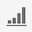

# Projektöversikt

Med Workspace-projekt kan du kombinera paneler, visualiseringar och komponenter för att skapa analyser och dela dem med vem som helst i organisationen. Innan du startar ditt första projekt bör du lära dig hur du får tillgång till, navigerar och hanterar dina projekt.

Om du vill få åtkomst till projekt i Customer Journey Analytics väljer du **[!UICONTROL Workspace]**.  **[!UICONTROL Projects]**-hanteraren visar alla projekt som du äger eller projekt som delas med dig. Projektledaren med projektlistan är också standardstartsida för Customer Journey Analytics, om du inte har konfigurerat något annat i Inställningar.

## Titelområde

I titelområdet ➊ kan du skapa ett projekt, skapa en mapp, redigera dina inställningar och visa eller dölja en panel med ytterligare paneler.

* Om du vill visa eller dölja en vänsterpanel där du kan välja mellan **[!UICONTROL Projects]** och **[!UICONTROL Learning]** väljer du .
* Titeln visar Projekt, eventuellt tillagda med en sökväg till den markerade mappen. Till exempel [!UICONTROL Projects] > **[!UICONTROL Company Folder]**. Du kan välja enskilda undermappsdelar för att gå direkt till den specifika mappen.
* Om du vill visa rutor för en [**[!UICONTROL Blank project]**](create-projects.md), [**[!UICONTROL Blank mobile scorecard]**](/help/mobile-app/create-scorecard.md), [**[!UICONTROL Guided analysis]**](/help/guided-analysis/overview.md), **[!UICONTROL Open the documentation]** och **[!UICONTROL Open release notes]** väljer du  **[!UICONTROL Show more]**. Om du vill dölja området med rutor väljer du  **[!UICONTROL Show less]**.
* Baserat på vad du väljer att visa kan du med [Visa väljare](#show-selector) redigera inställningar och utföra åtgärder i den aktuella mappen som visas i **[!UICONTROL Projects]**:

  | Åtgärd | Beskrivning |
  |---|---|
  | **[!UICONTROL Create project]** | Välj att [skapa ett nytt projekt](create-projects.md). |
  | **[!UICONTROL Create folder]** | Välj att [skapa en ny mapp](workspace-folders/create-folders.md). |
  |  **[!UICONTROL Edit preferences]** | [Redigera inställningar](/help/analysis-workspace/user-preferences.md) för alla dina projekt. När den synliga sökvägen resulterar i begränsat utrymme är den här åtgärden en del av undermenyn . |
  | **[!UICONTROL Add projects]** | Välj att [lägga till projekt](workspace-folders/add-projects.md) i den aktuella mappen. När den synliga sökvägen resulterar i begränsat utrymme är den här åtgärden en del av undermenyn . |
  | **[!UICONTROL Rename folder]** | [Byter namn på](workspace-folders/manage-folders.md#rename-folders) till den aktuella mappen. |
  | **[!UICONTROL Move folder]** | [Flyttar](workspace-folders/manage-folders.md#move-folders) den aktuella mappen. |
  | **[!UICONTROL Delete folder]** | [Tar bort](workspace-folders/manage-folders.md#delete-folders) den aktuella mappen. |

## Projektlista

Projektlistan ➋ visar alla projekt som du äger och som har delats med dig. Listan innehåller följande kolumner:

| Kolumn | Beskrivning |
| --- | --- | 
|  | När ett eller flera projekt är markerade visas ett blått åtgärdsfält längst ned i projektgränssnittet. Mer information finns i [Åtgärder](#actions). |
|  | Välj om du vill gynna  eller  ett projekt. |
| **[!UICONTROL Title and description]** | Om du vill redigera projektet markerar du titellänken, som öppnar [Workspace-projektet](/help/analysis-workspace/home.md). Projekt som delas med dig markeras med . Välj  om du vill visa en snabbmeny med mer information om projektet. Välj  om du vill öppna en snabbmeny med åtgärder. Mer information finns i [Åtgärder](#actions). |
| **[!UICONTROL Type]** | Ett Workspace-projekt, en -mapp eller ett [Mobile Scorecard](/help/mobile-app/home.md). |
| **[!UICONTROL Tags]** | Vilka taggar som används i projektet. |
| **[!UICONTROL Scheduled]** | Anger om ett projekt är schemalagt att skickas med e-post till mottagarna. Alternativen är  **[!UICONTROL On]** eller  **[!UICONTROL Off]**. Se [Skicka projektdata till andra](/help/analysis-workspace/export/t-schedule-report.md). |
| **[!UICONTROL Shared link (anyone)]** | Om ett projekt delas med någon, även med personer som inte har tillgång till Analysis Workspace. Alternativen är  **[!UICONTROL Active]** eller  **[!UICONTROL Inactive]**. Mer information finns i [Dela ett projekt med vem som helst (ingen inloggning krävs)](/help/analysis-workspace/curate-share/share-projects.md#share-a-project-with-anyone-no-login-required) i [Dela projekt](/help/analysis-workspace/curate-share/share-projects.md). |
| **[!UICONTROL Project Role]** | Din roll för projektet. Alternativen är: Redigera, Duplicera, Visa. Mer information finns i [Projektroller](/help/analysis-workspace/curate-share/curate.md). |
| **[!UICONTROL Data view]** | Datavyn som projektet är associerat med. |
| **[!UICONTROL Owner]** | Den person som skapade det här projektet (antingen du eller någon som delade projektet med dig). |
| **[!UICONTROL Shared with]** | Användare som projektet har delats med. |
| **[!UICONTROL Last Modified]** | Datum och tid när projektet senast ändrades. |
| **[!UICONTROL Last Opened]** | Datum och tid när projektet senast öppnades. |
| **[!UICONTROL Project ID]** | ID för projektet. |
| **[!UICONTROL Longest Date Range]** | Det längsta datumintervallet för någon av panelerna eller visualiseringarna i projektet. |
| **[!UICONTROL Number of Queries]** | Det totala antalet frågor i projektet. |
| **[!UICONTROL Location]** | Mappen där projektet finns. |

Håll pekaren över en kolumnrubrik om du vill visa  och välj på snabbmenyn:

* **[!UICONTROL Sort Ascending]**
* **[!UICONTROL Sort Descending]**
* **[!UICONTROL Resize column]**. En blå linje visas som gör det lättare att ändra storlek på kolumnen.

### Åtgärder

Du kan vidta åtgärder för ett eller flera projekt med snabbmenyn  eller det blå åtgärdsfältet.

| Ikon | Åtgärd | Beskrivning |
|:---:| ---|---|
|  | **[!UICONTROL *x *selected]** | Avmarkera de markerade projekten och mapparna och ta bort det blå åtgärdsfältet. |
|  | **[!UICONTROL Delete]** | Ta bort ett eller flera projekt eller mappar. Du uppmanas att bekräfta åtgärden. |
|  | **[!UICONTROL Share]** | Dela ett projekt. Mer information finns i [Dela ett projekt](/help/analysis-workspace/curate-share/share-projects.md). |
|  | **[!UICONTROL Rename]** | Byt namn på ett projekt. Öppnar en **[!UICONTROL Rename: *projektnamnsdialogruta *]**. Ange ett nytt namn och välj **[!UICONTROL Save]**. |
|  | **[!UICONTROL Copy]** | Kopiera ett eller flera projekt. Projekt får inte samma namn och suffix `(Copy)`. |
|  | **[!UICONTROL Pin]** eller **[!UICONTROL Unpin]** | Fäst eller ta bort ett eller flera projekt eller mappar. Fastnålade projekt och mappar visas högst upp i listan och den sorteringsordning du anger ignoreras. |
|  | **[!UICONTROL Move up]** | Flytta ett fäst projekt eller en mapp uppåt i projektlistan. |
|  | **[!UICONTROL Move down]** | Flytta ett fäst projekt eller en mapp nedåt i projektlistan. |
|  | **[!UICONTROL Tag]** | Tagga ett eller flera projekt eller mappar. Dialogrutan **[!UICONTROL Tag Components]** visas och du kan välja en eller flera taggar. Välj **[!UICONTROL Save]** om du vill spara taggarna för de valda projekten eller mapparna. |
|  | **[!UICONTROL Approve]** eller **[!UICONTROL Unapprove]** | Godkänn eller avgodkänn ett projekt. Endast administratörer kan godkänna projekt. |
|  | **[!UICONTROL Export CSV]** | Exportera de markerade projekten till en CSV-fil med namnet `Project List.csv`. |
|  | **[!UICONTROL Add Projects]** | Lägg till ett eller flera projekt i en vald mapp. I **[!UICONTROL Add Projects]** kan du välja ett eller flera projekt. Välj **[!UICONTROL Add]** om du vill lägga till projekten i mappen. Mer information finns i [Lägg till projekt i mappar](workspace-folders/add-projects.md#from-inside-a-folder). |
|  | **[!UICONTROL Move to]** | Flytta ett eller flera markerade projekt till en mapp. I **[!UICONTROL Select Folder]** markerar du mappen som det markerade projektet ska flyttas till och väljer **[!UICONTROL Move]**. Mer information finns i [Lägg till projekt i mappar](workspace-folders/add-projects.md#from-the-project-list). |

## Visa väljare

Du kan ändra utseende och känsla för projektgränssnittet med hjälp av **[!UICONTROL Show]**-väljarna ➌. **[!UICONTROL Show]**-väljaren definierar vilka alternativ som är tillgängliga i [titelområdet](#title-area) och vilka kolumner som visas i [projektlistan](#project-list).

* Om du vill ändra tillgängliga alternativ för [titelområdet](#title-area) väljer du **[!UICONTROL Show]** **[!UICONTROL All projects]** eller **[!UICONTROL Show]** **[!UICONTROL Folders & Projects]**.

* Om du vill definiera vilka kolumner som ska visas för [projektlistan](#project-list) väljer du  och markerar eller avmarkerar kolumner i dialogrutan **[!UICONTROL Customize table]**. Välj **[!UICONTROL Apply]** om du vill använda anpassningen. Mer information om kolumnerna finns i [Projektlista](#project-list).

## Panelen Filter

Du kan filtrera projekt och mappar i [projektlistan](#project-list) med filterpanelen ➍. Om du vill visa eller dölja filterpanelen använder du .

Filterpanelen består av följande avsnitt.

### Taggar

| Taggar | Beskrivning |
|---|---|
| {width="300"} | I avsnittet **[!UICONTROL Tags]** kan du filtrera efter taggar. <ul><li>Du använder  *Sök efter taggar* för att söka efter taggar som du vill använda för att filtrera.</li><li>Du kan markera flera taggar. Vilka märkord som är tillgängliga beror på vilka markeringar du har gjort i andra avsnitt på filterpanelen.</li><li>Siffrorna anger:<ul><li>**2︎⃣**: Antalet taggar som är tillgängliga för projekten som är resultatet av det aktuella filtret.</li><li>7︎⃣: Antalet projekt som är associerade med den specifika taggen.</li></ul></li></ul> |

### Datavy

| Datavy | Beskrivning |
|---|---|
| {width="300"} | I avsnittet **[!UICONTROL Data view]** kan du filtrera på datavyer. <ul><li>Du använder  *Sök i datavyer* för att söka efter datavyer som du vill använda för att filtrera.</li><li>Du kan välja mer än en datavy. Vilka datavyer som är tillgängliga beror på vilka markeringar du har gjort i andra avsnitt på filterpanelen.</li><li>Siffrorna anger:<ul><li>**3︎⃣**: Antalet datavyer som är tillgängliga för projekten som är ett resultat av det aktuella filtret.</li><li>4︎⃣: Antalet projekt som är associerade med den specifika datavyn.</li></ul></li></ul> |

### Ägare

| Ägare | Beskrivning |
|---|---|
| {width="300"} | I avsnittet **[!UICONTROL Owner]** kan du filtrera efter ägare. <ul><li>Du använder  *Sökägare* för att söka efter ägare som du vill använda för att filtrera.</li><li>Du kan välja mer än en ägare. Vilka ägare som är tillgängliga beror på vad som har gjorts i andra avsnitt på filterpanelen.</li><li>Siffrorna anger:<ul><li>**3︎⃣**: Antalet ägare som är tillgängliga för projekten som är ett resultat av det aktuella filtret.</li><li>4︎⃣: Antalet projekt som är associerade med den specifika ägaren.</li></ul></li></ul> |

### Typ

| Typ | Beskrivning |
|---|---|
| {width="300"} | I avsnittet **[!UICONTROL Type]** kan du filtrera efter typ av projekt eller mappar.<ul><li>Du kan välja ett eller flera av följande alternativ:<ul><li> **[!UICONTROL folder]**</li><li>**[!UICONTROL Workspace project]**</li><li>**[!UICONTROL Mobile scorecard]**</li></ul> <li>Du kan markera mer än ett annat filter. Vilka andra filter som är tillgängliga beror på vilka markeringar du har gjort i andra avsnitt på filterpanelen.</li><li>Siffrorna anger:<ul><li>**5︎⃣**: Antalet andra filter som är tillgängliga för projekten som är resultatet av det aktuella filtret.</li><li>4︎⃣: Antalet projekt som är associerade med det specifika andra filtret.</li></ul></li></ul> |

### Andra filter

| Andra filter | Beskrivning |
|---|---|
| {width="300"} | I avsnittet **[!UICONTROL Other filters]** kan du filtrera på andra fördefinierade filter.<ul><li>Du kan välja ett eller flera av följande alternativ:<ul><li> **[!UICONTROL Show all]**</li><li>**[!UICONTROL Shared with me]**</li><li>**[!UICONTROL Mine]**</li><li>**[!UICONTROL Approved]**</li><li>**[!UICONTROL Favorites]**</li></ul> Vad du kan välja beror på din roll och dina behörigheter.</li><li>Du kan markera mer än ett annat filter. Vilka andra filter som är tillgängliga beror på vilka markeringar du har gjort i andra avsnitt på filterpanelen.</li><li>Siffrorna anger:<ul><li>**5︎⃣**: Antalet andra filter som är tillgängliga för projekten som är resultatet av det aktuella filtret.</li><li>4︎⃣: Antalet projekt som är associerade med det specifika andra filtret.</li></ul></li></ul> |

## Sök

Du använder sökområdet ➎ för att söka efter projekt och mappar med hjälp av fältet . Börja skriva och [projektlistan](#project-list) filtrerar automatiskt dina sökindata.

I sökområdet visas även de filter som har använts på panelen Filter.

* Om du vill ta bort ett filter väljer du  i filtret.
* Om du vill ta bort alla filter väljer du Rensa alla.

Om utrymmet är begränsat för att visa de enskilda filtren visas **[!UICONTROL Segmenting by *x *filters]**.

* Ta bort ett filter:

   1. Använd **[!UICONTROL *x *filters]** överst för att öppna en snabbmeny med en lista över filtyperna och de enskilda filtren.
   1. Använd  för att ta bort ett filter.

<!--

The Projects page contains the following information: 

>[!NOTE]
>
>Some columns are not displayed by default. To customize the columns you see, click the **Customize table** icon .

|  Element  | Description  |
|---|---|
| [Edit preferences](/help/analysis-workspace/user-preferences.md) | Manage settings for Analysis Workspace and its related components for all new projects or panels that you create.  |
| [Create folder](/help/analysis-workspace/build-workspace-project/workspace-folders/create-folders.md)  | Add a new folder or subfolder to the list of projects and folders. |
| [Create project](/help/analysis-workspace/build-workspace-project/create-projects.md)  | Start a new project from scratch.  |
|  Show more  |Reveals options for creating a blank project or mobile scorecard, [viewing training tutorials](https://experienceleague.adobe.com/docs/analytics-learn/tutorials/analysis-workspace/analysis-workspace-basics/analysis-workspace-introduction.html?lang=sv-SE), or [viewing release notes](/help/release-notes/latest.md).  |
| Show Folders & Projects| Choose whether to show the folder structure of projects. For more information, see [About Folders in Analytics](/help/analysis-workspace/build-workspace-project/workspace-folders/about-folders.md). |
|  Customize table (icon)  | Allows you to customize the information that shows for each project on the Projects page.  |
|  Name  | Name of the Workspace project.  |
| Type | Indicates whether this is a Workspace Project, a folder, or a [Mobile Scorecard](https://experienceleague.adobe.com/docs/analytics/analyze/mobapp/home.html?lang=sv-SE). |
|  Tags  |Tags that were applied to the project.  |
| Scheduled | Indicates whether projects are scheduled to be emailed to recipients on a schedule. See [Send project data to others](/help/analysis-workspace/export/t-schedule-report.md). |
| Shared link (anyone) | Projects can be shared with anyone--even with people who don't have access to Analysis Workspace. This column shows whether projects have been shared in this way. See [Share a project with anyone (no login required)](/help/analysis-workspace/curate-share/share-projects.md#share-public-link) in [Share projects](/help/analysis-workspace/curate-share/share-projects.md) for more information. |
| Data view | The data view that the project is associated with. |
| [Project Role](https://experienceleague.adobe.com/docs/analytics/analyze/analysis-workspace/curate-share/share-projects.html?lang=sv-SE) | Indicates your role for the project - owners, edit, duplicate, view. |
|  Owner  | The person who created this project (either you or someone who shared the project with you.)  |
|  Shared with  | Users that the project has been shared with.  |
|  Last Modified  | Date and time when the project was last modified.  |
|  Last Opened  | Date and time when the project was last opened.  |
|  Project ID  | The ID of the project.  |
|  Longest Date Range  | The longest date range of the project.  |
|  Number of Queries  | The total number of queries contained in the project.  |
|  Location  | The folder where the project resides.  |

## Menu bar {#menu-bar}

Within a project, the menu provides options for managing your project, adding components, finding help, and more. Each menu option can also be accessed by keyboard [shortcuts](/help/analysis-workspace/build-workspace-project/fa-shortcut-keys.md).

|  Menu item  | Description  |
|---|---|
|  Project  | Includes common actions for project management, including New, Open, Save, and Save As. You can also refresh the entire project to retrieve the most recent data and definitions by clicking Refresh Project. [Download project data](/help/analysis-workspace/export/download-send.md) options enable you to export data from Workspace. **Project Info & Settings** (see below) offers many options for managing your project.  |
|  Edit  | Undo or redo your last action. Clear All will reset your project to a blank starting point. |
|  Insert  | Insert new panels or visualizations from this menu. You can also insert new panels and visualizations from the left panel.  |
|  [Components](/help/components/overview.md)  | Create new segments, calculated metric, date range, or alert components from your project. You can also create new components from the left panel. If your component definitions have recently changed, Refresh Components will retrieve the latest definitions. |
|  [Share](/help/analysis-workspace/curate-share/send-schedule-files.md)  | Curate, share and schedule PDF/CSV projects to recipients in your organization.  |
|  Help  | Access help documentation, videos, and the Analytics [Experience League community](https://experienceleaguecommunities.adobe.com/t5/adobe-analytics/ct-p/adobe-analytics-community). Manage the visibility of Workspace tips as well as the [debugger](https://experienceleague.adobe.com/sv/docs/analytics-learn/tutorials/apis/using-analysis-workspace-to-build-api-2-requests). Find details about Workspace and factors that impact project [performance](/help/technotes/optimizing-performance.md).  |
|  Share button or Owner  | If you are in an Own or Edit for the project, the Share button in the top-right gives you one-click access to manage your project recipients. If you are in a Duplicate or View role for the project, you will see the project owner's name. |

### Project Info & Settings {#info-settings}

**[!UICONTROL Workspace]** > **[!UICONTROL Project]** > **[!UICONTROL Project info & settings]** provides project-level information on the currently active project.

Settings include:

|  Setting  | Description  |
|---|---|
|  Project Name  | The name given to the project. You can double-click the name to edit it.  |
|  Created By  | Project owner name  |
|  Last Modified  | Date of last modification to the project.  |
|  Tags  |Lists any tags applied to a project for easier categorization.  |
|  Description  | A description is useful for clarifying the purpose of a project. You can double-click the description to edit it.  |
|  Count repeat instances in project  | Specifies whether repeat instances are counted in reports. Note: this setting does not apply to Flow or Fallout visualizations.  |
|  [Project color palette](/help/analysis-workspace/build-workspace-project/color-palettes.md)  | You can change the categorical color palette used in Workspace, by choosing from out-of-the-box palettes that have been optimized for color blindness, or by specifying your custom palette. This feature affects many things in Workspace, including most visualizations.  |
| [View Density](/help/analysis-workspace/build-workspace-project/view-density.md) | Lets you see more data on the screen by reducing the vertical padding of the left panel, freeform tables and cohort tables. |

## Left panel

Within a project, various icons are available in the left panel, and each represents important parts of a project:

* [Panels](/help/analysis-workspace/c-panels/panels.md) 

* [Visualizations](/help/analysis-workspace/visualizations/freeform-analysis-visualizations.md)

* [Components](/help/components/overview.md)

* [Data dictionary](/help/components/data-dictionary/data-dictionary-overview.md)

* [Table of contents](/help/analysis-workspace/build-workspace-project/project-table-of-contents.md) 

Components (Dimensions, Metrics, Segments, Date Ranges) in the left panel relate to the active panel data view. The active panel is identified by the blue border that surrounds it, and the active data view is listed at the top of the component panel.

## Project canvas {#canvas}

The project canvas is where you bring together panels, tables, visualizations, and components to build your analysis. A project can contain many panels, and each panel can contain many tables and visualizations.

Panels are helpful when you want to organize your projects according to time periods, data views, or analysis use case. The active panel will have a blue border around it, and determines what components are available in the left panel.

Depending on the starting point you chose for your projects, you will either have a [freeform table](/help/analysis-workspace/visualizations/freeform-table/freeform-table.md) or a [blank panel](/help/analysis-workspace/c-panels/blank-panel.md) in the canvas to begin with. The quickest way to start analyzing is to select one or many components and simply drag & drop them into the project canvas. A table of data will automatically be rendered for you. [Learn more](/help/analysis-workspace/visualizations/freeform-table/freeform-table.md) about the different options for building a table, or leverage our [training tutorial](/help/analysis-workspace/home.md) for more guidance on building your first project.

## Project Manager {#manager}

Analysis Workspace projects can be managed under **Analytics > Components >  Projects**. The Project Manager shows the projects that a specific user created. You can transfer project ownership to a new user under Admin > Analytics Users & Assets > Transfer Assets.

In Projects Manager, you can add, tag, share, duplicate/copy, and more. Search for a project in the search bar or by using the filter options in the left panel. You can filter by tag, owners, project type and more.

The following are common actions in the Projects manager, and can be taken on one or many projects at once:

|  Action  | Description  |
|---|---|
|  Add  | Create a new project from scratch.  |
|  Tag or Approve  | Choose "Tag" or "Approve" to organize your projects and make them easier to search for.  |
|  [Share](/help/analysis-workspace/curate-share/share-projects.md)  | Make a project available to other Analysis Workspace users in your organization.  |
|  Delete  | Delete your project.  |
|  Rename  | Edit the name of your project.  |
|  Copy  | Create a duplicate copy of your project. This creates a new project and project ID. Any shares or schedules tied to the original project will not be copied. |
|  Export to CSV  | Download your project as a CSV file, which includes plain-text data.  |

-->

