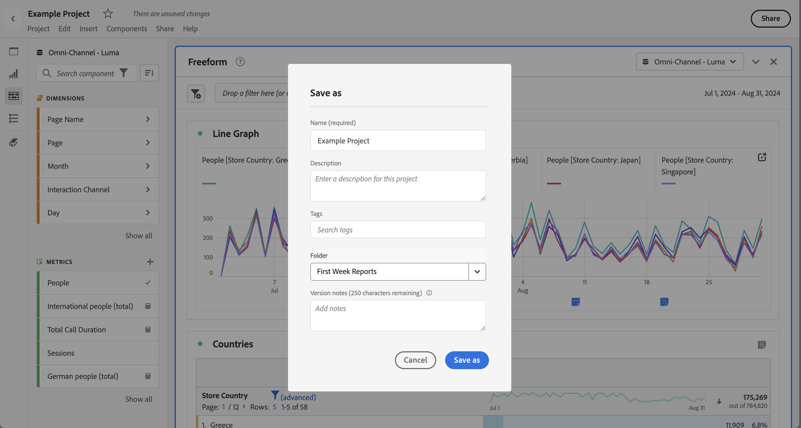

# Spara projekt {#save-projects}

<!-- markdownlint-disable MD034 -->

>[!CONTEXTUALHELP]
>id="workspace_project_addnotes"
>title="Lägg till anteckningar"
>abstract="Lägg till anteckningar om den projektversion som sparas. Anteckningarna lagras med versionen och är tillgängliga på menyn **[!UICONTROL Project]** > **[!UICONTROL Open previous version]**."

<!-- markdownlint-enable MD034 -->

Projekt i Analysis Workspace sparas automatiskt varannan minut. Du kan också spara projekt själv, spara ett projekt som en dubblett eller spara ett projekt med versionskommentarer.

## Spara

Om du vill spara ett projekt manuellt när projektet är öppet i Analysis Workspace väljer du **[!UICONTROL Project]** och sedan något av följande alternativ:

* **[!UICONTROL Save]**

  Spara ändringar i projektet. Om projektet delas ser projektmottagarna även ändringarna.

  När du sparar projektet första gången visas en **[!UICONTROL Save]**-dialogruta.

  

   1. Ange följande:

      * **[!UICONTROL Name]** (krävs). projektnamn.
      * **[!UICONTROL Description]**. En beskrivning av projektet.
      * **[!UICONTROL Tags]**. Sök efter taggar i fältet [!UICONTROL *Sök efter taggar*] eller lägg till nya taggar med **[!UICONTROL ENTER]**.
      * **[!UICONTROL Folder]**. Välj en mapp i listrutan [!UICONTROL *Välj en mapp*]. Om du inte anger någon mapp sparas projektet i den aktuella mappen som du skapade ett nytt projekt från.
      * **[!UICONTROL Version notes]**. Lägg till versionsinformation i textområdet *Lägg till anteckningar*.

   1. Välj **[!UICONTROL Save]** om du vill spara projektet.

  När du sparar projektet sparas en version av projektet som lagras i 90 dagar.

  Om du sparar ett projekt som du har delat visas en **[!UICONTROL Save changes to shared project]**-varningsdialogruta där du uppmanas bekräfta åtgärden.

  

   * Välj **[!UICONTROL Save]** om du vill spara projektet.
   * Välj **[!UICONTROL Save as]** om du vill spara projektet som ett duplicerat projekt med ett nytt namn.

* **[!UICONTROL Save with notes]**

  

  När du sparar projektet lägger du till anteckningar om vad som har ändrats i projektet. I dialogrutan Spara versionsinformation:

   1. Ange **[!UICONTROL Version notes]** i textområdet **[!UICONTROL Add notes]**.
   1. Välj **[!UICONTROL Save]**.

  Anteckningar lagras med projektversionen och är tillgängliga när du [öppnar en tidigare version](open-projects.md#open-previous-version) av projektet. En version som sparas med anteckningar sparas automatiskt i ett år.

* **[!UICONTROL Save As]**

  

  Skapa en kopia av projektet med ett nytt namn. Dialogrutan Spara som visas.

   1. Ange följande:

      * **[!UICONTROL Name]** (krävs). projektnamn.
      * **[!UICONTROL Description]**. En beskrivning av projektet.
      * **[!UICONTROL Tags]**. Sök efter taggar i fältet [!UICONTROL *Sök efter taggar*] eller lägg till nya taggar med **[!UICONTROL ENTER]**.
      * **[!UICONTROL Folder]**. Välj en mapp i listrutan [!UICONTROL *Välj en mapp*]. Om du inte anger någon mapp sparas projektet i den aktuella mappen som du skapade ett nytt projekt från.
      * **[!UICONTROL Version notes]**. Lägg till versionsinformation i textområdet *Lägg till anteckningar*.

   1. Välj **[!UICONTROL Save]** om du vill spara projektet.

  Du kan spara projektet i en annan mapp. Det ursprungliga projektet påverkas inte.

<!-- Cannot find this option in CJA 
| **[!UICONTROL Save as template]** | Save your project as a [custom template](https://experienceleague.adobe.com/docs/analytics/analyze/analysis-workspace/build-workspace-project/starter-projects.html?lang=sv-SE) that becomes available to your organization under **[!UICONTROL Project > New]** | 
-->

## Spara automatiskt

>[!IMPORTANT]
>
>Även om nya projekt sparas automatiskt måste du spara varje nytt projekt manuellt den **första** gången.
>

Alla projekt i Analysis Workspace sparas automatiskt varannan minut på din dator. Den här funktionen för att spara automatiskt inkluderar nyligen skapade projekt som ännu inte har sparats manuellt.

### Nya projekt

Analysis Workspace uppmanar dig att spara nya projekt manuellt när du växlar till ett annat projekt, stänger webbläsarfliken och så vidare.

Om du av någon anledning oväntat förlorar åtkomsten till ett nyskapat projekt innan du sparar det manuellt, sparas en återställningsversion av ditt projekt på Analysis Workspace startsida i en mapp med namnet **[!UICONTROL Recovered Projects (Last 7 Days)]**. Återställ det återskapade projektet och spara det manuellt på önskad plats.

Så här återställer du ett återskapat projekt:

1. Gå till mappen **[!UICONTROL Recovered Projects (Last 7 Days)]** på Analysis Workspace startsida.

<!-- 
     
  -->

1. Öppna projektet och spara det där du vill.

### Befintliga projekt

Om du av någon anledning lämnar ett projekt med ändringar som ännu inte har sparats automatiskt uppmanas du att spara ändringarna eller ett varningsmeddelande visas.

Några vanliga scenarier:

#### Öppna ett annat projekt

Om du öppnar ett annat projekt när du arbetar med ett projekt som innehåller ändringar som ännu inte har sparats automatiskt uppmanas du att spara det aktuella projektet.

Följande alternativ är tillgängliga:

* **[!UICONTROL Save]**: Ersätter den senaste automatiskt sparade lokala kopian av ditt projekt med dina senaste ändringar.
* **[!UICONTROL Discard Changes]**: Dina senaste ändringar ignoreras. Den senaste automatiskt sparade lokala kopian finns kvar i projektet.
* **[!UICONTROL Cancel]**: Avbryt åtgärden om du vill öppna ett annat projekt och behålla det befintliga projektet öppet.

<!--  -->

#### Navigera bort eller stänga en flik

Om du navigerar bort från sidan eller stänger webbläsarfliken när du visar ett projekt med ändringar som ännu inte har sparats automatiskt, visas en varning i webbläsaren om att ändringar som inte har sparats går förlorade. Du kan välja att avbryta eller avbryta. Hur webbläsaren varnar beror på vilken webbläsare du använder.

### Webbläsaren kraschar eller sessionstider ut

Om webbläsaren kraschar eller om sessionen avbryts uppmanas du att återställa ändringar i projektet som ännu inte har sparats automatiskt nästa gång du öppnar Analysis Workspace.

* Välj **[!UICONTROL Yes]** om du vill återställa projektet från den senaste automatiskt sparade kopian.

* Välj **[!UICONTROL No]** om du vill ta bort den automatiskt sparade kopian och öppna den senast sparade versionen av projektet.

<!---->

För **nya**-projekt som aldrig har sparats går det inte att återställa ändringar som inte har sparats.

<!-- Shouldn't this belong to another page?  Moved it to a new open projects page

## Open previously saved version

To open a previously saved version of a project:

1. Select **[!UICONTROL Open previous version]** from the **[!UICONTROL Project]** menu.

   

1. Review the list of previous versions available. You can switch between **[!UICONTROL All versions]** and **[!UICONTROL Only versions with notes]**.

   For each version, the list shows a timestamp
   [!UICONTROL Timestamp] and [!UICONTROL Editor] are shown, in addition to [!UICONTROL Notes] if they were added when the [!UICONTROL Editor] saved. Versions without notes are stored for 90 days; versions with notes are stored for 1 year.
1. Select a previous version and click **[!UICONTROL Load]**.
   The previous version then loads with a notification. The previous version does not become the current saved version of your project until you click **[!UICONTROL Save]**. If you navigate away from the loaded version, when you return, you will see the last saved version of the project.

-->
