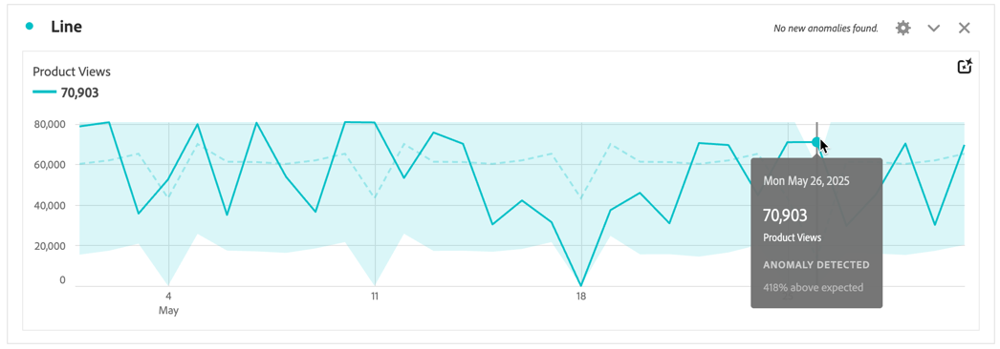

# Visa avvikelser

Du kan visa avvikelser i Analysis Workspace i en tabell eller i ett linjediagram.

## Visa avvikelser i en tabell {#section_869A87B92B574A38B017A980ED8A29C5}

Du kan visa avvikelser i en friformstabell i en tidsserie.

1. Välj  i kolumnrubriken och kontrollera sedan att alternativet **[!UICONTROL Show anomalies]** är markerat i listan med alternativ. Mer information finns i [Kolumninställningar](/help/analysis-workspace/visualizations/freeform-table/column-row-settings/column-settings.md).

1. Anomalier visas i tabellen enligt följande:

   

   ◥ visas i det övre högra hörnet av varje rad där en dataavvikelse upptäcks.

   Den **färgade lodräta linjen** i varje rad ➋ anger det förväntade värdet. Det **färgade skuggade området** i varje rad ➊ anger det faktiska värdet. Hur raden (förväntat värde) jämförs med det skuggade området (faktiskt värde) avgör om det finns någon avvikelse. (En observation anses vara onormal baserat på de avancerade statistiska tekniker som beskrivs i [Statistiska tekniker som används vid avvikelseidentifiering](/help/analysis-workspace/c-anomaly-detection/statistics-anomaly-detection.md).)

1. Välj ◥ i det övre högra hörnet av en rad om du vill visa information om avvikelsen. Detta visar i vilken utsträckning (i procent) det faktiska värdet avviker antingen över eller under det förväntade värdet.

## Visa avvikelser i ett linjediagram

Linjediagram är den enda visualisering som gör att du kan se avvikelser.

Så här visar du avvikelser i ett linjediagram:

1. Välj  i visualiseringshuvudet och kontrollera sedan att alternativet [!UICONTROL **Visa avvikelser**] är markerat i listan med alternativ. Mer information finns i [Rad](/help/analysis-workspace/visualizations/line.md).

1. (Valfritt) Om du vill tillåta konfidensintervallet att skala diagrammet väljer du  i visualiseringshuvudet och sedan alternativet **[!UICONTROL Allow anomalies to Scale Y-axis]**.

   Det här alternativet är inte markerat som standard eftersom det ibland kan göra diagrammet mindre läsbart.

   Anomalier visas i linjediagrammet enligt följande:

   

   En **vit punkt** visas på raden där en dataavvikelse upptäcks. (En observation anses vara onormal baserat på de avancerade statistiska tekniker som beskrivs i [Statistiska tekniker som används vid avvikelseidentifiering](/help/analysis-workspace/c-anomaly-detection/statistics-anomaly-detection.md).)

   Det **ljusa skuggade området** är konfidensintervallet, eller det förväntade intervallet, där värden ska förekomma. Alla värden som ligger utanför det förväntade intervallet är en avvikelse.

   Om du har flera mätvärden i linjediagrammet visas bara avvikelserna, och du måste hålla muspekaren över varje avvikelse för att se konfidensintervallet för det måttet.

   Den **prickade linjen** är det exakta förväntade värdet.

1. Markera en avvikelse (vit punkt) om du vill visa följande information:

   * Datumet då avvikelsen inträffade.

   * Avvikelsens råvärde.

   * Procentvärdet över eller under det förväntade värdet, som representeras av den helgröna linjen.

<!--
# View anomalies in Analysis Workspace

You can view anomalies in a table or in a line chart.

## View anomalies in a table {#table}

You can view anomalies in a time-series Freeform Table.

1. Select the column settings icon in the column header, then ensure that the [!UICONTROL **Anomalies**] option is selected in the list of options. For more information, see [Column settings](/help/analysis-workspace/visualizations/freeform-table/column-row-settings/column-settings.md).

1. Click away from the settings menu to view the updated table.

   

1. Anomalies are shown in the table as follows:

   A **dark gray triangle** appears in the upper-right corner of each row where a data anomaly is detected.

   The colored **vertical line** in each row indicates the expected value. The colored **shaded area** in each row indicates the actual value. How the line (expected value) compares with the shaded area (actual value) determines whether there is an anomaly. (An observation is considered anomolous based on the advanced statistical techniques described in [Statistical techniques used in anomaly detection](/help/analysis-workspace/c-anomaly-detection/statistics-anomaly-detection.md).)

1. Select the gray triangle in the upper-right corner of a row to view details about the anomaly. This shows the extent (as a percentage) to which the actual value diverges either above or below the expected value.

## View anomalies in a line chart {#line-chart}

A Line chart is the only visualization that allows you to view anomalies.

To view anomalies in a line chart:

1. Select the settings icon in the visualization header, then ensure that the [!UICONTROL **Show anomalies**] option is selected in the list of options. For more information, see [Line](/help/analysis-workspace/visualizations/line.md).

1. (Optional) To allow the confidence interval to scale the chart, select the settings icon in the visualization header, then select the option, **[!UICONTROL Allow anomalies to Scale Y-axis]**. 

   This option is not selected by default because it can sometimes make the chart less legible.
   
1. Click away from the settings menu to view the updated line chart.

      

   Anomalies are shown in the line chart as follows:
   
   A **white dot** appears on the line wherever a data anomaly is detected. (An observation is considered anomolous based on the advanced statistical techniques described in [Statistical techniques used in anomaly detection](/help/analysis-workspace/c-anomaly-detection/statistics-anomaly-detection.md).)

   The **light shaded area** is the confidence band, or expected range, where values should occur. Any value that falls outside of this expected range is an anomaly. 

   If you have multiple metrics in the line chart, only the anomalies are shown and you have to hover over each anomaly to see the confidence band for that metric. 

   The **dotted line** is the exact expected value.

1. Click an anomaly (white dot) to view the following information:

   * The date the anomaly occurred 
   
   * The raw value of the anomaly 
   
   * The percentage value above or below the expected value, which is represented by the solid green line.
   
-->
