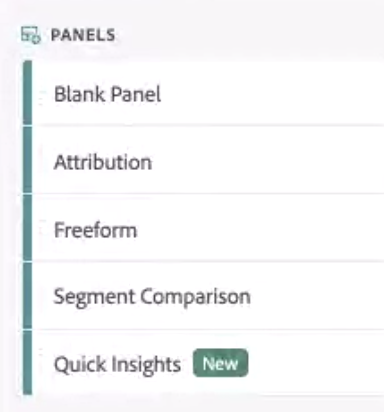
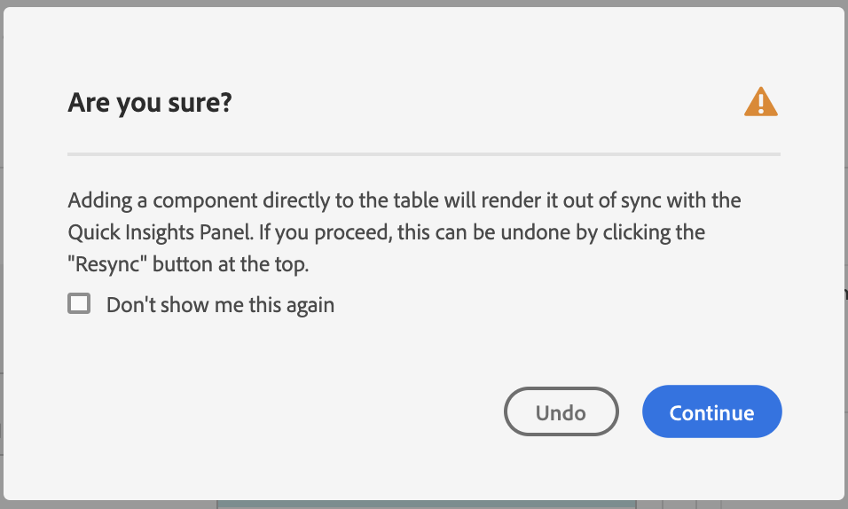

# Snabbinsikter, panel

>[!NOTE]
>
>Du visar dokumentationen för Analysis Workspace i Customer Journey Analytics. Dess funktionsuppsättning skiljer sig något från [Analysis Workspace i traditionell Adobe Analytics](https://docs.adobe.com/content/help/en/analytics/analyze/analysis-workspace/home.html). [Läs mer …](/help/getting-started/cja-aa.md)

>[!IMPORTANT]
>
>**[!UICONTROL Quick Insights]** Panelen är för närvarande i begränsad testning. [Läs mer](https://docs.adobe.com/content/help/sv-SE/analytics/landing/an-releases.html)

[!UICONTROL Quick Insights] ger vägledning till icke-analytiker och nya användare av [!UICONTROL Analysis Workspace] så att de kan lära sig att snabbt och enkelt svara på affärsfrågor. Det är också ett utmärkt verktyg för avancerade användare som snabbt vill besvara en enkel fråga utan att själva behöva skapa en tabell.

När du börjar använda detta [!UICONTROL Analysis Workspace]kan du undra vilka visualiseringar som är mest användbara, vilka dimensioner och mått som kan underlätta insikter, var du drar och släpper objekt, var du skapar ett segment osv.

För att hjälpa till med detta och baserat på ditt företags användning av datakomponenter i [!UICONTROL Analysis Workspace], [!UICONTROL Quick Insights] använder en algoritm som ger dig de populäraste dimensionerna, måtten, segmenten och datumintervallen som ditt företag använder. Du kommer att se dimensioner, mått och segment med märkord. [!UICONTROL Popular] i den nedrullningsbara listan enligt följande:

[!UICONTROL Quick Insights] hjälper dig

* Skapa en datatabell och en åtföljande visualisering i [!UICONTROL Analysis Workspace].
* Läs om terminologi och vokabulär för grundläggande komponenter och delar av [!UICONTROL Analysis Workspace].
* Gör enkla uppdelningar av dimensioner, lägg till flera mått eller jämför segment enkelt inom ett [!UICONTROL Freeform table].
* Ändra eller prova olika visualiseringstyper för att snabbt och intuitivt hitta sökverktyget för analysen.

## Grundläggande nyckelterminologi

Nedan följer några av de grundläggande begrepp som du måste känna till. Varje datatabell består av två eller flera byggstenar (komponenter) som du använder för att visa din datatabell.

| Byggblock (komponent) | Definition |
|---|---|
| [!UICONTROL Dimension] | Dimensioner är beskrivningar eller egenskaper av mätdata som kan ses, brytas ned och jämföras i ett projekt. De är icke-numeriska värden och datum som delas upp i dimensionsobjekt. Till exempel är &quot;webbläsare&quot; eller &quot;sida&quot; dimensioner. |
| [!UICONTROL Dimension item] | Dimensionsobjekt är individuella värden för en dimension. Dimensionsobjekt för webbläsardimensionen skulle till exempel vara &quot;Krom&quot;, &quot;Firefox&quot;, &quot;Kant&quot; osv. |
| [!UICONTROL Metric] | Metrisk är kvantitativ information om besöksaktivitet, t.ex. vyer, klickbara genomgångar, omladdningar, genomsnittlig tid, enheter, order, intäkter och så vidare. |
| [!UICONTROL Visualization] | Arbetsyteerbjudanden [ett antal visualiseringar](/help/analysis-workspace/visualizations/freeform-analysis-visualizations.md) om du vill skapa visuella representationer av dina data, t.ex. stapeldiagram, ritdiagram, histogram, linjediagram, kartor, spridningsdiagram m.m. |
| [!UICONTROL Dimension Breakdown] | En uppdelning av dimensioner är ett sätt att bokstavligen dela upp en dimension efter andra dimensioner. I vårt exempel skulle du kunna bryta ned USA-staterna efter mobila enheter för att få besök av mobila enheter per tillstånd, eller så kan du bryta ned mobila enheter efter mobila enhetstyper, efter regioner, efter interna kampanjer osv. |
| [!UICONTROL Segment] | Med segment kan du identifiera undergrupper av besökare baserat på egenskaper eller interaktioner på webbplatsen. Du kan till exempel skapa [!UICONTROL Visitor] segment baserade på attribut: webbläsartyp, enhet, antal besök, land, kön eller baserat på interaktioner: kampanjer, sökord, sökmotor eller baserat på utgångar och poster: besökare från Facebook, en definierad landningssida, referensdomän eller baserad på anpassade variabler: formulärfält, definierade kategorier, kund-ID. |

## Kom igång med Snabbinsikter

1. Logga in på Adobe Analytics med de autentiseringsuppgifter du har fått.
1. Gå till [!UICONTROL Workspace] och klicka **[!UICONTROL Create New Project]** och klicka sedan på **[!UICONTROL Quick Insights]**. (Du kan även komma åt den här panelen från **[!UICONTROL Panel]** menyn på vänster räl.)

   

   

1. När du börjar gå igenom den korta självstudiekursen som lär dig en del av [!UICONTROL Quick Insights panel] grunderna. Eller klicka på **[!UICONTROL Skip Tutorial]**.
1. Markera dina byggblock (kallas även komponenter): dimensioner (orange), mått (grön), segment (blå) eller datumintervall (lila) Du måste välja minst en dimension och ett mått för att en tabell ska kunna byggas automatiskt.

   

   Du kan välja byggstenarna på tre sätt:
   * Dra och släpp dem från vänster räl.
   * Om du vet vad du letar efter: Börja skriva och [!UICONTROL Quick Insights] Fyll i blanktangen åt dig.
   * Klicka på den nedrullningsbara listan och sök i listan.

1. När du har lagt till minst en dimension och ett mått skapas följande för dig:

   * En Freeform-tabell med dimensionen (här, USA) lodrätt och måttet (här, Besök) vågrätt överst. Checka ut den här tabellen:

   

   * En åtföljande visualisering, i detta fall en [stapeldiagram](/help/analysis-workspace/visualizations/bar.md). Den visualisering som genereras baseras på den typ av data som du har lagt till i tabellen. Eventuella tidsbaserade data (t.ex. [!UICONTROL Visits] standard per dag/månad) till en [!UICONTROL Line] diagram. Alla icke tidsbaserade uppgifter (t.ex. [!UICONTROL Visits] per [!UICONTROL Device]) är standard för en [!UICONTROL Bar] diagram. Du kan ändra visualiseringstypen genom att klicka på den nedrullningsbara pilen bredvid visualiseringstypen.

1. (Valfritt) Visa dimensioner och visa dimensionsposter genom att klicka på högerpilen bredvid dimensionen.

1. Försök att lägga till ytterligare förbättringar enligt beskrivningen nedan under &quot;Fler tips&quot;.

1. Spara projektet genom att klicka på **[!UICONTROL Project > Save]**.

## Fler tips

Andra användbara tips visas i [!UICONTROL Quick Insights Builder], några av dem beror på din senaste åtgärd.

* Fyll i **[!UICONTROL More tips]** Självstudiekurs: Öppna den via hjälpen (?) ikonen bredvid [!UICONTROL Quick Insights] Titel. Den här självstudiekursen visar upp till 24 timmar efter att du har skapat ett projekt med minst en dimension och ett mått.

   

* **Uppdelning efter**: Du kan använda upp till 3 nivåer av uppdelningar på dimensioner för att gå ner till de data du verkligen behöver.

   

* **Lägg till fler mått**: Du kan lägga till upp till två fler mått genom att använda operatorn OCH för att lägga till dem i tabellen.

   

* **Lägg till fler segment**: Du kan lägga till upp till två segment till genom att använda operatorerna OCH eller ELLER för att lägga till dem i tabellen. Se vad som händer med tabellen när du lägger till Mobile Users ELLER Loyal Visitors. De står bredvid varandra, över måtten. Om du lade till Mobile Users AND Loyal Visitors, visas resultaten från båda segmenten tillsammans, och de staplas ovanpå varandra i tabellen.

   

## Kända begränsningar

Om du försöker redigera direkt i tabellen orsakar det [!UICONTROL Quick Insights] om du vill bli ur synkroniseringen. Du kan återställa den till föregående [!UICONTROL Quick Insights] inställningar genom att klicka på **[!UICONTROL Resync Builder]** längst upp till höger på panelen.

Du får en varning innan du lägger till något direkt i tabellen:

Om du bygger direkt kommer tabellen nu att fungera som en traditionell Freeform-tabell, utan de användbara funktionerna för nya användare.

