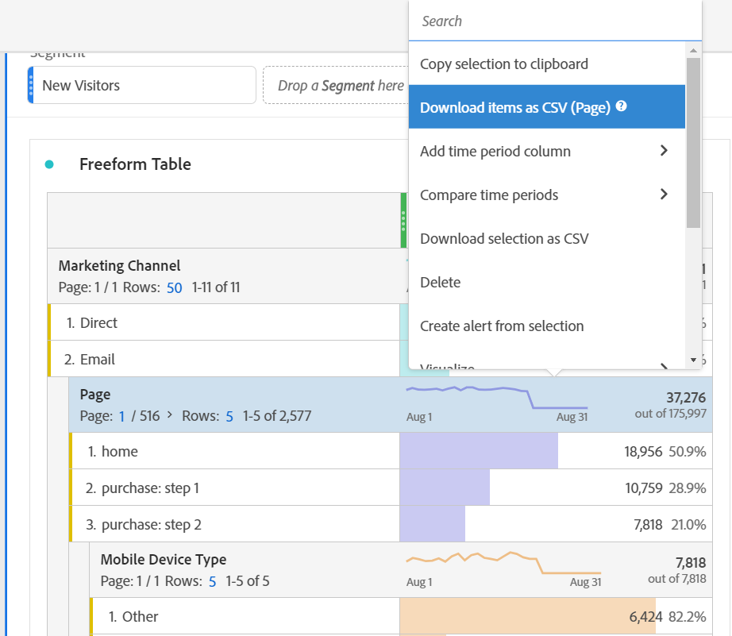

# Hämta PDF- eller CSV-filer från arbetsyta

Det finns flera olika sätt att exportera data från Analysis Workspace, beroende på vilken uppsättning data du vill analysera utanför verktyget och vem som behöver få informationen. Exporterade data kan vara i form av kopierade data, CSV- eller PDF-filer. En PDF-fil är vanligtvis att föredra om du vill att visualiseringar ska ingå i filen, medan en CSV-fil (eller kopierade data) är att föredra om du bara vill ha oformaterade textdata.

>[!IMPORTANT]
>
> Vissa alternativ som det hänvisas till på den här sidan, t.ex. **Hämta objekt som CSV**, för närvarande testas i begränsad omfattning. [Läs mer](https://docs.adobe.com/content/help/sv-SE/analytics/landing/an-releases.html)

## Hämta projekt som CSV eller PDF {#download-project}

Du kan ladda ned ett fullständigt projekt genom att gå till **[!UICONTROL Project > Download as PDF (or as CSV)]**. Den hämtade filen innehåller alla visade (synliga) tabeller och visualiseringar i projektet. En PDF-fil är vanligtvis att föredra om du vill att visualiseringar ska ingå i filen, medan en CSV är att föredra om du bara vill ha oformaterade textdata.

Vid nedladdning av projekt bör du tänka på följande:

* Projektet kan sparas eller inte sparas när du begär en projekthämtning. Men endast sparade projekt kan [schemalagd](https://docs.adobe.com/content/help/en/analytics/analyze/analysis-workspace/curate-share/t-schedule-report.html).
* Det kan ta flera minuter att exportera PDF-filer som hämtats i webbläsaren eftersom projektet körs på Adobe-servrar igen innan det återges i PDF-format. Vi rekommenderar att du inte lämnar projektet förrän PDF-filen hämtas i webbläsaren. Du kan dock fortsätta att göra ändringar i projektet medan du väntar. Om det tar längre tid än 5 minuter att rendera en PDF-fil, uppmanas du att skicka den via e-post i stället.
* PDF-nedladdningar återges som en enda sida utan att någon sidnumrering tillämpas.
* När ett projekt återges i PDF återger vi vad som finns på sidan. Om ett projekt har skräddarsydda visualiseringar och paneler måste du ändra dem så att de blir automatiskt stora (knapp i det övre högra hörnet) så att det inte blir något trunkerat innehåll.

## Kopiera data till Urklipp (snabbtangent: Ctrl+C) {#copy-data}

Alternativet Högerklicka **[!UICONTROL Copy to clipboard]** I kan du snabbt kopiera data från arbetsytan och klistra in dem någon annanstans.

* Om du vill att tabellen som visas ska kopieras högerklickar du på tabellrubriken och väljer **Kopiera visade data till Urklipp**.
* Om du vill att en delmängd data ska kopieras gör du en markering i tabellen och högerklickar sedan > **Kopiera markering till Urklipp**.

Dessutom har hotkey `Ctrl+C` kopierar ditt val till Urklipp. När du har kopierat kan du gå till ett annat verktyg och klistra in informationen (eller träffa `Ctrl+V`).

## Hämta data som CSV {#download-data}

Alternativet Högerklicka **[!UICONTROL Download data as CSV]** gör att du kan hämta en tabell med data eller datakällan för all visualisering som CSV.

* Högerklicka i tabellhuvudet **[!UICONTROL Download displayed data as CSV]**. Då hämtas de data som visas i tabellen som CSV.
* Om Du gör en markering i tabellen, visas alternativet **[!UICONTROL Download selection as CSV]**. Endast markeringen laddas ned med det här alternativet, i motsats till hela tabellen som visas.
* Högerklicka i huvudet på visualiseringen **[!UICONTROL Download data as CSV]**. Då hämtas datakälltabellen för visualisering som CSV. Anmärkning: Visualiseringen av kartan stöder inte detta alternativ.

## Hämta objekt som CSV {#download-items}

Om du vill analysera mer än de 400 synliga raderna data i en tabell högerklickar du på tabellrubriken eller valfri rad och markerar **Hämta objekt som CSV (Dimensionsnamn)**. Med det här alternativet exporteras upp till 50 000 dimensionsobjekt för den valda dimensionen (baserat på tabellsortering), med filter och segment tillämpade. Om du väljer det här alternativet överst i tabellen exporteras tabellens första dimension. Inga begränsningar tillämpas i frihandstabellen, men det rekommenderas att alternativet Hämta objekt används i tabeller med färre än 20 kolumner för att säkerställa optimal prestanda.

>[!TIP]
>
> Om din dimension överstiger 50 000 objekt hämtar du filen med andra sorteringsmått tillämpade eller använder ett filter. Sortera t.ex. fallande efter Visits i en hämtning och sedan stigande efter Visits i en andra hämtning. Det här tipset kan hjälpa dig att hämta objekt som är längre bort.

Du kan köra flera uppgifter i projektet och till och med navigera till ett nytt arbetsyteprojekt på samma flik medan hämtningen pågår. Nedladdningen pausas om du öppnar en ny webbläsarflik. Hämtningen avbryts om du lämnar arbetsytan helt eller stänger webbläsarfliken.

### Hämtad objektfil

Tabellens funktioner tillämpas på den hämtade filen enligt följande:

* Alla panelsegment används som filter.
* Uppdelningar **ovan** den valda dimensionen i tabellen används som filter ovanför varje kolumn.
* Uppdelningar **under** den markerade dimensionen i tabellen tas bort.

I exemplet ovan hämtas sidobjekt med panelsegmentet (nya besökskunder) och komponenterna ovanför (Marknadsföringskanal = e-post) tillämpade som filter, och komponenterna nedan (mobil enhetstyp) tas bort från den nedladdade CSV-filen.

### Hämta meddelanden

När filen hämtas visas ett informationsmeddelande med förloppet. Du kan när som helst avbryta hämtningen genom att klicka på **[!UICONTROL Cancel download]**. Stänga popup **inte** avbryta hämtningen.

När filen är klar visas ett meddelande om slutförandet och filen hämtas till webbläsaren.

Om du begär mer än en nedladdning åt gången får du ett meddelande om att varje ytterligare nedladdning köas tills den föregående nedladdningen är klar.

## FAQ {#faq}

| Fråga | Svar |
| --- | --- |
| Varför är min hämtade PDF-fil en sida? | Arbetsytan paginerar inte hämtade PDF-filer just nu. |
| Kan jag exportera mer än 50 000 objekt med alternativet &quot;Hämta objekt som CSV&quot;? | Varje hämtning kan innehålla upp till 50 000 dimensionsobjekt, men du kan ändra sorteringen av tabellen för att hämta fler slutobjekt eller använda ett filter för att hämta fler specifika objekt. |
| Vad gör? **[!UICONTROL Copy visualization]** Gör det? | **[!UICONTROL Copy visualization]** är inte ett exportalternativ. Du kan kopiera en visualisering eller panel från en plats på arbetsytan till en annan. Exempelvis från en panel till en annan i samma projekt, eller från ett projekt till ett annat projekt. [Titta på videon](https://www.youtube.com/watch?v=lvmAdKNfWQw) |

