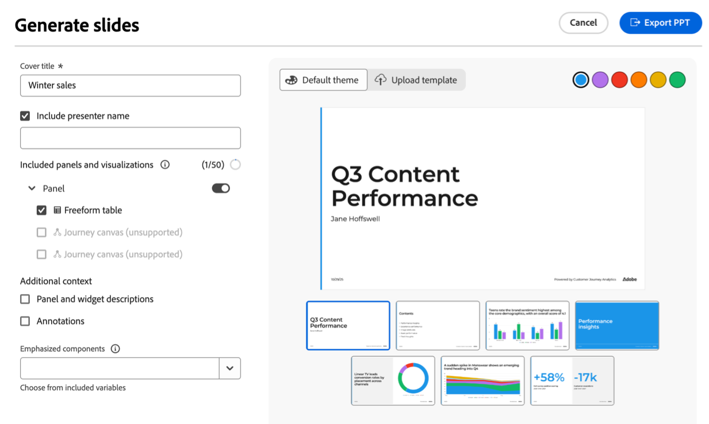

# Data storytelling: Generera bildpresentationer från Workspace-rapporter {#generate-powerpoint}

>[!AVAILABILITY]
>
>Dataljudsberättande är en skicklighet under [Data Insights Agent](/help/data-analysis-ai.md). Den här funktionen är i den begränsade testfasen och är kanske inte tillgänglig än i din miljö. Den här anteckningen tas bort när funktionen är allmänt tillgänglig. Mer information om Customer Journey Analytics finns i [Customer Journey Analytics funktionsreleaser](/help/release-notes/releases.md).

<!-- also remove lmited testing note from: /help/technotes/access-control.md -->

<!--at GA in January, replace Limited Testing note with this: Data Storytelling is a skill under Data Insights Agent and is available to eligible customers for a limited time. Access to Data Insights Agent will end on 28th February 2026. To continue using Data Insights Agent or other Adobe Experience Platform Agents without interruption, please contact your Adobe account representative to learn more about licensing Adobe Experience Platform Agent Orchestrator. -->

Användare med [nödvändig behörighet](#permission-requirements-to-generate-slides) kan automatiskt generera .pptx-presentationer baserat på Analysis Workspace-projekt. När du skapar dessa bildpresentationer skapar Customer Journey Analytics automatiskt en berättelse utifrån era data genom att identifiera viktiga insikter och konvertera dem till bilder som är klara för intressenter.

Det här genererade datamaterialet minskar tiden, arbetet och expertisen som krävs för att hitta resultaten från ett Workspace-projekt. Analytikerna kan fokusera mer på att utforska data, samtidigt som Customer Journey Analytics kan bygga upp och formatera chefernas berättarröst och förmedla affärsresultatet till intressenter.

## Förstå dataartiklar i bildpresentationer

En **databerättelse** är berättelsen som Customer Journey Analytics skapar utifrån dina Workspace-data. Med hjälp av generativ AI identifierar Customer Journey Analytics viktiga teman i panelerna och visualiseringar som du väljer att ta med i bildpresentationen. Den genererar insikter och går sedan igenom en process för borttagning av dubbletter och poängsättning för att identifiera en delmängd av insikter som kan användas för att skapa databerättelsen.

I följande avsnitt beskrivs det ytterligare värde som datarubrikerna tillhandahåller, de nödvändiga elementen i ett projekt som hjälper till att forma berättarrösten och de nyckelelement som ingår i .pptx-presentationen.

### Ytterligare värde från datarubriker

Databerättelser ger värde och insikter till ett Workspace-projekt genom att göra data tillgängliga för användare som inte har någon erfarenhet av dataanalys.

Data från olika källor kompletterar en analys av ett visst Workspace-projekt genom att

* Tillhandahåller ytterligare kontext

* Markera viktiga insikter

* Bedömning av huruvida vissa variabler är undervärderade eller övervärderade

* Påtala dolda trender, avvikelser och andra bidragande faktorer

* Ge idéer för nästa steg

### Projektelement som formar dataartiklar

Analysis Workspace skapar dataartiklar genom att ta hänsyn till följande projektelement:

* Relationer mellan dimensioner och mätvärden

* De enskilda element som utgör grunden för analysen (mått, mått, filter, tabellstruktur på frihand, visualiseringar och paneler)

* Namnen på panelerna, tabellerna och visualiseringarna

* Metrisk ordning i en frihandstabell (för att bestämma prioritet)

* Ordningen på visualiseringar i en panel (för att fastställa prioritet)

* Sammanfattningsnummer och sammanfattningstexter (för att avgöra vilka mätvärden som behöver markeras i dataartikeln)

### Presentationselement i en dataartikel

Dataartiklar består av en rubrikbild, sammanfattningsbild, detaljbilder och avsnittsavgränsare.

**Rubrikbild:** Visar den titel och det presentatörsnamn som du anger. Information i talaranteckningarna som beskriver hur temat och berättarrösten skapades, hur många insikter som skapades och användes samt vilka paneler som användes.

**Sammanfattning:** Prioriterar de mest värdefulla insikterna och skapar en övergripande berättelse som är mellan 1 och 5 meningar lång.

**Detaljbilder:** Genererar insikter om tabeller, paneler eller visualiseringar i ett Workspace-projekt. Insikterna består av trender, säsongsvariationer, avvikelser och korrelationer.

**Avsnittsavgränsare:** delar insikter med avsnittsavgränsare som är placerade och namngivna.

## Generera en .pptx-presentation baserad på ett Workspace-projekt

<!-- markdownlint-disable MD034 -->

>[!CONTEXTUALHELP]
>id="cja-powerpoint-include-visualizations"
>title="Inkluderade paneler och visualiseringar"
>abstract="Välj paneler och visualiseringar som du vill ta med i presentationen. Du kan inkludera upp till 50 visualiseringar."

<!-- markdownlint-enable MD034 -->

<!-- markdownlint-disable MD034 -->

>[!CONTEXTUALHELP]
>id="cja-presentation-emphasized-components"
>title="Viktiga komponenter"
>abstract="Välj upp till 5 mätvärden och 5 dimensioner från dina visualiseringar som du vill betona i presentationen. De mätvärden du väljer visas i kursiv stil, måtten visas i fet stil och dimensionsobjekten visas i en kontrasterande färg."

<!-- markdownlint-enable MD034 -->

1. Gå till det Workspace-projekt som innehåller de data du vill använda som bas för bildpresentationen.

1. Välj **[!UICONTROL Generate slides]** i det övre högra hörnet på sidan.

   Dialogrutan Generera bilder visas.

   

1. Ange följande information:

   | Alternativ | Beskrivning |
   |---------|----------|
   | **[!UICONTROL Cover title]** | Ange en rubrik för presentationen. Den här rubriken visas på presentationens rubrikbild. |
   | **[!UICONTROL Include presenter name]** | Ange namnet på presentatören. Namnet visas på presentationens rubrikbild, under omslagets rubrik. |
   | **[!UICONTROL Panels and visualizations to include]** | Välj paneler och visualisering som du vill ta med i presentationen. Du kan inkludera upp till 50 visualiseringar.
Om en visualisering är nedtonad följs den antingen av texten **[!UICONTROL (unsupported)]** eller **[!UICONTROL (restricted data)]**.
<ul><li>**Stöds inte**: De flesta paneler och visualiseringar stöds. Mer information om paneler och visualisering som inte stöds finns i [Projektelement och funktioner som inte stöds](#unsupported-project-elements-and-features).</li><li>**Begränsade data**: Visualiseringen innehåller en komponent som är begränsad från att exporteras av en datastyrningsprincip som används av din organisation. Kontakta systemadministratören för att se vilka komponenter som är begränsade från att exporteras och ta sedan bort de begränsade komponenterna innan du genererar bildrutor.</li></ul> |
   | **[!UICONTROL Emphasize components]** | Välj mått och mått från dina visualiseringar som du vill framhäva i presentationen. De komponenter du väljer rangordnas högre och ges större vikt när du skapar teman och en övergripande berättarröst för dataartikeln. 
När ingen betoning används visas komponenterna i presentationer enligt följande:<ul><li>**Mätvärden och dimensioner:** Kursiv</li><li>**Dimension-objekt:** Citattecken</li></ul>

När betoning används visas komponenterna i presentationer enligt följande:
<ul><li>**Mätvärden och dimensioner:** Kursiv och fet</li><li>**Dimension-objekt:** Fet när motsvarande dimension framhävs
En färg används också på dimensionsobjektet när dimensionsobjektet är markerat i diagrammet.
</li></ul> |

   <!-- add this later: - **[!UICONTROL Panel and visualization descriptions]** - Choose whether to include panel and visualization descriptions in your generated slide presentation. - 
   - **[!UICONTROL Annotations]** - Choose whether annotations are visible in your generated slide presentation. For more information about annotations, see [Annotations overview](/help/components/annotations/overview.md).  -  -->

1. (Villkorligt) Välj **[!UICONTROL Default theme]** om du vill generera bilder i färre steg och om ett företagstema inte krävs för bildpresentationen.

   Välj bara den färg du vill använda.

   

1. (Villkorligt) Välj **[!UICONTROL Upload template]** om bildpresentationen behöver matcha ett företagstema. Det här alternativet kräver att du överför en anpassad mall och använder dina anpassade format.

   Den senaste anpassade mallen som du överför lagras lokalt i webbläsarens cacheminne och är tillgänglig när du genererar framtida bildpresentationer.

   

   Gör något av följande om du vill överföra en anpassad mall:

   +++(Rekommenderas) Hämta en tom mall och ändra den

   1. Hämta [den här tomma mallen](https://d30ln29764hddd.cloudfront.net/deploy/builds/data-storytelling.2025-10-20T15:10:19/resources/components/Blank.potx?).

   1. Använd dina anpassade format på den tomma mallen.

   1. Ladda upp mallen igen utan att ändra några malllayoutsnamn:

      Dra en tom mall med dina anpassade format till släppområdet från filsystemet.

      eller

      Välj **[!UICONTROL Browse]**, bläddra sedan till och välj en tom mall där dina anpassade format används från filsystemet.

   1. I avsnittet **[!UICONTROL Layout mapping]** mappas varje bildrutelayout som används i genererade presentationer automatiskt till en bildruta från ditt överförda tema. Granska valen för att kontrollera att de är korrekta.

      

   1. (Villkorligt) Om en bildrutelayout är felaktigt mappad väljer du **[!UICONTROL Change selection]** ovanför den bildruta som valdes i den överförda presentationen och väljer sedan den bildruta som matchar layouten.

      Upprepa den här processen för varje bildruta som har mappats felaktigt.

   +++

   +++Överföra en anpassad mall direkt 

   1. Dra den anpassade mallen från filsystemet till släppområdet.

      eller

      Välj **[!UICONTROL Browse]**, bläddra sedan till och välj din anpassade mall från filsystemet.

      Kontrollera att den överförda filen har mallayouter med följande namn: &quot;Title_Slide&quot;, &quot;Section_Divider&quot;, &quot;Title_Text&quot;, &quot;Title_Chart&quot;, &quot;Title_Two_Content_Mixed&quot;, &quot;Title_Three_Content_Mixed&quot;.

      Upp till 25 malllayouter stöds.

      .pptx- och .potx-filer som är upp till 25 MB stora stöds.

   1. I avsnittet **[!UICONTROL Layout mapping]** mappas varje bildrutelayout som används i genererade presentationer automatiskt till en bildruta från ditt överförda tema. Granska valen för att kontrollera att de är korrekta.

      

   1. (Villkorligt) Om en bildrutelayout är felaktigt mappad väljer du **[!UICONTROL Change selection]** ovanför den bildruta som valdes i den överförda presentationen och väljer sedan den bildruta som matchar layouten.

      Upprepa den här processen för varje bildruta som har mappats felaktigt.

   +++

1. Välj **[!UICONTROL Export PPT]**.

   .pptx-presentationen laddas automatiskt ned till din arbetsstation.

1. (Rekommenderas) Öppna PPTX-presentationen och granska den. Gör nödvändiga ändringar.

## Behörighetskrav för att generera bilder

>[!AVAILABILITY]
>
>Om ni inte har tillgång till bildspel från Workspace kontaktar ni er Adobe återförsäljare.

Möjligheten att generera bilder är aktiverad som standard för alla användare i organisationer som har den nödvändiga licensieringen.

Administratörer av produktprofiler vars organisationer har licens att generera bilder kan vid behov inaktivera åtkomsten.

I [!UICONTROL Adobe Admin Console] avgör behörigheten [!UICONTROL Reporting Tools] **[!UICONTROL Data storytelling]** åtkomsten till den här funktionen. En [produktprofiladministratör](https://helpx.adobe.com/se/enterprise/using/manage-product-profiles.html) måste följa de här stegen i [!UICONTROL Admin Console] om de vill inaktivera åtkomst:
1. Navigera till **[!UICONTROL Admin Console]** > **[!UICONTROL Products and services]** > **[!UICONTROL Customer Journey Analytics]** > **[!UICONTROL Product Profiles]**
1. Välj titeln för den produktprofil som du vill ge åtkomst till [!UICONTROL Data storytelling].
1. Välj **[!UICONTROL Permissions]** i den specifika produktprofilen.
1. Välj  om du vill redigera **[!UICONTROL Reporting Tools]**.
1. Välj  om du vill ta bort **Data storytelling** från **[!UICONTROL Included permission items]**.

   <!--add screenshot of permission in the admin console-->

1. Välj **[!UICONTROL Save]** om du vill spara behörigheterna.

Mer information finns i [Åtkomst på användarnivå](/help/technotes/access-control.md#user-level-access) i [Åtkomstkontroll](/help/technotes/access-control.md#access-control).

## Projektelement och funktioner som inte stöds {#unsupported}

Följande Analysis Workspace-element och -funktioner som används i ett projekt stöds inte när bilder skapas:

* Attributionspanelen

  Panelen visas som nedtonad när konfigurationsalternativen visas.

  Alla andra paneler kan inkluderas i bilder som genereras från ett Workspace-projekt.

* Vissa visualiseringar

  De flesta visualiseringar kan inkluderas i bilder som skapas från ett Workspace-projekt. Följande visualiseringar kan dock inte inkluderas och visas som nedtonade när konfigurationsalternativen visas:

   * Område

   * Punkt

   * Kohortabell

   * Kombination

   * Utfall

   * Flöde

   * Reseduk

   * Spridning

   * Treemap

* Guidade analyser

* Komponenter som är begränsade från att exporteras av en datastyrningsprincip

  Mer information finns i [Felsökning av misslyckade exporter](/help/components/exports/troubleshoot-exports.md).

## Projektelement och funktioner med begränsat stöd

* Uppdelningar

  Som en del av processen för borttagning av dubbletter och poängsättning när ni skapar relevanta insikter analyseras varje uppdelning i en friformstabell separat, och endast de första fem uppdelningarna i en friformstabell analyseras.

  Endast den första nivån i en uppdelning stöds. En uppdelning av en uppdelning ingår inte i presentationen.

