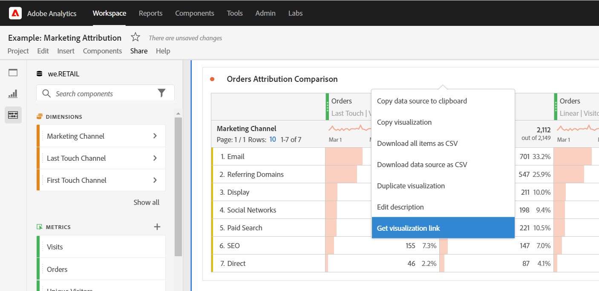

# Skapa delbara länkar

Analysis Workspace erbjuder många sätt att dela ett projekt med dina användare, inklusive möjligheten att få en länk till ett projekt eller en specifik del av ett projekt. Användare som får en länk måste logga in på Adobe Analytics innan de kan komma till projektet.

## Hämta projektlänk {#project-link}

Om du vill dela en länk till hela projektet går du till **[!UICONTROL Share > Get project link]**. Om mottagaren av länken inte har tilldelats en [projektroll](https://docs.adobe.com/content/help/sv-SE/analytics/analyze/analysis-workspace/curate-share/share-projects.translate.html)tar emot administratörer **[!UICONTROL Can edit]** och icke-administratörer tar emot **[!UICONTROL Can duplicate]** erfarenheter.

## Hämta panel- eller visualiseringslänk {#panel-link}

Du kan också dela en länk till en viss del av ett projekt, t.ex. en panel eller individuell visualisering. Detta kallas ibland för interlinkmekanismen. Detta kan vara användbart om du vill uppmärksamma användarna på de viktigaste insikterna i projektet.

* Från valfritt panelhuvud högerklickar du **[!UICONTROL Get panel link]**
* Högerklicka på ett tabell- eller visualiseringshuvud **[!UICONTROL Get visualization link]**

[Titta på videon](https://www.youtube.com/watch?v=lvmAdKNfWQw) om hur du skapar länkar och använder dem för att köra mottagare till specifika delar av projektet.

## Använd länkar i en innehållsförteckning {#TOC}

Ett tips för att dra nytta av de olika länkalternativen är att alltid inkludera en innehållsförteckning överst i arbetsyteprojektet. I innehållsförteckningen kan du länka till andra relevanta projekt, specifika paneler och specifika visualiseringar. Detta gör det lättare för projektmottagaren att navigera.

[Titta på videon](https://www.youtube.com/watch?v=Xo6fTguWm-M) om hur du skapar en innehållsförteckning med hjälp av länkar och arbetsytans textredigerare.

