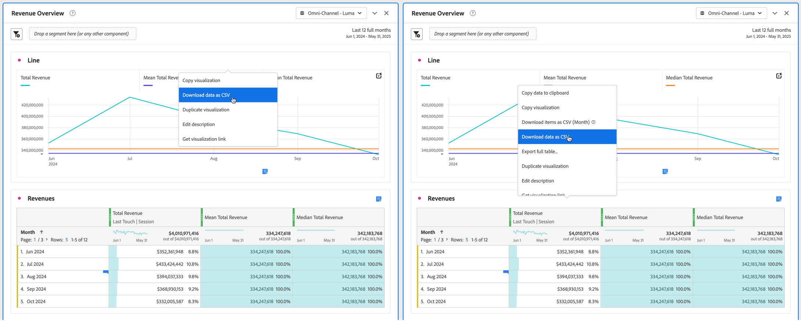

# Hämta projekt och data

Du kan hämta Analysis Workspace-projekt och data till din lokala enhet. Den här hämtningen kan vara kopierade data, en CSV-fil (kommaavgränsade data) eller ett PDF-dokument (portabla dokumentformat).

* Välj alternativet PDF om du vill att visualiseringar ska ingå i den hämtade filen.
* Välj CSV och kopierade dataalternativ om du bara behöver textdata.

Ytterligare metoder för att exportera Customer Journey Analytics-data beskrivs i [Exportöversikt](/help/analysis-workspace/export/export-project-overview.md).

## Hämta ett projekt som en PDF- eller CSV-fil {#download-project}

### Hämta ett projekt som en PDF-fil

Tänk på följande när du hämtar ett projekt som PDF:

* Lämna inte projektet förrän projektet har laddats ned till din arbetsstation. Nedladdningen kan ta flera minuter eftersom projektet körs på Adobe-servrar igen för att PDF ska kunna återge. Du kan fortsätta att ändra projektet medan hämtningen återger. Om det tar längre tid än fem minuter att återge en PDF uppmanas du att [skicka PDF](../curate-share/send-schedule-files.md) via e-post i stället.
* Hämtningar återges som en sida utan sidnumrering.
* PDF innehåller det som visas på webbläsarsidan i Analysis Workspace. Om du vill undvika trunkerat innehåll väljer du  för att automatiskt ändra storlek på visualiseringar eller paneler i anpassad storlek.
* [Det går att klicka på hyperlänkar](/help/analysis-workspace/visualizations/freeform-table/freeform-table-hyperlinks.md) i frihandstabeller i den hämtade PDF-filen.

Så här hämtar du ett projekt som en PDF-fil:

1. Välj **[!UICONTROL Project]** > **[!UICONTROL Download PDF]**.

   Ett grönt fält visas med följande meddelande:  **[!UICONTROL Your download has been requested. Please wait.]**

1. När nedladdningen är klar visas ett grönt fält med följande meddelande:  **[!UICONTROL *Projektets namn *PDF är klart.]**

1. Välj **[!UICONTROL Download]** i det gröna fältet.

   Beroende på inställningarna i webbläsaren hämtas PDF automatiskt till den mapp som du tidigare konfigurerat, eller så uppmanas du att välja en mapp där PDF ska hämtas.

   Filnamnet består av *projektnamn* - *rapportsvitens namn* - *datum*. Exempel: `Example Project - Omni-Channel - Luma - Jun 30, 2025.pdf`.

### Hämta ett projekt som en CSV-fil

1. Välj **[!UICONTROL Project]** > **[!UICONTROL Download CSV]**.

   Beroende på inställningarna i webbläsaren hämtas CSV-filen automatiskt till en mapp som du tidigare konfigurerat, eller så uppmanas du att välja en mapp där CSV-filen ska hämtas.

   Filnamnet består av *projektnamn* - *rapportsvitens namn* - *datum*. Exempel: `Example Project - Omni-Channel - Luma - Jun 30, 2025.csv`.

## Kopiera data inom en visualisering till Urklipp {#copy-data}

Med alternativet **[!UICONTROL Copy to clipboard]** på snabbmenyn kan du snabbt kopiera data från Analysis Workspace och klistra in data i ett verktyg från tredje part.

* Om du vill att tabelldata som visas ska kopieras markerar du tabellrubriken och väljer **Kopiera data till Urklipp** på snabbmenyn.
* Om du vill att en delmängd av data ska kopieras markerar du den i tabellen och väljer **Kopiera markering till Urklipp** på snabbmenyn.

>[!TIP]
>
>Du kan använda snabbtangenten **_cmd + c_** (macOS) eller **_ctrl + c_** (Windows) för att kopiera ditt val till Urklipp. Använd sedan **_cmd + v_** (macOS) eller **_ctrl + v_** (Windows) för att klistra in data.

{zoomable="yes"}

## Hämta data i en visualisering som en CSV-fil {#download-data}

Med alternativen för att hämta som CSV på snabbmenyn kan du hämta en datatabell eller datakällan för en visualisering som en CSV-fil.

Så här gör du:

* Välj **[!UICONTROL Download data as CSV]** på snabbmenyn i en tabell eller visualisering. Detta hämtar visade data i tabellen eller den underliggande datakällan för en visualisering som en CSV-fil.

<!-- Only relevant as soon as CJA supports Map visualization 
  >[!NOTE]
  >
  >  Note: the Map visualization does not support this option.
-->

* Välj **[!UICONTROL Download selection as CSV]** på snabbmenyn i en tabell. Endast markeringen laddas ned med det här alternativet, i motsats till den fullständiga tabellen som visas.

## Hämta objekt som en CSV-fil {#download-items}

Om du vill analysera fler än de 400 synliga dataraderna i en tabell väljer du **Hämta objekt som CSV (_Dimension name_)** på snabbmenyn för tabellhuvudet eller på en rad. Med det här alternativet exporteras upp till 50 000 dimensionsobjekt (baserat på tabellsortering) för den valda dimensionen med sorteringsalternativ och filter. Om du väljer det här alternativet överst i tabellen exporteras den första dimensionen i tabellen.

Inga begränsningar används i frihandstabellen. För att få optimala prestanda bör du använda det här alternativet i tabeller med färre än 20 kolumner.

>[!TIP]
>
> Om din dimension överstiger 50 000 objekt hämtar du filen med olika sorteringsvärden eller använder ett segment. Du kan t.ex. sortera efter besök i en nedladdning och sedan stigande efter besök i en andra nedladdning. Det här tipset kan hjälpa dig att hämta objekt med längre svans.

Du kan utföra flera uppgifter samtidigt i projektet och till och med navigera till ett nytt Workspace-projekt på samma flik medan hämtningen pågår. Hämtningen pausas om du öppnar en ny flik i webbläsaren. Hämtningen avbryts om du lämnar Workspace helt eller stänger webbläsarfliken.

### Nedladdad objektfil {#items-file}

Följande funktioner i en frihandstabell används i den hämtade filen:

* Alla panelsegment används som filter.
* Uppdelningar **ovanför** den valda dimensionen i tabellen används som filter ovanför varje kolumn.
* Uppdelningar **nedanför** av den valda dimensionen i tabellen tas bort.

### Hämta meddelanden {#notifications}

När filen laddas ned visas följande meddelanden:

* Ett blått **[!UICONTROL _tabellnamn _-_Dimension _.csv har begärts._x _% slutfört]**&#x200B;anger förloppet. Om du vill avbryta hämtningen väljer du **[!UICONTROL Cancel download]**. Välj  om du vill stänga meddelandet, som inte avbryter hämtningen.
* Ett grönt **[!UICONTROL _tabellnamn _-_Dimension _.csv har hämtats]**&#x200B;meddelande om slutförd filhämtning. Filen hämtas till den nedladdningsmapp som är konfigurerad för webbläsaren.

Om du begär mer än en nedladdning åt gången får du ett meddelande om att varje ytterligare nedladdning är i kö tills den tidigare nedladdningen är klar.

## Hämta känsliga data {#sensitive}

Tänk dig en [datastyrningspolicy](/help/data-views/data-governance.md) som förhindrar hämtning av data. Och att den här principen är aktiverad i datavyn som du rapporterar om. Det innebär att alla nedladdningar (till exempel när du skickar e-post eller delar PDF-filer) av projekt kommer att krascha datafälten som är märkta som känsliga. Du kan fortfarande göra analyser i dessa fält i Analysis Workspace. Om du försöker skicka ett projekt med e-post eller på annat sätt dela ett projekt visas de känsliga datafälten som tomma i PDF- eller CSV-filen.

Om datafält som är märkta som känsliga inkluderas i datavyn är alternativet att markera och kopiera data från skärmen begränsat för alla data i datavyn.

## Vanliga frågor och svar {#faq}

| Fråga | Svar |
| --- | --- |
| Varför består min nedladdade PDF av bara en sida? | Funktionen [Hämta PDF](#download-as-csv-or-pdf) numrerar inte hämtade PDF-filer. |
| Kan jag exportera mer än 50 000 objekt med alternativet **[!UICONTROL Download items as CSV]**? | Varje nedladdning kan innehålla upp till 50 000 dimensionsobjekt, men du kan ändra sorteringsordningen i tabellen för att hämta längre slutobjekt eller använda ett filter för att hämta mer specifika objekt. |
| Vad gör **[!UICONTROL Copy visualization]**? | Till skillnad från [!UICONTROL **Kopiera data till Urklipp**] eller [!UICONTROL **Kopiera markering till Urklipp**] är snabbmenyalternativet **[!UICONTROL Copy visualization]** inte ett exportalternativ. Med det här alternativet kan du [kopiera en visualisering](/help/analysis-workspace/visualizations/freeform-analysis-visualizations.md#context-menu) eller [kopiera en panel](/help/analysis-workspace/c-panels/panels.md#context-menu) från en plats i Workspace till en annan. Exempel: från en panel till en annan i samma projekt, eller från ett projekt till ett annat projekt. |
