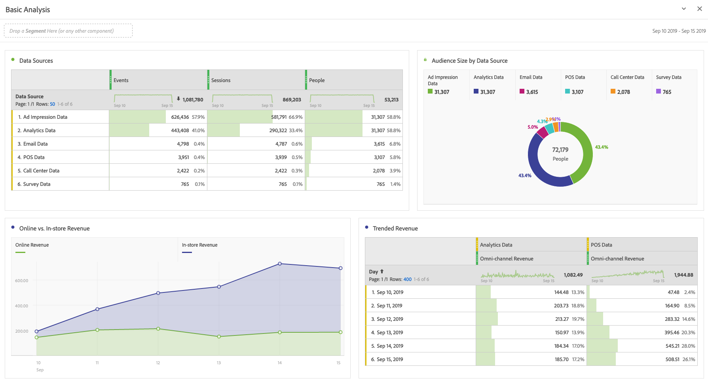

# Utför grundläggande analys

>[!NOTE]
>
>Du visar dokumentationen för Analysis Workspace i Customer Journey Analytics. Funktionsuppsättningen skiljer sig något från [Analysis Workspace i traditionell Adobe Analytics](https://experienceleague.adobe.com/docs/analytics/analyze/analysis-workspace/home.html). [Läs mer …](/help/getting-started/cja-aa.md)

När du har skapat anslutningar och datavyer kan du analysera de data du har tagit med hjälp av kraften och flexibiliteten i Analysis Workspace. Experimentera och dra i mått och mätvärden, ändra dimensionerna och måttattribueringsinställningar, egna namn, tidszon, sessionsinställningar osv.

Här är ett exempel på grundläggande visualiseringar i Workspace. Du kan till exempel

* Skapa en rankad rapport över vilka datakällor som visar flest händelser, sessioner och personer.

* Skapa en trendrapport över intäkter online eller i butik som jämför de två datakällorna över tiden.

* Avbilda målgruppsstorleken efter datakällor, t.ex. annonsvisningsdata, Customer Journey Analytics-data, e-postdata, POS-data, callcenterdata och undersökningsdata.

