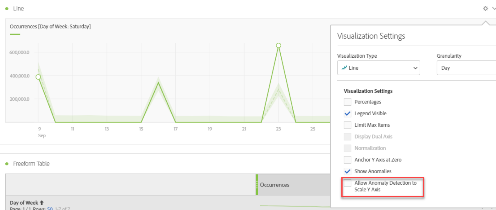

# Visa avvikelser i Analysis Workspace

>[!NOTE]
>
>Du visar dokumentationen för Analysis Workspace i Customer Journey Analytics. Dess funktionsuppsättning skiljer sig något från [Analysis Workspace i traditionell Adobe Analytics](https://docs.adobe.com/content/help/en/analytics/analyze/analysis-workspace/home.html). [Läs mer …](/help/getting-started/cja-aa.md)

Du kan visa avvikelser i en tabell eller i ett linjediagram.

## Visa avvikelser i en tabell {#section_869A87B92B574A38B017A980ED8A29C5}

I en frihandstabell i tidsserien flaggas nu automatiskt varje rad med ett mörkt grått utropstecken om ett datafel har upptäckts.

Den lodräta grå linjen på varje rad anger det förväntade värdet. När du håller över utropstecknet visas i vilken utsträckning avvikelsen avviker från det förväntade värdet (i + eller - %).

## Visa avvikelser i ett linjediagram {#section_7C1192AFDB4345A8A2CCFB3AE0C47D82}

Linjediagrammet visar det ljusgröna konfidensintervallet med de onormala värdena (vita punkter).

Om du klickar på en vit punkt blir den grön och visar dig:

* Datumet då avvikelsen inträffade
* Obehandlat värde på avvikelsen
* Procentvärdet över eller under det förväntade värdet, som representeras av den fasta gröna linjen.

<!--* The Analyze link to start [Contribution Analysis](/help/analysis-workspace/virtual-analyst/contribution-analysis/ca-tokens.md).-->

Om du har flera mått i linjediagrammet visar vi bara anomalierna och du måste hovra över varje anomali för att se konfidensintervallet för det måttet.

Förtroendeintervallet för anomalsk detektion skalar inte automatiskt y-axeln för en visualisering för att eventuellt göra diagrammet mer läsbart.

Du har möjlighet att låta konfidensintervallet skalförändra diagrammet. Klicka bara på ikonen Inställningar (växel) och kontrollera **[!UICONTROL Allow Anomaly Detection to Scale Y Axis]**.

