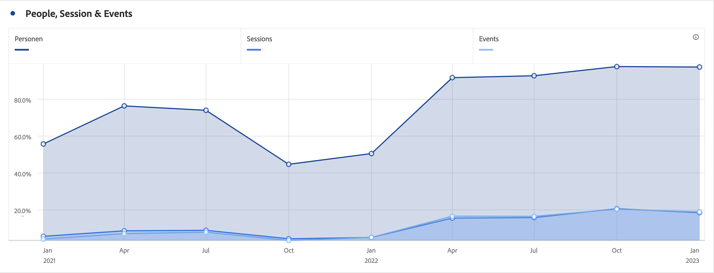

# Yta (staplad)

>[!BEGINSHADEBOX]

_I den här artikeln dokumenteras staplade Area- och Area-visualiseringar i_  _**Customer Journey Analytics**._ _Se [Område och ytor staplade](https://experienceleague.adobe.com/en/docs/analytics/analyze/analysis-workspace/visualizations/area) för_  _**Adobe Analytics**-versionen av den här artikeln._

>[!ENDSHADEBOX]

Områdesvisualiseringen har ett standardalternativ och ett staplingsalternativ.

## Område {#area}

<!-- markdownlint-disable MD034 -->

>[!CONTEXTUALHELP]
>id="workspace_area_button"
>title="Ytdiagram"
>abstract="Skapa en områdesgraf som representerar skärningspunkten mellan flera mätvärden."

<!-- markdownlint-enable MD034 -->

Visualiseringen av  **[!UICONTROL Area]** är som ett linjediagram, men med ett färgat område under linjen. Lägg till ett ytdiagram när du har flera mätvärden och vill visualisera området som uttrycks genom skärningspunkten för två eller flera mätvärden.

## Skiktat område {#area-stacked}

<!-- markdownlint-disable MD034 -->

>[!CONTEXTUALHELP]
>id="workspace_areastacked_button"
>title="Skiktat område"
>abstract="Skapa en områdesgraf som representerar stapling av flera mätvärden."

<!-- markdownlint-enable MD034 -->

Visualiseringen av  **[!UICONTROL Area stacked]** är som ett område, men varje serie börjar överst i föregående serie.

Använd alternativet **[!UICONTROL 100% stacked]** i  **[!UICONTROL Settings]** för att omvandla diagrammet till en 100 % staplad visualisering.

>[!MORELIKETHIS]
>
>[Lägg till en visualisering på en panel](/help/analysis-workspace/visualizations/freeform-analysis-visualizations.md#add-visualizations-to-a-panel)
>>[Visualiseringsinställningar](/help/analysis-workspace/visualizations/freeform-analysis-visualizations.md#settings)
>>[Snabbmenyn Visualisering ](/help/analysis-workspace/visualizations/freeform-analysis-visualizations.md#context-menu)
>
