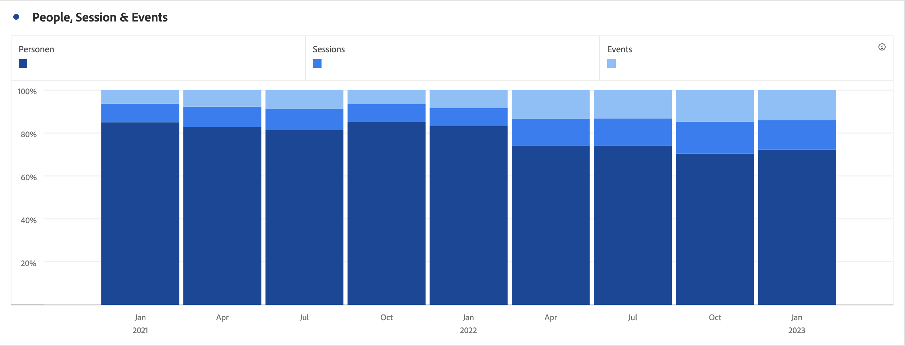

# Stolpstreck och stapel

## Liggande {#bar}

<!-- markdownlint-disable MD034 -->

>[!CONTEXTUALHELP]
>id="cja_workspace_bar_button"
>title="Liggande"
>abstract="Skapa en fältvisualisering som representerar olika värden för ett eller flera mätvärden."

<!-- markdownlint-enable MD034 -->

Visualiseringen  **[!UICONTROL Bar]** visar lodräta staplar som representerar olika värden för ett eller flera mätvärden.

Med en listruta för granularitet i visualiseringsinställningarna kan du ändra en trendvisualisering (till exempel rad, rad) från dag till vecka till månad, osv.

## Stapel staplad {#bar-stacked}

<!-- markdownlint-disable MD034 -->

>[!CONTEXTUALHELP]
>id="cja_workspace_barstacked_button"
>title="Stapel staplad"
>abstract="Skapa en stapelvisualisering för att representera olika värden över en eller flera staplade mätvärden."

<!-- markdownlint-enable MD034 -->

Visualiseringen av  **[!UICONTROL Bar stacked]** fungerar som ett stapeldiagram, men med seriestaplarna staplade ovanpå varandra.

Använd alternativet **[!UICONTROL 100% stacked]** i  **[!UICONTROL Settings]** för att omvandla diagrammet till en 100 % staplad visualisering.

>[!MORELIKETHIS]
>
>[Lägg till en visualisering på en panel](/help/analysis-workspace/visualizations/freeform-analysis-visualizations.md#add-visualizations-to-a-panel)
>[Visualiseringsinställningar](/help/analysis-workspace/visualizations/freeform-analysis-visualizations.md#settings)
>[Snabbmenyn Visualisering ](/help/analysis-workspace/visualizations/freeform-analysis-visualizations.md#context-menu)
>

