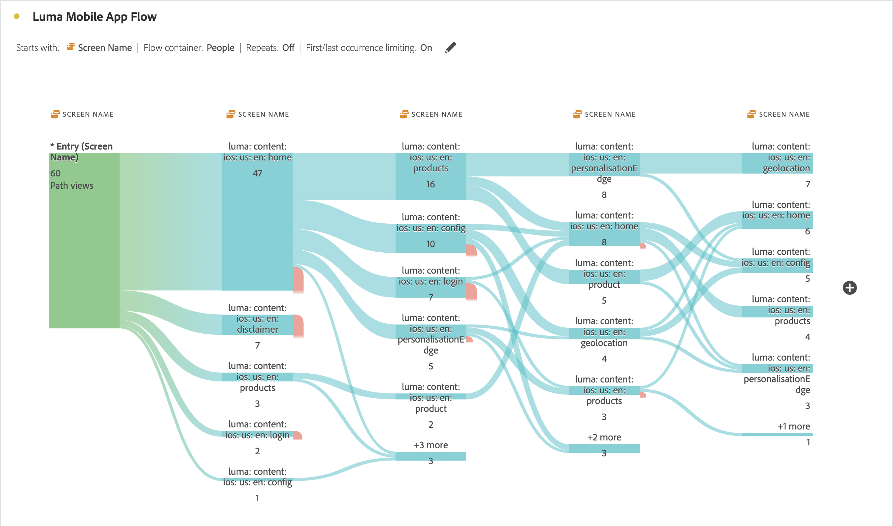

# Flerdimensionella flöden

Med ett interdimensionellt flöde kan du undersöka användarsökvägar i olika dimensioner. Den här artikeln visar hur du använder det här flödet för två användningsområden: interaktioner och händelser för mobilappar och hur kampanjer leder till webbbesök

<!--
A dimension label at the top of each Flow column makes using multiple dimensions in a flow visualization more intuitive:

-->

## Interaktioner och händelser för mobilappar

Dimensionen [!UICONTROL Screen Name] används i det här exempelflödet för att se hur användare använder de olika skärmarna (scenerna) i appen. Den översta skärmen som returneras är **[!UICONTROL luma: content: ios: en: home]**, som är appens startsida:

Om du vill utforska interaktionen mellan skärmar och händelsetyper (som att lägga till i kundvagn, inköp med mera) i den här appen drar och släpper du dimensionen **[!UICONTROL Event Types]**:

* Ovanför alla tillgängliga steg i flödet för att ersätta dimensionen:

  

* Utanför den aktuella flödesvisualiseringen lägger du till dimensionen:

  

Flödesvisualiseringen nedan visar resultatet av att lägga till dimensionen **[!UICONTROL Event Types]**. Visualiseringen ger insikter om hur mobilappsanvändare förflyttar sig mellan olika skärmar i appen innan de lägger till produkter i en kundvagn, stänger appen, presenteras ett erbjudande med mera.

## Hur kampanjer lockar webbbesök

Ni vill analysera vilka kampanjer som leder till besök på webbplatsen. Du skapar en flödesvisualisering med **[!UICONTROL Campaign Name]** som dimension

Du ersätter den sista **[!UICONTROL Campaign Name]**-dimensionen med dimensionen **[!UICONTROL Formatted Page Name]** och lägger till ytterligare en **[!UICONTROL Formatted Page Name]**-dimension i slutet av flödesvisualiseringen.

Du kan hålla muspekaren över något av flödena för att se mer information. Till exempel vilka kampanjer som har resulterat i en kundvagnsutcheckning.

