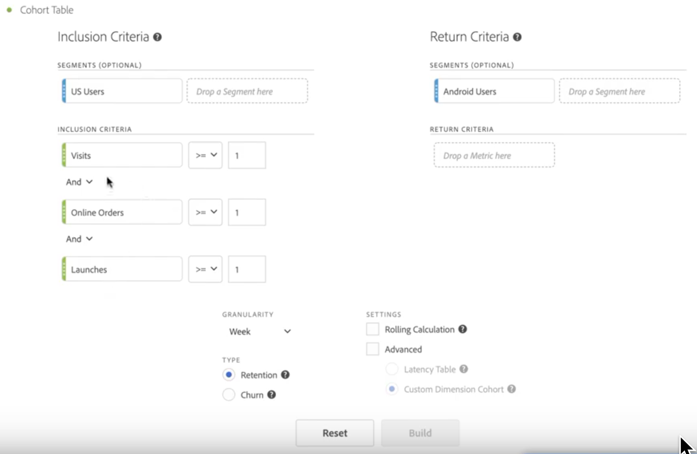
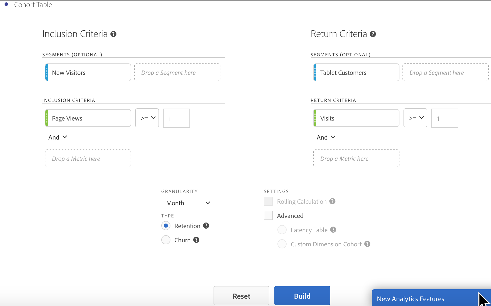

# Konfigurera en [!UICONTROL Cohort Analysis] rapport

Skapa en kohort och kör en [!UICONTROL Cohort Analysis] rapportera i Analysis Workspace.

1. Klicka på **[!UICONTROL Visualizations]** ikonen i den vänstra listen och dra en **[!UICONTROL Cohort Table]** till arbetsytan.

   

1. Definiera **[!UICONTROL Inclusion Criteria]**, **[!UICONTROL Return Criteria]**, **[!UICONTROL Cohort Type]** och **[!UICONTROL Settings]** enligt definitionen i tabellen nedan.

   | Element | Beskrivning |
   |--- |--- |
   | **[!UICONTROL Inclusion Criteria]** | Du kan använda upp till 10 inkluderingsfilter och upp till 3 inkluderingsvärden. Måttet anger vad som placerar en användare i en kohort. Om inkluderingsmåttet till exempel är Order, inkluderas endast användare som har gjort en beställning under kohortanalysens tidsintervall i den initiala kohorten. Standardoperatorn mellan mätvärden är AND, men du kan ändra den till OR. Dessutom kan du lägga till numerisk filtrering i dessa mätvärden. Exempel: &quot;Besök >= 1&quot;.  |
   | **[!UICONTROL Return Criteria]** | Du kan använda upp till 10 returfilter och upp till 3 returvärden. Måttet anger om användaren har behållits (kvarhållning) eller inte (bortfall). Om returvärdet till exempel är Videovyer visas bara de användare som visade videor under efterföljande tidsperioder (efter den period då de lades till i en kohort) som sparade. Ett annat mått som kvantifierar kvarhållandet är Besök. |
   | **[!UICONTROL Granularity]** | Tidsgranulariteten för dag, vecka, månad, kvartal eller år. |
   | **[!UICONTROL Type]** | **[!UICONTROL Retention]**(standard): En bevarandekohort mäter hur bra din person kohorter återgår till din egendom över tid. Det här är den standardkohort som vi alltid har haft och indikerar återkomst och upprepning av användarbeteende. A [!UICONTROL Retention] Kohort indikeras av den gröna färgen i tabellen. **[!UICONTROL Churn]**: En bortfallscohort (kallas även&quot;attrition&quot; eller&quot;utfall&quot;) mäter hur din personkohort faller bort från din egendom över tiden. Kurn = 1 - Kvarhållning. [!UICONTROL Churn] är ett bra mått på hur kantig och möjlig kunden är genom att visa hur ofta kunderna inte kommer tillbaka. Du kan använda urn för att analysera och identifiera fokusområden: vilka kohortfilter kan behöva lite uppmärksamhet. A [!UICONTROL Churn] Kohort indikeras av den röda färgen i tabellen (liknar den som finns i **[!UICONTROL Flow]**visualisering).  |
   | **[!UICONTROL Settings]** | **[!UICONTROL Rolling Calculation]**: Beräkna kvarhållning eller kurva baserat på föregående kolumn, i stället för kolumnen Inkluderat (standard). [!UICONTROL Rolling Calculation] ändrar beräkningsmetoden för dina&quot;retur&quot;-perioder. Vid den normala beräkningen hittas oberoende av användare som uppfyller&quot;returkriterierna&quot; och som var en del av inkluderingsperioden, oavsett om de var i kohorten för den föregående perioden eller inte. Istället [!UICONTROL Rolling Calculation] söker efter användare som uppfyller returkriterierna och som ingick i föregående period. Därför bör [!UICONTROL Rolling Calculation] filtrerar och trattar de användare som kontinuerligt uppfyller&quot;returkriterierna&quot; under en period. [!UICONTROL Return] kriterier tillämpas på var och en av de perioder som leder fram till den valda perioden.   **[!UICONTROL Latency Table]**: A [!UICONTROL Latency] tabell anger tiden som har gått före och efter det att inkluderingshändelsen inträffade. [!UICONTROL Latency] är bra att använda för-/efteranalys. Om du t.ex. har en kommande produkt eller en kampanj och vill spåra beteendet innan samt se hur det fungerar efter, kan du [!UICONTROL Latency] tabellen visar pre- och post-beteendet sida vid sida för att se den direkta effekten. Cellerna före inkludering i [!UICONTROL Latency] Tabellen beräknas av användare som uppfyller [!UICONTROL Inclusion] kriterierna för inkluderingsperioden och uppfyller sedan [!UICONTROL Return] i perioderna före inkluderingsperioden. Observera att [!UICONTROL Latency] tabeller och [!UICONTROL Custom Dimension] Kohort kan inte användas tillsammans.  **[!UICONTROL Custom Dimension Cohort]**: Skapa kohorter baserat på den valda dimensionen i stället för tidsbaserade kohorter (standard). Många kunder vill analysera sina kohorter med något annat än tid, och med den nya funktionen Custom Dimension Cohort kan du skapa kohorter baserat på de mått de själva väljer. Använd dimensioner som marknadsföringskanal, kampanj, produkt, sida, region eller någon annan dimension i Customer Journey Analytics för att visa hur kvarhållandet ändras baserat på de olika värdena för de här dimensionerna. The [!UICONTROL Custom Dimension] Kohortfilterdefinitionen använder dimensionsobjektet endast som en del av inkluderingsperioden, inte som en del av returdefinitionen.  När du har valt [!UICONTROL Custom Dimension] Alternativet Kohort, du kan dra och släppa vilken dimension du vill i släppzonen. På så sätt kan du jämföra liknande dimensionsobjekt under samma tidsperiod. Du kan t.ex. jämföra prestanda för städer sida vid sida, produkter, kampanjer osv. Den returnerar dina 14 främsta dimensionsobjekt. Du kan emellertid använda ett filter (öppna det genom att hålla muspekaren åt höger om dimensionen som dragits på) för att endast visa önskade dimensionsobjekt. A [!UICONTROL Custom Dimension] Kohort kan inte användas med [!UICONTROL Latency] Tabellfunktion.  |

1. Justera **[!UICONTROL Cohort Table Settings]** genom att klicka på kugghjulet.

   | Inställning | Beskrivning | | Visa endast procent | Tar bort talvärdet och visar bara procentvärdet. | | Avrunda procent till närmaste heltal | Avrundar procentvärdet till närmaste heltal i stället för att visa decimalvärdet. | | Visa genomsnittlig procentrad | Infogar en ny rad högst upp i tabellen och lägger sedan till medelvärdet för värdena i varje kolumn. |

## Bygg [!UICONTROL Cohort Analysis] rapport

1. Klicka på **[!UICONTROL Build]**.

   

   Rapporten visar vilka som gjort en beställning ( *`Included`* ) och som återvände till din webbplats vid efterföljande besök. Genom att antalet besök minskar över tid kan du upptäcka problem och vidta åtgärder.
1. (Valfritt) Skapa ett filter från en markering.

   Markera celler (angränsande eller icke-angränsande) och högerklicka sedan > **[!UICONTROL Create Filter From Selection]**.

1. I [Filter Builder](/help/components/filters/filter-builder.md)redigerar du filtret ytterligare och klickar sedan på **[!UICONTROL Save]**.

   Det sparade filtret kan användas i [!UICONTROL Filter] panel i [!UICONTROL Analysis Workspace].
1. Namnge och spara ditt kohortprojekt.
1. (Valfritt) [Kuratera och dela](/help/analysis-workspace/curate-share/curate.md) projektkomponenterna.

   >[!NOTE]
   >
   >Du måste spara projektet innan kursen är tillgänglig.

## Ladda ned en kohortvisualisering

Precis som med andra visualiseringar i Analysis Workspace kan du hämta en kohortvisualisering som en CSV- eller PDF-fil. Mer information finns i [Hämta projektdata](/help/analysis-workspace/export/download-send.md).