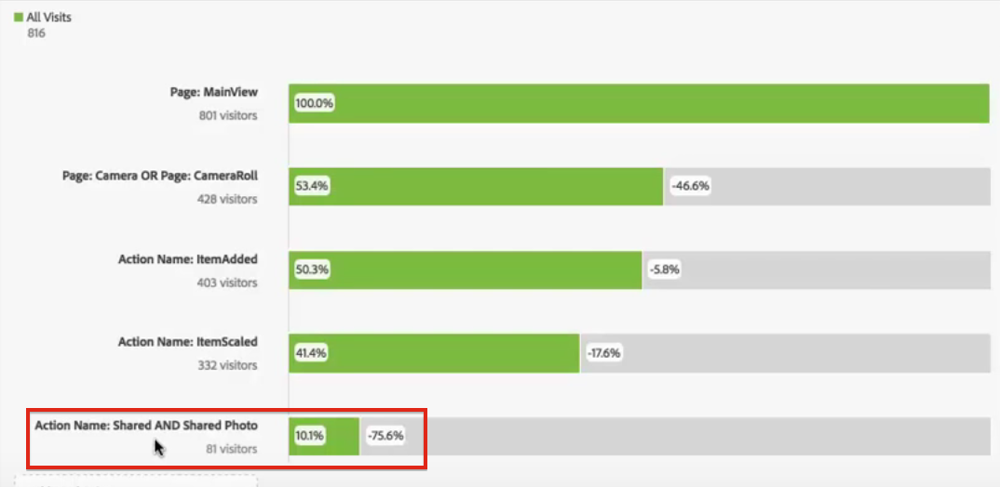

# Intradimensionella utfall

Med Fallout i Analysis Workspace kan du blanda och matcha mått och mätvärden som kontaktytor i flöden och arbetsflöden. Detta ger större flexibilitet när det gäller att definiera de användarsteg som du vill undersöka.

**Exempel**: Förutom siddimensionen kan du lägga till åtgärdsbaserade dimensionsobjekt i en utfallsvisualisering. På så sätt kan ni visualisera hur sidor och vissa åtgärder interagerar på kundens vägar.

Utfallet uppdateras dynamiskt så att du kan se utfallet i flera dimensioner.

Du kan också lägga till mätvärden i den här mixen. I det här exemplet har vi lagt till måttet&quot;Delat foto&quot; för att ge intryck av kundens väg:

Dessutom kan du kombinera olika mått och mätvärden i AND-kontrollpunkter. Bara dra ytterligare mått eller mätvärden över en befintlig dimension:

