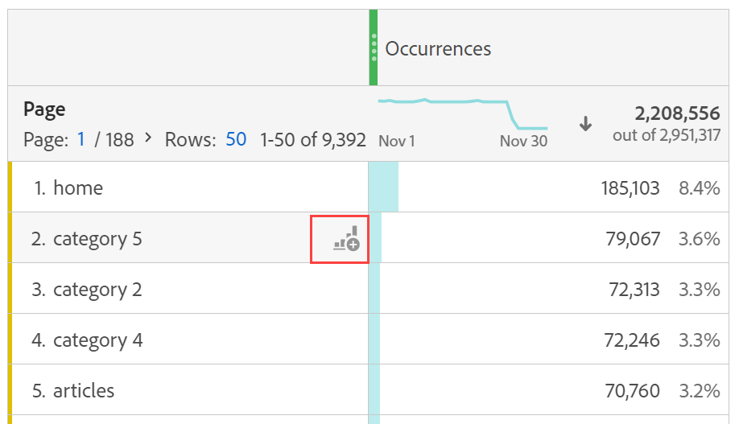

# Visualiseringar - översikt

Workspace erbjuder ett antal visualiseringar som gör att du kan generera visuella representationer av dina data. t.ex. stapeldiagram, mundiagram, histogram, linjediagram, kartor, punktdiagram med mera.

## Typer

Följande visualiseringstyper finns i Analysis Workspace:

| Ikon | Namn | Beskrivning |
| :---: | --- | ---|
|  | [Område](/help/analysis-workspace/visualizations/area.md) | En områdesgraf visualisering. Som ett linjediagram, men med ett färgat område under linjen. Använd ett ytdiagram när du har flera mätvärden och vill visualisera området som uttrycks genom skärningspunkten för två eller flera mätvärden. |
|  | [Bar](/help/analysis-workspace/visualizations/bar.md) | En stapeldiagramvisualisering med lodräta staplar som representerar olika värden över en eller flera mätvärden. |
|  | [Stapel staplad](/help/analysis-workspace/visualizations/bar.md) | En staplad stapeldiagramvisualisering med lodräta staplar som representerar olika värden över ett eller flera mätvärden. |
| 
 | [Punkt](/help/analysis-workspace/visualizations/bullet-graph.md) | En punktgraf som visar hur ett värde som du är intresserad av jämförs med eller mäter mot andra prestandaintervall (mål). |
|  | [Kohortabell](/help/analysis-workspace/visualizations/cohort-table/cohort-analysis.md) | En kohortvisualisering är en grupp personer som delar gemensamma egenskaper under en viss period. En kohorttabell är användbar för retentions-, urn- eller latensanalys. |
|  | [Kombination](combo-charts.md) | Med ett kombinationsdiagram kan du snabbt skapa en jämförelsevisualisering utan att först behöva skapa en tabell. |
|  | [Ringdiagram](/help/analysis-workspace/visualizations/donut.md) | På samma sätt som ett cirkeldiagram visas data som delar av eller segment i en helhet i en munhandvisning. |
|  | [Utfall](/help/analysis-workspace/visualizations/fallout/fallout-flow.md) | En utfallsvisualisering visar var personer lämnade (föll ut) och fortsatte igenom (föll igenom) en fördefinierad sidsekvens. |
|  | [Flöde](/help/analysis-workspace/visualizations/c-flow/flow.md) | En flödesvisualisering visar exakta kundvägar via era webbplatser och appar. |
| 
 | [Frihandstabell](/help/analysis-workspace/visualizations/freeform-table/freeform-table.md) | En frihandsritbordsvisualisering är en interaktiv visualisering. Visualisering av tabeller på frihand är grunden för dataanalys i Workspace. |
|  | [Histogram](/help/analysis-workspace/visualizations/histogram.md) | En histogramvisualisering blockerar personer, besök eller händelser i grupper baserat på en mätvolym. |
|  | [Vågrätt fält](/help/analysis-workspace/visualizations/horizontal-bar.md) | En vågrät fältvisualisering visar vågräta staplar som representerar olika värden över ett eller flera mätvärden. |
|  | [Vågrätt fält staplat](/help/analysis-workspace/visualizations/horizontal-bar.md) | En staplad vågrät fältvisualisering visar vågräta staplar som representerar olika värden över ett eller flera mätvärden. |
|  | [Researbetsyta](/help/analysis-workspace/visualizations/journey-canvas/journey-canvas.md) | Med en visualisering av arbetsytan på resan kan ni analysera och få insikter om de resor som ni erbjuder era användare och kunder. |
|  | [Sammanfattning av nyckelmått](/help/analysis-workspace/visualizations/key-metric.md) | En sammanfattning av nyckeltal kombinerar visualisering av rad, sammanfattningsändring och sammanfattningsnummer. |
|  | [Linjediagram](/help/analysis-workspace/visualizations/line.md) | En radvisualisering representerar mätvärden som använder en rad för att visa hur värden ändras under en tidsperiod. Ett linjediagram använder tid längs x-axeln. |
|  | [Spridning](/help/analysis-workspace/visualizations/scatterplot.md) | En punktvisualisering visar relationen mellan dimensionsobjekt och upp till tre mätvärden. |
|  | [Avsnittshuvud](section-header.md) | Identifiera och föra fram avsnitt på en panel. |
|  | [Sammanfattningsändring](/help/analysis-workspace/visualizations/summary-number-change.md) | En visualisering av en sammanfattningsändring visar ändringen mellan de markerade cellerna som ett stort tal eller som ett procenttal. |
| 
 | [Sammanfattningsnummer](/help/analysis-workspace/visualizations/summary-number-change.md) | En visualisering av ett sammanfattningsnummer visar den markerade cellen som ett stort tal. |
|  | [Text](/help/analysis-workspace/visualizations/text.md) | Med textvisualisering kan du lägga till användardefinierad text i din Workspace. Användbar för att lägga till ytterligare kontext till analyser och insikter, utöver att utnyttja beskrivningar av paneler/visualisering |
|  | [Treemap-diagram](/help/analysis-workspace/visualizations/treemap.md)
 | I en treemap-visualisering visas hierarkiska (trädstrukturerade) data som en uppsättning kapslade rektanglar. |
|  | [Venn](/help/analysis-workspace/visualizations/venn.md) | En venn-visualisering använder cirklar för att avbilda den metriska överlappningen av upp till 3 segment. |

<!-- Add beneath Horizontal bar in the table above: | [Journey canvas](/help/analysis-workspace/visualizations/journey-canvas/journey-canvas.md) | Similar to Fallout, Journey canvas shows where persons left (fell out) and continued through (fell through) a predefined sequence of pages. 
Unlike Fallout, Journey canvas supports not only linear journeys, but any number of entry points and paths. Furthermore, journeys can be created in Adobe Journey Optimizer and then analyzed in Journey canvas.
 | -->

## Lägga till visualiseringar i en panel

1. Öppna det Workspace-projekt där du vill lägga till en visualisering.

1. Använd någon av följande metoder för att lägga till visualiseringen:

   

   * I den vänstra panelen väljer du  **Visualiseringar** och drar sedan en visualisering till panelen där du vill lägga till visualiseringen.

   * Välj  på panelen där du vill lägga till visualiseringen och välj sedan den ikon som representerar den visualisering som du vill lägga till. Håll pekaren över ikonen för varje visualisering för att se namnet.

   * Lägg till en [tom panel](/help/analysis-workspace/c-panels/blank-panel.md) och välj sedan den visualisering som du vill lägga till.

   * Välj **[!UICONTROL Duplicate visualization]** eller **[!UICONTROL Copy visualization]** på snabbmenyn för en befintlig visualisering i ditt Analysis Workspace-projekt.

   * Använd Workspace **[!UICONTROL Insert]**-menyn för att infoga en visualisering.

   * Välj **[!UICONTROL Visualize]** på snabbmenyn i en friformstabell. Välj sedan visualisering på undermenyn. Baserat på det aktuella urvalet i tabellen avgör Workspace vilken visualisering som ska erbjudas och tolkar data för att skapa den begärda visualiseringen.

När du lägger till en enkel visualisering, till exempel en [rad](line.md) av [Bar](bar.md)-visualisering, används den närmaste friformstabellen som datakälla. Du kan alltid ändra [datakällan](#data-source) för dina visualiseringar.

## Hantera visualiseringar

Du kan hantera en visualisering när du hovrar över visualiseringen eller väljer visualiseringen.

* Om du vill komprimera en visualisering väljer du .
* Om du vill visa en komprimerad visualisering väljer du .
* Om du vill ta bort en visualisering väljer du . Ångra genom att välja **[!UICONTROL Edit]** > **[!UICONTROL Undo]** (**[!UICONTROL *cmd+z *]**) |**[!UICONTROL * Ctrl+z *]**).
* Om du vill återställa en visualisering till standardhöjden väljer du .
* Om du vill flytta en visualisering inom en panel drar och släpper du visualiseringen när en  är synlig (vanligtvis när du för muspekaren över huvudet).

## Förklaring

En visualiseringsförklaring hjälper dig att relatera datum i en källtabell till plottade serier i visualiseringen. Förklaringen är interaktiv - du kan markera ett förklaringsobjekt om du vill visa/dölja en serie i visualiseringen, vilket är praktiskt om du vill förenkla de data som visas.

Dessutom kan du byta namn på förklaringsetiketter så att det blir lättare att använda bilderna. Obs! Teckenredigering gäller **inte** för: Teckenuppsättning, Punkt, Sammanfattningsändring/nummer, Text, Frihand, Histogram, Kohort eller Flödesvisualiseringar.

Så här redigerar du en förklaringsetikett:

1. Högerklicka på någon av förklaringsetiketterna.
1. Klicka på **[!UICONTROL Edit Label]**.

   

1. Ange den nya etikettexten.
1. Tryck på **[!UICONTROL Enter]** för att spara.

## Inställningar

Varje visualisering har sina egna inställningar. Om du vill komma åt visualiseringsinställningarna väljer du  **[!UICONTROL Settings]** i visualiseringshuvudet för att visa ett popup-fönster.

Beroende på visualiseringen kan du konfigurera

* information om källan till data för visualiseringen via fliken [**[!UICONTROL Data source]**](#data-source), och
* inställningar för visualisering via fliken [**[!UICONTROL Settings]**](#settings-1).

### Datakälla

Du kan styra vilken datakälla och vilka objekt eller positioner i datakällan som motsvarar en visualisering. Mer information finns i [Hantera datakällor](t-sync-visualization.md).

### Inställningar

Vilka visualiseringsinställningar som är tillgängliga beror på visualiseringen. Tabellen nedan sammanfattar de vanligaste inställningarna. Vissa visualiseringar har specifika inställningar. Mer information finns i dokumentationen för den enskilda visualiseringen.

| Alternativ | Beskrivning |
| --- | --- |
| **[!UICONTROL Visualization type]** | Ändra den typ av visualisering som används för att visualisera data. |
| **[!UICONTROL Granularity]** | Ändra tidgranulariteten för trendvisualiseringar. Den här ändringen gäller även för datakälltabellen. |
| **[!UICONTROL Percentages]** | Visa värden i procent. |
| **[!UICONTROL 100% stacked]** | Omvandla diagrammet till en 100 % staplad visualisering.  Gäller endast för en staplad visualisering av ytor, stolpar och vågräta staplar. |
| **[!UICONTROL Legend visible]** | Visa förklaringstext. |
| **[!UICONTROL Limit max items]** | Begränsa antalet objekt som visas i en visualisering. När du väljer det här alternativet anger du det högsta antalet objekt. |
| **[!UICONTROL Show annotations]** | Visa anteckningarna som gjorts för den här visualiseringen. |
| **[!UICONTROL Hide title]** | Dölj titeln på visualiseringen. |
| **[!UICONTROL Anchor y-axis at zero]** | Sätt y-axelns nederkant till noll. Om alla värden som är ritade i diagrammet ligger betydligt över noll gör diagrammets standardvärde att y-axelns nederdel inte är noll. Om du aktiverar det här alternativet tvingas y-axeln till noll (och diagrammet ritas om). |
| **[!UICONTROL Display dual axis]** | Visa vänster och höger y-axel för två olika mätvärden. Det här alternativet gäller bara om du har två mätvärden. Dubbla axlar är användbara när plottade mätvärden har olika magnituder. |
| **[!UICONTROL Show x-axis]** | Visa x-axeln i visualiseringen. |
| **[!UICONTROL Show y-axis]** | Visa y-axeln i visualiseringen. |
| **[!UICONTROL Show barbells on lines]** | Visa streckade linjer på linjevisualisering i en kombinationsdiagram. |
| **[!UICONTROL Normalization]** | Använd samma proportioner för mätvärden. Likvärdiga proportioner är användbara när plottade mätvärden har olika förstoringsgrader. |
| **[!UICONTROL Show anomalies]** | Förbättra linjediagram och frihandstabeller genom att visa avvikelseidentifiering. Analysidentifiering i linjevisualiseringar inkluderar ett förväntat värde (streckad linje) och ett förväntat intervall (skuggat band). |
| **[!UICONTROL Show forecast]** | Förbättra linjediagram och frihandstabeller genom att visa prognosvärden. |
| **[!UICONTROL Show min]** | Visa det minsta värdet i visualiseringen. |
| **[!UICONTROL Show max]** | Visa det högsta värdet i visualiseringen. |
| **[!UICONTROL Show trendline]** | Visa en trendlinje i visualiseringen. När du väljer det här alternativet kan du välja typ av trendlinje i den nedrullningsbara menyn. |

Du kan anpassa inställningarna för alla visualiseringar som du skapar. Mer information finns i [Användarinställningar](/help/analysis-workspace/user-preferences.md).

## Snabbmeny {#right-click}

Använd snabbmenyn (som är tillgänglig genom alternativ markering, till exempel högerklicka när du använder en mus) på ett visualiseringshuvud för att få tillgång till ytterligare funktioner för en visualisering. Alla alternativ är inte tillgängliga för alla visualiseringar.

| Alternativ | Beskrivning |
| --- | --- |
| **[!UICONTROL Insert copied visualization]** | Klistra in (infoga) en kopierad visualisering på en annan plats i projektet, eller i ett helt annat projekt. |
| **[!UICONTROL Copy data to clipboard]** | [Kopiera data](/help/analysis-workspace/export/download-send.md#copy-to-clipboard) från visualiseringen till Urklipp. |
| **[!UICONTROL Copy selection to clipboard]** | [Kopiera markeringen](/help/analysis-workspace/export/download-send.md#copy-to-clipboard) från visualiseringen till Urklipp. |
| **[!UICONTROL Download items as CSV (*dimensionsnamn *)]** | [Hämta dimensionsobjekten](/help/analysis-workspace/export/download-send.md#download-items-as-csv) (högst 50 000) av visualiseringen till din lokala enhet. Högst 50 000 dimensionsartiklar för den valda dimensionen. |
| **[!UICONTROL Copy visualization]** | Kopiera visualiseringen så att du kan infoga visualiseringen på en annan plats i projektet eller i ett helt annat projekt. |
| **[!UICONTROL Download data CSV]** | [Hämta visuella data](/help/analysis-workspace/export/download-send.md#download-as-csv) för visualiseringen till din lokala enhet. |
| **[!UICONTROL Export full table]** | Exportera hela tabellen till en angiven molnplats. Se [Exporterar Customer Journey Analytics-rapporter till molnet](../export/export-cloud.md) |
| **[!UICONTROL Duplicate visualization]** | Gör en exakt kopia av visualiseringen. |
| **[!UICONTROL Edit description]** | Lägg till (eller redigera) en textbeskrivning för visualiseringen. Se [Text](text.md). |
| **[!UICONTROL Get visualization link]** | Kopiera och dela en länk direkt till visualiseringen. Länken visas i en dialogruta för delning. Välj Kopiera för att kopiera länken till Urklipp. |
| **[!UICONTROL Start over]** | Ta bort konfigurationen för den aktuella visualiseringen så att du kan konfigurera om den från grunden. |

## Konfiguration

Vissa visualiseringar (som Cohort-tabellen, Fallout, Flow med flera) har en konfigurationsdialogruta som hjälper dig att skapa visualiseringen. Använd  längst upp i visualiseringen för att komma åt och ändra konfigurationen.

## Visualisera

Om du inte är säker på vilken visualisering du ska välja väljer du  **[!UICONTROL Visualize]** i valfri tabellrad på frihand (tillgänglig vid hovring). Den här markeringen är det snabbaste sättet att lägga till en visualisering. Analysis Workspace har en väl underbyggd gissning där visualisering bäst passar era data. Om du t.ex. har markerat en rad skapas ett [linjediagram](line.md). Om du har markerat tre segmentrader skapas ett [venn](venn.md)-diagram.

