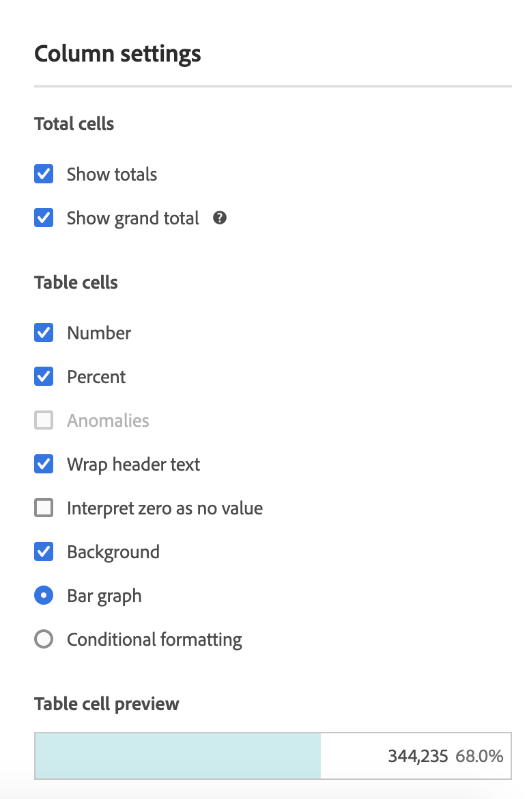

# [!UICONTROL Column Settings]

[!UICONTROL Column Settings] gör att du kan konfigurera kolumnformatering, som vissa kan vara villkorliga.

Visa en video om rad- och kolumninställningar här:

>[!VIDEO](https://video.tv.adobe.com/v/40382/?quality=12)

## Redigera [!UICONTROL Column Settings] {#edit-column-settings}

För åtkomst [!UICONTROL Column Settings]drar du en friformstabell till projektet och klickar sedan på kugghjulsikonen i kolumnrubriken.

Du kan redigera inställningar **för flera kolumner samtidigt**. Markera bara flera kolumner och klicka på inställningsikonen för någon av dessa kolumner. Alla ändringar du gör gäller för alla kolumner där celler är markerade.

| Element | Beskrivning |
| --- | --- |
| Nummer | Avgör om en cell visar/döljer det numeriska värdet för måttet. Om måttet till exempel är Sidvyer är det numeriska värdet antalet sidvyer för radobjektet. |
| Procent | Avgör om en cell visar/döljer procentvärdet för måttet. Om måttet till exempel är Sidvyer är procentvärdet antalet sidvyer för radobjektet delat med de totala sidvyerna för kolumnen.  Obs! Vi kan visa procenttal som är större än 100 % för att vara mer korrekta. Vi flyttar också det övre gränsvärdet till 1 000 % för att säkerställa att kolumnerna blir för stora. |
| Anomalier | Avgör om avvikelseidentifiering körs på värdena i den här kolumnen. |
| Radbryt rubriktext | Gör att du kan radbryta rubriktexten i frihandstabeller så att rubrikerna blir mer läsbara och tabellerna mer delbara. Detta är användbart för .pdf-återgivning och för mått med långa namn. Aktiverat som standard. |
| Tolka noll som inget värde | För celler med värdet 0 anger om en 0-cell eller en tom cell ska visas. Det här är användbart när du tittar på data för varje dag i en månad, och vissa dagar har inte inträffat än.  I stället för att visa 0 för framtida datum kan tomma celler visas i stället. Diagram följer även den här inställningen (d.v.s. de visar inte en linje eller en stapel med 0 värden när den här inställningen är markerad). |
| Bakgrund | Anger om en cell visar/döljer all cellformatering, inklusive stapeldiagrammet och villkorsstyrd formatering. |
| Stolpdiagram | Visar ett vågrätt stolpdiagram som representerar cellens värde i förhållande till totalvärdet för kolumnen. |
| Villkorsstyrd formatering | Se avsnittet nedan. |
| Förhandsgranskning av tabellcell | Visar en förhandsvisning av hur varje cell visas med de valda formateringsalternativen. |

## Villkorsstyrd formatering {#conditional-formatting}

Villkorsstyrd formatering tillämpar formatering på övre, mellersta och nedre gränser som du kan definiera. Om du använder villkorsstyrd formatering (färger o.s.v.) i frihandstabeller aktiveras även automatiskt vid uppdelning, såvida inte &quot;Anpassade&quot; gränser har valts.

| Element | Beskrivning |
| --- | --- |
| Villkorsstyrd formatering | Använder en förkonfigurerad färguppsättning som du väljer för celler. Beroende på vilket av de fyra tillgängliga färgscheman du väljer tilldelas olika färger till höga värden, mittpunktsvärden och låga värden.   Om du ersätter en dimension i tabellen återställs de villkorliga formateringsgränserna. Om du ersätter ett mätvärde räknas gränserna för den kolumnen om (där ett mätvärde finns på X-axeln och ett mått på Y-axeln). |
| Använd procentgränser | Ändra gränsintervallet så att det baseras på procentvärden i stället för absoluta värden. Detta fungerar för mätvärden som endast är procentbaserade (som Studsfrekvens) samt för mätvärden som har ett antal och ett procenttal (som sidvyer). |
| Automatiskt genererad | Beräkna automatiskt övre/mellersta/nedre gränser baserat på data. Den övre gränsen är det största värdet i den här kolumnen. Den undre gränsen är det lägsta och mittpunkten är medelvärdet av de övre och nedre gränserna. |
| Anpassad | Tilldela manuellt övre/mellersta/nedre gränser. Då får du den flexibilitet du behöver för att avgöra när ett kolumnvärde blir bra, medelbra eller dåligt. |
| Paletten Villkorsstyrd formatering | Välj vilket av de fyra tillgängliga färgschemana som du vill använda för villkorsstyrd formatering. |

## Använd en attribueringsmodell som inte är standard {#attribution}

Gör att du kan åsidosätta standardattributmodellen som angetts i [Datavyer](/help/data-views/component-settings/attribution.md).

>[!NOTE]
>
>Tänk på följande när du uppdaterar en komponents attribuering till en icke-standardattribueringsmodell:
>
>* **När komponenten används i en rapport med *en dimension*:** Komponentens attribuering ignorerar allokeringsmodellen när en icke-standardattribueringsmodell används.
>
>* **När komponenten används i en rapport med *flera dimensioner*:** Komponentens attribuering bevarar allokeringsmodellen när en icke-standardattribueringsmodell används.
>
>   Flera dimensioner är bara tillgängliga när [exportera data till molnet](/help/analysis-workspace/export/export-cloud.md).
>
> Mer information om allokering finns i [Inställningar för Persistence-komponent](/help/data-views/component-settings/persistence.md).

Så här använder du en icke-standardattribueringsmodell för ett mätresultat i en Analysis Workspace:

1. Klicka på inställningsikonen (kugghjulsikonen) på ett mätvärde i kolumnen Frihandstabell.

   

2. Under **[!UICONTROL Data Settings]**, kontrollera **[!UICONTROL Use non-default attribution model]**. Mer information om olika attribueringsmodeller finns i [Attributionsmodeller](/help/data-views/component-settings/attribution.md).

   

>[!MORELIKETHIS]
>
>* [Hantera datakällor](/help/analysis-workspace/visualizations/t-sync-visualization.md)
