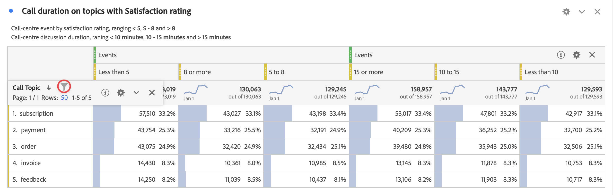

# Filtrera och sortera tabeller på frihand

Frihandstabeller i Analysis Workspace är grunden för interaktiv dataanalys. De kan därför innehålla tusentals rader med information. Filtrering och sortering av data kan vara en viktig del av att effektivt kunna hitta den viktigaste informationen.

<!--The following video covers filter and sort options in Analysis Workspace, in addition to pagination options:

>[!VIDEO](https://video.tv.adobe.com/v/23968)-->

## Filtrera tabeller

Med filter i Analysis Workspace hittar du den viktigaste informationen.

>[!NOTE]
>
> Endast dynamiska dimensionsobjekt kan filtreras enligt beskrivningen i det här avsnittet. Statiska dimensionsobjekt kan inte filtreras. Mer information finns i [Dynamiska jämfört med statiska dimensionsobjekt i frihandstabeller](/help/analysis-workspace/visualizations/freeform-table/column-row-settings/manual-vs-dynamic-rows.md).

## Filtrera tabellrader på frihand

Du kan använda flera metoder för att filtrera rader från en frihandstabell. 

- Klicka på X i raden
- Tabellfilter
- Segmentering

Se till att du läser hur varje metod påverkar [Frihandstabellsummor](/help/analysis-workspace/visualizations/freeform-table/workspace-totals.md).

### Exkludera snabbt specifika rader från en tabell

Du kan snabbt utesluta vissa rader från tabellen utan att behöva öppna filterdialogrutan.

>[!NOTE]
>
>När du utelämnar rader enligt beskrivningen i det här avsnittet, visas en [!UICONTROL **Uteslut alltid objekt**] regeln används automatiskt i den avancerade filterdialogrutan. (Du kan visa den tillämpade regeln genom att markera filterikonen och sedan [**[!UICONTROL Show advanced]**](#apply-a-simple-or-advanced-filter-to-a-table).)

Så här exkluderar du snabbt vissa rader från en friformstabell:

1. Håll pekaren över raden som du vill utesluta och välj sedan x-ikonen.

   Håll ned Skift-tangenten om du vill markera flera rader eller håll ned Kommando-tangenten (Mac) eller Ctrl-tangenten (Windows) om du vill markera flera rader.

<!--### Right-click > Delete selected rows

Note: this option does not seem to work. AN-338422

1. Select 1 or more rows. 
1. Right-click and select **[!UICONTROL Delete Selected Rows]**. 

   This action will remove the rows from the table and apply a table filter.-->

### Använda ett enkelt eller avancerat filter på en tabell

Så här filtrerar du data i frihandstabeller:

1. Håll markören över den kolumn som innehåller de data som du vill filtrera. <!--only some types of columns show the filter... Which? Just Dimensions?-->

1. Välj **Filter** -ikonen när den visas.

   

   Följande alternativ är tillgängliga:

   | Alternativ | Funktion |
   |---------|----------|
   | [!UICONTROL **Sök efter ord eller fras**] | Ange ett ord eller en fras som du vill filtrera efter. Endast rader som innehåller det angivna ordet eller den exakta frasen visas. |
   | [!UICONTROL **Inkludera ospecificerad (ingen)**] | Välj det här alternativet om du vill visa data i tabellen som inte faller inom någon av tabellens dimensioner. <!--what is this?--> |

1. (Valfritt) Om du vill filtrera efter olika villkor eller efter flera villkor väljer du [!UICONTROL **Visa avancerat**].

   Följande avancerade filteralternativ är tillgängliga:

   | Alternativ | Funktion |
   |---------|----------|
   | [!UICONTROL **Inkludera ospecificerad (ingen)**] | Välj det här alternativet om du vill visa data i tabellen som inte faller inom någon av tabellens dimensioner. <!--what is this?--> |
   | [!UICONTROL **Matcha**] | 
Välj [!UICONTROL **Om alla villkor är uppfyllda**] om du bara vill visa data som uppfyller alla villkor som du anger. Det här alternativet ger vanligtvis mer förfinade data.
 
Välj [!UICONTROL **Om något villkor uppfylls**] om du vill visa data som uppfyller något av de filtervillkor som du anger. Det här alternativet ger vanligtvis mindre förfinade data.
 |
   | [!UICONTROL **Kriterier**] | 
Välj bland följande filteralternativ:

(Välj [!UICONTROL **Lägg till rad**] om du vill lägga till flera filtervillkor. Det alternativ du väljer i dialogrutan [!UICONTROL **Matcha**] -avsnittet avgör om alla eller några av villkoren som du lägger till måste uppfyllas.)
<ul><li>
[!UICONTROL **Innehåller frasen**]: Endast data som innehåller den exakta frasen som du anger inkluderas i de filtrerade resultaten. Orden måste vara i den ordning som anges i [!UICONTROL **Sök efter ord- eller frasfält**].
Det här är standardinställningen när du gör en enkel sökning.

</li><li>
[!UICONTROL **Innehåller alla termer**]: Endast data som innehåller ett eller flera ord från den fras du anger inkluderas i de filtrerade resultaten. 
</li><li>
[!UICONTROL **Innehåller alla termer**]: Endast data som innehåller alla ord från den fras du anger inkluderas i filtrerade resultat. Orden behöver inte vara i den ordning som anges i [!UICONTROL **Sök efter ord- eller frasfält**].
</li><li>
[!UICONTROL **Innehåller inga termer**]: Endast data som inte innehåller något av orden från den fras du anger inkluderas i filtrerade resultat. 
</li><li>
[!UICONTROL **Innehåller inte frasen**]: Endast data som inte innehåller den exakta frasen som du anger inkluderas i de filtrerade resultaten. Orden måste vara i den ordning som anges i [!UICONTROL **Sök efter ord- eller frasfält**].
</li><li>
[!UICONTROL **Lika med**]: Endast data som exakt matchar den fras du anger inkluderas i de filtrerade resultaten. 
</li><li>
[!UICONTROL **Är inte lika med**]: Endast data som inte exakt matchar den fras du anger inkluderas i filtrerade resultat. 
</li><li>
[!UICONTROL **Börjar med**]: Endast data som börjar med ordet eller den exakta frasen som du anger inkluderas i de filtrerade resultaten. 
</li><li>
[!UICONTROL **Slutar med**]: Endast data som slutar med ordet eller den exakta frasen som du anger inkluderas i de filtrerade resultaten. 
</li></ul> |
   | [!UICONTROL **Uteslut alltid objekt**] | Ange namnet på alla objekt som du vill utesluta från filtrerade data. |

1. Välj [!UICONTROL **Använd**] för att filtrera data.

   The **Filter** icon  blir blå när ett filter används i tabellen.

### Filter

Se vår [Filtreringsdokumentation](/help/components/filters/filters-overview.md) för mer information.

## Sortera tabeller

Du kan sortera data i en Frihand-tabell efter en kolumn i Analysis Workspace som är en dimension eller ett mått.

En nedåtpil  är synlig i kolumnrubriken som data sorteras efter.

1. Klicka på pilen bredvid namnet på måttet eller måttet i en friformstabell i Analysis Workspace.

   Tänk på följande när du sorterar:

   - Nedpilen sorterar i fallande ordning och uppilen (standard) i stigande ordning.
   - Du kan sortera Dimensioner alfabetiskt eller numeriskt. Du kan till exempel ha numrerade steg i ett arbetsflöde och vill kanske sortera efter stegnumret. Du kan sortera en datumrelaterad dimension efter datum. Du kan också sortera datakällor i bokstavsordning, som i följande bild.

   

