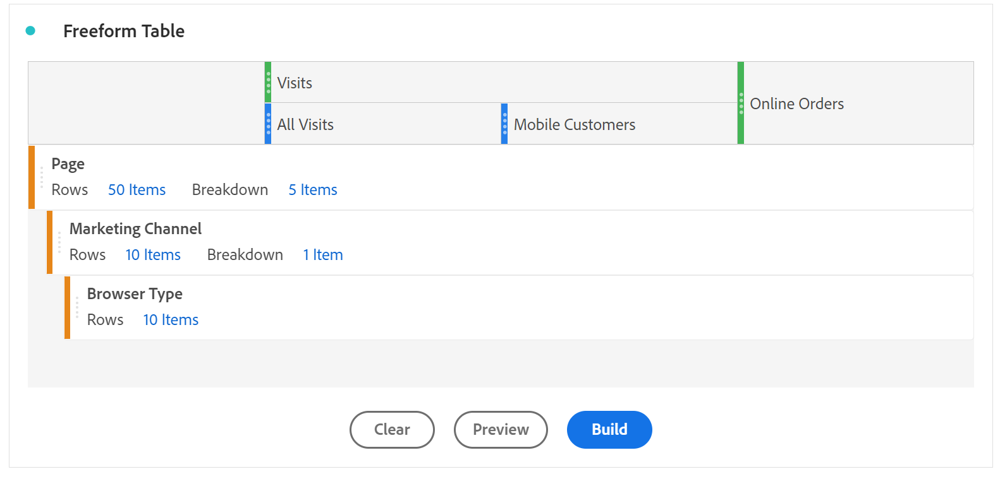

# Översikt över frihandstabell {#freeform-table-overview}

<!-- markdownlint-disable MD034 -->

>[!CONTEXTUALHELP]
>id="workspace_freeformtable_button"
>title="Frihandsregister"
>abstract="Skapa en tom frihandsritbordsvisualisering som du kan bygga upp med mått, segment, mätvärden och datumintervall. Du kan använda frihandstabellen som bas för andra visualiseringar."

<!-- markdownlint-enable MD034 -->

>[!BEGINSHADEBOX]

_I den här artikeln dokumenteras frihandstabellens visualisering i_  _**Customer Journey Analytics**._ _Se [Frihandstabell](https://experienceleague.adobe.com/en/docs/analytics/analyze/analysis-workspace/visualizations/freeform-table/freeform-table) för_  _**Adobe Analytics**-versionen av den här artikeln._

>[!ENDSHADEBOX]

I Analysis Workspace är en  **[!UICONTROL Freeform table]**-visualisering grunden för interaktiv dataanalys. Du kan dra och släppa en kombination av [komponenter](/help/components/overview.md) i rader och kolumner för att skapa en anpassad tabell för analysen. När varje komponent släpps uppdateras tabellen omedelbart så att du snabbt kan analysera och fördjupa den.

Så här skapar och konfigurerar du en [!UICONTROL Freeform table]:

* Lägg till en  **[!UICONTROL Freeform table]**. Se [Lägga till en visualisering på en panel](../freeform-analysis-visualizations.md#add-visualizations-to-a-panel).

## Automatiserade tabeller

Det snabbaste sättet att skapa en tabell är att släppa komponenter direkt i ett tomt projekt, en panel eller en frihandstabell. En frihandstabell har skapats i det format som rekommenderas. [Titta på självstudiekursen](https://experienceleague.adobe.com/en/docs/analytics-learn/tutorials/analysis-workspace/building-freeform-tables/auto-build-freeform-tables-in-analysis-workspace).

## Frihandsritbordsverktyget

Om du vill lägga till flera komponenter i tabellen först och sedan återge data kan du välja **[!UICONTROL Enable table builder]**. Med verktyget aktiverat kan du dra och släppa dimensioner, uppdelningar, mätvärden och segment för att skapa tabeller som besvarar mer komplexa frågor. Data uppdateras när du har valt **[!UICONTROL Build]**.

## Interaktioner

Du kan interagera med och anpassa en frihandstabell på flera olika sätt:

### Filter och sortering

* Du kan [segmentera och sortera](filter-and-sort.md) data i en tabell.

### Rader

* Du kan snabbt [skapa en ny visualisering](../freeform-analysis-visualizations.md#visualize) från en eller flera rader med .
* Du kan anpassa fler rader till en enda skärm genom att justera projektets [visningstäthet](/help/analysis-workspace/build-workspace-project/view-density.md).
* Varje dimensionsrad kan visa upp till 400 rader, innan sidnumreringen görs. Markera siffran bredvid **[!UICONTROL Rows]** i den första kolumnrubriken om du vill visa fler rader på en sida. Navigera till en annan sida med  i den första kolumnrubriken.
* Du kan dela upp rader med ytterligare komponenter. Om du vill dela upp flera rader samtidigt markerar du flera rader och drar sedan nästa komponent ovanpå de markerade raderna. Läs mer om [uppdelningar](/help/components/dimensions/t-breakdown-fa.md).
* Rader kan [segmenteras](/help/components/segments/seg-overview.md) om du vill visa en reducerad uppsättning med artiklar. Ytterligare inställningar är tillgängliga under [Radinställningar](/help/analysis-workspace/visualizations/freeform-table/column-row-settings/table-settings.md).

### Kolumner

* Komponenter kan staplas i kolumner för att skapa segmenterade mätvärden, tabbanalyser med mera.
* Vyn för varje kolumn kan justeras under [kolumninställningarna](/help/analysis-workspace/visualizations/freeform-table/column-row-settings/column-settings.md).
* Flera åtgärder är tillgängliga via [snabbmenyn](/help/analysis-workspace/visualizations/freeform-analysis-visualizations.md#context-menu). Menyn innehåller olika åtgärder beroende på om du markerar tabellrubriken, rader eller kolumner.

## Inställningar

Välj  för att visa **[!UICONTROL Table settings]**. Följande specifika [inställningar](../freeform-analysis-visualizations.md#settings) för visualisering är tillgängliga:

### Datakälla

| Alternativ | Beskrivning |
|---|---|
| **[!UICONTROL Linked visualizations]**. | Visar alla länkade visualiseringar. |
| **[!UICONTROL Show data source]** | När det är avmarkerat döljs frihandstabellen som fungerar som datakälla för visualiseringen i Workspace. |

### Inställningar

| Alternativ | Beskrivning |
|---|---|
| **[!UICONTROL Align dates from each columns to all start on the same row]** | Om du vill justera eller inte justera datum från varje kolumn så att alla börjar på samma rad. |

## Snabbmeny

Följande [snabbmeny](../freeform-analysis-visualizations.md#context-menu)-alternativ är tillgängliga från visualiseringens sidhuvud:

| Alternativ | Beskrivning |
| --- | --- |
| **[!UICONTROL Insert copied visualization]**n | Klistra in (infoga) en kopierad visualisering på en annan plats i projektet, eller i ett helt annat projekt. |
| **[!UICONTROL Copy data to clipboard]** | Kopiera data från visualiseringen till Urklipp. |
| **[!UICONTROL Copy selection to clipboard]** | Kopiera markeringen från visualiseringen till Urklipp. |
| **[!UICONTROL Download items as CSV (*dimensionsnamn *)]** | Ladda omedelbart ned dimensionsobjekten (högst 50 000) av visualiseringen till din lokala enhet. Högst 50 000 dimensionsartiklar för den valda dimensionen. |
| **[!UICONTROL Copy visualization]** | Kopiera visualiseringen så att du kan infoga visualiseringen på en annan plats i projektet eller i ett helt annat projekt. |
| **[!UICONTROL Download data CSV]** | Ladda omedelbart ned visuella data till din lokala enhet. |
| **[!UICONTROL Export full table...]** | Exportera hela tabellen till en angiven molnplats. Se [Exporterar Customer Journey Analytics-rapporter till molnet](../../export/export-cloud.md) |
| **[!UICONTROL Duplicate visualization]** | Gör en exakt kopia av visualiseringen. |
| **[!UICONTROL Edit description]** | Lägg till (eller redigera) en textbeskrivning för visualiseringen. Se [Text](../text.md). |
| **[!UICONTROL Get visualization link]** | Kopiera och dela en länk direkt till visualiseringen. Länken visas i en dialogruta för delning. Välj Kopiera för att kopiera länken till Urklipp. |
| **[!UICONTROL Start over]** | Ta bort konfigurationen för den aktuella visualiseringen så att du kan konfigurera om den från grunden. |

>[!MORELIKETHIS]
>
>[Lägg till en visualisering på en panel](/help/analysis-workspace/visualizations/freeform-analysis-visualizations.md#add-visualizations-to-a-panel)
>>[Visualiseringsinställningar](/help/analysis-workspace/visualizations/freeform-analysis-visualizations.md#settings)
>>[Snabbmenyn Visualisering ](/help/analysis-workspace/visualizations/freeform-analysis-visualizations.md#context-menu)
>
