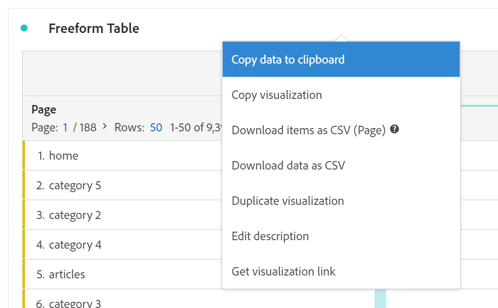

# Frihandsregister

I Analysis Workspace är Freeform Table grunden för interaktiv dataanalys. Du kan dra och släppa en kombination av [komponenter](https://experienceleague.adobe.com/docs/analytics/analyze/analysis-workspace/components/analysis-workspace-components.html) till rader och kolumner för att skapa en anpassad tabell för din analys. När varje komponent släpps uppdateras tabellen omedelbart så att du snabbt kan analysera och fördjupa.

## Automatiserade tabeller

Det snabbaste sättet att skapa en tabell är att släppa komponenter direkt i ett tomt projekt, en panel eller en frihandstabell. En frihandstabell skapas automatiskt i det format som rekommenderas. [Se självstudiekursen](https://experienceleague.adobe.com/docs/analytics-learn/tutorials/analysis-workspace/building-freeform-tables/auto-build-freeform-tables-in-analysis-workspace.html).

## Frihandsritbordsverktyget

Om du föredrar att lägga till flera komponenter i tabellen först och sedan återge data, kan du aktivera Frihand tabellverktyg. När verktyget är aktiverat kan du dra och släppa i många dimensioner, uppdelningar, mätvärden och filter för att skapa tabeller som besvarar mer komplexa frågor. Data uppdateras inte direkt, utan uppdateras när du klickar på **[!UICONTROL Build]**.

## Tabellinteraktioner

Du kan interagera med och anpassa en frihandstabell på flera olika sätt:

* **Rader**
   * Du kan anpassa fler rader till en enda skärm genom att justera projektets [visningsdensitet](https://experienceleague.adobe.com/docs/analytics/analyze/analysis-workspace/build-workspace-project/view-density.html).
   * Varje dimensionsrad kan visa upp till 400 rader, innan sidnumreringen görs. Klicka på siffran intill &quot;Rader&quot; för att visa fler rader på en sida. Navigera till en annan sida med sidpilen i sidhuvudet.
   * Rader kan delas upp efter ytterligare komponenter. Om du vill dela upp flera rader samtidigt markerar du bara flera rader och drar sedan nästa komponent ovanpå de markerade raderna. Läs mer om [uppdelning](https://experienceleague.adobe.com/docs/analytics/analyze/analysis-workspace/components/dimensions/t-breakdown-fa.html).
   * Rader kan [filtrerad](https://experienceleague.adobe.com/docs/analytics/analyze/analysis-workspace/visualizations/freeform-table/filter-and-sort.html) om du vill visa en reducerad uppsättning med objekt. Ytterligare inställningar finns under [Radinställningar](https://experienceleague.adobe.com/docs/analytics/analyze/analysis-workspace/visualizations/freeform-table/column-row-settings/table-settings.html).

* **Kolumner**
   * Komponenter kan staplas i kolumner för att skapa filtrerade mätvärden, tabbanalyser med mera.
   * Vyn för varje kolumn kan justeras under [kolumninställningar](https://experienceleague.adobe.com/docs/analytics/analyze/analysis-workspace/build-workspace-project/column-row-settings/column-settings.html).
   * Flera åtgärder är tillgängliga via [högerklicksmeny](https://experienceleague.adobe.com/docs/analytics-learn/tutorials/analysis-workspace/building-freeform-tables/using-the-right-click-menu.html). Menyn innehåller olika åtgärder beroende på om du klickar på tabellhuvudet, raderna eller kolumnerna.

## Exportera frihandstabelldata

Läs mer om alla data [exportalternativ](https://experienceleague.adobe.com/docs/analytics/analyze/analysis-workspace/curate-share/download-send.html) för Analysis Workspace.

* Högerklicka > **[!UICONTROL Copy data to clipboard]** exporterar visade tabelldata. Om en tabellmarkering görs kommer det här alternativet att ange **[!UICONTROL Copy selection to clipboard]**. The **Ctrl+C** hotkey kopierar även markerade data.
* Högerklicka > **[!UICONTROL Download data as CSV]** hämtar visade tabelldata som en CSV-fil. Om en tabellmarkering görs kommer det här alternativet att ange **[!UICONTROL Download selection as CSV]**.
* Högerklicka > **[!UICONTROL Project > Download items as CSV]** exporterar upp till 50 000 dimensionsobjekt för den valda dimensionen.

Läs mer om alla data [exportalternativ](https://experienceleague.adobe.com/docs/analytics/analyze/analysis-workspace/curate-share/download-send.html) för Analysis Workspace.

