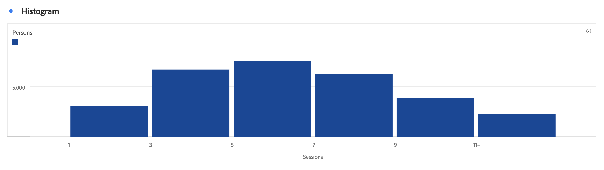

# Histogram {#histogram}

<!-- markdownlint-disable MD034 -->

>[!CONTEXTUALHELP]
>id="cja_workspace_histogram_button"
>title="Histogram"
>abstract="Skapa en histogramvisualisering som representerar fördelningen av numeriska data i grupper av intervall."

<!-- markdownlint-enable MD034 -->

Visualiseringen av  **[!UICONTROL Histogram]** liknar en [!UICONTROL Bar]-visualisering, men grupperar nummer i intervall (bucket). Analytics automatiserar&quot;paketeringen&quot; av tal i intervall, men du kan ändra inställningarna i [Avancerade inställningar](#advanced-settings).

## Använd

Skapa ett histogram:

1. Lägg till en  **[!UICONTROL Histogram]**-visualisering. Se [Lägga till en visualisering på en panel](freeform-analysis-visualizations.md#add-visualizations-to-a-panel).
1. Dra ett mätvärde från komponentlistan **[!UICONTROL Metrics]** eller välj ett mätvärde i listrutan [!UICONTROL *Lägg till ett mätvärde*] .
1. (valfritt) Välj **[!UICONTROL Show advanced settings]**. Se [Avancerade inställningar](#advanced-settings).
1. Välj **[!UICONTROL Build]**.

>[!NOTE]
>
>Histogram stöder endast standardvärden, inte beräknade värden.

I exemplet nedan används ett histogram för att bucket-sessioner för antalet personer. Histogrammet visar att de flesta personer har mellan 16 och 21 sessioner för det valda dataområdet.

## Avancerade inställningar

Som en del av visualiseringen är specifika histograminställningar tillgängliga.

| Histograminställningar | Beskrivning |
|---|---|
| **[!UICONTROL Starting bucket]** | Anger vilken bucket histogrammet börjar med. &quot;1&quot; är standardvärdet. Du kan ange startnummer från 0 till oändlighet (inga negativa tal). |
| **[!UICONTROL Metric buckets]** | Gör att du kan öka/minska antalet dataintervall (bucket). Det högsta antalet bucklor är 50. |
| **[!UICONTROL Metric bucket size]** | Gör att du kan ange storleken för varje bucket. Du kan till exempel ändra bucketstorleken från en sidvy till två sidvyer. |
| **[!UICONTROL Counting method]** | Välj från **[!UICONTROL Person]**, **[!UICONTROL Session]** eller **[!UICONTROL Event]**. Exempel: sidvisningar per session, sidvisningar per person eller sidvisningar per händelse. |

<!--Russ or Meike - Check Hit Type link above. -->

**Exempel**:

| Startar bucket | Måttbucklar | Storlek på måttpyts | Resultat |
|:----:|:--:|:--:|:--|
| 1 | 5 | 2 |  |
| 0 | 3 | 5 |  |

>[!MORELIKETHIS]
>
>[Lägg till en visualisering på en panel](/help/analysis-workspace/visualizations/freeform-analysis-visualizations.md#add-visualizations-to-a-panel)
>[Visualiseringsinställningar](/help/analysis-workspace/visualizations/freeform-analysis-visualizations.md#settings)
>[Snabbmenyn Visualisering ](/help/analysis-workspace/visualizations/freeform-analysis-visualizations.md#context-menu)
>

## Blogginlägg

Läs det här blogginlägget om information om [hur du använder histogram för att identifiera oväntade datavärden](https://experienceleaguecommunities.adobe.com/t5/adobe-analytics-blogs/using-histograms-to-identify-unexpected-data-values/ba-p/596168).
