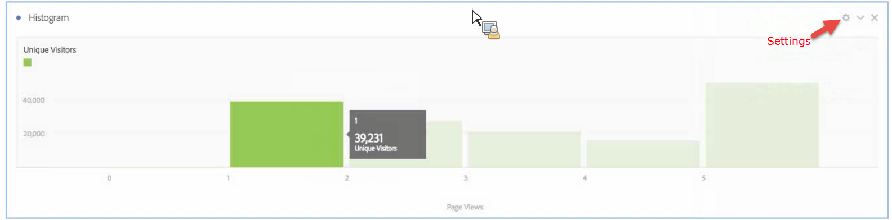

# Histogram

Ett histogram liknar ett stapeldiagram, men det grupperar nummer i intervall (intervall). Med Analytics automatiseras&quot;buffring&quot; av tal till intervall, men du kan ändra inställningarna i [Avancerade inställningar](#section_09D774C584864D4CA6B5672DC2927477).

## Skapa ett histogram {#section_74647707CC984A1CB6D3097F43A30B45}

Så här skapar du ett histogram:

1. Klicka **[!UICONTROL Visualizations]** till vänster.
1. Dra **[!UICONTROL Histogram]** till panelen.
1. Välj ett mått som du vill dra till histogramvisualiseringen och klicka på **[!UICONTROL Build]**.

>[!NOTE]
>
>Histogram stöder endast standardvärden, inte beräknade värden.

Här har vi använt måtten för sidvisningar per unika besökare. Den första (vänster) markeringen motsvarar en sidvy per unik person, den andra markeringen motsvarar två sidvisningar osv.

## Avancerade inställningar {#section_09D774C584864D4CA6B5672DC2927477}

Om du vill justera histograminställningarna klickar du på inställningsikonen (&quot;kugghjulet&quot;) i det övre högra hörnet. Här är de inställningar du kan ändra:

| Histograminställningar | Vad det gör |
|---|---|
| Startar Bucket | Anger vilken bucket histogrammet börjar med. &quot;1&quot; är standardvärdet. Du kan ange startnummer från 0 till oändlighet (inga negativa tal). |
| Mätbuffertar | Gör att du kan öka/minska antalet dataintervall (bucket). Det högsta antalet bucklor är 50. |
| Storlek på mätpyts | Gör att du kan ange storleken för varje bucket. Du kan till exempel ändra bucketstorleken från en sidvy till två sidvyer. |
| Inventeringsmetod | Här kan du välja bland [Besökare](https://experienceleague.adobe.com/docs/analytics/components/metrics/unique-visitors.html), [Besök](https://experienceleague.adobe.com/docs/analytics/components/metrics/visits.html), eller Träff. Exempel: sidvisningar per besök eller sidvisningar per person eller sidvisningar per händelse. För Träff används&quot;Förekomster&quot; som y-axelmått i en friformstabell. |

<!--Russ or Meike - Check Hit Type link above. -->

**Exempel**:

* Startar Bucket: 1. Mätbuffertar: 5. Måttpytsstorlek: 2 resulterar i detta histogram: 1-2, 3-4, 5-6, 7-8, 9-10.
* Startar Bucket: 0; Mätbuffertar: 3. Måttpytsstorlek: 5 kommer att resultera i detta histogram: 0-4, 5-9, 10-14

## Visa och redigera histogramdata {#section_B2CD7CDF0F6B432F928103AE7AAA3617}

Om du vill visa eller ändra datakällan för histogramdiagrammet klickar du på punkten bredvid histogramhuvudet för att gå till **[!UICONTROL Data Source Settings]** > **[!UICONTROL Show Data Source]**.

Fördefinierade filter som visas i tabellen är interna filter och visas inte i filterväljaren. Klicka på ikonen &quot;i&quot; bredvid filternamnet och klicka sedan på **[!UICONTROL Make public]** för att göra filtret offentligt.

Om du vill utforska fler sätt att hantera frihandsdatatabeller och andra visualiseringar, som att göra datauppdelningar, går du [här](https://experienceleague.adobe.com/docs/analytics/analyze/analysis-workspace/visualizations/freeform-analysis-visualizations.html).

## Blogginlägg

Läs det här blogginlägget om information om [använda histogram för att identifiera oväntade datavärden](https://experienceleaguecommunities.adobe.com/t5/adobe-analytics-blogs/using-histograms-to-identify-unexpected-data-values/ba-p/596168).
