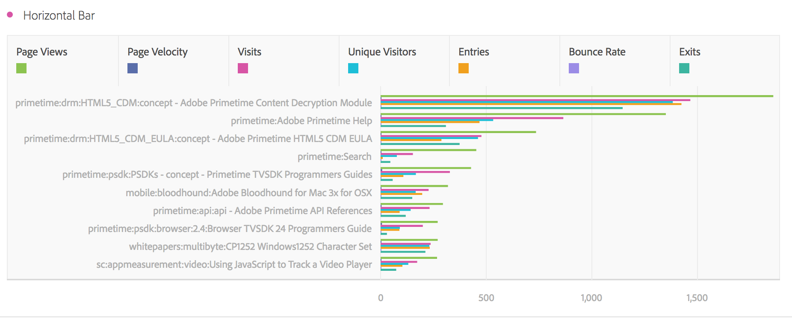

# Liggande stapeldiagram och staplat liggande stapeldiagram

>[!NOTE]
>
>Du visar dokumentationen för Analysis Workspace i Customer Journey Analytics. Dess funktionsuppsättning skiljer sig något från [Analysis Workspace i traditionell Adobe Analytics](https://docs.adobe.com/content/help/en/analytics/analyze/analysis-workspace/home.html). [Läs mer …](/help/getting-started/cja-aa.md)

## Vågrät stapel {#section_73A4D6F6C8864045A97B0B32B5FFFEDB}

Den här visualiseringen visar vågräta staplar som representerar olika värden över ett eller flera mått.

## Staplad vågrät stapel {#section_50C08E9E20A94024A6553BC352ADB597}

Denna visualisering liknar [!UICONTROL Horizontal Bar Chart], men seriestaplarna visas staplade.

De [!UICONTROL Horizontal Bar Stacked] Visualiseringsinställning för staplade visualiseringar gör diagrammet till en &quot;100 % staplad&quot; visualisering:

