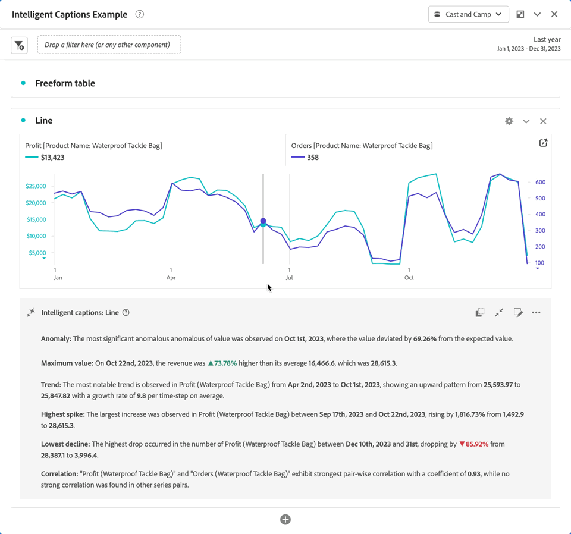

# Intelligenta bildtexter {#intelligent-captions}

<!-- markdownlint-disable MD034 -->

>[!CONTEXTUALHELP]
>id="workspace_intelligentcaptions_area"
>title="Intelligenta bildtexter: Område"
>abstract="Generera insikter i naturspråksformulär som hjälper er att enklare förstå och tolka data för den här visualiseringen."

<!-- markdownlint-enable MD034 -->

<!-- markdownlint-disable MD034 -->

>[!CONTEXTUALHELP]
>id="workspace_intelligentcaptions_bar"
>title="Intelligent captions: Bar"
>abstract="Generera insikter i naturspråksformulär som hjälper er att enklare förstå och tolka data för den här visualiseringen."

<!-- markdownlint-enable MD034 -->

<!-- markdownlint-disable MD034 -->

>[!CONTEXTUALHELP]
>id="workspace_intelligentcaptions_donut"
>title="Intelligenta bildtexter: Donut"
>abstract="Generera insikter i naturspråksformulär som hjälper er att enklare förstå och tolka data för den här visualiseringen."

<!-- markdownlint-enable MD034 -->

<!-- markdownlint-disable MD034 -->

>[!CONTEXTUALHELP]
>id="workspace_intelligentcaptions_horizontalbar"
>title="Intelligenta bildtexter: Vågrät liggande stapel"
>abstract="Generera insikter i naturspråksformulär som hjälper er att enklare förstå och tolka data för den här visualiseringen."

<!-- markdownlint-enable MD034 -->

<!-- markdownlint-disable MD034 -->

>[!CONTEXTUALHELP]
>id="workspace_intelligentcaptions_line"
>title="Intelligenta bildtexter: Line"
>abstract="Generera insikter i naturspråksformulär som hjälper er att enklare förstå och tolka data för den här visualiseringen."

<!-- markdownlint-enable MD034 -->

<!-- markdownlint-disable MD034 -->

>[!CONTEXTUALHELP]
>id="workspace_intelligentcaptions_fallout"
>title="Intelligenta bildtexter: Utfall"
>abstract="Generera insikter i naturspråksformulär som hjälper er att enklare förstå och tolka data för den här visualiseringen."

<!-- markdownlint-enable MD034 -->

<!-- markdownlint-disable MD034 -->

>[!CONTEXTUALHELP]
>id="workspace_intelligentcaptions_flow"
>title="Intelligenta bildtexter: Flöde"
>abstract="Generera insikter i naturspråksformulär som hjälper er att enklare förstå och tolka data för den här visualiseringen."

<!-- markdownlint-enable MD034 -->

Funktionen för intelligenta bildtexter använder avancerad generativ AI för att ge viktiga insikter om de vanligaste Workspace-visualiseringarna på naturspråket.

Intelligenta bildtexter inriktas på följande:

* Analytiker som behöver berättelser att dela med andra användare. Analytikerna behöver dessa insikter för att kunna ge sina användare kontext.
* Affärsanvändare som snabbt vill hitta högnivåuppgifter.

>[!BEGINSHADEBOX]

Se  [Intelligenta bildtexter](https://video.tv.adobe.com/v/3443142/?quality=12&learn=on&captions=swe){target="_blank"} för en demonstrationsvideo.

>[!ENDSHADEBOX]

## Starta intelligenta bildtexter {#launch}

Om du vill starta automatiskt genererade intelligenta bildtexter för en visualisering väljer du  längst upp till höger i visualiseringen. Det här valet genererar insikter om naturliga språk.

Kom ihåg att:

* Du behöver minst 3 datapunkter för att kunna generera bildtexter. Annars kan du få ett fel som **[!UICONTROL Not enough data to analyze]**.

* Bildtexter genereras varje gång underliggande markerade data ändras i tabellen som styr visualiseringen.

* Om det finns flera mätvärden i en associerad frihandstabell, genereras bildtexter endast för det första mätvärdet eller det mätvärde som användaren har valt. Bildtexter kan dock genereras för flera mätvärden för linje- och områdesvisualiseringar.

* Om du sparar projektet vid en viss punkt och läser in det igen senare, uppdateras bildtexterna automatiskt med nya data. Detsamma gäller för schemalagda projekt och PDF-filer som exporteras från ett projekt.

## Visualiseringar {#visualizations}

Intelligenta bildtexter stöds i följande visualiseringar:

* [Rad](line.md) (inklusive flera rader)
* [Liggande](bar.md)
* [Vågrätt fält](horizontal-bar.md)
* [Område](area.md) (inklusive flera riktningslinjer)
* [Munk](donut.md)
* [Utfall](fallout/fallout-flow.md)
* [Flöde](c-flow/flow.md)

<!--
Here is an example of what intelligent captions could look like:

-->

## Åtgärder

Du kan utföra följande åtgärder på intelligenta bildtexter:

### Kopiera till Urklipp {#copy}

Du kan kopiera bildtexterna till ett urklipp och klistra in dem i en PowerPoint eller andra verktyg. Du kan kopiera enskilda bildtexter i en vy eller kopiera alla bildtexter samtidigt i den utökade bildtextvyn.

* Om du vill kopiera bildtexterna väljer du  längst upp till höger i dialogrutan med bildtexter.

### Visa alla eller enskilda intelligenta bildtexter  {#show-all-or-individual}

Du kan visa alla intelligenta bildtexter samtidigt i en utökad vy eller visa enskilda intelligenta bildtexter i en vy i taget.

* Om du vill visa alla intelligenta bildtexter väljer du .
* Om du vill visa enskilda intelligenta bildtexter, en i taget, väljer du .

### Redigera visning {#edit}

Du kan redigera visningen av bildtexter, till exempel dölja eller visa en viss kategori med insikter.

1. Välj  i dialogrutan Intelligenta bildtexter.

1. Växla mellan  om du vill visa en viss insikt (till exempel **[!UICONTROL Min]**) eller  om du vill dölja en viss insikt (till exempel **[!UICONTROL Spike]**).

   

1. Välj **[!UICONTROL Apply]**.

### Ge feedback

Du kan ge feedback på de genererade intelligenta bildtexterna (feedback kan bara ges i den utökade bildtextvyn).

1. Välj  i dialogrutan Intelligenta bildtexter.

1. Välj  **[!UICONTROL Good response]**,  **[!UICONTROL Bad response]** eller  **[!UICONTROL Report]**.

1. Ange din feedback i dialogrutan **[!UICONTROL Thank you for your feedback]** och välj **[!UICONTROL Submit]** för att skicka den.

### Exportera {#export}

Du kan exportera intelligenta bildtexter som en del av PDF, förutsatt att projektet sparas med de intelligenta bildtexter som skapas.

### Växla av {#toggle}

Om du inte vill visa intelligenta bildtexter kan du inaktivera funktionen.

1. Gå till [Visualiseringsinställningar](/help/analysis-workspace/user-preferences.md#visualizations-preferences).
1. Avmarkera **[!UICONTROL Show intelligent captions]**.

   

1. Välj **[!UICONTROL Save]** om du vill spara inställningen.

## Intelligenta bildtexter i Mobile Scorecards

Intelligenta bildtexter finns också i [mobilstyrkort](https://experienceleague.adobe.com/sv/docs/analytics-platform/using/cja-dashboards/manage-scorecard#captions) i Customer Journey Analytics.

## Funktionsåtkomst

Följande parametrar styr åtkomsten till intelligenta bildtexter:

* **Åtkomst till lösning**: Funktionen för intelligenta bildtexter är tillgänglig i Customer Journey Analytics, men inte i Adobe Analytics.

* **Kontraktsåtkomst**: Om du inte kan använda intelligenta bildtexter kontaktar du organisationens administratör eller Adobe Account Representant (Admin). Innan du kan använda intelligenta bildtexter i din organisation måste du godkänna vissa allmänna AI-relaterade juridiska villkor.

* **Behörigheter**: I [!UICONTROL Adobe Admin Console] avgör behörigheten [!UICONTROL Reporting Tools] **[!UICONTROL Intelligent Captions]** åtkomsten. En [produktprofiladministratör](https://helpx.adobe.com/se/enterprise/using/manage-product-profiles.html) måste följa de här stegen i [!UICONTROL Admin Console]:
   1. Navigera till **[!UICONTROL Admin Console]** > **[!UICONTROL Products and services]** > **[!UICONTROL Customer Journey Analytics]** > **[!UICONTROL Product Profiles]**.
   1. Välj namnet på den produktprofil som du vill ge tillgång till intelligenta bildtexter för.
   1. Välj **[!UICONTROL Permissions]** i den specifika produktprofilen.
   1. Välj  om du vill redigera **[!UICONTROL Reporting Tools]**.
   1. Välj  om du vill lägga till **Intelligent Captions** i **[!UICONTROL Included permission items]**.

      

   1. Välj **[!UICONTROL Save]** om du vill spara behörigheterna.

Mer information finns i [Åtkomstkontroll](/help/technotes/access-control.md#access-control).
