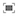
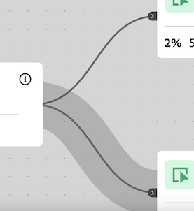

# Konfigurera en visualisering av en arbetsyta på resan

Med visualiseringen av arbetsytan på resande fot kan ni analysera och få djupgående insikter om de resor som ni erbjuder era användare och kunder.

## Översikt över arbetsytan Resa

Se [Översikt över arbetsytan på resan](/help/analysis-workspace/visualizations/journey-canvas/journey-canvas.md) om du vill veta mer om arbetsytan på resan, inklusive:

* Viktiga funktioner

* Potential insights

* Differences between Journey canvas and Fallout

* Information om hur man analyserar Journey Optimizer resor

* Och mer

## Börja bygga en visualisering av en arbetsyta i resan

1. Lägg till en tom panel i ditt projekt, markera ikonen [!UICONTROL **Visualiseringar**] i den vänstra listen och dra sedan visualiseringen  [!UICONTROL **Journey Canvas**] till panelen.

   eller

   Lägg till en visualisering av en arbetsyta på resan på något av de sätt som beskrivs i avsnittet [Lägg till visualiseringar i en panel](/help/analysis-workspace/visualizations/freeform-analysis-visualizations.md#add-visualizations-to-a-panel) i [Översikt över visualiseringar](/help/analysis-workspace/visualizations/freeform-analysis-visualizations.md).

   

1. Ange följande grundläggande information för att konfigurera arbetsytan på resan:

   | Fält | Funktion |
   |---------|----------|
   | [!UICONTROL **Primärt mått**] | Bestämmer måttet som används vid beräkning av procentvärden och talvärden för varje nod i resan.
**Obs!** Omfånget för data som ingår i varje procent och talvärde bestäms av det mätvärde som du väljer i fältet **[!UICONTROL Journey canvas container]**. Om till exempel **[!UICONTROL Person]** anges som behållare sträcker sig statistiken som visas under resan över flera sessioner för en viss person. Om **[!UICONTROL Session]** anges som behållare begränsas statistiken som visas under resan till en enda definierad session för en viss person.

Tänk på följande exempel på hur det primära måttet påverkar procentvärdena och talvärdena för varje nod:
<ul><li>Om _Personer_ är det primära måttet och _Person_ är behållaren flyttas bara de personer som har en händelse som matchar villkoren för varje efterföljande nod i resan genom hela resan. Utfall inträffar på en nod när en person aldrig anlänt till någon av de närmaste noderna på resan. De kan ha utfört andra åtgärder på webbplatsen, men uppfyller inte kriterierna som definieras av någon av de noder som följer direkt.</li><li>Om _Personer_ är det primära måttet och _Session_ är behållaren flyttas bara de personer som har en händelse som matchar villkoren för varje nod i resan under hela resan. Utfall inträffar på en nod när en person aldrig anlänt till någon av de närmaste noderna på resan under en session. De kan ha utfört andra åtgärder på webbplatsen under sessionen, men de uppfyller inte kriterierna som definieras av någon av de noder som följer direkt.</li></ul> 
Det primära måttet påverkar följande aspekter av visualiseringen av arbetsytan på resan:
<ul><li>Det totala antalet som visas på varje nod.  
Om till exempel Händelser är det primära måttet visar varje nod antalet personer som hade en händelse som matchar villkoren för den noden (och varje föregående nod som leder fram till den i resan).
</li><li>Procentandelen som visas på varje nod. (När visualiseringen har skapats kan du använda den nedrullningsbara menyn **[!UICONTROL Percentage value]** för att välja att visa antingen procentandelen av totalsumman, procentandelen av föregående nod eller procentandelen av startnoden.)
Om till exempel Händelser är det primära måttet visar varje nod hur många procent av personerna som hade en händelse som matchar villkoren för den noden (och varje föregående nod som leder fram till den i resan).
</li><li>När en dimension läggs till i visualiseringen läggs de tre viktigaste noderna i visualiseringen till, baserat på det primära måttet.</li></ul> |
   | [!UICONTROL **Sekundärt mått**] | Bestämmer det sekundära måttet som används vid beräkning av procentvärden och talvärden för varje nod i resan. Det sekundära måttet är valfritt. 
**Obs!** Omfånget för data som ingår i varje procent och talvärde bestäms av det mätvärde som du väljer i fältet **[!UICONTROL Journey canvas container]**. Om till exempel **[!UICONTROL Person]** anges som behållare sträcker sig statistiken som visas under resan över flera sessioner för en viss person. Om **[!UICONTROL Session]** anges som behållare begränsas statistiken som visas under resan till en enda definierad session för en viss person.

När ett sekundärt mått har konfigurerats påverkar det följande aspekter av visualiseringen av arbetsytan på resan:
<ul><li>Det totala antalet som visas på varje nod under det primära måttet. 
Om t.ex. Konton är det sekundära måttet visas antalet konton på noden för alla personer som nått noden under resan.
</li><li>Procentandelen som visas på varje nod under det primära måttet. (När visualiseringen har skapats kan du välja att visa antingen procentandelen av totalvärdet eller startnoden.)</li>
Om sessioner till exempel är det sekundära måttet visar varje nod hur många sessioner som nått den noden under resan (antingen procentandelen av den totala eller startnoden).
</li></ul> |
   | [!UICONTROL **Journey Optimizer resa**]<!-- name? --> | Välj den Journey Optimizer-resa som du vill använda som bas för din analys på arbetsytan i Journey. Resor med någon av följande statusar är tillgängliga: Live, Stoppad eller Slutförd 
Du kan också lämna det här alternativet tomt om du vill ha en tom arbetsyta som du kan använda för att skapa analyser i Analysis Workspace.
 
När du analyserar en Journey Optimizer-resa på en arbetsyta visas resan med samma ordning, sekvens och struktur som i Journey Optimizer. Mer information finns i [Analysera Journey Optimizer-resor](/help/analysis-workspace/visualizations/journey-canvas/journey-canvas.md#analyze-journey-optimizer-journeys) i [Översikt över arbetsytan på resan](/help/analysis-workspace/visualizations/journey-canvas/journey-canvas.md).

**Obs!**: Det här alternativet visas bara när Journey Optimizer-data identifieras i samma datavy som är markerad på den Analysis Workspace-panel där du lägger till visualiseringen. Mer information om hur du ändrar datavyn på en panel i Analysis Workspace finns i [Analysis Workspace - översikt](/help/analysis-workspace/home.md).
 |

1. (Valfritt) Välj [!UICONTROL **Visa avancerade inställningar**] och ange sedan följande information:

   | Fält | Funktion |
   |---------|----------|
   | [!UICONTROL **Researbetsytebehållare**] | Välj den behållare som du vill fokusera på under hela resan. Behållaren som du väljer avgör omfattningen för de data som hämtas under resan. Detta påverkar statistiken som visas i visualiseringen. (Om behållarnamnen skiljer sig från standardnamnen som visas nedan anpassades de i datavyn.)<ul><li>**Session:** Begränsar statistiken för visualiseringen så att den hamnar inom en enda definierad session för en viss person. Det innebär att de tal och procenttal som visas på varje nod (som baseras på primär- och sekundärstatistik) måste förekomma i en enda session för varje person. Med andra ord kan en person representeras flera gånger i en enda resa.
Den här behållaren använder sessionsmått.
</li><li>**Person:** (Standard) Tillåter att statistiken för visualiseringen sträcker sig över flera sessioner för en viss person. Det innebär att de siffror och procenttal som visas på varje nod (som baseras på primär- och sekundärstatistik) kan förekomma i alla sessioner, så länge sessionerna tillhör samma person. Med andra ord kan en person bara representeras en gång under en enskild resa.
Den här behållaren använder personmåttet.
</li></ul> |

1. Välj [!UICONTROL **Skapa**].

   Om du har valt en Journey Optimizer-resa visas resan med samma ordning, sekvens och struktur som i Journey Optimizer. (Only users with access to Journey optimizer can select a Journey Optimizer journey.)

   <!-- add screen shot -->

   If you didn&#39;t select a Journey Optimizer journey, a blank canvas displays where you can begin adding nodes to the journey. (Only users with access to Journey optimizer can select a Journey Optimizer journey.)

   <!-- add screen shot -->

1. Whether you are creating a new analysis from a blank canvas or you are analyzing a Journey Optimizer journey, you can configure the journey as described in [Configure visualization settings](#configure-visualization-settings).

## Configure visualization settings

Det finns olika konfigurationsalternativ i arbetsytehuvudet på resan.

Så här konfigurerar du inställningar för visualisering av arbetsytan på resan:

1. Öppna en befintlig visualisering av en arbetsyta för resan i Analysis Workspace eller [börja skapa en ny](#begin-building-a-journey-canvas-visualization).

   Alternativ som gör att du kan konfigurera visualiseringen av arbetsytan på resan finns i rubriken:

   

1. Konfigurera någon av följande inställningar som visas högst upp i visualiseringen:

   | Inställning | Funktion |
   |---------|----------|
   | [!UICONTROL **Procentvärde**] | Det procentvärde som visas på varje nod i resan.

 
Tänk på följande när du konfigurerar procentvärdena som visas på noder under resan:
<ul><li>Ett procentvärde visas för det primära måttet på varje nod. Ett procenttal visas också för det sekundära måttet om ett sådant har konfigurerats. (Mer information om de primära och sekundära måttinställningarna finns i [Börjar skapa en visualisering av en arbetsyta på resan](#begin-building-a-journey-canvas-visualization).)</li><li>Procentsatserna omfattar alla personer eller sessioner som ingår i datavyn inom panelens datumintervall. Om _personer_ eller _sessioner_ används beror på behållarinställningen. (Mer information om behållarinställningen finns i [Börjar skapa en visualisering av en arbetsyta på resan](#begin-building-a-journey-canvas-visualization).)</li></ul> 
Välj bland följande alternativ:
 <ul><li>[!UICONTROL **Procent av startnod**]: Beräknar procentsatserna som visas på varje nod i förhållande till startnoden. Procentsatserna baseras på det primära och sekundära mätvärdet som du valde. 
En _startnod_ är en nod som inte har några anslutna noder före.

En resa kan innehålla flera startnoder. [!UICONTROL **Procent av totalt**] används emellertid om resan innehåller två eller flera startnoder som leder till en gemensam nod. Om du vill använda [!UICONTROL **Procent av startnod**] uppdaterar du resan så att varje nod i resan kan spåras tillbaka till en enda startnod.
</li><li>[!UICONTROL **Procent av föregående nod**]: Beräknar procentsatserna som visas på varje nod i förhållande till föregående nod. Procentsatserna baseras på det primära och sekundära mätvärdet som du valde.</li><li>[!UICONTROL **Procent av totalt**]: Beräknar procentsatserna som visas på varje nod i förhållande till alla data i datavyn. Procentsatserna baseras på det primära och sekundära mätvärdet som du valde.</li></ul> |
   | [!UICONTROL **Pilinställningar**] | Pilarna som visas mellan noderna på arbetsytan kan konfigureras så att anpassade etiketter och värden visas. 

_Etiketter_ är egna namn som visas på pilar. Endast en etikett visas på en viss pil. Etiketterna kan vara något av följande och visas i den här inställningsordningen:
<ol><li>Ett anpassat namn som lagts till från en arbetsyta i resan (enligt beskrivningen i [Lägg till eller uppdatera en etikett på en pil](#add-or-update-a-label-on-an-arrow))</li><li>En Journey Optimizer-etikett</li><li>Journey Optimizer-villkor</li></ol>
_Värden_ är de tal och procenttal som visas på pilar, och de anger vilka personer eller sessioner som har flyttat från en nod till nästa nod på resan. (Med andra ord, de som inte föll bort från resan i ett visst steg.) 

Följande alternativ är tillgängliga för resor som inte har sitt ursprung i Journey Optimizer och för Journey Optimizer resor som inte har ändrats avsevärt på arbetsytan under resan: (Betydande ändringar är att lägga till eller ta bort noder, lägga till eller ta bort pilar eller ändra komponenterna i en nod.)
<ul><li>[!UICONTROL **Inga etiketter**]: Inga etiketter visas på pilar i resan.   Det här alternativet är bara tillgängligt om resan har ändrats i </li><li>[!UICONTROL **Endast etiketter**]: Etiketter visas på pilar i resan.</li></ul>
Följande alternativ är tillgängliga för Journey Optimizer-resor som har ändrats betydligt på arbetsytan i Resan: (Betydande ändringar innefattar att lägga till eller ta bort noder, lägga till eller ta bort pilar eller ändra komponenterna i en nod.)(**Obs!**: De här alternativen visas bara när Journey Optimizer-data identifieras i samma datavy som är markerad på den Analysis Workspace-panel där du lägger till visualiseringen. Mer information om hur du ändrar datavyn på en panel i Analysis Workspace finns i [Analysis Workspace - översikt](/help/analysis-workspace/home.md).)
<ul><li>[!UICONTROL **Inga etiketter eller värden**]: Inga etiketter eller värden visas på pilar under resan.</li><li>[!UICONTROL **Endast etiketter**]: Endast etiketter visas på pilar i resan. Värden visas inte.</li><li>[!UICONTROL **Endast värden**]: Endast värden visas på pilar i resan. Etiketter visas inte.</li><li>[!UICONTROL **Värden och etiketter**]: Både etiketter och värden visas på pilar under resan.</li></ul> |
   | [!UICONTROL **Visa utfall**] | Utfallsdata visar en procentandel och ett antal som faller utanför varje nod på resan. Utfallsdata baseras på det mått som är associerat med resans behållarinställningar. De baseras inte på det primära eller sekundära måttet. 

Som standard är behållaren _Person_, så måttet som används för utfallsdata är _Personer_. Om behållaren ändras till _Session_ är det mått som används för utfallsdata _Sessioner_ och så vidare.

Om till exempel _Person_ är behållarinställning visar bortfallet hur många procent och hur många personer på varje nod av resan som aldrig anlänt till någon av de närmast följande noderna. De kan ha utfört andra åtgärder på webbplatsen, men uppfyller inte kriterierna som definieras av någon av de noder som följer direkt.
 
Mer information om inställningen för arbetsytebehållaren i Journey finns i [Börja skapa en visualisering av en arbetsyta i Journey](#begin-building-a-journey-canvas-visualization). |
   | **Zoomkontroller** | Följande zoomkontroller finns i det övre högra hörnet av arbetsytan:<ul><li>**Zooma in** : Förstorar specifika delar av visualiseringen.
Du kan också använda muskontroller, som att fästa på en styrplatta.
</li><li>**Zoom out** : Shrinks the visualization to allow more room on the canvas.
Du kan också använda muskontroller, som att fästa på en styrplatta.
</li><li>**Fit screen** : Adjusts current zoom and pan settings to fill the screen with the full visualization.</li></ul>
To pan across the canvas after zooming in or out, click your mouse and drag to the desired location.
 |

1. Continue with [Add nodes](#add-nodes).

## Lägg till noder

Noder i en visualisering av en arbetsyta i en resa representerar händelser eller åtgärder som rör en användarresa.

Du kan skapa noder på följande sätt: genom att dra Workspace-komponenter från den vänstra listen till arbetsytan, genom att låta arbetsytan på resan välja nästa eller föregående noder som baseras på befintliga noder eller genom att duplicera befintliga noder.

### Dra komponenter från den vänstra listen

1. Öppna en befintlig visualisering av en arbetsyta för resan i Analysis Workspace eller [börja skapa en ny](#begin-building-a-journey-canvas-visualization).

1. Dra mått, dimensioner, dimensionsobjekt, filter eller datumintervall från den vänstra listen till arbetsytan. Mätvärden som baseras på ett [härlett fält](/help/data-views/derived-fields/derived-fields.md) stöds. Beräknade mått, liksom alla mått och mått som baseras på en [sammanfattningsdatamängd](/help/data-views/summary-data.md), stöds inte.

   Du kan markera flera komponenter i den vänstra listen genom att hålla ned Skift eller genom att hålla ned Kommando (Mac) eller Ctrl (Windows).

   Visualiseringen uppdateras baserat på det primära måttet enligt följande (beroende på komponenttypen och det område på arbetsytan där du monterar den):

   | Komponenttyp | Placering av komponent | Visualiseringsuppdateringar när noden har lagts till |
   |---------|----------|----------|
   | Mått | Tomt område på arbetsytan | Noden visar var komponenten släpptes, utan anslutning till några befintliga noder. |
   | Mått | En befintlig nod | Komponenten kombineras automatiskt med den befintliga noden. (Mer information finns i [Kombinera noder](#combine-nodes).)
 |
   | Mått | En pil mellan två befintliga noder | Noden visas mellan de två befintliga noderna där komponenten släpptes och är ansluten till båda befintliga noder. (Mer information finns i [Anslut noder](#connect-nodes).)
 |
   | Dimension | Tomt område på arbetsytan | 3 noder skapas för de tre översta dimensionsobjekten där komponenten släpptes, utan anslutning till några befintliga noder. (**Obs!** Om bara 1 eller 2 noder visas betyder det att data endast är tillgängliga för 1 eller 2 av dimensionsobjekten. Om inga noder visas betyder det att data inte är tillgängliga för någon av dimensionsobjekten. I det här fallet kan du försöka lägga till den på en annan punkt av resan, justera visualiseringens datumintervall eller välja en annan dimension.)
Håll ned Skift-tangenten när du släpper dimensionen på arbetsytan för att lägga till den som en enda nod med tre dimensionsobjekt.

 |
   | Dimension | En befintlig nod | En uppdelning används automatiskt på noden med de fem översta dimensionsobjekten visade.<!--what happens if you hold Shift?-->
Om du vill visa detaljerna i en ny visualisering av en frihandstabell väljer du länken [!UICONTROL **Öppna i en frihandstabell**] på noden.
 |
   | Dimension | En pil som ansluter två befintliga noder | 3 noder skapas för de tre främsta dimensionsobjekten som följer efter den första händelsen efter den första noden (för personer/sessioner som till slut kommer till den andra noden). Noderna visas mellan de två befintliga noderna där komponenten släpptes och varje nod är ansluten till båda befintliga noder. (**Obs!** Om bara 1 eller 2 noder visas betyder det att data endast är tillgängliga för 1 eller 2 av dimensionsobjekten. Om inga noder visas betyder det att data inte är tillgängliga för någon av dimensionsobjekten. I det här fallet kan du försöka lägga till den på en annan punkt av resan, justera visualiseringens datumintervall eller välja en annan dimension.)
Håll ned Skift-tangenten när du släpper dimensionen på arbetsytan för att lägga till den som en enda nod med tre dimensionsobjekt. (Mer information finns i [Anslut noder](#connect-nodes).)
 |
   | Dimension | Tomt område på arbetsytan | Noden visar var komponenten släpptes, utan anslutning till några befintliga noder. |
   | Dimension | En befintlig nod | Komponenten kombineras automatiskt med den befintliga noden. |
   | Dimension | En pil som ansluter två befintliga noder | Noden visas mellan de två befintliga noderna där komponenten släpptes och är ansluten till båda befintliga noder. (Mer information finns i [Anslut noder](#connect-nodes).)
 |
   | Filter | Tomt område på arbetsytan | Noden visar var komponenten släpptes utan anslutning till några andra noder.
Antalet och procentandelen som visas på noden omfattar summan av det primära måttet, filtrerat efter filtret som du valde.
 
Om du t.ex. väljer Personer som det primära måttet för resan och sedan lägger till filtret Dagar i ett tomt område på arbetsytan visas alla personer som har haft en händelse idag.
 |
   | Filter | En befintlig nod | Använder filtret på den befintliga noden. |
   | Filter | En pil som ansluter två noder | Noden visas mellan de två befintliga noderna där komponenten släpptes och är ansluten till båda befintliga noder. (Mer information finns i [Anslut noder](#connect-nodes).)

Applies the filter to the point on the path where the component was dropped.
 |
   | Datumintervall | Tomt område på arbetsytan | Noden visar var komponenten släpptes, utan anslutning till några andra noder.
Antalet och procentandelen som visas på noden inkluderar summan av det primära måttet, filtrerat efter det datumintervall du valde.
 
Om du t.ex. väljer Personer som det primära måttet för resan och sedan lägger till datumintervallet Den här månaden i ett tomt område på arbetsytan, visas alla personer som har haft en händelse under den aktuella månaden.
 |
   | Datumintervall | En befintlig nod | Använder datumintervallet på den befintliga noden. |
   | Datumintervall | En pil som ansluter två noder | Noden visas mellan de två befintliga noderna där komponenten släpptes och är ansluten till båda befintliga noder. (Mer information finns i [Anslut noder](#connect-nodes).)

Tillämpar datumintervallet på den punkt på banan där komponenten släpptes.
 |
   | Flera komponenter | Ett tomt område på arbetsytan | **Om ingen av komponenterna är dimensioner:**
Varje komponent visas som en separat nod där komponenterna släpptes, utan anslutning till några befintliga noder.

Håll ned Skift-tangenten när du släpper komponenterna på arbetsytan för att lägga till dem som en kombinerad nod. 

**Om någon av de komponenter du lägger till är dimensioner:**

Varje komponent visas som en separat nod där komponenterna släpptes, utan anslutning till några befintliga noder.

Det går bara att lägga till en dimension åt gången. När dimensionen läggs till skapas 3 noder för de tre översta dimensionsobjekten där komponenten släpptes.

Håll ned Skift-tangenten när du släpper komponenterna på arbetsytan för att lägga till dem som en kombinerad nod. De tre översta dimensionsobjekten kombineras med varje nod. (Mer information finns i [Kombinera noder](#combine-nodes).)
 |
   | Flera komponenter | En befintlig nod | Alla komponenter kombineras med den befintliga noden.
Om någon av de komponenter du lägger till är dimensioner kombineras de tre översta dimensionsobjekten med noden.
 
Det går bara att lägga till en dimension åt gången.
 |
   | Flera komponenter | En pil som ansluter två befintliga noder | **Om ingen av komponenterna är dimensioner:**
Varje komponent visas som en separat nod där komponenterna släpptes och varje nod är ansluten till båda befintliga noder. (Mer information finns i [Anslut noder](#connect-nodes).)

Håll ned Skift-tangenten när du släpper komponenterna på arbetsytan för att lägga till dem som en kombinerad nod. (Komponenter måste vara av samma typ för att kunna kombineras till en enda nod.) (Mer information finns i [Kombinera noder](#combine-nodes).)

**Om någon av de komponenter du lägger till är dimensioner:**

Varje komponent visas som en separat nod där komponenterna släpptes och varje nod är ansluten till båda befintliga noder.

Det går bara att lägga till en dimension åt gången. När dimensionen läggs till skapas 3 noder för dimensionens tre främsta objekt som följer efter den första händelsen efter den första noden (för personer eller sessioner som till slut kommer till den andra noden). Varje nod är ansluten till båda befintliga noder. (Mer information finns i [Anslut noder](#connect-nodes).)

Håll ned Skift-tangenten när du släpper komponenterna på arbetsytan för att lägga till dem som en kombinerad nod. De tre översta dimensionsobjekten kombineras med varje nod och varje nod är ansluten till båda befintliga noder. (Mer information finns i [Kombinera noder](#combine-nodes).)
 |

   Noderna visas som en rektangulär ruta med följande information:

   * Komponentnamn

   * Komponenttypen (till exempel mått eller dimension)

   * Statistik för primärt mått (summa och procent)

   * Statistik för sekundära mätvärden (summa och procent)

   En pulserande eller glödande nod indikerar att data läses in för den noden.

1. Upprepa den här processen om du vill fortsätta lägga till noder för att bygga ut din resa.

1. Fortsätt att anpassa resan enligt beskrivningen i avsnitten nedan. Du kan ansluta noder, byta namn på noder, tillämpa uppdelningar, skapa målgrupper, lägga till tidsbegränsningar och mycket mer.

### Visa de översta noderna baserat på befintliga noder

Du kan automatiskt visa de översta noderna baserat på de noder som redan finns på arbetsytan. Du kan lägga till de översta noderna på arbetsytan på resan eller visa dem i ett frihandsritbord.

Researbetsytan använder det primära måttet för att avgöra vilka noder som ska visas.

Det här alternativet är tillgängligt för följande objekt på arbetsytan:

* Enskilda noder

* Pilen mellan noder

#### Visa toppnoder efter en befintlig nod

You can select a node and show the top dimension items that come after it in the journey. Du kan lägga till de tre viktigaste måttobjekten på arbetsytan på resan som separata noder, eller så kan du visa alla objekt med de översta måtten i en frihandstabell.

1. Högerklicka på noden där du vill visa de viktigaste dimensionsobjekten som kommer efter den under resan.

   Noden kan inte ha några befintliga noder som leder ut från den under resan.

1. Välj [!UICONTROL **Visa de översta noderna efter den här noden**].

1. Välj var du vill visa dimensionsobjekten:

   * [!UICONTROL **På arbetsytan på resan**]: Lägger till de tre översta noderna på arbetsytan som kommer efter den här noden på resan. Varje nod är ansluten till den nod som du valde som en separat gren på arbetsytan.

   * [!UICONTROL **I en frihandstabell**]: Skapar en frihandstabellvisualisering med alla toppdimensionsobjekt som kommer efter den här noden under resan.

1. Välj önskad dimension i listan med dimensioner.

   Beroende på vad du valde i det föregående steget läggs de tre viktigaste måttobjekten till på arbetsytan som tre separata noder, eller så visas alla övre dimensionsobjekt i en frihandstabell.

#### Visa toppnoder före en befintlig nod

Du kan välja en nod och visa de viktigaste dimensionsobjekten som kommer före den under resan. Du kan lägga till de tre viktigaste måttobjekten på arbetsytan på resan som separata noder, eller så kan du visa alla objekt med de översta måtten i en frihandstabell.

1. Högerklicka på noden där du vill visa de viktigaste dimensionsobjekten som kommer före den på resan.

   Den här noden kan inte ha några befintliga noder på resan.

1. Välj [!UICONTROL **Visa de översta noderna före den här noden**].

1. Välj var du vill visa dimensionsobjekten:

   * [!UICONTROL **På arbetsytan på resan**]: Lägger till de tre översta noderna på arbetsytan som kommer före den här noden på resan. Varje nod är ansluten till den nod som du valde som en separat gren på arbetsytan.

   * [!UICONTROL **I en frihandstabell**]: Skapar en frihandstabellvisualisering med alla toppdimensionsobjekt som kommer före den här noden på resan.

1. Välj önskad dimension i listan med dimensioner.

   Beroende på vad du valde i det föregående steget läggs de tre viktigaste måttobjekten till på arbetsytan som tre separata noder, eller så visas alla övre dimensionsobjekt i en frihandstabell.

#### Visa de översta noderna mellan befintliga noder

Du kan välja en pil och visa de övre dimensionsobjekten som finns mellan två befintliga noder på resan. Du kan lägga till de tre viktigaste måttobjekten på arbetsytan på resan som separata noder, eller så kan du visa alla objekt med de översta måtten i en frihandstabell.

1. Högerklicka på pilen mellan de två noderna där du vill visa de översta dimensionsobjekten.

1. Välj [!UICONTROL **Visa de översta noderna mellan dessa noder**].

1. Välj var du vill visa dimensionsobjekten:

   * [!UICONTROL **I arbetsytan på resan**]: Lägger till de tre översta noderna på arbetsytan som finns mellan de två befintliga noderna. Varje nod är ansluten till de omgivande noderna som en separat gren på arbetsytan.

   * [!UICONTROL **I en frihandstabell**]: Skapar en frihandstabellvisualisering som visar alla objekt i den övre dimensionen som finns mellan de två befintliga noderna.

1. Välj önskad dimension i listan med dimensioner.

   Beroende på vad du valde i det föregående steget läggs de tre viktigaste måttobjekten till på arbetsytan som tre separata noder, eller så visas alla övre dimensionsobjekt i en frihandstabell.

### Duplicera noder

Alternativet att duplicera är tillgängligt för följande objekt på arbetsytan:

* Enskilda noder

* Flera noder

Så här duplicerar du noder:

1. Markera en eller flera noder som du vill duplicera.

   Om du vill markera flera noder håller du ned Kommando (Mac) eller Ctrl (Windows).

1. Högerklicka på en av de markerade noderna och välj sedan [!UICONTROL **Duplicera**].

## Designa resan

Nodernas ordning och anslutningarna mellan dem påverkar arbetsytans data på resande fot. Resorna ska visuellt och korrekt återspegla den händelsesekvens som du vill rapportera om.

När du har lagt till noder på arbetsytan kan du ordna om dem, kombinera dem, ansluta dem och lägga till tidsbegränsningar mellan dem.

### Ordna om noder

Resor på arbetsytan i resan består av ett flexibelt diagram över noder och pilar som representerar en kombination av händelser, dimensionsobjekt och filter.

Du kan dra noder på arbetsytan för att ändra ordningen på händelser och villkor för resan.

När du ändrar ordningen på noderna i resan uppdateras data i enlighet med detta.

### Kombinera noder

En kombinerad nod på arbetsytan i Journey är en enda punkt i användarresan (nod) som innehåller två eller flera komponenter som förenas via logik.

#### Skapa kombinerade noder

Du kan göra något av följande om du vill kombinera noder på arbetsytan för en resa:

* Dra en komponent från den vänstra listen till en nod på arbetsytan.

* Dra flera komponenter samtidigt från den vänstra listen till en nod på arbetsytan.

* Dra flera komponenter samtidigt från den vänstra listen till ett tomt område på arbetsytan samtidigt som du håller ned Skift.

<!-- * On the canvas, select the nodes that you want to combine, right-click one of the selected nodes, then select **Combine**. Is there a limit on how many you can combine? -->

#### Logisk när noder kombineras

Den logik som tillämpas på noder när de kombineras varierar beroende på vilka komponenttyper du kombinerar, enligt följande:

>[!TIP]
>
>Du kan visa logiken för en kombinerad nod genom att högerklicka på noden och sedan välja [!UICONTROL **Skapa filter från nod**]. Logiken visas i avsnittet [!UICONTROL **Definition**].

| Komponenttyper som ska kombineras | Använd logik (operator) |
|---------|----------|
| Mått + Mått | Kopplad med OR |
| Dimension-artikel + Dimension-artikel (från samma överordnade dimension) | Kopplad med OR |
| Dimension item + Dimension item (from different parent dimensions) | Kopplad med AND |
| Filter + filter | Kopplad med AND |
| Dimension + mått, datumintervall eller filter | Kopplad med AND |
| Datumintervall + Mått, Filter eller Dimension | Kopplad med AND |
| Filter + mått, datumintervall eller Dimension | Kopplad med AND |

### Anslut noder

Du kan ansluta noder som redan finns på arbetsytan eller ansluta en nod när du lägger till den på arbetsytan.

Du ansluter noder för att definiera resans händelsesekvens.

#### Pilar mellan noder

Noderna ansluts av en pil. Både pilens riktning och bredd har betydelse:

* **Riktning**: Anger sekvensen med händelser för resan

* **Bredd**: Anger procentvolym från en nod till en annan

  

#### Logisk vid anslutning av noder

När du ansluter noder på en arbetsyta i Journey ansluts de med hjälp av operatorn THEN. Detta kallas även [sekventiell filtrering](/help/components/filters/seg-sequential-build.md).

Noderna är sammankopplade som en&quot;slutgiltig sökväg&quot;, vilket innebär att besökare räknas så länge de så småningom går från en nod till en annan, oavsett händelser som inträffar mellan de två noderna. Den tid som användarna får förflytta sig längs banan bestäms av behållarinställningen. <!-- It can also be controlled by [adding a time constraint](#add-a-time-constraint-between-nodes). -->

Du kan visa logiken för anslutna noder genom att högerklicka på noden och sedan välja [!UICONTROL **Skapa filter från nod**]. Logiken visas i avsnittet [!UICONTROL **Definition**].

#### Anslut befintliga noder

Resorna kan inte vara cirkelformade, de måste gå tillbaka till tidigare anslutna noder.

Så här ansluter du noder på arbetsytan Resor:

1. I en visualisering av en arbetsyta på resan för du musen över noden som kommer först i den färdssekvens som du vill ansluta till en annan nod.

   4 blå punkter visas på var sida om den markerade noden.

1. Dra någon av de fyra blå punkterna till någon av de fyra sidorna i noden som du vill ansluta till.

   En pil visas som förbinder de två noderna. Mer information finns i [Pilar mellan noder](#arrows-between-nodes).

#### Anslut noder när du lägger till en nod

När du lägger till en nod på arbetsytan kan du placera den mellan två anslutna noder. Noden läggs till i resan mellan de två befintliga noderna.

Mer information finns i [Lägg till noder](#add-nodes).

<!--

### Add a time constraint between nodes

>[!AVAILABILITY]
>
>This feature is not yet available.

You can set a time constraint between nodes. When a time constraint is in place, people are considered to have fallen out of the journey if they follow the defined journey but take longer than the allotted time period to move between the nodes.

The option to add a time constraint is available for the following objects on the canvas:

* The arrow between nodes

To add a time constraint:

1. In a Journey canvas visualization, right-click the arrow between 2 nodes, then select [!UICONTROL **Add time constraint**].

from Travis: You can set time to be within X amount of time or after X amount of time (those are the only two options I think, but we can check with Brandon). 
1. Choose from the following options: 

-->

## Hantera noder eller pilar

<!--

### Change the color of a node or arrow

>[!AVAILABILITY]
>
>This feature is not yet available.

You can visually customize a journey by changing the color of any node or arrow on the canvas. For example, you could adjust colors to indicate a desirable or undesirable event.

The option to change the color is available for the following objects on the canvas:

* Individual nodes

* The arrow between nodes

To change the color of a node or arrow:

1. In a Journey canvas visualization, right-click the node or arrow whose color you want to change.

1. Select [!UICONTROL **Change color**]. 

1. Select the desired color. 

   The following colors are available: 

-->

### Byta namn på en nod

När du drar en komponent till en visualisering av en arbetsyta på resan skapas en nod med samma namn som komponentnamnet. Du kan byta namn på noden så att den bättre motsvarar det steg i resan som noden representerar.

Alternativet att byta namn är tillgängligt för följande objekt på arbetsytan:

* Enskilda noder

Så här byter du namn på en nod:

1. Högerklicka på den nod som du vill ändra namn på i en visualisering av en arbetsyta på resan.

1. Välj [!UICONTROL **Byt namn**].

1. Ange ett nytt namn och tryck sedan på Retur.<!--is that right?-->

### Lägga till eller uppdatera en etikett på en pil

Pilarna som visas mellan noderna på arbetsytan kan konfigureras så att anpassade etiketter och värden visas.

Etiketter är egna namn som visas på pilar. Endast en etikett visas på en viss pil.

Mer information om etiketter och värden som visas på pilar finns i Pilinställningar i [Konfigurera visualiseringsinställningar](#configure-visualization-settings).

Alternativet att lägga till eller uppdatera en etikett är tillgängligt för följande objekt på arbetsytan:

* Pilen mellan noder

Så här lägger du till en etikett till en pil:

1. Högerklicka på pilen där du vill lägga till en etikett i en arbetsytevisualisering på resan.

1. Välj **[!UICONTROL Add label]**.

1. Ange ett namn för etiketten och tryck sedan på Retur.

   Om pilinställningarna är konfigurerade för att dölja etiketter visas ett meddelande som uppmanar dig att visa etiketter.

Så här uppdaterar du en befintlig etikett på en pil:

1. Högerklicka på pilen där du vill lägga till en etikett i en arbetsytevisualisering på resan.

1. Välj **[!UICONTROL Update label]**.

1. Ange ett namn för etiketten och tryck sedan på Retur.

   Om pilinställningarna är konfigurerade för att dölja etiketter visas ett meddelande som uppmanar dig att visa etiketter.

### Använda en uppdelning

Alternativet att använda en uppdelning av data är tillgängligt för följande objekt på arbetsytan:

* Enskilda noder

* Flera noder

* Pilen mellan noder

* Flera pilar mellan noder

Tänk på följande när du använder en uppdelning:

* Uppdelningar tillämpas på det primära måttet. Det sekundära måttet påverkas inte.

* Att tillämpa en uppdelning påverkar inte resan. I stället visas en beskrivning av informationen för noden där den används.

* Om en nod redan har en brytning ersätts den befintliga med en ny brytning.

* Uppdelningsdata uppdateras om ändringar görs på en tidigare punkt under resan.

#### Använda en uppdelning på en eller flera noder eller pilar

1. I en visualisering av arbetsytan på resan väljer du en eller flera noder där du vill använda en uppdelning. Högerklicka sedan på en av de markerade noderna.

   eller

   I en visualisering av en arbetsyta på resan markerar du en eller flera pilar mellan två noder där du vill tillämpa nedbrytningen. Högerklicka sedan på en av de markerade pilarna.

   Om du vill markera flera noder eller pilar håller du ned Kommando (Mac) eller Ctrl (Windows).

1. Välj [!UICONTROL **Uppdelning**].

1. Välj var du vill visa uppdelningen:

   * [!UICONTROL **På resans arbetsyta**]

   * [!UICONTROL **I en frihandstabell**]

1. Välj den dimension som du vill använda för nedbrytningen.

   Om du väljer att visa uppdelningen på arbetsytan i resan visas de fem översta dimensionsobjekten på noden. Det finns ett alternativ på noden för att öppna nedbrytningen i en friformstabell.

   Om du väljer att visa detaljerna i ett frihandsritbord visas de översta måttobjekten i ett nytt frihandsritbord direkt ovanför visualiseringen av arbetsytan i resan.

#### Tillämpa en uppdelning på en enskild nod

Du kan dra en dimension från den vänstra listen till den nod på arbetsytan där du vill tillämpa nedbrytningen.

Mer information finns i [Lägg till noder](#add-nodes).

#### Ta bort en nedbrytning

Så här tar du bort en indelning som har tillämpats:

1. Högerklicka på den nod som har nedbrytning.

1. Välj **[!UICONTROL Remove breakdown]**.

### Skapa en målgrupp

The option to create an audience is available for the following objects on the canvas:

* Enskilda noder

* Flera noder

* Pilen mellan noder

* Flera pilar mellan noder

När du skapar en publik från flera noder eller pilar förenas de med operatorn OR.

Så här skapar du en publik:

1. I en visualisering av en arbetsyta på resan väljer du en eller flera noder där du vill skapa en målgrupp och högerklickar sedan på en av de markerade noderna.

   eller

   I en visualisering av en arbetsyta på resan markerar du en eller flera pilar mellan två noder där du vill skapa en målgrupp. Högerklicka sedan på en av de markerade pilarna.

   Om du vill markera flera noder eller pilar håller du ned Kommando (Mac) eller Ctrl (Windows).

   >[!NOTE]
   >
   >Målgrupper kan inte innehålla beräknade värden eller mätvärden som är baserade på en [sammanfattningsdatauppsättning](/help/data-views/summary-data.md). Om du försöker skapa en målgrupp från ett område på en arbetsyta som innehåller ett beräknat mått eller ett mätvärde som baseras på en sammanfattningsdatauppsättning, kommer det beräknade måttet inte att inkluderas i målgruppsdefinitionen.

1. Välj [!UICONTROL **Skapa målgrupp från nod**] eller [!UICONTROL **Skapa målgrupp från pil**].

1. Fortsätt skapa och publicera målgruppen enligt beskrivningen i [Skapa och publicera målgrupper](/help/components/audiences/publish.md).

### Visa trenddata

Du kan visa trenddata i ett linjediagram för objekt på arbetsytan på resan. <!--, with some prebuilt anomaly detection data (this is the definition in Fallout) -->

Alternativet att trender är tillgängligt för följande objekt på arbetsytan:

* Enskilda noder

* Flera noder

* Pilarna mellan noder

* Flera pilar mellan noder

Så här visar du trenddata:

1. I en visualisering av arbetsytan på resan väljer du en eller flera noder som du vill visa trenddata för och högerklickar sedan på en av de markerade noderna.

   eller

   I en visualisering av en arbetsyta på resan markerar du en eller flera pilar mellan två noder som du vill visa trenddata för och högerklickar sedan på en av de markerade pilarna.

   Om du vill markera flera noder eller pilar håller du ned Kommando (Mac) eller Ctrl (Windows).

1. Välj [!UICONTROL **Trend**].

### Skapa ett filter baserat på en nod eller pil

Du kan skapa ett nytt filter baserat på en nod eller pil i en resa. När filtret har skapats kan du använda det var som helst i Analysis Workspace.

Filter som skapas från arbetsytan i Resenstid använder [sekventiell filtrering](/help/components/filters/seg-sequential-build.md). Det innebär att filtret använder operatorn THEN för att länka samman sekvensen av händelser (resan) som personer flödade genom, vilket leder upp till den valda noden eller pilen. Alla händelser som matchar den valda noden eller pilen inkluderas i filtret.

Om du skapar ett filter baserat på en nod som har flera banor som flödar in i den, inkluderas alla banor i filtret. Separata banor förenas med operatorn OR.

Så här skapar du ett filter:

1. Högerklicka på noden eller pilen som du vill använda för att skapa filtret i en visualisering av arbetsytan på resan.

1. Välj [!UICONTROL **Skapa filter från nod**] eller [!UICONTROL **Skapa filter från pil**].

   Filterverktyget visas. I avsnittet [!UICONTROL **Definition**] skapas filterdefinitionen baserat på noden eller pilen som du valde och dess kontext inom resan.

1. Ange en titel för filtret och gör eventuella andra ändringar. Mer information om hur du skapar ett filter finns i [Filterverktyget](/help/components/filters/filter-builder.md).

1. Välj [!UICONTROL **Spara**] om du vill spara filtret.

### Ta bort noder

Du kan ta bort en eller flera noder i taget under en resa. När du tar bort en nod som är ansluten mellan två noder under resan kopplas de två återstående noderna direkt samman.

Så här tar du bort noder på arbetsytan för Resor:

1. I en visualisering av arbetsytan på resan markerar du en eller flera noder som du vill ta bort och högerklickar sedan på en av de markerade noderna.

1. Välj [!UICONTROL **Ta bort**].

### Ta bort pilar mellan noder

Du kan ta bort en eller flera pilar åt gången under en resa. När du tar bort en pil mellan två noder är noderna inte längre anslutna. Om pilen var en del av en längre bana kopplas banan från.

Så här tar du bort pilar mellan noder på arbetsytan för Resor:

1. I en visualisering av en arbetsyta på resan markerar du en eller flera pilar mellan två noder som du vill ta bort och högerklickar sedan på en av de markerade pilarna.

1. Välj [!UICONTROL **Ta bort**].

## Öppna en resa från Journey Optimizer

När du tittar på en resa i Journey Optimizer kan du välja att visa den på arbetsytan på resan.

1. Öppna den resa du vill analysera på arbetsytan i Journey Optimizer.

1. Välj [!UICONTROL **Analysera i CJA**]. <!-- ?? -->
