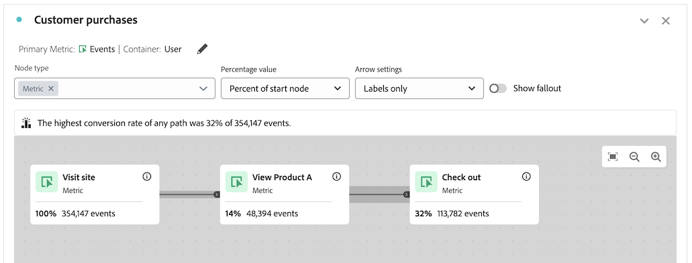

# Felsökning av arbetsytan på resan

Med visualiseringen av arbetsytan på resande fot kan ni analysera och få djupgående insikter om de resor som ni erbjuder era användare och kunder.

Mer information om arbetsytan på resan finns i [Översikt över arbetsytan på resan](/help/analysis-workspace/visualizations/journey-canvas/journey-canvas.md) och [Konfigurera en visualisering av arbetsytan på resan](/help/analysis-workspace/visualizations/journey-canvas/configure-journey-canvas.md).

Följande information kan hjälpa dig att felsöka oönskade resultat som du kanske kan se, till exempel noder som kommer senare under resan och som visar ett högre procenttal eller ett större antal siffror än noder som kommer tidigare under resan.

## Noder med ett högre procentvärde eller värde än tidigare noder

I Resans arbetsyta kan noder som kommer senare under resan visa ett högre procentvärde eller ett högre antal än noder som kommer tidigare under resan.

Till skillnad från Fallout-visualiseringar, som alltid är funnel-formade (där deltagandet minskar i varje steg), kan visualiseringar av arbetsytan på resande fot ha större delaktighet i senare steg av resan än i tidigare steg.

Detta kan inträffa i följande scenarier:

* När du använder ett primärt mått som inte är Personer eller Sessioner

* När flera banor konverteras till en enda nod

### Resan använder ett primärt mått som inte är Personer eller Session

Eftersom du kan använda alla mått som primära mått på en arbetsyta på en resa kan det leda till att noder som kommer senare under resan visas med högre procenttal eller antal än noder som kommer tidigare under resan.

Den resa som används i följande scenarier har konfigurerats med dessa inställningar:

* **[!UICONTROL Person]** anges som behållare

* **[!UICONTROL Event]** anges som primärt mått

#### Scenario 1: Användare A följer resvägen i första sessionen. I en efterföljande session har användaren en händelse som bara matchar en senare nod.

Anta att användare A besöker webbplatsen och slutför resan (nod 1: &quot;Besök webbplats&quot; > Nod 2: &quot;Visa produkt A&quot; > Nod 3: &quot;Checka ut&quot;). Eftersom användare A hade en händelse som matchade varje nod på resan i ordning, räknas en händelse för varje nod på resan.

Anta nu att Användare A besöker webbplatsen igen i en senare session. Eftersom Användare A redan har slutfört resan i en tidigare session genom att följa resan innebär det att varje gång Användare A har en händelse som matchar någon nod i resan - även om Användare A inte har följt vägen för resan i den aktuella sessionen - räknas en händelse på den relevanta noden i resan. Om till exempel Användare A checkar ut räknas en händelse på noden Checka ut. Detta kan resultera i en högre procentandel och ett större tal på noden &quot;Checka ut&quot; än på föregående nod, &quot;Visa produkt A&quot;.

I det här exemplet spelar transportens behållarinställning &quot;Person&quot; en viktig roll för att avgöra om händelsen på den tredje noden (&quot;Checka ut&quot;) räknas i nästa session.

Om behållarinställningen hade ställts in på &quot;Session&quot; skulle händelsen som bara ägde rum på den tredje noden vid det följande besöket inte ha räknas med i resan, eftersom statistiken som visas under resan skulle begränsas till en enda definierad session för en viss person. Mer information om behållarinställningen finns i [Börjar skapa en visualisering av en arbetsyta på resan](/help/analysis-workspace/visualizations/journey-canvas/configure-journey-canvas.md#begin-building-a-journey-canvas-visualization) i artikeln [Konfigurera en visualisering av en arbetsyta på resan](/help/analysis-workspace/visualizations/journey-canvas/configure-journey-canvas.md)

<!-- The time allotted for users to move along the path is determined by the container setting. Because "Person" is selected as the container setting in this example, people who followed the journey's path in one session (moving from Node 1 to Node 2 and to Node 3) met the criteria of the journey. On any subsequent visits to the site, any event they have that matches any node on the journey is counted on that node. -->

#### Scenario 2: Användare B faller utanför kundresan

Anta att Användare B besöker webbplatsen och inte slutför resan (besöker webbplatsen, besöker produkt B och checkar sedan ut). I det här fallet räknas en händelse för kundens startnod,&quot;Besök webbplats&quot;, men en händelse räknas inte för de återstående noderna och Användare B faller utanför kundresan. Trots att Användare B har checkat ut räknas inte en händelse på den tredje noden (&quot;Checka ut&quot;) eftersom Användare B inte slutförde resan genom att visa produkt A innan utcheckningen.

Detta beror på att händelser bara räknas för varje nod när personer följer kundens&quot;slutliga väg&quot;. Detta innebär att händelser bara räknas om personen så småningom flyttas från en nod till en annan, oavsett eventuella händelser mellan de två noderna.

### På resan konvergerar flera banor till en enda nod

På resans arbetsyta kan du ta med flera startnoder i en enda resa, vilket resulterar i flera banor. Dessa sökvägar kan konverteras till en gemensam nod, vilket resulterar i noder som kommer senare under resan och som visar ett högre procenttal eller ett större antal än noder som kommer tidigare under resan.

<!--

The journey used in the following scenarios is configured with the following settings:

* **[!UICONTROL Person]** is set as the container

* **[!UICONTROL Event]** is set as the primary metric

#### Scenario 

When a journey contains multiple paths that converge into a single node, the two paths are combined into the single node using the OR operator. This can result in the

-->

### Procenttal för resa

Siffrorna som visas på varje nod i en resa förblir konstanta oavsett vad som har valts i fältet **[!UICONTROL Percentage value]**, men procentsatserna kan ändras.

I följande avsnitt visas hur procentsatserna kan ändras för samma resa, beroende på vilket av följande alternativ som har valts i fältet **[!UICONTROL Percentage value]**:

+++Procent av startnod

Nodarna i den här resan innehåller följande statistik när fältet **[!UICONTROL Percentage value]** är inställt på **[!UICONTROL Percent of start node]**:

| Nod | Statistik |
|---------|----------|
| Nod 1 -&quot;Besök webbplats&quot; | Under den här resan ägde 354 147 evenemang rum på webbplatsen inom datumintervallet för rapportering, vilket visas i kundens startnod,&quot;Besök webbplats&quot;. |
| Nod 2 -&quot;Visa produkt A&quot; | Av det totala antalet händelser som visas i startnoden matchade 14 % (48 394) kriterierna för kundens andra nod, &quot;Visa produkt A&quot;. |
| Nod 3 -&quot;Checka ut&quot; | Av det totala antalet händelser som visas i startnoden matchade 32 % (113 782) kriterierna för kundens tredje nod,&quot;Checka ut&quot;. |

+++

+++Procent av föregående nod

Nodarna i den här resan innehåller följande statistik när fältet **[!UICONTROL Percentage value]** är inställt på **[!UICONTROL Percent of previous node]**:

| Nod | Statistik |
|---------|----------|
| Nod 1 -&quot;Besök webbplats&quot; | Under den här resan ägde 354 147 evenemang rum på webbplatsen inom datumintervallet för rapportering, vilket visas i kundens startnod,&quot;Besök webbplats&quot;. |
| Nod 2 -&quot;Visa produkt A&quot; | Av det totala antalet händelser som visades i föregående nod matchade 14 % (48 394) kriterierna för kundens andra nod, &quot;Visa produkt A&quot;. |
| Nod 3 -&quot;Checka ut&quot; | Av det totala antalet händelser som visades i föregående nod matchade fler än 100 % (113 782) kriterierna för kundens tredje nod, &quot;Checka ut&quot;. |

+++

+++Procent av totalt

Nodarna i den här resan innehåller följande statistik när fältet **[!UICONTROL Percentage value]** är inställt på **[!UICONTROL Percent of total]**:

| Nod | Statistik |
|---------|----------|
| Nod 1 -&quot;Besök webbplats&quot; | Under den här resan ägde 354 147 evenemang rum på webbplatsen inom datumintervallet för rapportering, vilket visas i kundens startnod,&quot;Besök webbplats&quot;. |
| Nod 2 -&quot;Visa produkt A&quot; | Av det totala antalet händelser matchade färre än 1 % (48 394) villkoren för kundens andra nod,&quot;Visa produkt A&quot;. |
| Nod 3 -&quot;Checka ut&quot; | Av det totala antalet händelser matchade 1 % (113 782) kriterierna för kundens tredje nod,&quot;Checka ut&quot;. |

+++

## Kompatibilitet mellan behållarmått och primärmått

Du kan konfigurera researbetsytebehållaren som Person (som använder personmåttet) eller Session (som använder sessionsmåttet).

Se till att du väljer ett primärt mått som är kompatibelt med det behållarmått som är markerat. De flesta mätvärden är kompatibla med de behållarmått som är tillgängliga. Vissa kombinationer av behållarmått och primära mätvärden bör dock undvikas.

Om du till exempel använder Person som behållare med Session som primärt mått kan det leda till oönskade resultat.

<!--

## Percentages that exceed 100%

The following configurations can result in nodes that show percentages that exceed 100%:

* When the **[!UICONTROL Percentage value]** field is set to **[!UICONTROL Percent of total]** or **[!UICONTROL Percent of start node]**, and a primary metric is selected that results in less data for the start node than on subsequent nodes.

  For example, if Revenue is selected as the primary metric, and no revenue is being realized on the primary metric, then on any node where revenue is being realized will show as exceeding 100%. 

-->
