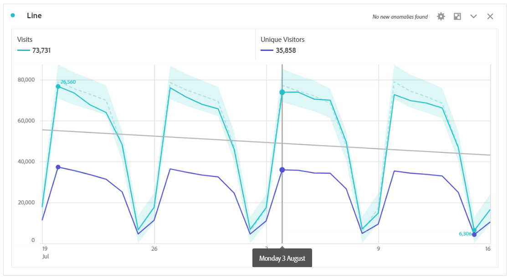

# Linje

>[!NOTE]
>
>Radvisualiseringen kommer snart att fungera [intelligenta bildtexter](/help/analysis-workspace/visualizations/intelligent-captions.md).

Radvisualiseringen representerar mätvärden som använder en rad för att visa hur värden ändras under en tidsperiod. Ett linjediagram kan bara användas när tid används som dimension.

Välj inställningsikonen  i det övre fältet i linjevisualiseringen för att komma åt [Visualiseringsinställningar](freeform-analysis-visualizations.md) tillgängliga. Inställningarna är indelade i:

* **Allmänt**: Inställningar som är gemensamma för olika visualiseringstyper
* **Axel**: Inställningar som påverkar x- eller y-axeln i linjens visualisering
* **Övertäckningar**: Alternativ för att lägga till ytterligare kontext till de serier som visas i radvisualiseringen.

## Ändra granularitet

En granularitetslistruta i [visningsinställningar](freeform-analysis-visualizations.md) gör att du kan ändra en anpassad visualisering (t.ex. linje, stapel) från dag till vecka till månad, osv. Granulariteten uppdateras också i datakälltabellen.

## Visa min eller max

Under **[!UICONTROL Visualization Settings]** > **[!UICONTROL Overlays]** > **[!UICONTROL Show min/max]** kan du täcka över en etikett för minsta och högsta värde för att snabbt markera toppar och dalar i ett mätresultat. Obs! min/max-värdena härleds från de synliga datapunkterna i visualiseringen, inte från hela uppsättningen värden inom en dimension.

## Visa trendlinjeövertäckning

Under **[!UICONTROL Visualization Settings]** > **[!UICONTROL Overlays]** > **[!UICONTROL Show trendline]** kan du välja att lägga till en regression eller en glidande medeltrendlinje i linjeserierna. Trendlinjer hjälper till att beskriva ett tydligare mönster i data.

>[!TIP]
>
>Vi rekommenderar att trendlinjer tillämpas på data som inte innehåller dagens (partiella data) eller framtida datum, eftersom de skevar trendlinjen. Om du behöver ta med framtida datum tar du dock bort nollor från data för att undvika skevning för dessa dagar. Det gör du genom att gå till visualiseringens datakälltabell, välja måttkolumnen och sedan aktivera **[!UICONTROL Column Settings]** > **[!UICONTROL Interpret zero as no value]**.

Alla trendlinjer för regressionsmodellen passas in med vanliga minsta fyrkanter:

| Modell | Beskrivning |
| --- | --- |
| Linjär | Skapar en rät linje som passar bäst för enkla linjära datauppsättningar och är användbar när data ökar eller minskar med en konstant hastighet. Ekvation: `y = a + b * x` |
| Logaritmisk | Skapar en kurvformad linje som passar bäst och är användbar när ändringshastigheten i data snabbt ökar eller minskar och sedan Nivåer ut. En logaritmisk trendlinje kan använda negativa och positiva värden. Ekvation: `y = a + b * log(x)` |
| Exponentiell | Skapar en böjd linje och är användbar när data ökar eller minskar med konstant ökande hastighet. Det här alternativet ska inte användas om dina data innehåller noll eller negativa värden. Ekvation: `y = a + e^(b * x)` |
| Strömförsörjning | Skapar en böjd linje och är användbar för datauppsättningar som jämför mått som ökar med en viss hastighet. Det här alternativet ska inte användas om dina data innehåller noll eller negativa värden. Ekvation: `y = a * x^b` |
| Kvadratisk | Söker efter den bästa passningen för en datauppsättning som är formad som en parabola (konkav upp eller ned). Ekvation: `y = a + b * x + c * x^2` |
| Glidande medelvärde | Skapar en jämn trendlinje baserad på en uppsättning medelvärden. Ett glidande medelvärde kallas även för ett rullande medelvärde och använder ett visst antal datapunkter (som bestäms av ditt urval av &#39;Perioder&#39;), jämför dem och använder medelvärdet som en punkt på raden. Exempel är 7 dagars glidande medelvärde eller 4 veckors glidande medelvärde. |
