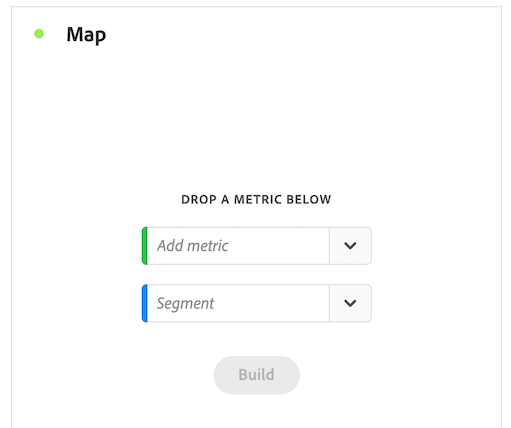

# Karta {#map}

<!-- markdownlint-disable MD034 -->

>[!CONTEXTUALHELP]
>id="workspace_map_button"
>title="Karta"
>abstract="Den här visualiseringen representerar mätvärden genom att täcka över dem på en karta. Detta är användbart när du vill identifiera data i olika geografiska regioner."

<!-- markdownlint-enable MD034 -->

<!-- markdownlint-disable MD034 -->

>[!CONTEXTUALHELP]
>id="workspace_map_bubbles"
>title="Bubblor"
>abstract="Rita händelser med bubblor."

<!-- markdownlint-enable MD034 -->

<!-- markdownlint-disable MD034 -->

>[!CONTEXTUALHELP]
>id="workspace_map_heatmap"
>title="Heatmap"
>abstract="Rita händelser med hjälp av en värmekarta."

<!-- markdownlint-enable MD034 -->

{{release-limited-testing}}

>[!BEGINSHADEBOX]

_I den här artikeln beskrivs kartvisualiseringen i_  _**Customer Journey Analytics**._ _Se [Karta](https://experienceleague.adobe.com/en/docs/analytics/analyze/analysis-workspace/visualizations/map-visualization) för_  _**Adobe Analytics**-versionen av den här artikeln._

>[!ENDSHADEBOX]

Med visualiseringen  **[!UICONTROL Map]** i Analysis Workspace kan du skapa en visuell karta över alla mått (inklusive beräknade värden). Det är användbart när du vill identifiera och jämföra mätdata för olika geografiska regioner.

## Förutsättningar

### Lägga till kontextetiketter i datavyer

I inställningarna för datavyer i Customer Journey Analytics kan administratörer lägga till [kontextetiketter](/help/data-views/component-settings/overview.md) i en dimension eller ett mått, och Customer Journey Analytics-tjänster som [!UICONTROL map] kan använda dessa etiketter för sina syften.

#### Nödvändiga kontextetiketter för latitud och longitud i kartvisualiseringen

Kontextetiketter krävs för att kartvisualiseringen ska fungera. Utan följande sammanhangsetiketter fungerar inte kartvisualiseringen eftersom det inte finns några latitud- och longituddata att arbeta med.

* [!UICONTROL Geo: Latitude]
* [!UICONTROL Geo: Longitude]

Så här lägger du till följande sammanhangsetiketter:

1. I Customer Journey Analytics väljer du **[!UICONTROL Data Management]** > **[!UICONTROL Data views]**.

1. På sidan Datavyer markerar du datavyn som innehåller data som du vill analysera i mappningsvisualiseringen.

1. Välj fliken **[!UICONTROL Components]**.

1. (Villkorligt) Om du använder Web SDK och har konfigurerat latitud och longitud så att de fylls i i dataströmmen, eller om du använder Analytics Source Connector för att fylla i händelsedata, bör latitud- och longitudfält redan vara tillgängliga i ditt schema och fyllas i med rätt kontextetiketter.

   Leta reda på dessa **[!UICONTROL Latitude]**- och **[!UICONTROL Longitude]** schemafält (i **[!UICONTROL Event datasets]** > **[!UICONTROL placeContext]** > **[!UICONTROL geo]** > **[!UICONTROL _schema]**) och dra dem till datavyn som dimensioner om de inte redan finns.

   När dessa schemafält finns som dimensioner i datavyn tillämpas deras kontextetiketter automatiskt och mappningsvisualiseringen använder dem utan någon ytterligare konfiguration.

   

1. (Villkorligt) Om du har anpassade dimensioner som du vill använda för latitud- och longituddata kan du konfigurera kontextetiketterna för de anpassade fälten:

   1. I avsnittet **[!UICONTROL Dimensions]** väljer du den dimension som innehåller longituddata.

   1. I avsnittet **[!UICONTROL Component settings]** till höger, i fältet **[!UICONTROL Context labels]**, börjar du skriva `Longitude` och väljer det sedan i listrutan.

      

   1. Upprepa den här processen om du vill lägga till kontextetiketten **[!UICONTROL Latitude]** i dimensionen som innehåller latituddata.

   1. (Valfritt) Som standard är de här dimensionerna exakta för korgen eller postnumret i kartvisualiseringen, och de visar 2 decimaler i Workspace-rapporter. Du kan justera dem så att de är exakta i en enda mätare i kartvisualiseringen och så att 5 decimaler visas i Workspace-rapporter. Mer information om hur du justerar precisionsnivån finns i [Konfigurera exakta platser för dimensioner](#configure-precise-locations-for-dimensions).

1. Välj **[!UICONTROL Save and continue]** > **[!UICONTROL Save and finish]**.

#### Nödvändiga kontextetiketter för geomallar

Adobe innehåller flera [fördefinierade mallar](/help/analysis-workspace/templates/use-templates.md#web-audience) som använder kartvisualisering. Om du vill använda varje mall måste du lägga till motsvarande sammanhangsetikett till en dimension i datavyn.

Här följer mallarna och den obligatoriska sammanhangsetiketten. Utan dessa etiketter fungerar inte mallarna eftersom det inte finns några geodata att arbeta med.

| Mallnamn | Etikett för obligatoriskt sammanhang |
|---------|----------|
| Geografiska länder | [!UICONTROL Geo: Geo Country] |
| Geografiska områden | [!UICONTROL Geo: Geo Region] |
| Geostäder | [!UICONTROL Geo: Geo City] |
| Geo US-delstater | [!UICONTROL Geo: Geo State] |
| Geo US DMA | [!UICONTROL Geo: Geo Dma] |

Så här lägger du till följande sammanhangsetiketter:

1. I Customer Journey Analytics väljer du **[!UICONTROL Data Management]** > **[!UICONTROL Data views]**.

1. På sidan Datavy väljer du den datavy som innehåller data som du vill analysera med färdiga mallar som använder kartvisualiseringen. I den här datavyn väljer du fem dimensioner, en med landsuppgifter, en med regiondata, en med stadsuppgifter, en med statliga data och en med DMA-data. Därefter etiketterar du de dimensionerna med motsvarande sammanhangsetikett.

1. Välj fliken **[!UICONTROL Components]**.

1. (Villkorligt) Om du använder Web SDK och har konfigurerat geofält som ska fyllas i i dataströmmen, eller om du använder Analytics Source Connector för att fylla i händelsedata, bör geofält redan vara tillgängliga i ditt schema och fyllas i med rätt kontextetiketter.

   Leta upp rätt schemafält, till exempel **[!UICONTROL City]**, **[!UICONTROL Postal code]**, **[!UICONTROL State or province]** (i **[!UICONTROL Event datasets]** > **[!UICONTROL placeContext]** > **[!UICONTROL geo]**) och dra dem till datavyn som dimensioner om de inte redan finns.

   När dessa schemafält finns som dimensioner i datavyn tillämpas deras kontextetiketter automatiskt och geomallarna använder dem utan någon ytterligare konfiguration.

   

1. (Villkorligt) Om du har anpassade dimensioner som du vill använda för geodata kan du konfigurera kontextetiketterna för de anpassade fälten:

   1. Välj den dimension som innehåller landsdata.

   1. I avsnittet **[!UICONTROL Component settings]** till höger, i fältet **[!UICONTROL Context labels]**, börjar du skriva `Geo Country` och väljer det sedan i listrutan.

      

   1. Upprepa den här processen om du vill lägga till kontextetiketten **[!UICONTROL Geo: Geo Region]**, **[!UICONTROL Geo: Geo City]**, **[!UICONTROL Geo: Geo State]** och **[!UICONTROL Geo: Dma]** i varje dimension som innehåller motsvarande data.

1. Välj **[!UICONTROL Save and continue]** > **[!UICONTROL Save and finish]**.

### Grafikdrivrutinerna måste ha stöd för WebGL-återgivning

Kartvisualiseringen använder WebGL för att visa grafik. Om grafikdrivrutinerna inte har stöd för WebGL-återgivning kan du behöva uppdatera drivrutinerna.

## Kartvisualisering i Customer Journey Analytics jämfört med Adobe Analytics

Kartvisualiseringen i Customer Journey Analytics skiljer sig från kartvisualiseringen i Adobe Analytics på följande sätt:

| Funktion | Customer Journey Analytics | Adobe Analytics |
|---------|----------|---------|
| Datakälla | Använd ett segment som finns i datavyn som datakälla. | Tillhandahåller följande alternativ: <ul><li>Mobile lat/long</li><li>Geografiska Dimension Representerar geografiska segmenteringsdata om besökarens plats baserat på besökarens IP-adress. </li></ul> |
| Precision | För datauppsättningar med djup precision kan du konfigurera dimensionerna i datavyn så att upp till 5 decimaler visas. Detta gör att kartvisualiseringen kan vara exakt inom en enda mätare. 
Mer information finns i [Konfigurera exakta platser för dimensioner](#configure-precise-locations-for-dimensions).
 | Data är korrekta för nivån [!UICONTROL Country], [!UICONTROL Region] och [!UICONTROL City]. (Det går inte till DMA- eller Zip-kodnivån.) |
| Skapa ett segment av en markering | Skapa ett segment baserat på ett specifikt område som du väljer i kartvisualiseringen. 
Mer information finns i [Skapa ett segment från mappningsvisualiseringen](#create-a-segment-from-the-map-visualization).
 | Skapa ett segment baserat på de data som rapporteras i kartvisualiseringen i allmänhet. |
| Skapa en målgrupp utifrån ett urval | Skapa en målgrupp baserat på ett specifikt område som du väljer i kartvisualiseringen. 
Mer information finns i [Skapa en målgrupp från kartvisualiseringen](#create-an-audience-from-the-map-visualization). | Det går inte att skapa en målgrupp från kartvisualiseringen. |
| Skapa en trend från en markering | Skapa en anpassad linjediagramvisualisering baserat på ett specifikt område som du väljer i kartvisualiseringen. 
Mer information finns i [Skapa ett trendlinjediagram från mappningsvisualiseringen](#create-a-trended-line-chart-from-the-map-visualization). <!-- is this correct? --> | Det går inte att skapa en trend från mappningsvisualiseringen. |
| Lägga till en uppdelning från en markering | Dela upp en specifik dimensionsuppgift, mått, segment eller datumintervall inom ett visst område som du väljer i kartvisualiseringen. 
Mer information finns i [Lägga till en uppdelning från kartvisualiseringen](#add-a-breakdown-from-the-map-visualization). | Det går inte att lägga till en nedbrytning från kartvisualiseringen. |

## Börja skapa en kartvisualisering {#begin-building-map}

<!-- markdownlint-disable MD034 -->

>[!CONTEXTUALHELP]
>id="workspace_map_panel"
>title="Konfigurera kartvisualisering"
>abstract="Välj det mätvärde eller beräknade mätvärde som ska användas som grund för kartvisualiseringen. Du kan också lägga till ett segment om du vill fokusera på en viss delmängd av data.
Du kan uppdatera den här informationen när som helst efter att visualiseringen har återgetts.
"

<!-- markdownlint-enable MD034 -->

1. Markera ikonen [!UICONTROL **Visualiseringar**] i den vänstra listen och dra sedan **[!UICONTROL Map]** visualiseringen  till en panel som innehåller en frihandstabell.

   eller

   Lägg till en kartvisualisering på något av de sätt som beskrivs i avsnittet [Lägg till visualiseringar i en panel](/help/analysis-workspace/visualizations/freeform-analysis-visualizations.md#add-visualizations-to-a-panel) i [Översikt över visualiseringar](/help/analysis-workspace/visualizations/freeform-analysis-visualizations.md).

   {width="50%"}

1. Ange följande grundläggande information för att konfigurera kartvisualisering:

   * **[!UICONTROL Add metric]**: Välj ett mått eller beräknat mått i listrutan Mått. (Du kan också dra ett mått från den vänstra listen.)

     >[!IMPORTANT]
     >
     >Om du väljer ett mätvärde som har [attribuering](/help/data-views/component-settings/attribution.md#attribution-models) används samma attribuering för latitud- och longitudparen i kartvisualiseringens aktuella visningsruta.
     >

     <!-- Only choose metrics that use Last Touch as the [attribution model](/help/data-views/component-settings/attribution.md#attribution-models) (this is the default attribution model for all metrics). Choosing a metric that has an attribution model other than Last Touch results in inaccurate map data, because attribution is applied to the latitude and longitude pairs. -->

   * **[!UICONTROL Add segment]**: (Valfritt) Välj ett segment i den nedrullningsbara listan. Eller dra i ett segment från segmentlistan.

   Du kan uppdatera den här informationen när visualiseringen har byggts genom att välja redigeringsikonen  i visualiseringshuvudet.

1. Välj **[!UICONTROL Build]**.

   En världskarta med bubblor genereras.

   

1. Fortsätt med [Visa en mappningsvisualisering](#view-a-map-visualization) och [Konfigurera visualiseringsinställningar](#configure-visualization-settings).

## Visa en kartvy

1. Om du inte redan gjort det kan du skapa en kartvisualisering enligt beskrivningen i [Börja skapa en kartvyalisering](#begin-building-a-map-visualization).

1. Gör något av följande i kartvyn i Analysis Workspace:

   * **Zooma in**: Du kan zooma in på kartan för att förstora vissa områden på något av följande sätt:

      * Dubbelklicka på kartan med musen.

      * Använd mushjulet eller liknande åtgärder på styrplattan.

      * Välj plusikonen  på kartvisualiseringen.

     Kartan zoomas därefter. Den nödvändiga dimensionen (land > stat > stad) uppdateras automatiskt utifrån zoomnivån.

   * **Zooma ut**: Du kan zooma ut på kartan om du vill visa större områden på något av följande sätt:

      * Håll ned Skift-tangenten och dubbelklicka på kartan med musen.

      * Använd mushjulet eller liknande åtgärder på styrplattan.

      * Välj minusikonen  på kartvisualiseringen.

     Kartan zoomas därefter. Den nödvändiga dimensionen (land > stat > stad) uppdateras automatiskt utifrån zoomnivån.

   * **Rotera**: Du kan rotera kartan i 2D eller 3D genom att hålla ned [!UICONTROL Ctrl] medan du drar kartan med musen.

     Om du vill återställa kartan till dess ursprungliga nordliga justering väljer du kompassikonen .

   * **Markeringsverktyget**: Du kan markera ett område på kartan för att [skapa ett segment](#create-a-segment-from-the-map-visualization), [skapa en trend](#create-a-trended-line-chart-from-the-map-visualization) eller [lägga till en uppdelning](#add-a-breakdown-from-the-map-visualization).

     Klicka på markeringsverktyget  och dra sedan musen för att markera önskat område.

   * **Jämför**: Du kan jämföra två eller flera mappningsvisualiseringar i samma projekt genom att placera dem sida vid sida.

   * **Visa jämförelser mellan period och period (till exempel år över år)**:

      * Visa negativa tal.

        Om du till exempel ritar upp ett årligt mätvärde kan kartan visa -33 % över New York.

      * Med mätvärden som är av typen *percent*, genereras medelvärden för procentsatserna tillsammans.

      * Ett grönt och rött färgschema anger positivt och negativt.

   * **Ytterligare visualiseringsinställningar**: Välj inställningsikonen  i visualiseringshuvudet om du vill visa ytterligare inställningar för mappningsvisualiseringen. Mer information finns i [Konfigurera visualiseringsinställningar](#configure-visualization-settings).

1. **Spara** projektet om du vill spara alla kartinställningar (koordinater, zoomning, rotation).
1. (Valfritt) Tabellen under visualiseringen kan fyllas i genom att du drar i platsdimensioner och mått från den vänstra listen.

## Konfigurera visualiseringsinställningar

Så här konfigurerar du inställningar för mappningsvisualisering:

1. Öppna en befintlig kartvisualisering i Analysis Workspace eller [börja skapa en ny](#begin-building-a-map-visualization).

1. Håll pekaren över kartvisualiseringen och välj sedan inställningsikonen  i visualiseringshuvudet.

   Följande alternativ är tillgängliga:

   | Avsnitt | Inställning | Beskrivning |
   | --- |--- |--- |
   | **[!UICONTROL Map type]** | | |
   | | **[!UICONTROL Bubbles]** | Ritar händelser med bubblor. Ett bubbeldiagram är ett diagram med flera variabler och som är ett kors mellan ett punktdiagram och ett proportionellt ytdiagram. Den här vyn är standard. |
   | | **[!UICONTROL Heatmap]** | Ritar händelser med hjälp av en heatmap. En heatmap är en grafisk representation av data där de enskilda värdena i en matris representeras som färger. |
   | **[!UICONTROL Styles]** | | |
   | | **[!UICONTROL Color theme]** | Visar färgschemat för värmekartan och bubblorna. Du kan välja mellan Coral, Reds, Green eller Blues. Standardvärdet är Coral. |
   | | **[!UICONTROL Map style]** | Du kan välja mellan Basic, Streets, Bright, Light, Dark och Satellite. |
   | | **[!UICONTROL Cluster radius]** | Grupperar datapunkter som ligger inom det angivna antalet pixlar. Standardvärdet är 50.
Det här alternativet är bara tillgängligt när **[!UICONTROL Bubbles]** har valts som **[!UICONTROL Map type]**.
 |
   | | **[!UICONTROL Custom max value]** | Gör att du kan ändra tröskelvärdet för det högsta värdet för kartan. Om du justerar det här värdet justeras skalan för bubblor- eller heatmap-värdena (färg och storlek) i förhållande till det anpassade maxvärdet som du anger. |
   | | **[!UICONTROL Show annotations]** | Visar anteckningarna som gjorts för den här visualiseringen. |
   | | **[!UICONTROL Hide title]** | Döljer titeln på visualiseringen. |

## Konfigurera exakta platser för dimensioner

Om du har anpassade datamängder med djup precision kan du konfigurera kartvisualiseringen så att du får en platsnoggrannhet med en enda mätare.

1. I Customer Journey Analytics väljer du **[!UICONTROL Data Management]** > **[!UICONTROL Data views]**.

1. Markera datavyn som innehåller dimensionerna som du vill konfigurera för att använda mer exakta platser.

1. Välj fliken **[!UICONTROL Components]** i datavyn.

1. Välj de dimensioner som du använder för latitud och longitud som du vill konfigurera. Mer information om vilka dimensioner du använder finns i [Obligatoriska kontextetiketter för latitud och longitud i kartvisualiseringen](#required-context-labels-for-latitude-and-longitude-in-the-map-visualization).

1. Konfigurera precisionsnivån för dimensionen:

   1. Med dimensionen som du vill konfigurera fortfarande markerad expanderar du avsnittet **[!UICONTROL Format]** i den högra listen.

      

   1. I fältet **[!UICONTROL Decimal places]** ändrar du antalet decimaler så att det motsvarar den önskade precisionsnivån:

      * **0:** Exakt för den stora regionen eller landsnivån i kartvisualiseringen. Visar 0 decimaler i Workspace-rapporter.

      * **1:** Exakt för regionen eller storstadsnivån i kartvisualiseringen.  Visar en decimal i Workspace-rapporter.

      * **2:** Exakt för stad eller postnummer i kartvisualiseringen. Visar 2 decimaler i Workspace-rapporter.

        Det här är standardvalet.

      * **3:** Exakt för den mycket lilla stan eller grannskapsnivån i kartvisualiseringen. Visar 3 decimaler i Workspace-rapporter.

      * **4:** Exakt för ett specifikt paket med mark- eller byggnadsnivåer i kartvisualiseringen. Visar 4 decimaler i Workspace-rapporter.

      * **5:** Exakt för en enda mätare i kartvisualiseringen. Visar 5 decimaler i Workspace-rapporter.

1. Välj **[!UICONTROL Save and continue]** > **[!UICONTROL Save and finish]**.

## Skapa ett segment från kartvisualiseringen {#map-create-segment}

Du kan skapa ett segment baserat på ett visst område som du väljer i kartvisualiseringen. När du skapar ett segment baserat på ett markerat område inkluderas alla data som ligger inom latitud och longitud för markeringen i segmentet.

Så här skapar du ett segment från kartvisualiseringen:

1. Zooma eller panorera till det område på kartan som innehåller de data du vill använda för ditt segment.

1. Gör något av följande:

   * **Om du vill skapa ett segment av allt som för närvarande visas på kartan:** Högerklicka någonstans på kartan och välj sedan **[!UICONTROL Create segment from current view]**.

   * **Om du vill skapa ett segment för ett mer specifikt område på kartan:** Klicka på markeringsverktyget , dra musen för att markera önskat område och markera sedan **[!UICONTROL Create segment from selection]**.

1. Använd segmentverktyget för att definiera det nya segmentet. Mer information finns i [Segmentbyggare](/help/components/segments/seg-builder.md).

## Skapa en målgrupp utifrån kartvisualiseringen

Du kan skapa en målgrupp baserat på ett specifikt område som du väljer i kartvisualiseringen.

Så här skapar du en målgrupp utifrån kartvisualiseringen:

1. Zooma eller panorera till det område på kartan som innehåller de data du vill använda för din målgrupp.

1. Gör något av följande:

   * **Om du vill skapa en målgrupp från allt som visas på kartan:** Högerklicka någonstans på kartan och välj sedan **[!UICONTROL Create audience from current view]**.

   * **Om du vill skapa en målgrupp för ett mer specifikt område på kartan:** Klicka på markeringsverktyget , dra musen för att markera önskat område och välj sedan **[!UICONTROL Create audience from selection]**.

1. Använd Audience Builder för att definiera den nya målgruppen. Mer information finns i [Målgruppsverktyget](/help/components/audiences/publish.md#audience-builder) i [Skapa och publicera målgrupper](/help/components/audiences/publish.md)

## Skapa ett trendlinjediagram utifrån kartvisualiseringen

Du kan skapa en anpassad linjediagramvisualisering för data inom ett visst område som du väljer i kartvisualiseringen.

Så här skapar du ett trendlinjediagram utifrån mappningsvisualiseringen:

1. Zooma eller panorera till det område på kartan som innehåller data som du vill använda för det trendlinjediagrammet.

1. Gör något av följande:

   * **Om du vill skapa ett trendlinjediagram av allt som för närvarande visas på kartan:** Högerklicka någonstans på kartan och välj sedan **[!UICONTROL Trend from current view]**.

   * **Om du vill skapa ett trendlinjediagram för ett mer specifikt område på kartan:** Klicka på markeringsverktyget , dra musen för att markera önskat område och välj sedan **[!UICONTROL Trend]**.

   En linjevisualisering med en trendlinje skapas. Mer information om den här visualiseringen finns i [Rad](/help/analysis-workspace/visualizations/line.md).

<!--

Can you do this?

## Add a breakdown from the map visualization

You can break down a specific dimension item, metric, segment, or date range for the data within a designated area that you select in the map visualization.

To add a breakdown from the map visualization:

1. (Optional) Zoom in on the specific area of the map that contains the data where you want to add the breakdown.

1. Click the selection tool , then drag your mouse to select the desired area.

1. Select **[!UICONTROL Add breakdown]**. 

-->

<!--

Can you do this?

## Export the map visualization as a PDF

To export the map visualization in PDF format:

1. how...

-->

