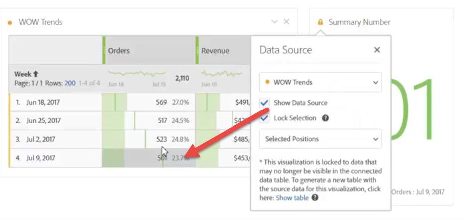

# Hantera datakällor

>[!NOTE]
>
>Du visar dokumentationen för Analysis Workspace i Customer Journey Analytics. Dess funktionsuppsättning skiljer sig något från [Analysis Workspace i traditionell Adobe Analytics](https://docs.adobe.com/content/help/en/analytics/analyze/analysis-workspace/home.html). [Läs mer …](/help/getting-started/cja-aa.md)

Med synkronisering av visualiseringar kan du styra vilken datatabell eller datakälla som motsvarar en visualisering.

**Tips:** Du kan se vilka visualiseringar som är relaterade till punktens färg bredvid titeln. Matchande färger innebär att visualiseringar baseras på samma datakälla.

Om du hanterar en datakälla kan du visa datakällan eller låsa markeringen. Dessa inställningar avgör hur visualiseringen ändras (eller inte ändras) när nya data kommer in.

1. [Skapa ett projekt](/help/analysis-workspace/home.md) med en datatabell och en [visualisering](/help/analysis-workspace/visualizations/freeform-analysis-visualizations.md).
1. Markera de celler (datakälla) som du vill associera med visualiseringen i datatabellen.
1. I visualiseringen klickar du på punkten bredvid rubriken för att ta upp **[!UICONTROL Data Source]** dialog. Välj **[!UICONTROL Show Data Source]** eller **[!UICONTROL Lock Selection]**.

   

   Om du synkroniserar en visualisering till en tabellcell skapas en ny (dold) tabell och färgkoder för synkroniserad visualisering med den tabellen.

| Element | Beskrivning |
|--- |--- |
| Länkade visualiseringar | Om det finns visualiseringar som är kopplade till en friform- eller kohorttabell öppnas den övre vänstra punkten för att visa de anslutna visualiseringarna och har ett kryssrutealternativ &quot;visa&quot; för att visa/dölja tabellen.  Med Hovering markeras den länkade visualiseringen och om du klickar på den kommer du till den. |
| Visa datakälla | Gör att du kan visa (genom att aktivera kryssrutan) eller dölja (genom att inaktivera) den datatabell som motsvarar visualiseringen. |
| Lås markering | Aktivera den här inställningen om du vill låsa visualiseringen till de data som är markerade i motsvarande datatabell. När alternativet är aktiverat väljer du mellan:  <ul><li>**Valda positioner**: Välj det här alternativet om visualiseringen ska förbli låst på de positioner som är markerade i motsvarande datatabell. Dessa ståndpunkter kommer att fortsätta att visualiseras, även om de specifika posterna i dessa positioner ändras. Välj till exempel det här alternativet om du alltid vill visa de fem främsta kampanjnamnen i den här visualiseringen, oavsett vilka kampanjnamn som visas i de fem främsta.</li> <li>**Markerade objekt**: Välj det här alternativet om du vill att visualiseringen ska förbli låst för de specifika objekt som är markerade i motsvarande datatabell. Dessa poster kommer även i fortsättningen att visualiseras, även om de ändrar sin rangordning mellan posterna i tabellen. Välj till exempel det här alternativet om du alltid vill visa samma fem specifika kampanjnamn i den här visualiseringen, oavsett var kampanjnamnen rangordnas.</li></ul> |

Den här arkitekturen skiljer sig från den föregående eftersom Analysis Workspace inte längre skapar en dold dubbletttabell som lagrar den låsta markeringen för dig. Nu pekar datakällan på tabellen som du skapade visualiseringen från.

**Exempel på användningsfall:**

* Du kan skapa en sammanfattande visualisering och låsa den i en cell i tabellen som du skapade den från. När du aktiverar Visa datakälla visas exakt var informationen kommer från i tabellen. Källdata kommer att gråmarkeras:

   >
* Du kan lägga till många visualiseringar och hämta dem från olika celler i samma tabell, som visas här. Tabellen är densamma som i exemplet ovan, men källcellen (och måttet) skiljer sig åt:

   >
* Du kan se om det finns visualiseringar som är kopplade till en frihandsfigur eller en kohorttabell genom att klicka på den övre vänstra punkten (Inställningar för datakälla). Vid hovring markeras den länkade visualiseringen och om du klickar på den kommer du till den.

   >
