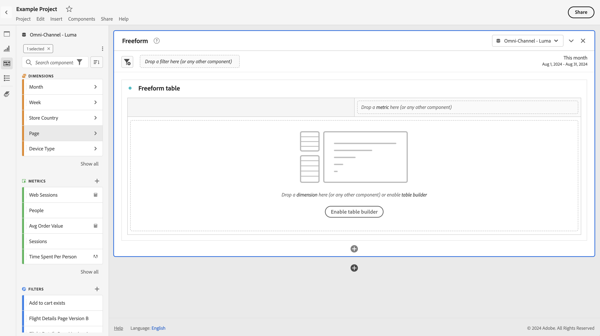

# Tillgänglighet i Analysis Workspace

Läs om tillgänglighetsstöd i [!UICONTROL Analysis Workspace], det främsta analysverktyget för Customer Journey Analytics.

Med hjälpmedel avses att göra produkter användbara för personer med funktionshinder som syn-, hörsel-, kognitiv-, motor- eller andra funktionshinder. Exempel på hjälpmedelsfunktioner för programvaror är:

* stöd för skärmläsare,
* textmotsvarigheter för grafik,
* kortkommandon,
* ändring av visningsfärger till hög kontrast,
* med mera.

[!UICONTROL Analysis Workspace] innehåller verktyg som gör den tillgänglig för användning, bland annat:

## Tangentbordsnavigering

Navigering i [!UICONTROL Analysis Workspace] fungerar uppifrån och ned och från vänster till höger. Följande navigeringselement underlättar tillgängligheten:

* Med tangenten **[!UICONTROL Tab]** kan du skapa genvägar mellan större avsnitt i Workspace. I den vänstra panelen kan du i **[!UICONTROL Tab]** även gå från ett dragbart alternativ till nästa.
* }︎ ◀ och {1 }︎ flyttas mellan enskilda element efter att tangenten ▶ har markerat ett element.**[!UICONTROL Tab]**
* **[!UICONTROL F6]**-tangenten navigerar till den första panelen i projektet och förflyttar sig mellan visualiseringarna på den panelen. Sedan flyttas den till nästa panel i projektet och upprepas.
* Fokusindikatorer används så att synkade tangentbordsanvändare har en tydlig indikation på vilket gränssnittselement som är i fokus. Indikatorn är en blå kantlinje för den panel som är i fokus. Och grå bakgrund för den senast valda funktionen och markeringen i funktionen. I exemplet har [!UICONTROL Components] och siddimensionen nyligen valts.

  

### Tangentbordsnavigering för menyraden

1. Tabba tills du har nått menyraden.
1. Använd piltangenterna för att navigera mellan menyer och menyalternativ.
1. Tryck på **[!UICONTROL Enter]** för att öppna en meny eller markera ett menyalternativ.
1. Stäng en meny med **[!UICONTROL Esc]**.

### Tangentbordsnavigering för dra och släpp-interaktioner

[!UICONTROL Analysis Workspace] är ett dra och släpp-användargränssnitt. Användarna kan dock lägga till komponenter med tangentbordet i stället:

1. Flikar vid en komponent på den vänstra panelen.
1. Tryck på **[!UICONTROL Enter]** för att markera.
1. Använd piltangenterna för att navigera till det område där du vill släppa komponenten.
1. Tryck på **[!UICONTROL Enter]** för att montera komponenten.

### Kortkommandon (snabbtangenter)

[!UICONTROL Analysis Workspace] erbjuder en mängd [kortkommandon](/help/analysis-workspace/build-workspace-project/fa-shortcut-keys.md) för ett smidigare arbetsflöde.

## Stöd för skärmläsare och skärmförstorare

En skärmläsare läser upp text som visas på datorskärmen. Den läser även information som inte är text, t.ex. knappetiketter eller bildbeskrivningar i programmet.

## Färgpaletter och kontrast

[!UICONTROL Analysis Workspace] strävar efter WCAG 2.1-överensstämmelse, inklusive krav på färgkontrast.

Dessutom kan användare ange en egen önskad färgpalett för ett projekt under **[!UICONTROL Project]** > **[!UICONTROL Project settings]** > [Projektfärgpalett](/help/analysis-workspace/build-workspace-project/color-palettes.md).

## Nödvändig validering

När du skapar en komponent, en visualisering eller en panel valideras de fält som krävs när du sparar. Om ett obligatoriskt fält inte godkänns vid valideringen visas det i rött med en felikon. En skriven beskrivning förklarar vad som behöver åtgärdas.

## Stöd för hjälpmedelsfunktioner för operativsystem

Analysis Workspace har stöd för inbyggda hjälpmedelsfunktioner för Windows och macOS, som högkontrastläge, klisterlappar och långsamma tangenter/filtertangenter. Det innehåller även information om användargränssnittet till operativsystemet för att möjliggöra interaktion med hjälpmedelstekniker, inklusive skärmläsare som VoiceOver för macOS och NVDA i Windows.
