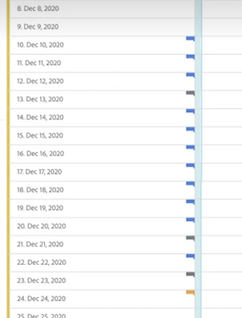
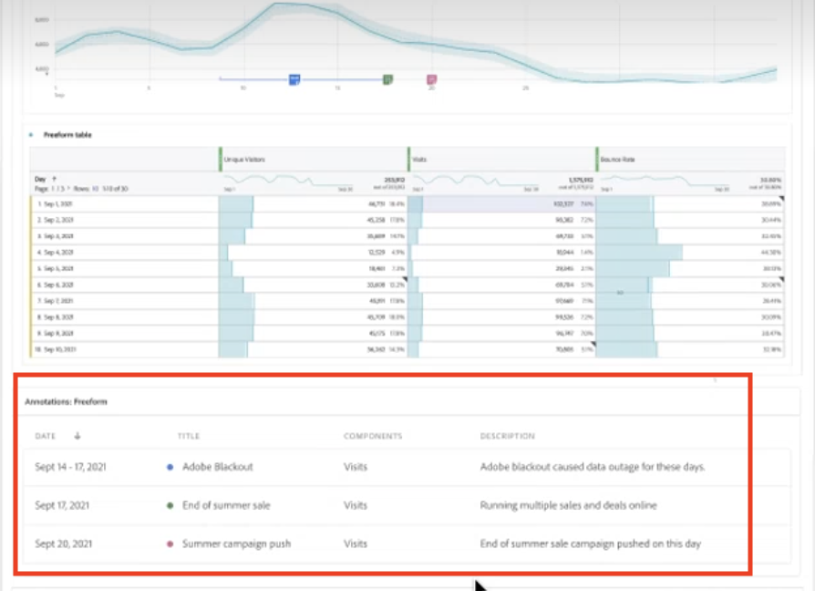

# Visa anteckningar

Anteckningarna visas något annorlunda beroende på om de sträcker sig över en enstaka dag eller ett datumintervall.

## Visa anteckningar i linjediagram eller tabeller

| Datum | Utseende |
| --- | --- |
| **En dag** | 
När du hovrar över anteckningen kan du se dess detaljer, redigera den genom att markera pennikonen eller ta bort den:
  |
| **Datumintervall** | Ikonen ändras och när du håller markören över den visas datumintervallet.

När du markerar den i linjediagrammet visas anteckningens metadata och du kan redigera eller ta bort den:
I en tabell visas en ikon för varje datum i datumintervallet.
 |
| **Överlappande anteckningar** | På dagar som har fler än en anteckning kopplad till sig visas ikonen i grå färg.

När du hovrar över den grå ikonen visas alla överlappande anteckningar:
 |

{style="table-layout:auto"}

## Visa anteckningar i en PDF-fil

Eftersom du inte kan hovra över ikoner i en PDF-fil innehåller den här filen (efter exporten) förklaringar längst ned på panelen. Här är ett exempel:

## Visa anteckningar med data som inte är trenddata

Ibland visas anteckningar med data som inte är trenddata, men som är knutna till en viss dimension. I så fall visas de bara i en sammanfattningsanteckning i det nedre högra hörnet. Här är ett exempel:

Sammanfattningsdiagrammet visas i alla visualiseringstyper i hörnet, inte bara i frihandstabeller och sammanfattningsnummer. Det visas också i visualiseringar som [!UICONTROL Donut], [!UICONTROL Flow],[!UICONTROL Fallout],[!UICONTROL Cohort]och så vidare.

