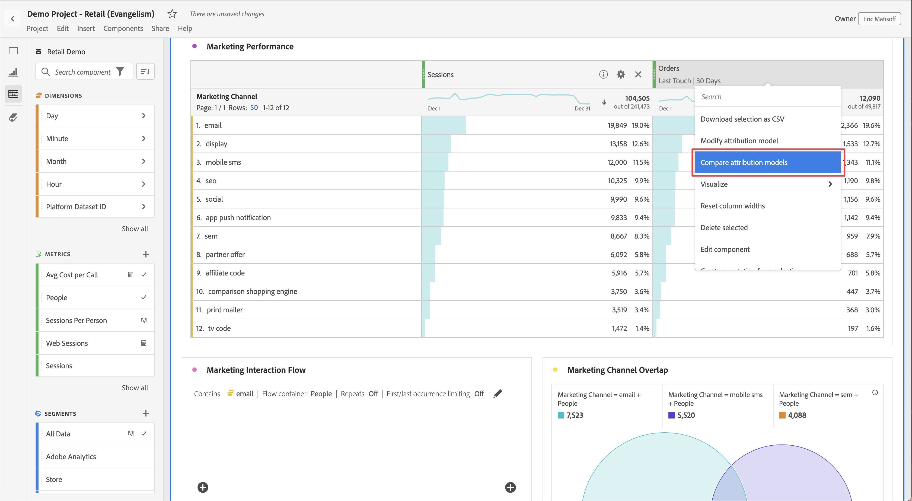

# Mätvärden

Med mätvärden kan du kvantifiera datapunkter i Analysis Workspace. De används oftast som kolumner i en visualisering och är knutna till dimensioner.

## Använd mätvärden i Analysis Workspace

Mätvärdena är flexibla i användningen inom Analysis Workspace. Dra ett mätvärde till en tom Freeform-tabell om du vill se mätningen trender över projektets datumperiod. Du kan också dra ett mått när det finns en dimension för att se mätvärdet jämfört med varje dimensionsobjekt. Om du drar ett mätresultat över ett befintligt måtthuvud ersätts det och om du drar ett mätvärde bredvid ett huvud kan du se båda mätvärdena sida vid sida.

Mer information om hur du lägger till mått och andra typer av komponenter i Analysis Workspace finns i [Använda komponenter i Analysis Workspace](/help/components/use-components-in-workspace.md).

## Typer av mätvärden

Adobe erbjuder flera typer av mätvärden som kan användas i Analysis Workspace:

* **Standardmått**: Exempel på standardvärden är Folk, Sessioner och Händelser.

  I motsats till Adobe Analytics kan du i Customer Journey Analytics definiera standardvärden på ett flexibelt sätt inom räckvidden för en anslutning och en datavy.

   * **Personer**: Personmåttet i Customer Journey Analytics är antalet som skiljer sig från person-ID:n. Beroende på vad du väljer som person-ID när du konfigurerar datauppsättningar i din anslutning kan personmåttet betyda olika saker.
   * **Sessioner**: Sessionsmätningen i Customer Journey Analytics är den som du definierar som en del av konfigurationen av sessionsinställningarna i datavyn. Se [Sessionsinställningar](/help/data-views/session-settings.md).
   * **Händelser**: Händelsemåttet i Customer Journey Analytics består av händelser som ingår i alla händelsedatamängder som du har konfigurerat som en del av anslutningen.

* **Beräknade mått** : Användardefinierade mått som baseras på standardvärden, statiska tal eller algoritmiska funktioner.

* **Beräknade mätmallar**  : Adobe-definierade mätvärden som beter sig på liknande sätt som beräknade mätvärden. Du kan använda dem som de är i Workspace-projekt eller spara en kopia för att anpassa logiken. Se [Beräknade standardvärden](calc-metrics/cm-workflow/../default-calcmetrics.md).

Du kan se om ett mätresultat har godkänts med ikonen  eller inte. Om du vill ha mer information om ett mätresultat för du pekaren över mätvärdet och väljer . Mer information finns i [Komponentinformation](use-components-in-workspace.md#component-info).

## Jämför mätvärden med olika attribueringsmodeller

Om du snabbt och enkelt vill jämföra en attribueringsmodell med en annan för ett mätresultat väljer du **[!UICONTROL Compare attribution models]** på snabbmenyn för ett mätresultat.

Med den här genvägen kan du snabbt och enkelt jämföra attribueringsmodeller.

## Skapa beräknade mått

Med beräknade mätvärden kan ni enkelt konfigurera hur mätvärden relaterar till varandra med hjälp av enkla operatorer eller statistiska funktioner. Mer information finns i [Översikt över beräknade mätvärden](/help/components/calc-metrics/calc-metr-overview.md).

Det finns flera sätt att skapa beräknade mått. Den metod du väljer avgör om det beräknade måttet är tillgängligt från komponentlistan i alla projekt, eller bara i det projekt där det skapades.

### Skapa beräknade mätvärden för alla projekt

Du kan använda verktyget för beräknade mätvärden för att skapa beräknade mätvärden. När de skapas på det här sättet är beräknade värden tillgängliga i komponentlistan och kan sedan användas i projekt i hela organisationen.

Mer information om hur du kommer åt verktyget för beräknade värden finns i [Skapa beräknade värden](/help/components/calc-metrics/cm-workflow/cm-workflow.md).

### Skapa beräknade mätvärden för ett enskilt projekt

Du kan skapa snabba beräknade mätvärden som bara är tillgängliga för det projekt där de skapades.

Så här skapar du ett beräknat mått för ett enskilt projekt:

1. Öppna det projekt i Analysis Workspace där du vill skapa det beräknade måttet.

1. Högerklicka på kolumnrubriken i en kolumn i en frihandstabell.

   eller

   Markera två kolumner samtidigt som du håller ned Skift och högerklicka sedan på en av de markerade kolumnerna.

1. Välj **[!UICONTROL Create metric from selection]**

   

1. Om du vill skapa ett beräknat mått för endast det här projektet väljer du bland de tillgängliga alternativen.

   När en kolumn är markerad är följande alternativ tillgängliga:

   * [!UICONTROL **Medel**]: Skapar en ny kolumn som visar medelvärdet i uppsättningen med dimensionselement för kolumnen. Detta använder funktionen [Medel](/help/components/calc-metrics/cm-functions.md#mean).

   * [!UICONTROL **Median**]: Skapar en ny kolumn som visar medianvärdet i uppsättningen med dimensionselement för kolumnen. Detta använder funktionen [Median](/help/components/calc-metrics/cm-functions.md#median).

   * [!UICONTROL **Kolumn max**]: Skapar en ny kolumn som visar det största värdet i uppsättningen med dimensionselement för kolumnen. Detta använder funktionen [Kolumnmaximum](/help/components/calc-metrics/cm-functions.md#column-maximum).

   * [!UICONTROL **Kolumn min**]: Skapar en ny kolumn som visar det minsta värdet i uppsättningen med dimensionselement för kolumnen. Detta använder funktionen [Kolumnminimum](/help/components/calc-metrics/cm-functions.md#column-minimum).

   * [!UICONTROL **Kolumnsumma**]:Skapar en ny kolumn som lägger till alla numeriska värden för ett mått i en kolumn (över elementen i en dimension). Detta använder funktionen [Kolumnsumma](/help/components/calc-metrics/cm-functions.md#column-sum).

   När två kolumner är markerade är följande alternativ tillgängliga:

   * [!UICONTROL **Dela upp**]: Skapar en ny kolumn som delar värdena för de två markerade kolumnerna.

   * [!UICONTROL **Subtrahera**]: Skapar en ny kolumn som subtraherar värdena för de två markerade kolumnerna.

   * [!UICONTROL **Lägg till**]: Skapar en ny kolumn som lägger till värdena för de två markerade kolumnerna.

   * [!UICONTROL **Multiplicera**]: Skapar en ny kolumn som multiplicerar värdena för de två markerade kolumnerna.

   * [!UICONTROL **Procentuell ändring**]: Skapar en ny kolumn som visar procentändringen för de två markerade kolumnerna.

[Beräknade mått: Mätvärden utan implementering](https://experienceleague.adobe.com/docs/analytics-learn/tutorials/components/calculated-metrics/calculated-metrics-implementationless-metrics.html) (3:42)

