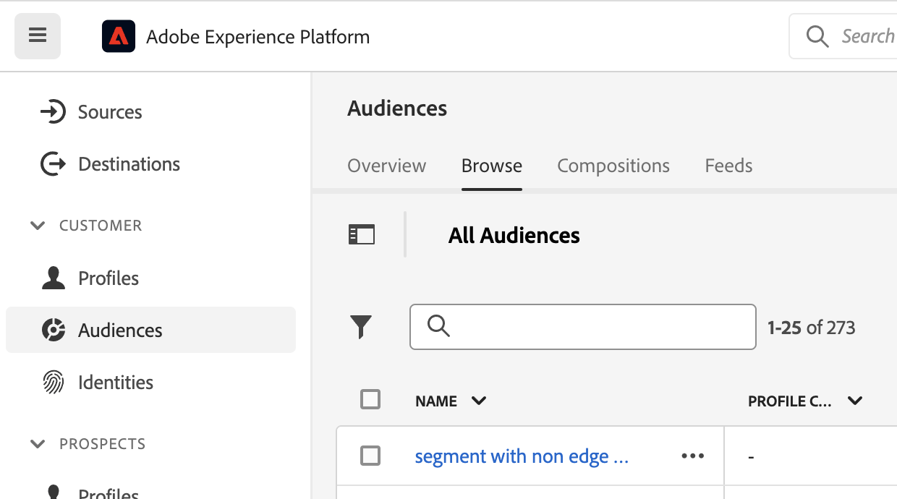

# Hantera målgrupper skapade i Customer Journey Analytics

>[!NOTE]
>
>Den här funktionen finns för närvarande i [begränsad testning](/help/release-notes/releases.md).

Genom att hantera tidigare skapade målgrupper kan ni

* **Schemalägg eller avschemalägg** automatisk uppdatering/uppdatering. Det maximala utgångsdatumet för schemat är 1 år.
* **Förnya ett schema för målgruppsuppdatering** när den snart går ut. Utgångna målgrupper behandlas på samma sätt som schemalagda rapporter som förfaller - administratören får ett e-postmeddelande en månad innan schemat förfaller.
* Visa **senaste gången en publik uppdaterades**
* Få insikter i **hur lång tid det tog att producera en publik** från Customer Journey Analytics (CJA), och hur lång tid det tog att få publiken att visas i kundprofilen i realtid för aktiveringsändamål.
* Se om målgrupperna i CJA är **används aktivt av kundprofilen i realtid** eller (helst) alla Experience Platform-program som använder de målgrupper som skapats av CJA.

## Hanteringsgränssnitt

skärmbild

| Användargränssnittsinställning | Definition |
| --- | --- |
| Dölj/visa filter | Här kan du visa eller dölja följande filter i den vänstra listen: <ul><li>Datavy</li><li>Ägare</li><li>Uppdateringsfrekvens</li><li>Taggar</li></ul> |
| Titel och beskrivning |  |
| Datavy |
| Målgruppsstorlek |  |
| Ägare |  |
| Uppdatera frekvens |  |
| Taggar |  |
| Senast uppdaterad |  |
| Senast ändrad |  |

{style=&quot;table-layout:auto&quot;}

## Visa och använda CJA-målgrupper i Experience Platform

Du kan visa CJA-målgrupper i Platform genom att gå till [!UICONTROL Segments] > [!UICONTROL Create segments] > [!UICONTROL Audiences] tab > [!UICONTROL CJA Audiences].

Du kan dra CJA-målgrupper till segmentdefinitionen för AEP-segment.

Om du väljer att exportera denna målgrupp till AEP Data Lake, visas den som en datauppsättning som överensstämmer med XDM Individual Profile Schema Class:

