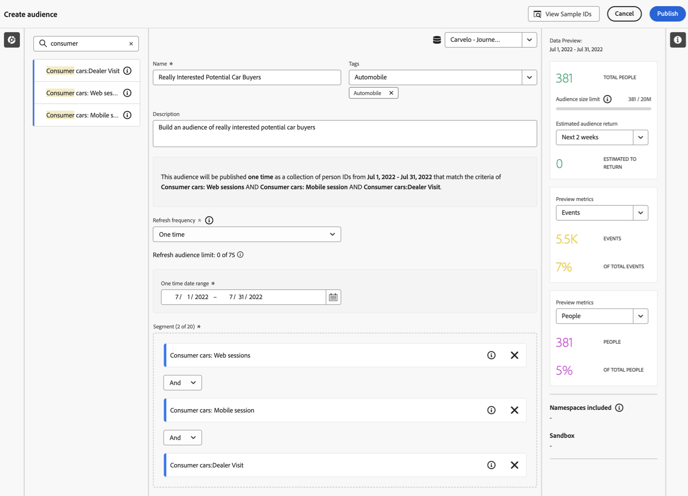

# Skapa och publicera målgrupper {#create-and-publish-audiences}

<!-- markdownlint-disable MD034 -->

>[!CONTEXTUALHELP]
>id="components_audiences_refreshfrequency"
>title="Uppdateringsfrekvens"
>abstract="Se hur ofta en målgrupps medlemskap omprövas. En gång utvärderas bara en målgrupp."

<!-- markdownlint-enable MD034 -->

<!-- markdownlint-disable MD034 -->

>[!CONTEXTUALHELP]
>id="components_audiences_audiencelimit"
>title="Målgruppsgräns"
>abstract="Att uppdatera målgrupper är begränsat baserat på hur ofta de uppdateras."

<!-- markdownlint-enable MD034 -->

<!-- markdownlint-disable MD034 -->

>[!CONTEXTUALHELP]
>id="component_audiences_refreshlookbackwindow"
>title="Uppdatera uppslagsfönstret"
>abstract="Definiera antalet dagar från idag som en målgrupp utvärderas från."

<!-- markdownlint-enable MD034 -->

<!-- markdownlint-disable MD034 -->

>[!CONTEXTUALHELP]
>id="component_audiences_audiencesizelimit"
>title="Storleksgräns för målgrupp"
>abstract="Målgrupperna får inte vara större än 20 miljoner medlemmar."

<!-- markdownlint-enable MD034 -->

<!-- markdownlint-disable MD034 -->

>[!CONTEXTUALHELP]
>id="component_audiences_namespacesincluded"
>title="Namnutrymmen ingår"
>abstract="Identiteterna i den här målgruppen består av namnutrymmena nedan."

<!-- markdownlint-enable MD034 -->

I det här avsnittet beskrivs hur du skapar och publicerar målgrupper som identifieras i Customer Journey Analytics till [kundprofilen i realtid](https://experienceleague.adobe.com/sv/docs/experience-platform/profile/home) i Adobe Experience Platform för kundanpassning och personalisering.

Läs den här [översikten](/help/components/audiences/audiences-overview.md) om du vill bekanta dig med konceptet Customer Journey Analytics målgrupper.

## Skapa och publicera en målgrupp {#create}

1. Gör något av följande om du vill skapa och publicera en publik:

   | Skapandemetod | Information |
   | --- | --- |
   | Från gränssnittet **[!UICONTROL Audiences]** | Välj **[!UICONTROL Components]** > **[!UICONTROL Audiences]** på Customer Journey Analytics huvudmeny. Gränssnittet Publiker visas. Välj **[!UICONTROL Create audience]** så öppnas [!UICONTROL Audience builder]. |
   | Från en visualisering i Analysis Workspace | Många visualiseringar i Analysis Workspace gör att du kan skapa en målgrupp med hjälp av snabbmenyn. Du kan till exempel välja **[!UICONTROL Create audience]** på snabbmenyn för ett objekt i en [friformstabell](/help/analysis-workspace/visualizations/freeform-table/freeform-table.md) eller en nod i [Researbetsytan](/help/analysis-workspace/visualizations/journey-canvas/journey-canvas.md).
När du använder den här metoden fylls segmentet i Audience Builder i automatiskt med den dimension eller det dimensionsobjekt som du valde.

Med följande visualiseringar kan du skapa en målgrupp med hjälp av högerklicksmenyn:
<ul><li>[Kohortabell](/help/analysis-workspace/visualizations/cohort-table/cohort-analysis.md)</li><li>[Utfall](/help/analysis-workspace/visualizations/fallout/fallout-flow.md)</li><li>[Flöde](/help/analysis-workspace/visualizations/c-flow/flow.md)</li><li>[Frihandstabell](/help/analysis-workspace/visualizations/freeform-table/freeform-table.md)</li><li>[Researbetsyta](/help/analysis-workspace/visualizations/journey-canvas/journey-canvas.md)</li><li>[Karta ](/help/analysis-workspace/visualizations/map.md#create-an-audience-from-the-map-visualization) **Obs!** Den här visualiseringen är i den begränsade testfasen av releasen och är kanske inte tillgänglig än i din miljö.</li><li>[Venn](/help/analysis-workspace/visualizations/venn.md)</li></ul>
**Obs!** Målgrupper kan inte innehålla beräknade värden. Om du försöker skapa en målgrupp som innehåller ett beräknat mått inkluderas inte det beräknade måttet i målgruppsdefinitionen.
 |
   | Från gränssnittet för att skapa/redigera segment | Markera rutan **[!UICONTROL Create an audience from this segment]**. Om du använder den här metoden fylls segmentet i automatiskt. Mer information finns i [Skapa segment](/help/components/segments/seg-create.md). |

   {style="table-layout:auto"}

1. Bygg målgruppen med [Audience Builder](#audience-builder).

1. Tolka data med panelen [Förhandsgranska datum](#data-preview).

1. Välj **[!UICONTROL [!UICONTROL View sample IDs]]** om du vill visa ett exempel på ID:n i den här målgruppen. I dialogrutan **[!UICONTROL Sample IDs]** kan du använda  [!UICONTROL *Sök efter exempel-ID:n*] för att söka efter exempel-ID:n.

1. Kontrollera målgruppskonfigurationen och välj **[!UICONTROL Publish]**.
Du får ett bekräftelsemeddelande om att publiken publiceras. Publiceringen tar bara en minut eller två att visa för den här publiken i Experience Platform.

1. Välj **[!UICONTROL View audience in AEP]** i samma meddelande så dirigeras du till [segmentgränssnittet](https://experienceleague.adobe.com/sv/docs/experience-platform/segmentation/ui/overview) i Adobe Experience Platform. Mer information finns nedan.

## Audience Builder

Konfigurera de här inställningarna för att definiera eller uppdatera målgruppen.

| Inställning | Beskrivning |
| --- | --- |
|  | Välj en datavy som ska användas för att skapa målgrupper. |
| **[!UICONTROL Name]** | Namnet på publiken. Exempel: `Really Interested in Potential Car Buyers` |
| **[!UICONTROL Tags]** | Alla taggar som du vill tilldela målgruppen för organisatoriska ändamål. Du kan markera en eller flera befintliga taggar eller ange en ny. |
| **[!UICONTROL Description]** | En beskrivning av målgruppen, för att skilja den från andra. Exempel: `Build an audience of really interested potential car buyers` |
| **[!UICONTROL Refresh frequency]** | Hur ofta du vill uppdatera publiken.
Du kan välja mellan <ul><li>**[!UICONTROL One time]** målgrupp: en målgrupp (standard) som inte behöver uppdateras. Det här alternativet kan till exempel vara användbart för specifika engångskampanjer. Du måste ange **[!UICONTROL One time date range]**. Du kan använda  för att ange ett datumintervall.</li><li>En uppfriskande publik. Du kan välja mellan följande alternativ:<ul><li>**[!UICONTROL Every 4 hour]** s: en publik som uppdateras var fjärde timme.</li><li>**[!UICONTROL Daily]**: en publik som uppdateras dagligen</li><li>**[!UICONTROL Weekly]**: en målgrupp som uppdateras varje vecka.</li><li>**[!UICONTROL Monthly]**: en målgrupp som uppdateras varje månad</li></ul></li>För att kunna uppdatera målgrupper måste du ange:<ul><li>**[!UICONTROL Refresh lookback window]**. Definiera antalet dagar från idag då en målgrupp utvärderas. Du kan välja mellan alternativ eller definiera en anpassad tid. Det högsta antalet är 90 dagar.</li><li>**[!UICONTROL Expiration date]**: Definiera när målgruppen slutar uppdatera. Du kan använda  för att välja ett datum. Standardvärdet är 1 år från skapandedatumet. Utgångna målgrupper behandlas på liknande sätt som schemalagda rapporter. Administratören får ett e-postmeddelande en månad innan målgruppen går ut.</li></ul> Observera att det finns en gräns på 75 till 150 målgruppsuppdateringar, beroende på ditt Customer Journey Analytics-berättigande.</li></ul> |
| **[!UICONTROL Filter]** | Filter är huvudindata för publiken. Dra och släpp ett eller flera segment från den vänstra  **[!UICONTROL Segment]** till segmentområdet. Du kan använda  [!UICONTROL *söksegment*] för att söka efter segment. Du kan lägga till upp till 20 segment. Segment kan kopplas med operatorerna **[!UICONTROL And]** eller **[!UICONTROL Or]**.
När du skapar en målgrupp från en visualisering i Analysis Workspace (t.ex. en frihandstabell eller en arbetsyta) bevaras alla segment som används på panelen eller i kolumnen. Du kan ta bort segment som används automatiskt.
 |
| **[!UICONTROL Data preview]** | Välj  om du vill visa eller dölja [Förhandsgranska data](#data-preview) för det valda datumintervallet. |

## Förhandsgranska data

Panelen Förhandsgranska data innehåller följande information.

| Element | Beskrivning |
| --- | --- |
| **[!UICONTROL Total people]** | Ett summerat antal av det totala antalet personer i den här publiken. Den maximala storleken är 20 miljoner människor. Om er målgrupp överstiger 20 miljoner människor måste ni minska målgruppens storlek innan ni kan publicera. |
| **[!UICONTROL Audience size limit]** | Visualisering för att visa hur långt från 20 miljoner som den här målgruppen är. |
| **[!UICONTROL Estimated audience return]** | Du kan använda det här värdet för att omdirigera personer i den här målgruppen som kommer tillbaka till din webbplats, mobilapp eller någon annan kanal.
Du kan välja tidsram (**[!UICONTROL Next 7 days]**, **[!UICONTROL Next 2 weeks]** eller **[!UICONTROL Next month]**) för det uppskattade antalet kunder som kan returnera. |
| **[!UICONTROL Estimated to return]** | Detta nummer ger ett uppskattat antal återkommande kunder under den tidsperiod som du valde. Det här talet beräknas med hjälp av den historiska bortfallstakten för den här målgruppen. |
| **[!UICONTROL Preview metrics]** | Du kan välja ett specifikt mått för att se hur data för det måttet baseras på den målgrupp du anger.  Varje förhandsvisningsmått visar en summa för måttet baserat på målgruppen. Och en procentandel av målgruppsbaserade mätvärden från den totala summan av mätvärdena, enligt datavyn. Exempelvis är 381 personer (det mätvärde du valde) resultatet av din målgruppsdefinition, som är 5 % av det totala antalet personer som är tillgängliga i datavyn. Du kan välja alla mätvärden som är tillgängliga i datavyn. |
| **[!UICONTROL Namespaces included]** | De specifika namnutrymmen som är associerade med personerna i din publik. Exempel är ECID, CRM-ID, e-postadresser osv. |
| **[!UICONTROL Sandbox]** | Den [Experience Platform-sandlåda](https://experienceleague.adobe.com/sv/docs/experience-platform/sandbox/home) som den här publiken finns i. När du publicerar den här målgruppen på Platform kan du bara arbeta med målgruppen inom gränserna för den här sandlådan. |

{style="table-layout:auto"}

## Vad händer när en publik har skapats och publicerats? {#after-audience-created}

När du har skapat och publicerat en målgrupp i Customer Journey Analytics är målgruppen tillgänglig i Experience Platform och kan visas på [målportalen](https://experienceleague.adobe.com/sv/docs/experience-platform/segmentation/ui/audience-portal). Med målgruppen i Experience Platform kan den användas i andra Experience Platform-program, till exempel Adobe Journey Optimizer.

Ett Adobe Experience Platform-direktuppspelningssegment skapas bara om din organisation är inställd för direktuppspelningssegmentering.

Tänk på följande när du arbetar med målgrupper som publiceras från Customer Journey Analytics till Experience Platform:

* Publiken i Experience Platform har samma namn och beskrivning som Customer Journey Analytics. Namnet läggs till med Customer Journey Analytics målgrupps-ID för att säkerställa att målgruppen är unik.
* Alla ändringar som görs i namn eller beskrivning av målgruppen i Customer Journey Analytics återspeglas i Experience Platform.
* Om en målgrupp tas bort i Customer Journey Analytics är målgruppen fortfarande tillgänglig i Experience Platform tills profilmedlemskapet för målgruppen upphör. Profilmedlemskapet upphör efter 420 dagar för en engångspublik och efter 16 dagar för återkommande målgrupper.

## Svarstidsfrågor {#latency}

Vid flera tillfällen före, under och efter publikationen kan fördröjningar uppstå. Här är en översikt över möjliga latenser.

|  | Svarstid | Varaktighet för fördröjning |
| --- | --- | --- |
| Visas inte | Källanslutning för Adobe Analytics till Analytics (A4T) | Upp till 30 minuter |
| 1 | Intag av data i datasjön (från Analytics-källkopplingen eller andra källor) | Upp till 90 minuter |
| 2 | Intag av data från Experience Platform Data Lake till Customer Journey Analytics | Upp till 90 minuter |
| 3 | Målgruppspublicering till kundprofil i realtid, inklusive automatisk generering av strömningssegmentet, så att segmentet kan vara klart att ta emot data. | Några sekunder |
| 4 | Uppdateringsfrekvens för målgrupper | <ul><li>Engångsuppdatering (fördröjning på mindre än 5 minuter)</li><li>Uppdatera var fjärde timme, varje dag, varje vecka, varje månad (fördröjningen går hand i hand med uppdateringsfrekvensen) |
| 5 | Skapa mål i Adobe Experience Platform: Aktivera det nya segmentet | 1-2 timmar |

{style="table-layout:auto"}

## Använda Customer Journey Analytics-målgrupper i Experience Platform {#audiences-aep}

Customer Journey Analytics tar alla namnområdes- och ID-kombinationer från den publicerade målgruppen och strömmar dem till Real-Time Customer Data Platform. Customer Journey Analytics skickar målgruppen till Experience Platform med den primära identitetsuppsättningen, enligt vad som valdes som [!UICONTROL Person ID] när anslutningen konfigurerades.

Real-Time Customer Data Platform undersöker sedan varje namnutrymmes-/ID-kombination och söker efter en profil som det kan vara en del av. En profil är i princip ett kluster med länkade namnutrymmen, ID:n och enheter. Om en profil hittas läggs namnutrymmet och ID:t till i de andra ID:n i den här profilen som ett segmentmedlemsattribut. <user@adobe.com> kan till exempel riktas mot alla enheter och kanaler. Om ingen profil hittas skapas en ny.

Så här visar du Customer Journey Analytics-målgrupper i Platform:

1. Expandera **[!UICONTROL Customer]** i den vänstra panelen och välj sedan **[!UICONTROL Audiences]**. <!-- is there a folder called "Customer Journey Analytics? -->

1. Välj fliken **[!UICONTROL Browse]**.

1. Gör något av följande för att hitta den publik du har publicerat från Customer Journey Analytics:

   

   * Sortera tabellen efter kolumnen **[!UICONTROL Origin]** för att visa målgrupper som visar [!UICONTROL **Customer Journey Analytics**] som ursprung.

   * Filtrera  på **[!UICONTROL Origin]** och välj **[!UICONTROL Customer Journey Analytics]**.

   * Använd sökfältet .

Mer information om hur du använder publiker i plattformar finns i avsnittet [Publiker](https://experienceleague.adobe.com/sv/docs/experience-platform/segmentation/ui/segment-builder) i [gränssnittshandboken för segmentbyggaren](https://experienceleague.adobe.com/sv/docs/experience-platform/segmentation/ui/segment-builder) i Experience Platform-dokumentationen.

### Förstå skillnader i antal målgrupper

Skillnader i antalet målgrupper kan uppstå mellan Customer Journey Analytics och Real-Time Customer Data Platform.

<!--

-->

#### Uppskattat kontra deterministiskt antal

Den metod som används för att beräkna antalet målgruppsmedlemskap skiljer sig mellan de två programmen, vilket beskrivs nedan.

* **Customer Journey Analytics**: Måttet **[!UICONTROL Total People]** i Customer Journey Analytics är ett uppskattat värde. Detta innebär att antalet är en uppskattning som baseras på målgruppens regler och kan ändras mellan uppdateringsintervall.
* **Real-Time Customer Data Platform**: Antalet i Real-Time Customer Data Platform är deterministiskt, baserat på dagliga utvärderingsjobb, och har korrigerats när målgruppen slutar publicera i målportalen.

#### Intervall och frekvens för publicering

Publiken publicerar till Real-Time Customer Data Platform med en hastighet av 1 500 poster per sekund (RPS). En publik på 20 miljoner medlemmar tar till exempel cirka 3,7 timmar att publicera fullt ut (20 MB/1 500 RPS/3 600 sekunder per timme). Under den här tiden är det troligtvis skillnader i målgruppsmedlemskap mellan de två programmen.

#### Profilfragmentering

Om det redan finns profiler som importerats från Customer Journey Analytics i Real-Time Customer Data Platform räknas de inte som nya profiler. Detta kan leda till lägre än förväntat antal profiler i Real-Time Customer Data Platform.

#### Batch jämfört med direktuppspelad publik

Customer Journey Analytics-målgrupper ingår inte i det dagliga batchutvärderingsjobbet och förblir fasta tills nästa publiceringsintervall. Andra grupper i Real-Time Customer Data Platform utvärderas däremot var 24:e timme.

### Viktiga sätt att komma ihåg

* **Uppskattat antal i Customer Journey Analytics**: Förstå att antalet **[!UICONTROL Total People]** i Customer Journey Analytics är en uppskattning och kan variera på grund av strömmande data och identitetsbeteenden.
* **Deterministiskt antal i Real-Time Customer Data Platform**: Antalet i Real-Time Customer Data Platform är fast och ändras inte förrän vid nästa publiceringsintervall.
* **Profilfragmentering**: Observera att befintliga profiler i Real-Time Customer Data Platform kanske inte bidrar till antalet nya profiler vid import från Customer Journey Analytics.

Genom att tydligt skilja på dessa aspekter kan ni bättre förstå och hantera era målgruppsdata i Customer Journey Analytics och Real-Time Customer Data Platform.—>

## Vanliga frågor {#faq}

Frågor och svar om publikens publicering.

+++**Vad händer om en användare inte längre är medlem i en målgrupp i Customer Journey Analytics?**

I så fall skickas en avslutningshändelse till Experience Platform från Customer Journey Analytics.

+++

+++**Vad händer om du tar bort en målgrupp i Customer Journey Analytics?**

När en Customer Journey Analytics-publik tas bort visas den inte längre i Experience Platform användargränssnitt. Profiler som är kopplade till den målgruppen tas dock inte bort i Experience Platform.

+++

+++**Om det inte finns någon motsvarande profil i Real-Time Customer Data Platform, skapas en ny profil?**

Ja, det kommer det.

+++

+++**Skickar Customer Journey Analytics målgruppsdata som pipeline-händelser eller som en platt fil som också skickas till datasjön?**

Customer Journey Analytics strömmar data till Real-Time Customer Data Platform via rörledning och dessa data samlas också in i en systemdatauppsättning i sjön.

+++

+++**Vilka identiteter skickar Customer Journey Analytics?**

Vilka identitets-/namnområdespar som angavs i [anslutningsinställningen](https://experienceleague.adobe.com/sv/docs/analytics-platform/using/cja-connections/create-connection). Detta är i synnerhet det steg då en användare väljer det fält som han eller hon vill använda som person-ID.

+++

+++**Vilket ID har valts som primär identitet?**

Se ovan. Endast en identitet per Customer Journey Analytics-person skickas.

+++

+++**Bearbetar Real-Time Customer Data Platform även Customer Journey Analytics-meddelanden? Kan Customer Journey Analytics lägga till identiteter i ett profilidentitetsdiagram genom målgruppsdelning?**

Nej. Endast en identitet per person skickas, så det finns inga diagramkanter som Real-Time Customer Data Platform kan använda.

+++

+++**Vilken tid på dygnet, varje vecka och varje månad uppdateras? Vilken veckodag uppdateras varje vecka?**

Tidpunkten för uppdateringen baseras på när den ursprungliga målgruppen publicerades och fäster vid den tidpunkten på dagen (och dagen i veckan eller månaden).

+++

+++**Kan du konfigurera uppdateringstiden varje dag, vecka och månad?**

Nej, användare kan inte konfigurera uppdateringstiden.

+++

## Nästa steg

* Om du vill hantera den här målgruppen går du till [hanteringsgränssnittet](/help/components/audiences/manage.md).
