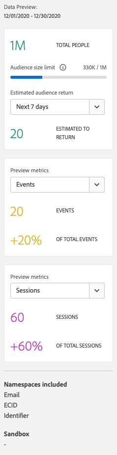

# Skapa och publicera målgrupper

I det här avsnittet beskrivs hur du skapar och publicerar målgrupper som identifieras i Customer Journey Analytics till [kundprofilen i realtid](https://experienceleague.adobe.com/docs/experience-platform/profile/home.html?lang=sv) i Adobe Experience Platform för kundanpassning och personalisering.

Läs den här [översikten](/help/components/audiences/audiences-overview.md) om du vill bekanta dig med konceptet Customer Journey Analytics målgrupper.

## Skapa och publicera en målgrupp {#create}

1. Gör något av följande för att börja skapa och publicera en målgrupp:

   | Skapandemetod | Information |
   | --- | --- |
   | Från huvudmenyn **[!UICONTROL Components]>[!UICONTROL Audiences]** | Sidan Audiences Manager öppnas. Klicka på **[!UICONTROL Create audience]** så öppnas [!UICONTROL Audience builder]. |
   | Från en friformstabell | Högerklicka på ett objekt i en friformstabell och välj **[!UICONTROL Create audience from selection]**. Om du använder den här metoden fylls filtret i automatiskt med den dimension eller dimensionspost som du valde i tabellen. |
   | Från gränssnittet för att skapa/redigera filter | Markera rutan **[!UICONTROL Create an audience from this filter]**. Om du använder den här metoden fylls filtret i automatiskt. |

   {style="table-layout:auto"}

   <!-- add beneath the Freeform table row above: | From within a Journey canvas visualization | Right-click a node in a Journey canvas visualization and select **[!UICONTROL Create audience]**. Using this method pre-populates the filter with the dimension or dimension item you selected in the table. | -->

1. Bygg publiken.

   Konfigurera de här inställningarna innan du kan publicera målgruppen.

   

   | Inställning | Beskrivning |
   | --- | --- |
   | [!UICONTROL Name] | Namnet på publiken. |
   | [!UICONTROL Tags] | Alla taggar som du vill ska tilldelas till målgruppen för organisatoriska ändamål. Du kan använda en befintlig tagg eller ange en ny. |
   | [!UICONTROL Description] | Lägg till en bra beskrivning av målgruppen för att skilja den från andra. |
   | [!UICONTROL Refresh frequency] | Hur ofta du vill uppdatera publiken.<ul><li>Du kan välja att skapa en enda målgrupp (standard) som inte behöver uppdateras. Detta kan till exempel vara användbart för specifika engångskampanjer.</li><li>Du kan välja andra uppdateringsintervall. För 4-timmars uppdateringsfrekvensen finns det en gräns på 75 till 150 målgrupper som uppdateras beroende på ditt Customer Journey Analytics-berättigande.</li></ul> |
   | Utgångsdatum | När publiken slutar uppdatera. Standardvärdet är 1 år från skapandedatumet. Utgångna målgrupper behandlas på samma sätt som schemalagda rapporter som förfaller - administratören får ett e-postmeddelande en månad innan målgruppen förfaller. |
   | Uppdatera uppslagsfönstret | Anger hur långt tillbaka i datafönstret du vill gå när du skapar den här målgruppen. Max 90 dagar. |
   | [!UICONTROL One-time date range] | Datumintervall när du vill att en engångspublik ska publiceras. |
   | [!UICONTROL Filter] | Filter är huvudindata för publiken. Du kan lägga till upp till 20 filter. Dessa filter kan kopplas till operatorerna `And` eller `Or`. |
   | [!UICONTROL View sample IDs] | Ett exempel på ID:n i den här målgruppen. Använd sökfältet för att söka efter exempel-ID:n. |

   {style="table-layout:auto"}

1. Tolka förhandsgranskningen av data.

   Publiken förhandsvisas i den högra listen. Här kan ni göra en sammanfattande analys av den målgrupp ni har skapat.

   

   | Förhandsvisningsinställning | Beskrivning |
   | --- | --- |
   | [!UICONTROL Data preview]-fönstret | Datumintervallet för målgruppen. |
   | [!UICONTROL Total people] | Ett summerat antal av det totala antalet personer i den här publiken. Den kan gå så högt som 20 miljoner människor. Om er målgrupp överstiger 20 miljoner människor måste ni minska målgruppens storlek innan ni kan publicera den. |
   | [!UICONTROL Audience size limit] | Visar hur långt från gränsen på 20 miljoner som den här målgruppen är. |
   | [!UICONTROL Estimated audience return] | Den här inställningen är användbar för återmarknadsföring av kunder i den här målgruppen som kommer tillbaka till din webbplats, mobilapp eller någon annan kanal (med andra ord som visas i den här datauppsättningen igen). 
Här kan du välja tidsram (nästa 7 dag, nästa 2 veckor, nästa månad) för det uppskattade antalet kunder som kan komma att returnera. |
   | [!UICONTROL Estimated to return] | Numret ger ett uppskattat antal återkommande kunder under den tidsperiod som du valde i listrutan. Vi tittar på den historiska bortfallsfrekvensen för den här publiken för att förutse detta antal. |
   | [!UICONTROL Preview metrics] | Med den här inställningen kan du titta på specifika mätvärden för att se om den här målgruppen bidrar med ett oproportionerligt belopp till det här mätvärdet, till exempel [!UICONTROL Revenue] eller [!UICONTROL Average time on site]. Det ger dig det sammanlagda antalet mätvärden, liksom procentandelen av det totala antalet. Du kan välja alla mätvärden som är tillgängliga i datavyn. |
   | [!UICONTROL Namespaces included] | De specifika namnutrymmen som är associerade med personerna i din publik. Exempel är ECID, CRM-ID, e-postadresser osv. |
   | [!UICONTROL Sandbox] | Den [Experience Platform-sandlåda](https://experienceleague.adobe.com/docs/experience-platform/sandbox/home.html?lang=sv) som den här publiken finns i. När du publicerar den här målgruppen på Platform kan du bara arbeta med den inom gränserna för den här sandlådan. |

   {style="table-layout:auto"}

1. Kontrollera målgruppskonfigurationen och klicka på **[!UICONTROL Publish]**.

   Om allt gick bra får du ett bekräftelsemeddelande om att publiken publicerades. Det tar bara några minuter för publiken att dyka upp i Experience Platform. (Även för målgrupper med miljontals medlemmar bör det ta mindre än fem minuter.)

1. Klicka på **[!UICONTROL View audience in AEP]** i samma meddelande så dirigeras du till [segmentgränssnittet](https://experienceleague.adobe.com/docs/experience-platform/segmentation/ui/overview.html) i Adobe Experience Platform. Mer information finns nedan.

## Vad händer när en publik har skapats och publicerats? {#after-audience-created}

När du har skapat och publicerat en målgrupp i Customer Journey Analytics är målgruppen tillgänglig i Experience Platform. Ett Adobe Experience Platform-direktuppspelningssegment skapas endast om din organisation är inställd för direktuppspelningssegmentering.

* Publiken i Platform har samma namn/beskrivning som Customer Journey Analytics-publiken, men namnet läggs till Customer Journey Analytics som målgrupps-ID för att säkerställa att det är unikt.
* Alla ändringar av publikens namn eller beskrivning i Customer Journey Analytics återspeglas i Platform.
* Om en målgrupp tas bort i Customer Journey Analytics är målgruppen fortfarande tillgänglig i Platform.

## Svarstidsfrågor {#latency}

Vid flera tillfällen före, under och efter publikationen kan fördröjningar uppstå. Här är en översikt över möjliga latenser.

| # | Svarstid | Varaktighet för fördröjning |
| --- | --- | --- |
| Visas inte | Källanslutning för Adobe Analytics till Analytics (A4T) | Upp till 30 minuter |
| 1 | Intag av data i datasjön (från Analytics-källkopplingen eller andra källor) | Upp till 90 minuter |
| 2 | Intag av data från Experience Platform Data Lake till Customer Journey Analytics | Upp till 90 minuter |
| 3 | Målgruppspublicering till kundprofil i realtid, inklusive automatisk generering av strömningssegmentet, så att segmentet kan vara klart att ta emot data. | Några sekunder |
| 4 | Uppdateringsfrekvens för målgrupper | <ul><li>Engångsuppdatering (fördröjning på mindre än 5 minuter)</li><li>Uppdatera var fjärde timme, varje dag, varje vecka, varje månad (fördröjningen går hand i hand med uppdateringsfrekvensen) |
| 5 | Skapa mål i Adobe Experience Platform: Aktivera det nya segmentet | 1-2 timmar |

{style="table-layout:auto"}

## Använda Customer Journey Analytics-målgrupper i Experience Platform {#audiences-aep}

Customer Journey Analytics tar alla namnområdes- och ID-kombinationer från den publicerade målgruppen och strömmar dem till kundprofilen i realtid (RTCP). Customer Journey Analytics skickar målgruppen till Experience Platform med den primära identitetsuppsättningen, enligt vad som valdes som [!UICONTROL Person ID] när anslutningen konfigurerades.

RTCP undersöker sedan varje namnutrymmes-/ID-kombination och söker efter en profil som det kan vara en del av. En profil är i princip ett kluster med länkade namnutrymmen, ID:n och enheter. Om en profil hittas läggs namnutrymmet och ID:t till i de andra ID:n i den här profilen som ett segmentmedlemsattribut. <user@adobe.com> kan till exempel riktas mot alla enheter och kanaler. Om ingen profil hittas skapas en ny.

Så här visar du Customer Journey Analytics-målgrupper i Platform:

>[!AVAILABILITY]
>
>De funktioner som beskrivs i följande steg är i den begränsade testfasen av releasen och är kanske inte tillgängliga än i din miljö. Om de här stegen inte matchar det du ser i din miljö ska du i stället göra så här: Gå till [!UICONTROL **Segment**] > [!UICONTROL **Skapa segment**] > fliken [!UICONTROL **Publiker**] > [!UICONTROL **CJA-målgrupper**].
>
>Den här anteckningen tas bort när funktionen är allmänt tillgänglig. Mer information om Customer Journey Analytics finns i [funktionsreleaser för Customer Journey Analytics](/help/release-notes/releases.md).

1. Expandera [!UICONTROL **Kund**] i den vänstra listen och välj sedan [!UICONTROL **Publiker**]. <!-- is there a folder called "Customer Journey Analytics? -->

1. Välj fliken [!UICONTROL **Bläddra**].

   

1. Gör något av följande för att hitta den publik du har publicerat från Customer Journey Analytics:

   * Sortera tabellen efter kolumnen [!UICONTROL **Ursprung**] för att visa målgrupper som visar [!UICONTROL **Customer Journey Analytics**] som ursprung.

   * Markera filterikonen.

   * Använd sökfältet.

Mer information om hur du använder publiker i plattformen finns i avsnittet [Publiker](https://experienceleague.adobe.com/docs/experience-platform/segmentation/ui/segment-builder.html?lang=en#audiences) i [Användargränssnittshandboken för segmentbyggaren](https://experienceleague.adobe.com/docs/experience-platform/segmentation/ui/segment-builder.html) i Experience Platform-dokumentationen.

## Vanliga frågor {#faq}

Frågor och svar om publikens publicering.

+++**Vad händer om en användare inte längre är medlem i en målgrupp i Customer Journey Analytics?**

I det här fallet skickas en exit-händelse till Experience Platform från Customer Journey Analytics.

+++

+++**Vad händer om du tar bort en målgrupp i Customer Journey Analytics?**

När en Customer Journey Analytics-publik tas bort visas den inte längre i användargränssnittet för Experience Platform. Inga profiler som är kopplade till den målgruppen tas emellertid bort i Platform.

+++

+++**Om det inte finns någon motsvarande profil i RTCDP, kommer en ny profil att skapas?**

Ja, det kommer det.

+++

+++**Skickar Customer Journey Analytics målgruppsdata som pipeline-händelser eller som en platt fil som också skickas till Data Lake?**

Customer Journey Analytics strömmar data till RTCP via rörledning, och dessa data samlas också in i en systemdatauppsättning i datasjön.

+++

+++**Vilka identiteter skickar Customer Journey Analytics över?**

Vilka identitets-/namnområdespar som angavs i [anslutningsinställningen](https://experienceleague.adobe.com/docs/analytics-platform/using/cja-connections/create-connection.html#create-connection). Detta är i synnerhet det steg då en användare väljer det fält som han eller hon vill använda som sitt &quot;person-ID&quot;.

+++

+++**Vilket ID har valts som primär identitet?**

Se ovan. Vi skickar bara en identitet per Customer Journey Analytics&quot;person&quot;.

+++

+++**Bearbetar RTCP även Customer Journey Analytics-meddelanden? Kan Customer Journey Analytics lägga till identiteter i ett profilidentitetsdiagram genom målgruppsdelning?**

Nej. Vi skickar bara en identitet per person, så det finns inga diagramkanter som RTCP kan använda.

+++

+++**Vilken tid på dygnet, varje vecka och varje månad uppdateras? Vilken veckodag uppdateras varje vecka?**

Tidpunkten för uppdateringen baseras på när den ursprungliga målgruppen publicerades och fäster vid den tidpunkten på dagen (och dagen i veckan eller månaden).

+++

+++**Kan varje dag, vecka och månad för uppdateringen konfigureras av användare?**

Nej, de kan inte konfigureras av användare.

+++

## Nästa steg

* Om du vill hantera den här målgruppen går du till [hanteringsgränssnittet](/help/components/audiences/manage.md).
