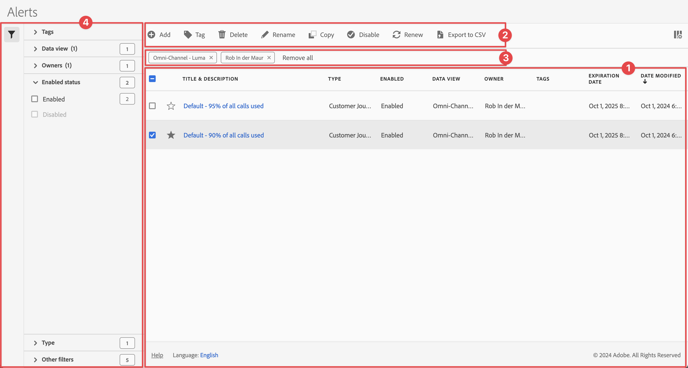

# Hantera aviseringar

Du kan filtrera, tagga, ta bort, byta namn på, kopiera, aktivera, inaktivera förnyelse och exportera aviseringar från ett centralt [!UICONTROL Alerts]-hanteringsgränssnitt. Så här hanterar du aviseringar:

* Välj **[!UICONTROL Components]** i huvudgränssnittet och välj sedan **[!UICONTROL Alerts]**.

Varningshanteraren är strukturerad som [Segmenthanteraren](/help/components/segments/seg-manage.md) och [hanteraren för beräknade värden](/help/components/calc-metrics/cm-workflow/cm-manager.md).

## Varningshanteraren

Varningshanteraren har följande gränssnittselement:

### Varningslista

Aviseringslistan ➊ visar alla aviseringar som du äger, aviseringar som har omfattats av alla dina projekt och aviseringar som har delats med dig. Listan innehåller följande kolumner:

| Kolumn | Beskrivning |
|---|---|
|  | Välj om du vill prioritera  eller  en varning. |
| **[!UICONTROL Title and description]** | Om du vill redigera varningen markerar du titellänken, som öppnar [Varningsverktyget](alert-builder.md#alert-builder). |
| **[!UICONTROL Type]** | Visar om aviseringen är en Customer Journey Analytics-datavarning eller en varning om användning av serversamtal. |
| **[!UICONTROL Enabled]** | Anger om aviseringen är aktiverad eller inaktiverad. |
| **[!UICONTROL Data view]** | De datavyer som den här varningen gäller för. |
| **[!UICONTROL Owner]** | Varningens ägare. Som icke-administratör visas endast aviseringar som du äger eller aviseringar som delas med dig. |
| **[!UICONTROL Tags]** | Taggarna för den här varningen. |
| **[!UICONTROL Expiration Date]** | Det datum och den tidpunkt då aviseringen förfaller. |
| **[!UICONTROL Date modified]** | Datum och tid då aviseringen senast ändrades. |

<!-- When "Last used" column is added, add this information as the description: Shows the date when the alert was last used. 
This information can help you determine whether a component is valuable to users in your organization, where it is used, and if it needs to be deleted or modified.

Consider the following when viewing this column:
<ul><li>This information does not include usage from the API, Report Builder, or Data Warehouse.</li><li>For some components, this column might not contain data if the component was last used prior to September 2023.</li></ul> -->

Använd  för att ange vilka kolumner du vill visa.

### Åtgärdsfält

Du kan använda åtgärdsfältet ➋ för att utföra åtgärder för aviseringar. Åtgärdsfältet innehåller följande åtgärder:

| Ikon | Åtgärd | Beskrivning |
|:---:|---|---|
|  | **[!UICONTROL Add]** | Lägg till ytterligare en avisering med [Varningsverktyget](alert-builder.md#alert-builder). |
|  | [!UICONTROL *Sök efter titel*] | Om ingen varning är markerad i listan söker du efter aviseringar med det här sökfältet. |
|  | **[!UICONTROL Tag]** | Tagga de markerade varningarna. I dialogrutan **[!UICONTROL Tag Alert]** markerar eller avmarkerar du taggarna för de markerade aviseringarna. Välj **[!UICONTROL Save]** om du vill spara taggarna för de valda aviseringarna. |
|  | **[!UICONTROL Delete]** | Ta bort de markerade aviseringarna. Du uppmanas att bekräfta åtgärden. |
|  | **[!UICONTROL Rename]** | Byt namn på en enskild markerad varning. Om du väljer det här alternativet kan du byta namn på aviseringen. |
|  | **[!UICONTROL Copy]** | Kopiera den markerade varningen. Nya aviseringar skapas med samma namn och suffix `(Copy)`. |
|  | **[!UICONTROL Enable]** eller **[!UICONTROL Disable]** | Aktivera eller inaktivera de markerade aviseringarna. |
|  | **[!UICONTROL Renew]** | Förnyar aviseringens förfallodatum. Utgångsdatumet är ett år från den dag du väljer det här alternativet, oavsett det ursprungliga förfallodatumet. |
|  | **[!UICONTROL Export to CSV]** | Exportera aviseringarna till en `Alerts List.csv`-fil. |

### Aktivt filterfält

Filterfältet ➌ visar de aktiva filter som använts från filterpanelen till listan med varningar (om sådana finns). Du kan snabbt ta bort ett filter med . Om fler än ett filter har angetts kan du ta bort alla filter med **[!UICONTROL Remove all]**.

### Panelen Filter

Du kan filtrera listan med varningar med hjälp av den vänstra panelen  **[!UICONTROL Filter]** ➍ . Filterpanelen visar typ av filter och antalet varningar som följer det specifika filtret.

1. Välj  för att öppna panelen Filter. Om du behöver mer utrymme för varningslistan kan du välja  en gång till för att stänga panelen.
1. Välj filter från något av de tillgängliga filteravsnitten.

#### Filteravsnitt för taggar

{{tagfiltersection}}

#### Filteravsnitt för datavy

{{dataviewfiltersection}}

#### Ägarfilteravsnitt

{{ownerfiltersection}}

#### Aktiverat statusfilteravsnitt

{{enabledstatusfiltersection}}

#### Textfilteravsnitt

{{typefiltersection}}

#### Andra filteravsnitt

{{otherfiltersfiltersection}}

## Redigera aviseringar

Du kan redigera en varning

* Markera aviseringens titel i listan [[!UICONTROL Alert]](#alerts-list).

Du använder [varningsverktyget](alert-builder.md#alert-builder) för att redigera varningen.

## Felsöka en varning

När du felsöker ett problem med en varning ska du ange JID-numret (Job Instance ID) till Adobe Support. JID-numret finns längst ned i det varningsmeddelande du får.

