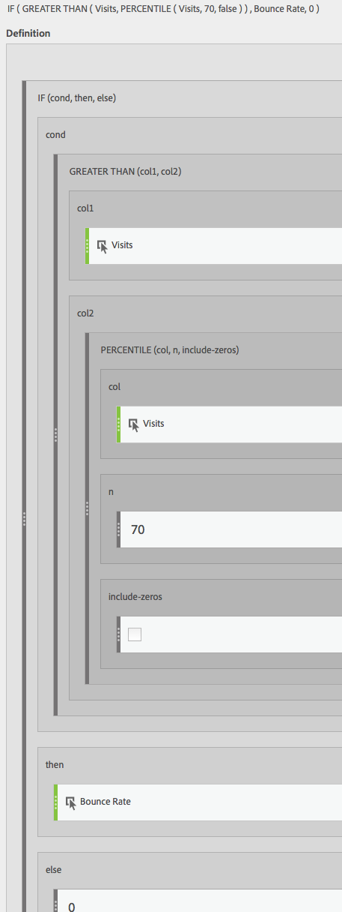

# Filtrerade och viktade mätvärden

Visar exempel på filtrerade och viktade mätvärden.

## Filtrerad studs-hastighet {#section_D42F2452E4464948934063EB6F2DAAB4}

Det här enkla filtrerade måttet visar endast avhoppsfrekvensen för de sidor som har fler än 100 besök:

Tänk på att den här formeln är beroende av ett konsekvent tidsintervall. Om du kör en rapport för en dag är alla sidor med fler än 20 besök värda att titta på. Om du kör det i en månad kanske du vill att filtret ska innehålla fler besök.

## Filtrerad studs-hastighet med procentig {#section_4F3E6D33A1FD438A932FA662B3510552}

Det här filtret visar studs-frekvensen för de 30 högsta procenten av sidorna, sorterade efter besök.

## Viktat mått {#section_F2D16B14569948289CF1310F9E6E3FC2}

Anta att du vill sortera efter studsfrekvens i allmänhet, men sidor med högre besök bör vara högre i listan. Du kan skapa en viktad studsfrekvens som ser ut så här:

