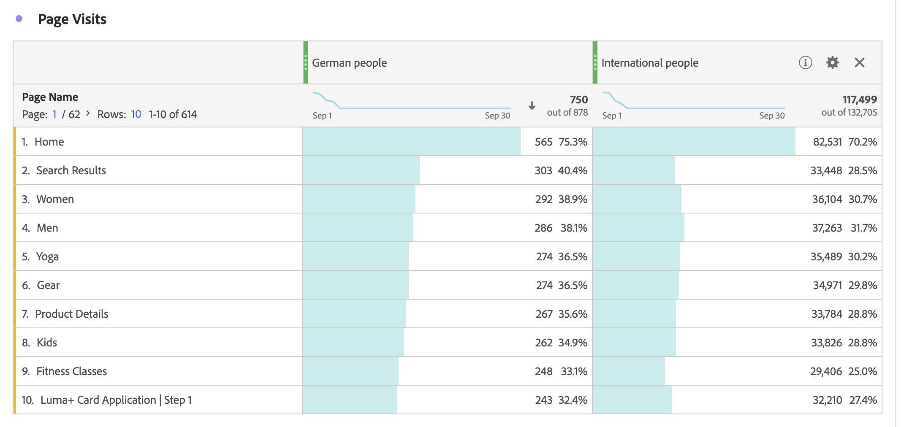

# Segmenterade mätvärden

I [verktyget för beräknade mätvärden](cm-build-metrics.md#definition-builder) kan du använda segment i måttdefinitionen. Det är praktiskt att använda segment om du vill använda mätvärden för en delmängd av dina data i analysen.

>[!NOTE]
>
>Segmentdefinitioner uppdateras via [segmentbyggaren](/help/components/segments/seg-builder.md). Om du ändrar ett segment uppdateras det automatiskt överallt där det används, inklusive om segmentet ingår i en beräknad måttdefinition.
>

Ni vill jämföra mätvärden för tyska människor som interagerar med ert varumärke med människor utanför Tyskland. Du kan alltså svara på frågor som:

1. Hur många tyska jämfört med internationella personer besöker dina mest [populära sidor](#popular-pages).
1. Hur många tyska jämfört med internationella personer på [totalt](#totals) har interagerat online med ditt varumärke den här månaden.
1. Vilka är de [procentandelarna](#percentages) tyskar och internationella personer som har besökt dina populära sidor?

Se avsnitten nedan för att illustrera hur segmenterade mätvärden kan hjälpa dig att svara på dessa frågor. Vid behov hänvisas till mer detaljerad dokumentation.

## Populära sidor

1. [Skapa ett beräknat mått](cm-workflow.md) från ett Workspace-projekt med namnet `German people`.
1. I [kalkylerade måttbyggare](cm-build-metrics.md) [skapar du ett segment ](/help/components/segments/seg-builder.md) med namnet `Germany` som använder fältet CRM-land från dina CRM-data för att avgöra var en person kommer ifrån.

   >[!TIP]
   >
   >I verktyget Beräknade mätvärden kan du skapa ett segment direkt med hjälp av panelen Komponenter.
   >   

   Ditt segment skulle kunna se ut som.

   

1. Använd segmentet för att uppdatera det beräknade måttet i verktyget Beräknade mått.

   

Upprepa stegen ovan för den internationella versionen av det beräknade måttet.

1. Skapa ett beräknat mått från ditt Workspace-projekt med namnet `International people`.
1. Skapa ett segment, med namnet `Not Germany`, som använder fältet CRM-land från dina CRM-data för att avgöra var en person kommer från i verktyget Beräknade mätvärden.

   Ditt segment ska se ut som.

   

1. Använd segmentet för att uppdatera det beräknade måttet i verktyget Beräknade mått.

   

1. Skapa ett projekt i Analysis Workspace där du tittar på sidor som besöktes av tyska och internationella personer.

   

## Summor

1. Skapa två nya beräknade värden baserade på totalsumman. Öppna varje segment som skapats tidigare, byt namn på segmentet, ange **[!UICONTROL Metric type]** för **[!UICONTROL People]** till **[!UICONTROL Grand Total]** och använd **[!UICONTROL Save As]** för att spara segmentet med det nya namnet. Exempel:

   

1. Lägg till en ny visualisering av Freeform-tabeller i ditt Workspace-projekt, som visar månadens totala sidor.

   

## Procenttal

1. Skapa två nya beräknade mätvärden som beräknar en procentandel av de beräknade mätvärden som du skapade tidigare.

   

1. Uppdatera ditt Workspace-projekt.

   

>[!BEGINSHADEBOX]

Se  [Använd ett segmenterat beräknat mätresultat som ett implementeringsfritt mätvärde](https://experienceleague.adobe.com/en/docs/analytics-learn/tutorials/components/calculated-metrics/calculated-metrics-segmented-metrics){target="_blank"} för en demonstrationsvideo.

{{videoaa}}

>[!ENDSHADEBOX]

