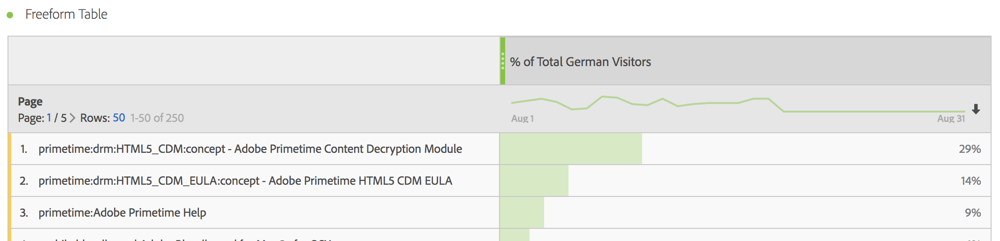

# Filtrerade mätvärden

I verktyget Beräknade mätvärden kan du använda filter i måttdefinitionen. Detta är praktiskt om du vill ta fram nya mätvärden som ska användas i din analys. Tänk på att filterdefinitioner kan uppdateras med hjälp av filterverktyget. Om ändringar görs uppdateras filtret automatiskt varhelst det används, inklusive om det ingår i en beräknad metrisk definition.

## Skapa ett filtrerat mått {#create}

Låt oss säga att du vill jämföra olika aspekter av ett&quot;tyska besökare&quot;-filter med ett&quot;Internationella besökare&quot;-filter. Du kan skapa mätvärden som ger dig insikter som:

* Hur fungerar innehållssökning jämfört med de två grupperna? (Ett annat exempel är: Hur är konverteringsgraden jämfört mellan de två filtren?)
* Hur många tyska personer surfar på vissa sidor jämfört med internationella personer som en procentandel av det totala antalet personer?
* Var är de största skillnaderna när det gäller vilket innehåll som nås av de olika filtren?

Bygg och spara ett mätvärde som kallas&quot;tyska besökare&quot; och ett mätvärde som kallas&quot;internationella besökare&quot;:

1. Skapa ett adhoc-filter i verktyget Beräknade mätvärden som kallas &quot;tyska besökare&quot;, där &quot;länder&quot; är lika med &quot;Tyskland&quot;. Dra dimensionen Länder till arbetsytan Definition och markera [!UICONTROL **Tyskland**] som värdet:

   

   >[!NOTE]
   >
   >Du kan även göra det här i dialogrutan [Filter Builder](/help/components/filters/create-filters.md)men vi har förenklat arbetsflödet genom att göra dimensionerna tillgängliga i verktyget för beräkning av mätvärden. &quot;Adhoc&quot; innebär att filtret inte är synligt i **[!UICONTROL Filters]** listan i den vänstra listen. Du kan emellertid göra den offentlig genom att hålla markören över ikonen&quot;i&quot; bredvid den och klicka på **[!UICONTROL Make public]**.

1. Dra filtret Tyskland till arbetsytan Definition och dra det unika besökarmåttet i den:

   

1. Välj [!UICONTROL **Spara**] för att spara det beräknade måttet.

1. Skapa ett adhoc-filter i verktyget Beräknade mätvärden, som kallas &quot;internationella besökare&quot;, där &quot;länder&quot; inte är lika med &quot;Tyskland&quot;.

   Dra dimensionen Länder till arbetsytan Definition och välj [!UICONTROL **Tyskland**] som värde, välj sedan [!UICONTROL **är inte lika med**] som -operatorn.

1. Dra det unika besökarmåttet i det.

1. Välj [!UICONTROL **Spara**] för att spara det beräknade måttet.

1. I Analysis Workspace drar du **[!UICONTROL Page]** Dimension till en frihandstabell och dra de två nya beräknade måtten intill varandra högst upp:

   

Här är en videoöversikt:

>[!VIDEO](https://video.tv.adobe.com/v/25407/?quality=12)

## Procent av totala mätvärden {#percent-total}

Du kan ta exemplet ovan ett steg längre genom att jämföra filtret med en total population. Det gör du genom att skapa två nya mätvärden, &quot;% av totalt antal tyska besökare&quot; och &quot;% av totalt antal internationella besökare&quot;:

1. Släpp filtret för tyska (eller internationella) besökare på arbetsytan.
1. Släpp ett annat filter för tyska (eller internationella) besökare nedan. Men den här gången klickar du på konfigurationsikonen (kugghjulsikonen) för att välja måtttypen &quot;Totalt&quot;. Formatet ska vara &quot;Procent&quot;. Operatorn ska delas med. Resultatet blir den här måttdefinitionen:

   

1. Använd följande mått i ditt projekt:

   
