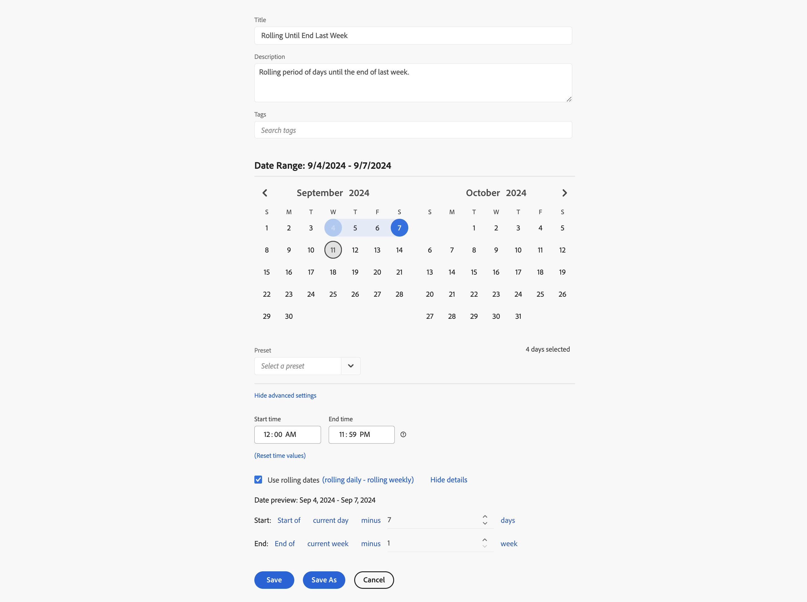

# Exempel på anpassade datumintervall

I den här artikeln finns fler exempel på anpassade datumintervall.

## De senaste två månaderna sedan

+++ Information

Du vill definiera ett anpassat datumintervall som definierar för två månader sedan. Du använder en av förinställningarna.

+++

## Rullande till slutet av sista veckan

+++ Information

Du vill definiera ett datumintervall som definierar perioden mellan den aktuella dagen för en vecka sedan och slutet av samma sista vecka. Exempel: om idag är onsdagen den 11 september 2024. Du vill ha ett datumintervall från onsdag 4 september 2024 till lördag 7 september 2024. September

+++

<!--
## Example: Use a 7-day rolling date range

You can create a date range that specifies a 7-day rolling window that ends one week ago:

Use *`rolling daily`*.

* The Start settings would be *`current day minus 6 days`*.

* The End settings would be *`current day minus 7 days`*.

This date range can be a component that you drag onto any freeform table.
-->