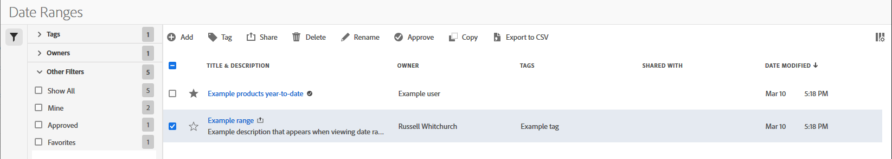

# Hantera datumintervall

Använd datumintervallhanteraren för att dela, byta namn på eller ta bort datumintervall. Så här når du datumhanteraren:

1. Logga in på [analytics.adobe.com](https://analytics.adobe.com) med inloggningsuppgifterna för ditt AdobeID.
1. Navigera till [!UICONTROL Components] > [!UICONTROL Date Ranges].

## Gränssnitt

Datumintervallhanteraren innehåller följande alternativ:

* **Lägg till**: Skapa ett nytt datumintervall. Se [skapa ett datumintervall](create.md) för mer information.
* **Sök efter titel**: Sök efter ett datumintervall efter titel. Resultaten filtreras baserat på den text som anges här.
* **Filter**: Filtrera datumintervall med den vänstra kolumnen. Du kan filtrera efter anpassad tagg, ägare, skapad av dig, dina favoriter, godkänd eller delad med dig. Du kan också söka efter önskade filter.
* **Favorit**: Klicka på  -ikonen bredvid ett datumintervall för att lägga till det i dina favoriter.
* **Anpassa kolumner**: Klicka på  om du vill visa eller dölja kolumner i datumintervallhanteraren.

Klicka i kryssrutan bredvid ett eller flera datumintervall om du vill se fler alternativ.

* **Tagg**: Använd en tagg för alla markerade datumintervall. Med taggar kan du ordna datumintervall och filtrera dem med den vänstra kolumnen.
* **Dela**: Dela ett datumintervall med andra Experience Cloud-användare. Om du är produktadministratör kan du även dela filer till hela organisationen eller grupper. Datumintervall som delas med andra användare i organisationen inkluderar en  -ikonen bredvid titeln.
* **Ta bort**: Ta bort markerade datumintervall permanent.
* **Byt namn**: Om ett enda datumintervall är markerat kan du ändra titeln.
* **Godkänn**: Om du är produktadministratör kan du lägga till en godkännandestämpel i ett datumintervall. Godkända datumintervall talar om för användarna i organisationen att de är&quot;officiella&quot; och skiljer dem från datumintervall som andra användare i organisationen har skapat. Godkända datumintervall innehåller en  -ikonen bredvid titeln.
* **Ogodkänd**: Om du är produktadministratör och väljer ett datumintervall som redan har godkänts kan du avgodkänna det.
* **Kopiera**: Skapa en kopia av de markerade datumintervallen. Datumintervall för kopiering har lagts till `(Copy)` till slutet av titeln för det eller de nyligen kopierade datumintervallen.
* **Exportera till CSV**: Exporterar alla markerade datumintervall till en CSV-fil. Kolumner i den resulterande CSV-filen innehåller alla synliga kolumner i datumintervallhanteraren.
