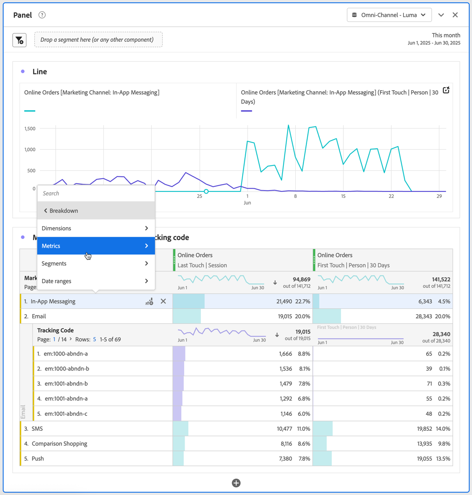
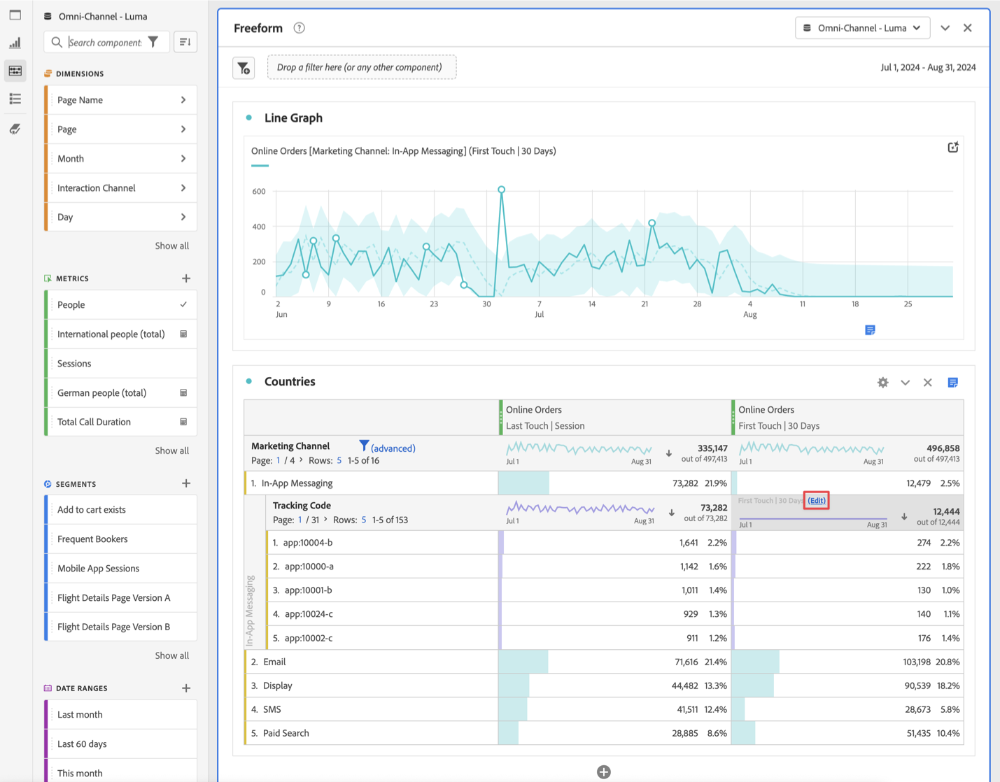

# Dela upp dimensioner

Ni kan dela upp era data i Analysis Workspace på ett obegränsat sätt för just era behov; skapa frågor med hjälp av relevanta mått, dimensioner, segment, tidslinjer och andra analysvärden.

1. I en [friformstabell](/help/analysis-workspace/visualizations/freeform-table/freeform-table.md) väljer du **[!UICONTROL Breakdown]**  på snabbmenyn för en eller flera markerade rader.

   

1. På undermenyn väljer du **[!UICONTROL Dimensions]**, **[!UICONTROL Metrics]**, **[!UICONTROL Segments]** eller **[!UICONTROL Date ranges]** och sedan ett alternativ. Eller sök bara efter en komponent i fältet **[!UICONTROL *Sök *]**.

Du kan dela upp mätvärden efter dimensionsobjekt eller målgruppssegment under valda tidsperioder. Du kan även gå ned mer i detalj.

>[!NOTE]
>
>Antalet uppdelningar i tabellen är begränsat till 400. Den här gränsen ökar vid export av uppdelningar.

## Uppdelning efter position

Som standard är uppdelningar fasta på statiska radobjekt. Tänk dig att du har delat upp de tre viktigaste sidobjekten (startsida, sökresultat, utcheckning) efter marknadsföringskanal. Sedan lämnar du projektet och återvänder två veckor senare. När du öppnar projektet igen har de tre översta sidorna ändrats, och nu är startsidan, sökresultaten och utcheckningen de 4-6 översta sidorna istället. Som standard visas dina Marketing Channel-indelningar fortfarande under Hemsida, Sökresultat och Utcheckning, även om de nu finns på raderna 4-6.

**Uppdelning efter position** delar däremot alltid upp de tre översta objekten, oavsett vilka de är. När du öppnar ditt projekt på nytt är Marketing Channel-uppdelningarna kopplade till de tre översta sidorna i tabellen. Och inte till startsidan, sökresultat och utcheckning, som nu finns på raderna 4-6. Se [Radinställningar](/help/analysis-workspace/visualizations/freeform-table/column-row-settings/table-settings.md) om hur du konfigurerar den här inställningen.

## Tillämpa attribueringsmodeller på uppdelningar

Alla uppdelningar i en tabell kan också ha en attribueringsmodell. Den här attribueringsmodellen kan vara densamma eller en annan än den överordnade kolumnen. Du kan till exempel analysera linjära beställningar i dimensionen marknadsföringskanaler, men använda U-formade beställningar på specifika spårningskoder i en kanal. Om du vill redigera attribueringsmodellen som används för en nedbrytning håller du pekaren över uppdelningsmodellen och väljer **[!UICONTROL Edit]**.

Detta är det förväntade beteendet när du tillämpar attribueringsmodeller på uppdelningar eller redigerar dem:

* Om du tillämpar en attribuering när det inte finns några andra attribut gäller attribueringen för hela kolumnträdet.

* Om du lägger till en uppdelning efter att en attribuering har tillämpats, används standardvärdet för den angivna uppdelning som lades till (om den dimensionen har ett standardvärde). I annat fall används den uppdelning som görs från den överordnade kolumnen. Vissa dimensioner har en standardallokering. Tidsdimensioner och Referens använder till exempel samma beröring. Produktdimensionen använder Senaste beröring. Andra dimensioner saknar standardvärde och använder den överordnade kolumnallokeringen.

* Om det redan finns attribut i kolumnträdet påverkas bara den du redigerar om du ändrar attributet.

>[!BEGINSHADEBOX]

Se  [Dimension i Analysis Workspace](https://experienceleague.adobe.com/sv/docs/analytics-learn/tutorials/analysis-workspace/dimensions/adding-dimensions-and-metrics-to-your-project-in-analysis-workspace){target="_blank"} för en demonstrationsvideo.

{{videoaa}}

>[!ENDSHADEBOX]

>[!BEGINSHADEBOX]

Se  [Dimension-uppdelningar](https://video.tv.adobe.com/v/23969?quality=12&learn=on){target="_blank"} för en demonstrationsvideo.

{{videoaa}}

>[!ENDSHADEBOX]

>[!BEGINSHADEBOX]

Se  [Lägga till mått och mätvärden](https://experienceleague.adobe.com/sv/docs/analytics-learn/tutorials/analysis-workspace/dimensions/adding-dimensions-and-metrics-to-your-project-in-analysis-workspace){target="_blank"} för en demonstrationsvideo.

{{videoaa}}

>[!ENDSHADEBOX]

>[!BEGINSHADEBOX]

Se  [Arbeta med dimensioner i en frihandstabell](https://experienceleague.adobe.com/sv/docs/analytics-learn/tutorials/analysis-workspace/building-freeform-tables/working-with-dimensions-in-a-freeform-table){target="_blank"} för en demonstrationsvideo.

{{videoaa}}

>[!ENDSHADEBOX]

>[!BEGINSHADEBOX]

Se  [Dimension-nedbrytning efter position](https://video.tv.adobe.com/v/24033){target="_blank"} för en demonstrationsvideo.

{{videoaa}}

>[!ENDSHADEBOX]

