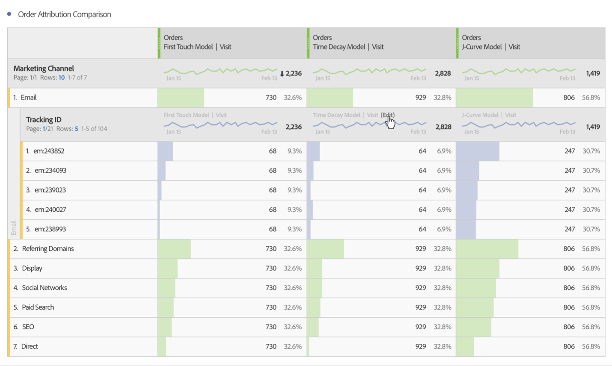

# Dela upp dimensioner

>[!NOTE]
>
>Du visar dokumentationen för Analysis Workspace i Customer Journey Analytics. Dess funktioner skiljer sig något från [Analysis Workspace i traditionell Adobe Analytics](https://docs.adobe.com/content/help/en/analytics/analyze/analysis-workspace/home.html). [Läs mer …](/help/getting-started/cja-aa.md)

Dela upp dimensioner och dimensionsobjekt i Analysis Workspace.

Analysera data på obegränsade sätt efter just era behov och bygg frågor med hjälp av relevanta mätvärden, mått, segment, tidslinjer och andra analysvärden.

1. [Skapa ett ](/help/analysis-workspace/home.md) projekt med en datatabell.
1. Högerklicka på ett radobjekt i datatabellen och välj **[!UICONTROL Breakdown]** > *`<item>`*.

   

   Du kan dela upp mätvärden efter dimensionsobjekt eller målgruppssegment under valda tidsperioder. Du kan även gå ned mer i detalj.

   >[!NOTE]
   >
   >Antalet uppdelningar i tabellen är begränsat till 200. Den här gränsen kommer att öka för export av uppdelningar.

**Video: Dimensioner i Analysis Workspace**

>[!VIDEO](https://video.tv.adobe.com/v/23971)

**Video: Dimensioner**

>[!VIDEO](https://video.tv.adobe.com/v/23969)

## Tillämpa attribueringsmodeller på uppdelningar

Alla uppdelningar i en tabell kan också ha en attribueringsmodell. Den här attribueringsmodellen kan vara densamma eller en annan än den överordnade kolumnen. Du kan till exempel analysera linjära beställningar i dimensionen marknadsföringskanaler, men använda U-formade beställningar på specifika spårningskoder i en kanal. Om du vill redigera attribueringsmodellen som används för en uppdelning håller du pekaren över nedbrytningsmodellen och klickar på **[!UICONTROL Edit]**:

