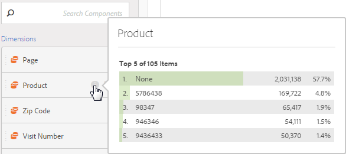

# Förhandsvisa dimensioner

>[!NOTE]
>
>Du visar dokumentationen för Analysis Workspace i Customer Journey Analytics. Dess funktioner skiljer sig något från [Analysis Workspace i traditionell Adobe Analytics](https://experienceleague.adobe.com/docs/analytics/analyze/analysis-workspace/home.html). [Läs mer …](/help/getting-started/cja-aa.md)

Håll pekaren över informationsikonen (i) bredvid en dimension. Detta visar de 5 högsta värdena för icke-tidsdimensioner (och 15 för tidsdimensioner). Vi brukade hålla dessa värden statiska (dvs. de 5 valda värdena ändrades aldrig).

Som standard visas nu dynamiska värden i stället för statiska, med möjlighet att omvandla dem till statiska värden. Andra saker att notera:

* När data uppdateras uppdateras kolumnerna för dynamiska mått så att de aktuella 5/15 måttobjekten visas.
* En kolumn för dynamiska mått som kopieras eller flyttas blir statisk.
* När du håller markören över en statisk måttkolumn visas en låsikon, som anger att måttet är statiskt.

## Visa dimensionsobjekt

När du håller muspekaren över ett mått och klickar på den grå högerpilen bredvid det visas en lista med dimensionsobjekt. Alla listor med dimensionsobjekt visar vanligtvis de översta artiklarna de senaste 30 dagarna.

Om du bläddrar nedåt i listan visas ett **[!UICONTROL Show Top Items From Last 6 Months]**. Klicka på det här alternativet om du vill visa de översta dimensionsobjekten från de senaste 180 dagarna.
