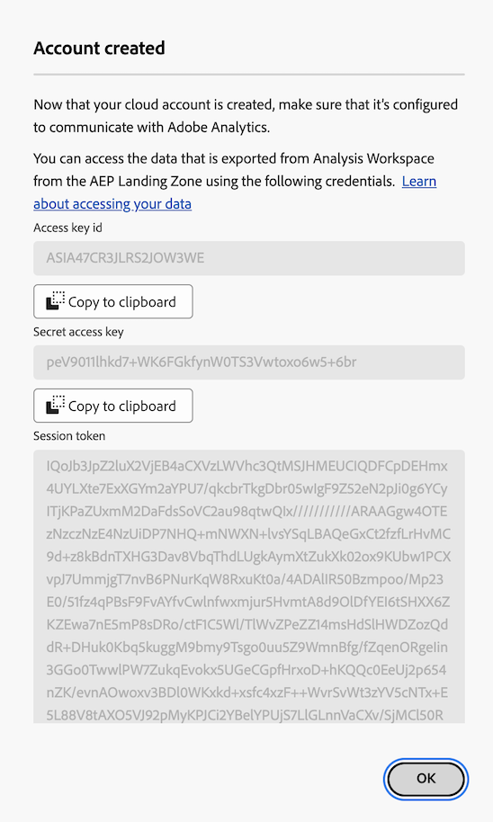

# Konfigurera molnexportkonton

Innan du kan exportera Customer Journey Analytics-rapporter till ett molnmål (antingen från Analysis Workspace, enligt beskrivningen i [Exportera Customer Journey Analytics-rapporter till molnet](/help/analysis-workspace/export/export-cloud.md) eller från Report Builder, enligt beskrivningen i [Exportera rapporter från Report Builder](/help/report-builder/report-builder-export.md)), måste du lägga till och konfigurera målet dit du vill att data ska skickas.

Den här processen består av att lägga till och konfigurera kontot (t.ex. Amazon S3, Google Cloud Platform o.s.v.) enligt beskrivningen i den här artikeln, och sedan lägga till och konfigurera platsen inom det kontot (t.ex. en mapp inom kontot) enligt beskrivningen i [Konfigurera molnexportplatser](/help/components/exports/cloud-export-locations.md).

Mer information om hur du hanterar befintliga konton, inklusive visning, redigering och borttagning av konton, finns i [Hantera platser och konton för molnexport](/help/components/exports/manage-export-locations.md).

## Börja skapa ett molnexportkonto

1. Kontrollera att du uppfyller [minimikraven](/help/analysis-workspace/export/export-cloud.md#minimum-requirements) för att exportera rapporter till molnet.
1. I Customer Journey Analytics väljer du [!UICONTROL **Komponenter**] > [!UICONTROL **Exportera**].
1. På sidan [!UICONTROL Exports] väljer du fliken [!UICONTROL **Platskonton**].

   

1. Välj [!UICONTROL **Lägg till konto**].

   Dialogrutan Lägg till konto visas.

1. Ange ett namn för platskontot i fältet [!UICONTROL **Platskontonamn**]. Det här namnet visas när du skapar en plats.

1. I fältet [!UICONTROL **Beskrivning av platskonto**] anger du en kort beskrivning av kontot för att skilja det från andra konton av samma kontotyp.

1. Aktivera alternativet [!UICONTROL **Gör kontot tillgängligt för alla användare i organisationen**] om du vill tillåta att andra användare i organisationen använder kontot.

   Tänk på följande när du delar konton:

   * Konton som du delar kan inte tas bort.

   * Delade konton kan bara redigeras av kontoägaren.

   * Vem som helst kan skapa en plats för det delade kontot.

1. I fältet [!UICONTROL **Kontotyp**] väljer du vilken typ av molnkonto du exporterar till. De tillgängliga kontotyperna är Amazon S3 Role ARN, Google Cloud Platform, Azure SAS, Azure RBAC, Snowflake och AEP Data Landing Zone.

1. Fortsätt med det avsnitt nedan som motsvarar den [!UICONTROL **kontotyp**] du valde.

   * [AEP Data Landing Zone](#aep-data-landing-zone)

   * [Amazon S3 Role ARN](#amazon-s3-role-arn)

   * [Google Cloud Platform](#google-cloud-platform)

   * [Azure SAS](#azure-sas)

   * [Azure RBAC](#azure-rbac)

   * [Snowflake](#snowflake)

### AEP Data Landing Zone

>[!IMPORTANT]
>
>Tänk på följande när du använder AEP Data Landing Zone för ditt exportkonto:
>
> * När du exporterar Customer Journey Analytics-rapporter till Adobe Experience Platform Data Landing Zone måste du hämta data inom 7 dagar och sedan ta bort dem från AEP Data Landing Zone. Efter 7 dagar tas data automatiskt bort från AEP Data Landing Zone.
> * AEP Data Landing Zone använder antingen Azure eller AWS-lagring. Om din organisation använder ett inloggningsföretag som är konfigurerat att använda Azure, använder AEP Data Landing Zone Azure. Om inloggningsföretaget är konfigurerat att använda AWS använder AEP Data Landing Zone AWS.
>

1. Börja skapa ett molnexportkonto på något av följande sätt:

   * Från exportsidan enligt beskrivningen ovan, i [Börja skapa ett molnexportkonto](#begin-creating-a-cloud-export-account)

   * När [fullständiga tabeller exporteras från Analysis Workspace](/help/analysis-workspace/export/export-cloud.md#export-full-tables-from-analysis-workspace)

1. När du har valt **[!UICONTROL AEP Data Landing Zone]** i fältet **[!UICONTROL Account type]** väljer du [!UICONTROL **Spara**].

   Någon av följande dialogrutor visas, beroende på om din AEP Data Landing Zone är konfigurerad att använda Azure- eller AWS-lagring:

   * **Azure-lagring:**

     Dialogrutan [!UICONTROL **Exportera konto som skapats**] visas.

     

   * **AWS-lagring:**

     >[!AVAILABILITY]
     >
     >Detta avsnitt gäller implementeringar av Experience Platform som körs på Amazon Web Services (AWS). Experience Platform som körs på AWS är för närvarande tillgängligt för ett begränsat antal kunder. Mer information om den Experience Platform-infrastruktur som stöds finns i [Experience Platform översikt över flera moln](https://experienceleague.adobe.com/en/docs/experience-platform/landing/multi-cloud).

     Dialogrutan [!UICONTROL **Konto skapat**] visas.

     

1. (Villkorligt) Om du använder Azure-lagring:

   1. Kopiera innehållet i fältet [!UICONTROL **SAS URI**] till Urklipp. Du använder den här SAS-URI:n för att komma åt data som exporteras från Analysis Workspace från AEP Data Landing Zone.

      Om det här fältet är tomt måste du ha behörighet att komma åt Adobe Experience Platform.

   1. Konfigurera din Data Landing Zone-behållare i Adobe Experience Platform så att den använder den SAS URI som du kopierade.

      >[!NOTE]
      >
      >När du använder ett AEP Data Landing Zone-konto som är baserat på Azure är det enklaste sättet att komma åt rapporter som du exporterar till AEP Data Landing Zone genom att använda Azure Storage Explorer. I följande steg används den här metoden.

      1. Om du inte redan har det hämtar du [Microsoft Azure Storage Explorer](https://azure.microsoft.com/en-us/products/storage/storage-explorer/).

      1. Följ stegen som beskrivs i [Ansluta din Data Landing Zone-behållare till Azure Storage Explorer](https://experienceleague.adobe.com/docs/experience-platform/destinations/catalog/cloud-storage/data-landing-zone.html#connect-your-data-landing-zone-container-to-azure-storage-explorer) i Adobe Experience Platform-dokumentationen.

         Du kan hoppa över de uppgifter som beskrivs i avsnitten [Hämta autentiseringsuppgifterna för din Data Landing Zone](https://experienceleague.adobe.com/docs/experience-platform/destinations/catalog/cloud-storage/data-landing-zone.html#retrieve-dlz-credentials) och [Uppdatera autentiseringsuppgifter för Data Landing Zone](https://experienceleague.adobe.com/docs/experience-platform/destinations/catalog/cloud-storage/data-landing-zone.html#update-dlz-credentials) eftersom den URI som du kopierade innehåller dessa autentiseringsuppgifter.

      1. När du följer Adobe Experience Platform-dokumentationen och kommer till fältet [!UICONTROL **Plumbibehållare-SAS-URL**] klistrar du in den SAS-URI som du kopierade i steg 3.

         >[!NOTE]
         >
         >Du måste utföra den här åtgärden var 7:e dag eftersom SAS-URI:n går ut 7 dagar efter att den har skapats. Du kan skapa ett skript för att automatisera den här processen.

         

   1. Välj [!UICONTROL **Nästa**] > [!UICONTROL **Anslut**].

   1. I Customer Journey Analytics väljer du [!UICONTROL **OK**] i dialogrutan [!UICONTROL **Exportera konto som skapats**].

      

1. (Villkorligt) Om du använder AWS-lagring:

   1. Kopiera innehållet i följande fält till Urklipp (du använder den här informationen för att komma åt data som exporteras från Analysis Workspace från AEP Data Landing Zone):

      * [!UICONTROL **Åtkomstnyckel-ID**]

      * **[!UICONTROL Secret access key]**

      * **[!UICONTROL Session token]**

      * **[!UICONTROL Bucket name]**

      * **[!UICONTROL DLZ folder]**

      

   1. Välj [!UICONTROL **OK**].

1. Fortsätt med [Konfigurera molnexportplatser](/help/components/exports/cloud-export-locations.md).

### Amazon S3 Role ARN

1. Börja skapa ett molnexportkonto på något av följande sätt:

   * Från exportsidan enligt beskrivningen ovan, i [Börja skapa ett molnexportkonto](#begin-creating-a-cloud-export-account)

   * När [fullständiga tabeller exporteras från Analysis Workspace](/help/analysis-workspace/export/export-cloud.md#export-full-tables-from-analysis-workspace)

1. Ange följande information i avsnittet [!UICONTROL **Kontoegenskaper**] i dialogrutan [!UICONTROL **Lägg till konto**]:

   | Fält | Funktion |
   |---------|----------|
   | [!UICONTROL **Roll-ARN**] | Du måste ange ett ROLL-ARN (Amazon Resource Name) som Adobe kan använda för att få åtkomst till Amazon S3-kontot. För att göra detta skapar du en IAM-behörighetsprincip för källkontot, kopplar principen till en användare och skapar sedan en roll för målkontot. Mer information finns i [den här AWS-dokumentationen](https://aws.amazon.com/premiumsupport/knowledge-center/cross-account-access-iam/). |

   {style="table-layout:auto"}

1. Välj [!UICONTROL **Spara**].

   Dialogrutan [!UICONTROL **Exportera konto som skapats**] visas.

   

1. Kopiera innehållet i fältet [!UICONTROL **User ARN**] till Urklipp. Användar-ARN (Amazon Resource Name) tillhandahålls av Adobe. Du måste koppla den här användaren till den princip du skapade i Amazon S3 Role ARN.

1. Välj [!UICONTROL **OK**].

1. Fortsätt med [Konfigurera molnexportplatser](/help/components/exports/cloud-export-locations.md).

### Google Cloud Platform

1. Börja skapa ett molnexportkonto på något av följande sätt:

   * Från exportsidan enligt beskrivningen ovan, i [Börja skapa ett molnexportkonto](#begin-creating-a-cloud-export-account)

   * När [fullständiga tabeller exporteras från Analysis Workspace](/help/analysis-workspace/export/export-cloud.md#export-full-tables-from-analysis-workspace)

1. Ange följande information i avsnittet [!UICONTROL **Kontoegenskaper**] i dialogrutan [!UICONTROL **Lägg till konto**]:

   | Fält | Funktion |
   |---------|----------|
   | [!UICONTROL **Projekt-ID**] | Ditt projekt-ID för Google Cloud som du kopierar från ditt Google Cloud-konto. Se [Google Cloud-dokumentationen om hur du hämtar ett projekt-ID](https://cloud.google.com/resource-manager/docs/creating-managing-projects#identifying_projects). |

   {style="table-layout:auto"}

1. Välj [!UICONTROL **Spara**].

   Dialogrutan [!UICONTROL **Exportera konto som skapats**] visas.

   

1. Kopiera innehållet i fältet [!UICONTROL **Principal**] till Urklipp och se sedan till att du ger huvudpersonen behörighet att överföra filer till det här bucket i Google Cloud Platform. <!-- add link to Google Cloud docs on how to do this -->

1. Välj [!UICONTROL **OK**].

1. Fortsätt med [Konfigurera molnexportplatser](/help/components/exports/cloud-export-locations.md).

### Azure SAS

1. Börja skapa ett molnexportkonto på något av följande sätt:

   * Från exportsidan enligt beskrivningen ovan, i [Börja skapa ett molnexportkonto](#begin-creating-a-cloud-export-account)

   * När [fullständiga tabeller exporteras från Analysis Workspace](/help/analysis-workspace/export/export-cloud.md#export-full-tables-from-analysis-workspace)

1. Ange följande information i avsnittet [!UICONTROL **Kontoegenskaper**] i dialogrutan [!UICONTROL **Lägg till konto**]:

   | Fält | Funktion |
   |---------|----------|
   | [!UICONTROL **Program-ID**] | Kopiera det här ID:t från det Azure-program som du skapade. I Microsoft Azure finns den här informationen på fliken **Översikt** i ditt program. Mer information finns i [Microsoft Azure-dokumentationen om hur du registrerar ett program med Microsoft identitetsplattform](https://learn.microsoft.com/en-us/azure/active-directory/develop/quickstart-register-app). |
   | [!UICONTROL **Klient-ID**] | Kopiera det här ID:t från det Azure-program som du skapade. I Microsoft Azure finns den här informationen på fliken **Översikt** i ditt program. Mer information finns i [Microsoft Azure-dokumentationen om hur du registrerar ett program med Microsoft identitetsplattform](https://learn.microsoft.com/en-us/azure/active-directory/develop/quickstart-register-app). |
   | [!UICONTROL **Nyckelvalvs-URI**] | <p>Sökvägen till SAS URI i Azure Key Vault.  Om du vill konfigurera Azure SAS måste du lagra en SAS URI som en hemlighet med Azure Key Vault. Mer information finns i [Microsoft Azure-dokumentationen om hur du ställer in och hämtar en hemlighet från Azure Key Vault](https://learn.microsoft.com/en-us/azure/key-vault/secrets/quick-create-portal?source=recommendations).</p><p>När nyckelvalvs-URI har skapats:<ul><li>Lägg till en åtkomstprincip på nyckelvalvet för att ge behörighet till det Azure-program som du skapade.<p><p>Mer information finns i [Microsoft Azure-dokumentationen om hur du tilldelar en åtkomstprincip för nyckelvalv](https://learn.microsoft.com/en-us/azure/key-vault/general/assign-access-policy?tabs=azure-portal).</p>eller</p><p>Om du vill tilldela en åtkomstroll direkt utan att skapa en åtkomstprincip läser du [Microsoft Azure-dokumentationen om hur du tilldelar Azure-roller med Azure-portalen](https://learn.microsoft.com/en-us/azure/role-based-access-control/role-assignments-portal). Detta lägger till rolltilldelningen för program-ID:t för åtkomst till nyckelvalvs-URI:n. </p></li><li>Kontrollera att program-ID har tilldelats den inbyggda rollen `Key Vault Certificate User` för att komma åt nyckelvalvs-URI.</br><p>Mer information finns i [Inbyggda Azure-roller](https://learn.microsoft.com/en-us/azure/role-based-access-control/built-in-roles).</p></li></ul> |
   | [!UICONTROL **Nyckelvalvets hemliga namn**] | Det hemliga namn du skapade när du lade till hemligheten i Azure Key Vault. I Microsoft Azure finns den här informationen i nyckelvalvet som du skapade på inställningssidorna för **nyckelvalv**. Mer information finns i [Microsoft Azure-dokumentationen om hur du ställer in och hämtar en hemlighet från Azure Key Vault](https://learn.microsoft.com/en-us/azure/key-vault/secrets/quick-create-portal?source=recommendations). |
   | [!UICONTROL **Platskontohemlighet**] | Kopiera hemligheten från Azure-programmet som du skapade. I Microsoft Azure finns den här informationen på fliken **Certifikat och hemligheter** i ditt program. Mer information finns i [Microsoft Azure-dokumentationen om hur du registrerar ett program med Microsoft identitetsplattform](https://learn.microsoft.com/en-us/azure/active-directory/develop/quickstart-register-app). <!-- need to grant permission to the bucket. Jun will send info on where that is documented) --> |

   {style="table-layout:auto"}

1. Välj [!UICONTROL **Spara**].

   Dialogrutan [!UICONTROL **Exportera konto som skapats**] visas.

   

1. Om du inte redan har det måste du se till att du ger behörighet till bucket i Azure SAS. <!-- add link to Google Cloud docs on how to do this -->

1. Välj [!UICONTROL **OK**].

1. Fortsätt med [Konfigurera molnexportplatser](/help/components/exports/cloud-export-locations.md).

### Azure RBAC

1. Börja skapa ett molnexportkonto på något av följande sätt:

   * Från exportsidan enligt beskrivningen ovan, i [Börja skapa ett molnexportkonto](#begin-creating-a-cloud-export-account)

   * När [fullständiga tabeller exporteras från Analysis Workspace](/help/analysis-workspace/export/export-cloud.md#export-full-tables-from-analysis-workspace)

1. Ange följande information i avsnittet [!UICONTROL **Kontoegenskaper**] i dialogrutan [!UICONTROL **Lägg till konto**]:

   | Fält | Funktion |
   |---------|----------|
   | [!UICONTROL **Program-ID**] | Kopiera det här ID:t från det Azure-program som du skapade. I Microsoft Azure finns den här informationen på fliken **Översikt** i ditt program. Mer information finns i [Microsoft Azure-dokumentationen om hur du registrerar ett program med Microsoft identitetsplattform](https://learn.microsoft.com/en-us/azure/active-directory/develop/quickstart-register-app). |
   | [!UICONTROL **Klient-ID**] | Kopiera det här ID:t från det Azure-program som du skapade. I Microsoft Azure finns den här informationen på fliken **Översikt** i ditt program. Mer information finns i [Microsoft Azure-dokumentationen om hur du registrerar ett program med Microsoft identitetsplattform](https://learn.microsoft.com/en-us/azure/active-directory/develop/quickstart-register-app). |
   | [!UICONTROL **Platskontohemlighet**] | Kopiera hemligheten från Azure-programmet som du skapade. I Microsoft Azure finns den här informationen på fliken **Certifikat och hemligheter** i ditt program. Mer information finns i [Microsoft Azure-dokumentationen om hur du registrerar ett program med Microsoft identitetsplattform](https://learn.microsoft.com/en-us/azure/active-directory/develop/quickstart-register-app). |

   {style="table-layout:auto"}

1. Välj [!UICONTROL **Spara**].

   Dialogrutan [!UICONTROL **Exportera konto som skapats**] visas.

   

1. Om du inte redan har det måste du se till att du ger behörighet till bucket i Azure RBAC. <!-- add link to Google Cloud docs on how to do this -->

1. Välj [!UICONTROL **OK**].

1. Fortsätt med [Konfigurera molnexportplatser](/help/components/exports/cloud-export-locations.md).

### Snowflake

1. Börja skapa ett molnexportkonto på något av följande sätt:

   * Från exportsidan enligt beskrivningen ovan, i [Börja skapa ett molnexportkonto](#begin-creating-a-cloud-export-account)

   * När [fullständiga tabeller exporteras från Analysis Workspace](/help/analysis-workspace/export/export-cloud.md#export-full-tables-from-analysis-workspace)

1. Ange följande information i avsnittet [!UICONTROL **Kontoegenskaper**] i dialogrutan [!UICONTROL **Lägg till konto**]:

   | Fält | Funktion |
   |---------|----------|
   | [!UICONTROL **Konto-ID**] | Identifierar unikt ett Snowflake-konto inom er organisation, liksom i hela nätverket av molnplattformar som stöds av Snowflake och molnregioner. <p>Du måste hämta kontoidentifieraren från ditt Snowflake-konto och sedan klistra in informationen här.</p><p>Om du vill veta var du kan hämta den här informationen kan du gå till sidan [Kontoidentifierare i Snowflake-dokumentationen](https://docs.snowflake.com/en/user-guide/admin-account-identifier).</p> |
   | [!UICONTROL **Användare**] | Inloggningsnamnet för den användare som ska användas för anslutningen. Vi rekommenderar att du skapar en ny användare som ska användas specifikt för Adobe. Ange namnet här och skapa sedan en användare i Snowflake med samma namn. Du kan skapa en användare i Snowflake med kommandot `CREATE USER`.  <p>Mer information finns i [Kommandona Användare, Roll och Behörighet](https://docs.snowflake.com/en/sql-reference/commands-user-role).</p> |
   | [!UICONTROL **Roll**] | Den roll som ska tilldelas användaren. Vi rekommenderar att du skapar en ny roll som ska användas specifikt för Adobe. Ange rollen här, skapa sedan en roll i Snowflake med samma namn och tilldela rollen till användaren. Du kan skapa en roll i Snowflake med kommandot `CREATE ROLE`. <p>Mer information finns i [Kommandona Användare, Roll och Behörighet](https://docs.snowflake.com/en/sql-reference/commands-user-role).</p> |

   {style="table-layout:auto"}

1. Välj [!UICONTROL **Spara**].

   Dialogrutan [!UICONTROL **Exportera konto som skapats**] visas.

   

1. Kopiera innehållet i fältet [!UICONTROL **Offentlig nyckel**] till Urklipp. Den offentliga nyckeln tillhandahålls av Adobe.

   Använd den offentliga nyckeln i Snowflake för att ansluta till ditt Snowflake-konto. Du måste associera användaren som du skapade med den här offentliga nyckeln.

   I Snowflake anger du till exempel följande kommando:

   ```
   CREATE USER <your_adobe_user> RSA_PUBLIC_KEY = '<your_public_key>';
   ```

   Mer information finns på sidan [Key Pair Authentication &amp; Key Pair Rotation (Autentisering av nyckelpar och rotation av nyckelpar) i Snowflake-dokumentationen](https://docs.snowflake.com/en/user-guide/key-pair-auth).

1. Välj [!UICONTROL **OK**].

1. Fortsätt med [Konfigurera molnexportplatser](/help/components/exports/cloud-export-locations.md).
