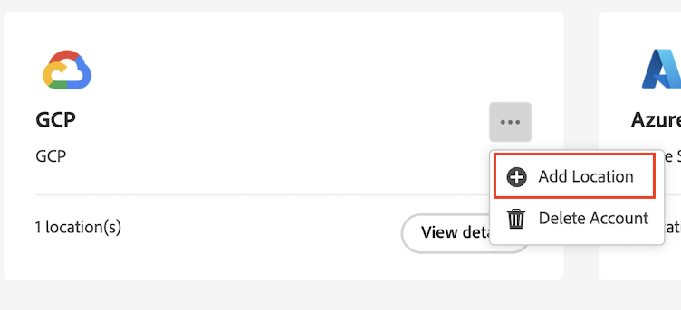

# Konfigurera platser för molnexport {#configure-cloud-export-locations}

<!-- markdownlint-disable MD034 -->

>[!CONTEXTUALHELP]
>id="cja-export-prefix"
>title="Prefix"
>abstract="Rotmappen i behållaren där du vill placera data. Ange ett namn på en statisk mapp och lägg sedan till ett snedstreck efter namnet för att skapa mappen. Exempel: `folder_name/`"

<!-- markdownlint-enable MD034 -->

<!-- markdownlint-disable MD034 -->

>[!CONTEXTUALHELP]
>id="cja-export-file-name"
>title="Filnamn och sökväg"
>abstract="Ange ett dynamiskt anpassat filnamn som ska användas för automatiserad export som skickas till den här platsen. Du kan också ange en dynamisk anpassad filsökväg före filnamnet.  Använd variabler i filnamnet och sökvägen för att göra dem dynamiska.  Om du till exempel anger `${yyyy}/${MM}/${dd}/my-report-${instance_id}-${idx}` får en export som automatiskt skickas till det här målet den 15 januari 2026 följande filsökväg och namn: `[prefix_folder_name]/2026/01/15/my-report-[UUID]-1.csv`  Klicka på länken nedan om du vill se en lista över tillgängliga variabler."

<!-- markdownlint-enable MD034 -->

Innan du kan exportera Customer Journey Analytics-rapporter till ett molnmål (antingen från [Analysis Workspace](/help/analysis-workspace/export/export-cloud.md) eller från [Report Builder](/help/report-builder/report-builder-export.md)) måste du lägga till och konfigurera platsen dit du vill att data ska skickas. Processen består av:

1. Lägga till och konfigurera kontot (t.ex. Amazon S3 och Google Cloud Platform) enligt beskrivningen i [Konfigurera molnexportkonton](/help/components/exports/cloud-export-accounts.md)

1. Lägga till och konfigurera platsen inom kontot (t.ex. en mapp på kontot) enligt beskrivningen i den här artikeln.

Mer information om hur du hanterar befintliga platser, inklusive visning, redigering och borttagning av platser, finns i [Hantera platser och konton för molnexport](/help/components/exports/manage-export-locations.md).

## Börja skapa en molnexportplats

1. Du måste lägga till ett konto innan du kan lägga till en plats. Om du inte redan har gjort det lägger du till ett konto enligt beskrivningen i [Konfigurera molnexportkonton](/help/components/exports/cloud-export-accounts.md).

1. I Customer Journey Analytics väljer du [!UICONTROL **Komponenter**] > [!UICONTROL **exporter**].

1. Välj fliken [!UICONTROL **Platser**] och välj sedan [!UICONTROL **Lägg till plats**].

   

   Eller

   Välj fliken [!UICONTROL **Platskonton**], markera ikonen med tre punkter på ett befintligt konto där du vill lägga till en plats och välj sedan [!UICONTROL **Lägg till plats**].

   

   Dialogrutan Plats visas.

1. Ange följande information:

   | Fält | Funktion |
   |---------|----------|
   | [!UICONTROL **Namn**] | Namnet på platsen. |
   | [!UICONTROL **Beskrivning**] | Ange en kort beskrivning av platsen för att hjälpa till att skilja den från andra platser på kontot. |
   | [!UICONTROL **Gör platsen tillgänglig för alla användare i organisationen**] | Aktivera det här alternativet om du vill att andra användare i organisationen ska kunna använda platsen. 
Tänk på följande när du delar platser:
<ul><li>Platser som du delar kan inte tas bort.</li><li>Delade platser kan bara redigeras av ägaren till platsen.</li><li>Platser kan bara delas om kontot som platsen är kopplad till också delas.</li></ul> |
   | [!UICONTROL **Platskonto**] | Välj det konto där du vill skapa platsen. Mer information om hur du skapar ett konto finns i [Konfigurera molnexportkonton](/help/components/exports/cloud-export-accounts.md). |

1. I avsnittet [!UICONTROL **Platsegenskaper**] anger du information som är specifik för kontotypen för ditt platskonto.

   Fortsätt med det avsnitt nedan som motsvarar kontotypen som du valde i fältet [!UICONTROL **Platskonto**].

   * [AEP Data Landing Zone](#aep-data-landing-zone)
   * [Amazon S3 Role ARN](#amazon-s3-role-arn)
   * [Google Cloud Platform](#google-cloud-platform)
   * [Azure SAS](#azure-sas)
   * [Azure RBAC](#azure-rbac)
   * [Snowflake](#snowflake)

### AEP Data Landing Zone

>[!IMPORTANT]
>
>När du exporterar Customer Journey Analytics-rapporter till Adobe Experience Platform Data Landing Zone måste du hämta data inom 7 dagar och sedan ta bort dem från AEP Data Landing Zone. Efter 7 dagar tas data automatiskt bort från AEP Data Landing Zone.

1. Börja skapa en plats för molnexport på något av följande sätt:

   * Från exportsidan enligt beskrivningen ovan, i [Börja skapa en molnexportplats](#begin-creating-a-cloud-export-location)

   * När [fullständiga tabeller exporteras från Analysis Workspace](/help/analysis-workspace/export/export-cloud.md#export-full-tables)

1. I avsnittet [!UICONTROL **Platsegenskaper**] i dialogrutan [!UICONTROL **Lägg till plats**] anger du följande information för att konfigurera en plats för Adobe Experience Platform Data Landing Zone:

   | Fält | Funktion |
   |---------|----------|
   | [!UICONTROL **Prefix**] | Mappen i behållaren där du vill placera data. Ange ett namn på en statisk mapp och lägg sedan till ett snedstreck efter namnet för att skapa mappen. Exempel: `folder_name/` |
   | [!UICONTROL **Filnamn och sökväg**] | Ange ett dynamiskt anpassat filnamn som ska användas för automatiska exporter som skickas till den här platsen. Du kan också ange en dynamisk egen sökväg innan filnamnet visas. 
Med det här alternativet kan du automatisera generering av filnamn och mappplacering så att filnamnen är förutsägbara och ordnade i mappar på ett logiskt sätt. Du kan t.ex. ge filnamn efter den dag de levererades och sedan placera dem i mappar som motsvarar varje månad.

Använd någon av följande variabler i filnamnet och sökvägen för att göra dem dynamiska:
<ul><li>**{yyyy}**: 4-siffrigt kalenderår (skiftlägeskänsligt)</li><li>**{yy}**: 2-siffrigt kalenderår (skiftlägeskänsligt)</li><li>**{MM}**: 2-siffrig månad (skiftlägeskänslig)</li><li>**{dd}**: Tvåsiffrig dag (skiftlägeskänslig)</li><li>**{HH}**: Tvåsiffrig timme (skiftlägeskänslig)</li><li>**{mm}**: 2-siffriga minuter (skiftlägeskänsligt)</li><li>**{ss}**: 2-siffriga sekunder (skiftlägeskänsligt)</li><li>**{fff}**: 3-siffriga nanosekunder (skiftlägeskänsliga)</li><li>**{instance_id}**: Begär (instans) UUID</li><li>**{export_id}**: Exportera UUID (schema)</li><li>**{idx}**: Index börjar från 0 (ökas för varje fil)</li><li>**{total}**: Totalt filnummer för hela överföringsjobb</li><li>**{completion_millis}**: Överföringstid i millisekunder</li></ul>

Om du till exempel anger `${yyyy}/${MM}/${dd}/my-report-${instance_id} -${idx}`, kommer en export som skickas automatiskt till den här destinationen den 15 januari 2026 att ha följande filsökväg och namn: [prefix_folder_name]/2026/01/15/my-report-[UUID]-1.csv
 |

   {style="table-layout:auto"}

1. Välj [!UICONTROL **Spara**].

1. Du kan nu exportera data från Analysis Workspace till kontot och platsen som du konfigurerade. Mer information om att exportera data till molnet finns i [Exportera projektdata till molnet](/help/analysis-workspace/export/export-cloud.md).

1. Det enklaste sättet att komma åt dina data i AEP Data Landing Zone är att använda Microsoft Azure Storage Explorer. Lagringsutforskaren är samma verktyg som används i instruktionerna för att konfigurera [AEP Data Landing Zone-kontot](/help/components/exports/cloud-export-accounts.md#aep-data-landing-zone).

   1. Öppna [Microsoft Azure Storage Explorer](https://azure.microsoft.com/en-us/products/storage/storage-explorer/).

   1. Gå till [!UICONTROL **Lagringskonton**] > [!UICONTROL **(bifogade behållare)**] > [!UICONTROL **Blobbehållare**] > **[!UICONTROL cjaexport-_nummer_]** > ***ditt_behållarnamn***.

      >[!NOTE]
      >
      >Mappnamnet **[!UICONTROL cjaexport-_number_]** är standardnamnet som tillhandahålls av Azure Storage Explorer. Om du bara har en enda anslutning som är associerad med din SAS-URI (som är normal) blir namnet på den här mappen **[!UICONTROL cjaexport-1]**.

      

   1. Markera den export som du vill hämta och välj sedan [!UICONTROL **Hämta**] för att hämta.

### Amazon S3 Role ARN

1. Börja skapa en plats för molnexport på något av följande sätt:

   * Gå till exportsidan enligt beskrivningen ovan i [Börja skapa en molnexportplats](#begin-creating-a-cloud-export-location)

   * När [du exporterar fullständiga register från Analysis Workspace](/help/analysis-workspace/export/export-cloud.md#export-full-tables)

1. Ange följande information om du vill konfigurera en ARN-plats för Amazon S3-roll i avsnittet [!UICONTROL **Platsegenskaper**] i dialogrutan [!UICONTROL **Lägg till plats**]:

   | Fält | Funktion |
   |---------|----------|
   | [!UICONTROL **Bucket**] | Den bucket på ditt Amazon S3-konto där du vill att Customer Journey Analytics-data ska skickas. 
Se till att användar-ARN som tillhandahölls av Adobe har behörigheten `S3:PutObject` för att kunna överföra filer till den här bucket. 

Bucket-namn måste uppfylla specifika namnregler. De måste till exempel innehålla mellan 3 och 63 tecken, får endast bestå av gemener, siffror, punkter (.) och bindestreck (-) och måste börja och sluta med en bokstav eller en siffra. [En fullständig lista över namnregler finns i AWS-dokumentationen](https://docs.aws.amazon.com/AmazonS3/latest/userguide/bucketnamingrules.html). 
 |
   | [!UICONTROL **Prefix**] | Mappen inom hakparentesen där du vill placera data. Ange ett namn på en statisk mapp och lägg sedan till ett snedstreck efter namnet för att skapa mappen. Till exempel folder_name/ |
   | [!UICONTROL **Filnamn och sökväg**] | Ange ett dynamiskt anpassat filnamn som ska användas för automatiska exporter som skickas till den här platsen. Du kan också ange en dynamisk egen sökväg innan filnamnet visas. 
Med det här alternativet kan du automatisera skapandet av filnamn och mappplacering så att filnamnen är förutsägbara och ordnade i mappar på ett logiskt sätt. Filnamn kan t.ex. namnges efter den dag de levererades och sedan placeras i mappar som motsvarar varje månad.

Använd någon av följande variabler i filnamnet och sökvägen för att göra dem dynamiska:
<ul><li>**{yyyy}**: 4-siffrigt kalenderår (skiftlägeskänsligt)</li><li>**{yy}**: 2-siffrigt kalenderår (skiftlägeskänsligt)</li><li>**{MM}**: 2-siffrig månad (skiftlägeskänslig)</li><li>**{dd}**: Tvåsiffrig dag (skiftlägeskänslig)</li><li>**{HH}**: Tvåsiffrig timme (skiftlägeskänslig)</li><li>**{mm}**: 2-siffriga minuter (skiftlägeskänsligt)</li><li>**{ss}**: 2-siffriga sekunder (skiftlägeskänsligt)</li><li>**{fff}**: 3-siffriga nanosekunder (skiftlägeskänsligt)</li><li>**{instance_id}**: Begär (instans) UUID</li><li>**{export_id}**: Exportera (schema) UUID</li><li>**{idx}**: Index börjar från 0 (ökas för varje fil)</li><li>**{total}**: Totalt filnummer för hela överföringsjobb</li><li>**{completion_millis}**: Överföringstid i millisekunder</li></ul>

Om du till exempel anger `${yyyy}/${MM}/${dd}/my-report-${instance_id} -${idx}`, kommer en export som skickas automatiskt till den här destinationen den 15 januari 2026 att ha följande filsökväg och namn: [prefix_folder_name]/2026/01/15/my-report-[UUID]-1.csv
 |

   {style="table-layout:auto"}

1. Välj [!UICONTROL **Spara**].

1. Du kan nu exportera data från Analysis Workspace till kontot och platsen som du konfigurerade. Mer information om att exportera data till molnet finns i [Exportera projektdata till molnet](/help/analysis-workspace/export/export-cloud.md).

### Google Cloud Platform

1. Börja skapa en plats för molnexport på något av följande sätt:

   * Från exportsidan enligt beskrivningen ovan, i [Börja skapa en molnexportplats](#begin-creating-a-cloud-export-location)

   * När [fullständiga tabeller exporteras från Analysis Workspace](/help/analysis-workspace/export/export-cloud.md#export-full-tables)

1. I avsnittet [!UICONTROL **Platsegenskaper**] i dialogrutan [!UICONTROL **Lägg till plats**] anger du följande information för att konfigurera en Google Cloud-plattformsplats:

   | Fält | Funktion |
   |---------|----------|
   | [!UICONTROL **Bucket**] | Bucket i GCP-kontot dit du vill att Customer Journey Analytics-data ska skickas. 
Se till att du har beviljat `roles/storage.objectCreator`-behörigheten till den huvudansvarige som tillhandahålls av Adobe. (Huvudkontot anges när [Google Cloud-plattformskontot konfigureras](/help/components/exports/cloud-export-accounts.md).) 
Mer information om att bevilja behörigheter finns i [Lägga till ett huvudnamn i en princip på paketnivå](https://cloud.google.com/storage/docs/access-control/using-iam-permissions#bucket-add) i dokumentationen för Google Cloud.

Om din organisation använder [begränsningar för organisationsprinciper](https://cloud.google.com/storage/docs/org-policy-constraints) för att endast tillåta Google Cloud-plattformskontot i din tillåtelselista behöver du följande Adobe-ägda Google Cloud-plattformens organisations-ID: <ul><li>`DISPLAY_NAME`: `adobe.com`</li><li>`ID`: `178012854243`</li><li>`DIRECTORY_CUSTOMER_ID`: `C02jo8puj`</li></ul> 
 |
   | [!UICONTROL **Prefix**] | Mappen inom hakparentesen där du vill placera data. Ange ett namn på en statisk mapp och lägg sedan till ett snedstreck efter namnet för att skapa mappen. Till exempel folder_name/ |
   | [!UICONTROL **Filnamn och sökväg**] | Ange ett dynamiskt anpassat filnamn som ska användas för automatiserad export som skickas till den här platsen. Du kan också ange en dynamisk anpassad filsökväg före filnamnet. 
Med det här alternativet kan du automatisera skapandet av filnamn och mappplacering så att filnamnen är förutsägbara och ordnade i mappar på ett logiskt sätt. Filnamn kan t.ex. namnges efter den dag de levererades och sedan placeras i mappar som motsvarar varje månad.

Använd någon av följande variabler i filnamnet och sökvägen för att göra dem dynamiska:
<ul><li>**{yyyy}**: 4-siffrigt kalenderår (skiftlägeskänsligt)</li><li>**{yy}**: 2-siffrigt kalenderår (skiftlägeskänsligt)</li><li>**{MM}**: Tvåsiffrig månad (skiftlägeskänsligt)</li><li>**{dd}**: 2-siffrig dag (skiftlägeskänsligt)</li><li>**{HH}**: 2-siffrig timme (skiftlägeskänsligt)</li><li>**{mm}**: 2-siffriga minuter (skiftlägeskänsliga)</li><li>**{ss}**: 2-siffriga sekunder (skiftlägeskänsligt)</li><li>**{fff}**: 3-siffriga nanosekunder (skiftlägeskänsligt)</li><li>**{instance_id}**: Begär (instans) UUID</li><li>**{export_id}**: Exportera (schema) UUID</li><li>**{idx}**: Index börjar från 0 (ökas för varje fil)</li><li>**{total}**: Totalt filnummer för hela överföringsjobb</li><li>**{completion_millis}**: Överföringstid i millisekunder</li></ul>

Om du till exempel anger `${yyyy}/${MM}/${dd}/my-report-${instance_id} -${idx}` får en export som automatiskt skickas till det här målet 15 januari 2026 följande filsökväg och namn: [prefix_folder_name]/2026/01/15/my-report-[UID]-1.csv
 |

   {style="table-layout:auto"}

1. Välj [!UICONTROL **Spara**].

1. Nu kan du exportera data från Analysis Workspace till det konto och den plats som du konfigurerade. Mer information om hur du exporterar data till molnet finns i [Exportera projektdata till molnet](/help/analysis-workspace/export/export-cloud.md).

### Azure SAS

1. Börja skapa en plats för molnexport på något av följande sätt:

   * Från exportsidan enligt beskrivningen ovan, i [Börja skapa en molnexportplats](#begin-creating-a-cloud-export-location)

   * När [fullständiga tabeller exporteras från Analysis Workspace](/help/analysis-workspace/export/export-cloud.md#export-full-tables)

1. I avsnittet [!UICONTROL **Platsegenskaper**] i dialogrutan [!UICONTROL **Lägg till plats**] anger du följande information för att konfigurera en Azure SAS-plats:

   | Fält | Funktion |
   |---------|----------|
   | [!UICONTROL **Behållarnamn**] | Behållaren i det konto du angav där du vill att Customer Journey Analytics-data ska skickas. |
   | [!UICONTROL **Prefix**] | Mappen i behållaren där du vill placera data. Ange ett namn på en statisk mapp och lägg sedan till ett snedstreck efter namnet för att skapa mappen. Exempel: `folder_name/`
Kontrollera att SAS-tokenarkivet som du angav i fältet Nyckelvalvets hemliga namn när du konfigurerar Azure SAS-kontot har behörigheten `Write`. Detta gör att SAS-token kan skapa filer i din Azure-behållare. 
Om du vill att SAS-token även ska skriva över filer kontrollerar du att SAS-tokenarkivet har behörigheten `Delete`.

Mer information finns i [Blob Storage-resurser](https://learn.microsoft.com/en-us/azure/storage/blobs/storage-blobs-introduction#blob-storage-resources) i dokumentationen för Azure Blob Storage.
 |
   | [!UICONTROL **Filnamn och sökväg**] | Ange ett dynamiskt anpassat filnamn som ska användas för automatiserad export som skickas till den här platsen. Du kan också ange en dynamisk egen sökväg innan filnamnet visas. 
Med det här alternativet kan du automatisera generering av filnamn och mappplacering så att filnamnen är förutsägbara och ordnade i mappar på ett logiskt sätt. Du kan t.ex. ge filnamn efter den dag de levererades och sedan placera dem i mappar som motsvarar varje månad.

Använd någon av följande variabler i filnamnet och sökvägen för att göra dem dynamiska:
<ul><li>**{yyyy}**: 4-siffrigt kalenderår (skiftlägeskänsligt)</li><li>**{yy}**: 2-siffrigt kalenderår (skiftlägeskänsligt)</li><li>**{MM}**: 2-siffrig månad (skiftlägeskänslig)</li><li>**{dd}**: Tvåsiffrig dag (skiftlägeskänslig)</li><li>**{HH}**: Tvåsiffrig timme (skiftlägeskänslig)</li><li>**{mm}**: 2-siffriga minuter (skiftlägeskänsligt)</li><li>**{ss}**: 2-siffriga sekunder (skiftlägeskänsligt)</li><li>**{fff}**: 3-siffriga nanosekunder (skiftlägeskänsligt)</li><li>**{instance_id}**: Begär (instans) UUID</li><li>**{export_id}**: Exportera (schema) UUID</li><li>**{idx}**: Index börjar från 0 (ökas för varje fil)</li><li>**{total}**: Totalt filnummer för hela överföringsjobb</li><li>**{completion_millis}**: Överföringstid i millisekunder</li></ul>

Om du till exempel anger `${yyyy}/${MM}/${dd}/my-report-${instance_id} -${idx}` får en export som automatiskt skickas till det här målet 15 januari 2026 följande filsökväg och namn: [prefix_folder_name]/2026/01/15/my-report-[UID]-1.csv
 |

   {style="table-layout:auto"}

1. Välj [!UICONTROL **Spara**].

1. Nu kan du exportera data från Analysis Workspace till det konto och den plats som du konfigurerade. Mer information om hur du exporterar data till molnet finns i [Exportera projektdata till molnet](/help/analysis-workspace/export/export-cloud.md).

### Azure RBAC

1. Börja skapa en plats för molnexport på något av följande sätt:

   * Från exportsidan enligt beskrivningen ovan, i [Börja skapa en molnexportplats](#begin-creating-a-cloud-export-location)

   * När [fullständiga tabeller exporteras från Analysis Workspace](/help/analysis-workspace/export/export-cloud.md#export-full-tables)

1. I avsnittet [!UICONTROL **Platsegenskaper**] i dialogrutan [!UICONTROL **Lägg till plats**] anger du följande information för att konfigurera en Azure RBAC-plats:

   | Fält | Funktion |
   |---------|----------|
   | [!UICONTROL **Behållare**] | Behållaren i det konto du angav där du vill att Customer Journey Analytics-data ska skickas. Se till att du ger behörighet att överföra filer till Azure-programmet som du skapade tidigare. |
   | [!UICONTROL **Prefix**] | Den mapp i behållaren där du vill placera data. Ange ett statiskt mappnamn och lägg sedan till ett snedstreck efter namnet för att skapa mappen. Exempel: `folder_name/`
Kontrollera att det program-ID som du angav när du konfigurerade Azure RBAC-kontot har tilldelats rollen `Storage Blob Data Contributor` för att få åtkomst till behållaren (mappen).
 
Mer information finns i [Inbyggda Azure-roller](https://learn.microsoft.com/en-us/azure/role-based-access-control/built-in-roles).
 |
   | [!UICONTROL **Filnamn och sökväg**] | Ange ett dynamiskt anpassat filnamn som ska användas för automatiserad export som skickas till den här platsen. Du kan också ange en dynamisk anpassad filsökväg före filnamnet. 
Med det här alternativet kan du automatisera skapandet av filnamn och mappplacering så att filnamnen är förutsägbara och ordnade i mappar på ett logiskt sätt. Filnamn kan t.ex. namnges efter den dag de levererades och sedan placeras i mappar som motsvarar varje månad.
 
Använd någon av följande variabler i filnamnet och sökvägen för att göra dem dynamiska:
<ul><li>**{yyyy}**: 4-siffrigt kalenderår (skiftlägeskänsligt)</li><li>**{yy}**: 2-siffrigt kalenderår (skiftlägeskänsligt)</li><li>**{MM}**: 2-siffrig månad (skiftlägeskänslig)</li><li>**{dd}**: Tvåsiffrig dag (skiftlägeskänslig)</li><li>**{HH}**: 2-siffrig timme (skiftlägeskänsligt)</li><li>**{mm}**: 2-siffriga minuter (skiftlägeskänsliga)</li><li>**{ss}**: 2-siffriga sekunder (skiftlägeskänsligt)</li><li>**{fff}**: 3-siffriga nanosekunder (skiftlägeskänsligt)</li><li>**{instance_id}**: Begär (instans) UUID</li><li>**{export_id}**: Exportera (schema) UUID</li><li>**{idx}**: Index börjar från 0 (ökas för varje fil)</li><li>**{total}**: Totalt filnummer för hela överföringsjobb</li><li>**{completion_millis}**: Överföringstid i millisekunder</li></ul>

Om du till exempel anger `${yyyy}/${MM}/${dd}/my-report-${instance_id} -${idx}` får en export som automatiskt skickas till det här målet 15 januari 2026 följande filsökväg och namn: [prefix_folder_name]/2026/01/15/my-report-[UID]-1.csv
 |
   | [!UICONTROL **Konto**] | Azure-lagringskontot. |

   {style="table-layout:auto"}

1. Välj [!UICONTROL **Spara**].

1. Nu kan du exportera data från Analysis Workspace till det konto och den plats som du konfigurerade. Mer information om hur du exporterar data till molnet finns i [Exportera projektdata till molnet](/help/analysis-workspace/export/export-cloud.md).

### Snowflake

1. Börja skapa en plats för molnexport på något av följande sätt:

   * Från exportsidan enligt beskrivningen ovan, i [Börja skapa en molnexportplats](#begin-creating-a-cloud-export-location)

   * När [fullständiga tabeller exporteras från Analysis Workspace](/help/analysis-workspace/export/export-cloud.md#export-full-tables)

1. I avsnittet [!UICONTROL **Platsegenskaper**] i dialogrutan [!UICONTROL **Lägg till plats**] anger du följande information för att konfigurera en Snowflake-plats:

   | Fält | Funktion |
   |---------|----------|
   | [!UICONTROL **DB**] | Den angivna databasen bör vara en befintlig databas. Rollen du skapade måste ha behörighet att komma åt den här databasen.
Det här är databasen som är associerad med scennamnet.

Du kan ge den här rollbehörigheten till databasen i Snowflake med följande kommando: `GRANT USAGE ON DATABASE <your_database> TO ROLE <your_role>;`
 
Mer information finns på sidan [Databas-, schema- och delningskommandon i Snowflake-dokumentationen](https://docs.snowflake.com/en/sql-reference/commands-database).
 |
   | [!UICONTROL **Schema**] | Det angivna schemat ska vara ett befintligt schema. Rollen du skapade måste ha behörighet att komma åt schemat.
Detta är schemat som är associerat med scennamnet.

Du kan tilldela rollen som du skapade behörigheter till schemat i Snowflake med följande kommando: `GRANT USAGE ON SCHEMA <your_database>.<your_schema> TO ROLE <your_role>;`

Mer information finns på sidan [Databas-, schema- och delningskommandon i Snowflake-dokumentationen](https://docs.snowflake.com/en/sql-reference/commands-database).
 |
   | [!UICONTROL **Scennamn**] | Namnet på den interna scenen där datafiler lagras i Snowflake.
Kontrollera att rollen som du angav på kontot har läs- och skrivbehörighet till det här scennamnet. (Eftersom du beviljar läs- och skrivåtkomst rekommenderar vi att du använder en scen som bara används av Adobe.)

Du kan bevilja läs- och skrivåtkomst till scennamnet i Snowflake med följande kommando: `GRANT READ, WRITE ON STAGE <your_database>.<your_schema>.<your_stage_name> TO ROLE <your_role>;`
 
Mer information om att bevilja behörigheter till en roll finns i [Bevilja behörigheter i Snowflake-dokumentationen](https://docs.snowflake.com/en/sql-reference/sql/grant-privilege).
 
Mer information om scennamnet finns i sidan [Välja en intern scen för lokala filer i Snowflake-dokumentationen](https://docs.snowflake.com/en/user-guide/data-load-local-file-system-create-stage).
 |
   | [!UICONTROL **Scensökväg**] | Sökvägen till den plats där datafiler lagras i Snowflake. 
Mer information finns i sidan [Välja en intern scen för lokala filer i Snowflake-dokumentationen](https://docs.snowflake.com/en/user-guide/data-load-local-file-system-create-stage).
 |
   | [!UICONTROL **Filnamn och sökväg**] | Ange ett dynamiskt anpassat filnamn som ska användas för automatiserad export som skickas till den här platsen. Du kan också ange en dynamisk anpassad filsökväg före filnamnet. 
Med det här alternativet kan du automatisera generering av filnamn och mappplacering så att filnamnen är förutsägbara och ordnade i mappar på ett logiskt sätt. Filnamn kan t.ex. namnges efter den dag de levererades och sedan placeras i mappar som motsvarar varje månad.

Använd någon av följande variabler i filnamnet och sökvägen för att göra dem dynamiska:
<ul><li>**{yyyy}**: 4-siffrigt kalenderår (skiftlägeskänsligt)</li><li>**{yy}**: 2-siffrigt kalenderår (skiftlägeskänsligt)</li><li>**{MM}**: Tvåsiffrig månad (skiftlägeskänsligt)</li><li>**{dd}**: Tvåsiffrig dag (skiftlägeskänslig)</li><li>**{HH}**: Tvåsiffrig timme (skiftlägeskänslig)</li><li>**{mm}**: 2-siffriga minuter (skiftlägeskänsligt)</li><li>**{ss}**: 2-siffriga sekunder (skiftlägeskänsligt)</li><li>**{fff}**: 3-siffriga nanosekunder (skiftlägeskänsligt)</li><li>**{instance_id}**: Begär (instans) UUID</li><li>**{export_id}**: Exportera (schema) UUID</li><li>**{idx}**: Index börjar från 0 (ökas för varje fil)</li><li>**{total}**: Totalt filnummer för hela överföringsjobb</li><li>**{completion_millis}**: Överföringstid i millisekunder</li></ul>

Om du till exempel anger `${yyyy}/${MM}/${dd}/my-report-${instance_id} -${idx}`, kommer en export som skickas automatiskt till den här destinationen den 15 januari 2026 att ha följande filsökväg och namn: [prefix_folder_name]/2026/01/15/my-report-[UUID]-1.csv
 |

   {style="table-layout:auto"}

1. Välj [!UICONTROL **Spara**].

1. Nu kan du exportera data från Analysis Workspace till det konto och den plats som du konfigurerade. Mer information om hur du exporterar data till molnet finns i [Exportera projektdata till molnet](/help/analysis-workspace/export/export-cloud.md).
