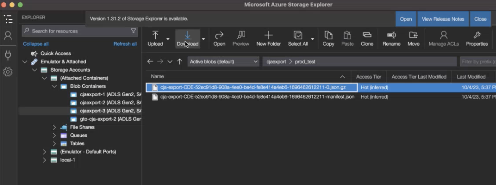

# Konfigurera platser för molnexport

Innan du kan exportera Customer Journey Analytics-rapporter till ett molnmål enligt beskrivningen i [Exportera Customer Journey Analytics-rapporter till molnet](/help/analysis-workspace/export/export-cloud.md)måste du lägga till och konfigurera platsen dit du vill att data ska skickas.

Den här processen består av att lägga till och konfigurera kontot (som Amazon S3, Google Cloud Platform o.s.v.) enligt beskrivningen i [Konfigurera molnexportkonton](/help/components/exports/cloud-export-accounts.md)och sedan lägga till och konfigurera platsen inom det kontot (till exempel en mapp inom kontot) enligt beskrivningen i den här artikeln.

Mer information om hur du hanterar befintliga platser, inklusive visning, redigering och borttagning av platser, finns i [Hantera platser och konton för molnexport](/help/components/exports/manage-export-locations.md).

## Börja skapa en molnexportplats

1. Du måste lägga till ett konto innan du kan lägga till en plats. Om du inte redan har det lägger du till ett konto enligt beskrivningen i [Konfigurera molnexportkonton](/help/components/exports/cloud-export-accounts.md).

1. I Customer Journey Analytics väljer du [!UICONTROL **Komponenter**] > [!UICONTROL **Export**].

1. Välj [!UICONTROL **Platser**] tabbtangenten och sedan välja [!UICONTROL **Lägg till plats**].

   

   eller

   Välj [!UICONTROL **Platskonton**] markerar du ikonen med tre punkter på ett befintligt konto där du vill lägga till en plats och väljer [!UICONTROL **Lägg till plats**].

   

   Dialogrutan Plats visas.

1. Ange följande information: |Fält | Funktion | |—|—| | [!UICONTROL **Namn**] | Namnet på platsen.  | | [!UICONTROL **Beskrivning**] | Ange en kort beskrivning av platsen för att hjälpa till att skilja den från andra platser på kontot. | | [!UICONTROL **Platskonto**] | Välj det konto där du vill skapa platsen. Mer information om hur du skapar ett konto finns i [Konfigurera molnexportkonton](/help/components/exports/cloud-export-accounts.md). |

1. I [!UICONTROL **Platsegenskaper**] anger du information som är specifik för kontotypen för ditt platskonto.

   Fortsätt med det avsnitt nedan som motsvarar kontotypen som du valde i dialogrutan [!UICONTROL **Platskonto**] fält.

   * [AEP Data Landing Zone](#aep-data-landing-zone)
   * [Amazon S3 Role ARN](#amazon-s3-role-arn)
   * [Google Cloud Platform](#google-cloud-platform)
   * [Azure SAS](#azure-sas)
   * [Azure RBAC](#azure-rbac)
   * [Snowflake](#snowflake)

### AEP Data Landing Zone

>[!IMPORTANT]
>
>När du exporterar rapporter från Customer Journey Analytics till Adobe Experience Platform Data Landing Zone ska du se till att du hämtar data inom 7 dagar och sedan ta bort dem från AEP Data Landing Zone. Efter 7 dagar tas data automatiskt bort från AEP Data Landing Zone.

1. Börja skapa en plats för molnexport på något av följande sätt:

   * På exportsidan som beskrivs ovan, i [Börja skapa en molnexportplats](#begin-creating-a-cloud-export-location)

   * När [exportera hela tabeller från Analysis Workspace](/help/analysis-workspace/export/export-cloud.md#export-full-tables-from-analysis-workspace)

1. I [!UICONTROL **Platsegenskaper**] i [!UICONTROL **Lägg till plats**] anger du följande information för att konfigurera en plats för Adobe Experience Platform Data Landing Zone:

   <!-- still need to update; can't create AEP account -->

   | Fält | Funktion |
   |---------|----------|
   | [!UICONTROL **Prefix**] | Mappen i behållaren där du vill placera data. Ange ett mappnamn och lägg sedan till ett snedstreck efter namnet för att skapa mappen. Exempel: `folder_name/` |

   {style="table-layout:auto"}

1. Välj [!UICONTROL **Spara**].

1. Nu kan du exportera data från Analysis Workspace till det konto och den plats som du konfigurerade. Mer information om hur du exporterar data till molnet finns i [Exportera projektdata till molnet](/help/analysis-workspace/export/export-cloud.md).

1. Det enklaste sättet att komma åt dina data i AEP Data Landing Zone är att använda Microsoft Azure Storage Explorer. Det här är samma verktyg som används i instruktionerna för att konfigurera [AEP Data Landing Zone-konto](/help/components/exports/cloud-export-accounts.md#aep-data-landing-zone).

   1. Öppna [Microsoft Azure Storage Explorer](https://azure.microsoft.com/en-us/products/storage/storage-explorer/).

   1. Gå till [!UICONTROL **Lagringskonton**] > [!UICONTROL **(Bifogade behållare)**] > [!UICONTROL **Blobbehållare**] > **[!UICONTROL cjaexport-_tal_]** > ***your_container_name***.

      >[!NOTE]
      >
      >Mappnamnet **[!UICONTROL cjaexport-_tal_]** är standardnamnet som tillhandahålls av Azure Storage Explorer. Om du bara har en enda anslutning som är kopplad till din SAS URI (som är normal) blir namnet på den här mappen **[!UICONTROL cjaexport-1]**.

      

   1. Markera den export som du vill hämta och välj sedan [!UICONTROL **Ladda ned**] för nedladdning.

### Amazon S3 Role ARN

1. Börja skapa en plats för molnexport på något av följande sätt:

   * På exportsidan som beskrivs ovan, i [Börja skapa en molnexportplats](#begin-creating-a-cloud-export-location)

   * När [exportera hela tabeller från Analysis Workspace](/help/analysis-workspace/export/export-cloud.md#export-full-tables-from-analysis-workspace)

1. I [!UICONTROL **Platsegenskaper**] i [!UICONTROL **Lägg till plats**] anger du följande information för att konfigurera en plats för Amazon S3 Role ARN:

   <!-- still need to update; can't create S3 role ARN account -->

   | Fält | Funktion |
   |---------|----------|
   | [!UICONTROL **Bucket**] | Den bucket på ditt Amazon S3-konto där du vill att Adobe Analytics-data ska skickas. 
Se till att användar-ARN som tillhandahålls av Adobe har `S3:PutObject` behörighet för att överföra filer till denna bucket. 
 |
   | [!UICONTROL **Prefix**] | Mappen inom hakparentesen där du vill placera data. Ange ett mappnamn och lägg sedan till ett snedstreck efter namnet för att skapa mappen. Till exempel folder_name/ |

   {style="table-layout:auto"}

1. Välj [!UICONTROL **Spara**].

1. Nu kan du exportera data från Analysis Workspace till det konto och den plats som du konfigurerade. Mer information om hur du exporterar data till molnet finns i [Exportera projektdata till molnet](/help/analysis-workspace/export/export-cloud.md).

### Google Cloud Platform

1. Börja skapa en plats för molnexport på något av följande sätt:

   * På exportsidan som beskrivs ovan, i [Börja skapa en molnexportplats](#begin-creating-a-cloud-export-location)

   * När [exportera hela tabeller från Analysis Workspace](/help/analysis-workspace/export/export-cloud.md#export-full-tables-from-analysis-workspace)

1. I [!UICONTROL **Platsegenskaper**] i [!UICONTROL **Lägg till plats**] anger du följande information för att konfigurera en plats för Google Cloud-plattformen:

   <!-- still need to update; can't create GCP account -->

   | Fält | Funktion |
   |---------|----------|
   | [!UICONTROL **Bucket**] | Den bucket på ditt GCP-konto där du vill att Adobe Analytics-data ska skickas. 
Se till att du har beviljat `roles/storage.objectCreator` tillstånd till huvudmannen från Adobe. (Huvudkontot tillhandahålls när [konfigurera Google Cloud Platform-kontot](/help/components/exports/cloud-export-accounts.md).) 
Mer information om att bevilja behörigheter finns i [Lägga till ett huvudnamn i en princip på paketnivå](https://cloud.google.com/storage/docs/access-control/using-iam-permissions#bucket-add) i Google Cloud-dokumentationen.
 |
   | [!UICONTROL **Prefix**] | Mappen inom hakparentesen där du vill placera data. Ange ett mappnamn och lägg sedan till ett snedstreck efter namnet för att skapa mappen. Till exempel folder_name/ |

   {style="table-layout:auto"}

1. Välj [!UICONTROL **Spara**].

1. Nu kan du exportera data från Analysis Workspace till det konto och den plats som du konfigurerade. Mer information om hur du exporterar data till molnet finns i [Exportera projektdata till molnet](/help/analysis-workspace/export/export-cloud.md).

### Azure SAS

1. Börja skapa en plats för molnexport på något av följande sätt:

   * På exportsidan som beskrivs ovan, i [Börja skapa en molnexportplats](#begin-creating-a-cloud-export-location)

   * När [exportera hela tabeller från Analysis Workspace](/help/analysis-workspace/export/export-cloud.md#export-full-tables-from-analysis-workspace)

1. I [!UICONTROL **Platsegenskaper**] i [!UICONTROL **Lägg till plats**] anger du följande information för att konfigurera en Azure SAS-plats:

   | Fält | Funktion |
   |---------|----------|
   | [!UICONTROL **Behållarnamn**] | Behållaren i det konto du angav där du vill att Customer Journey Analytics data ska skickas. |
   | [!UICONTROL **Prefix**] | Mappen i behållaren där du vill placera data. Ange ett mappnamn och lägg sedan till ett snedstreck efter namnet för att skapa mappen. Exempel: `folder_name/`
Kontrollera att det SAS-tokenarkiv som du angav i fältet Nyckelvalvets hemliga namn när du konfigurerar Azure SAS-kontot har `Write` behörighet. Detta gör att SAS-token kan skapa filer i din Azure-behållare. 
Om du vill att SAS-token även ska skriva över filer måste du se till att SAS-tokenarkivet har `Delete` behörighet.

Mer information finns i [Lagringsresurser för blob](https://learn.microsoft.com/en-us/azure/storage/blobs/storage-blobs-introduction#blob-storage-resources) i dokumentationen för Azure Blob Storage.
 |

   {style="table-layout:auto"}

1. Välj [!UICONTROL **Spara**].

1. Nu kan du exportera data från Analysis Workspace till det konto och den plats som du konfigurerade. Mer information om hur du exporterar data till molnet finns i [Exportera projektdata till molnet](/help/analysis-workspace/export/export-cloud.md).

### Azure RBAC

1. Börja skapa en plats för molnexport på något av följande sätt:

   * På exportsidan som beskrivs ovan, i [Börja skapa en molnexportplats](#begin-creating-a-cloud-export-location)

   * När [exportera hela tabeller från Analysis Workspace](/help/analysis-workspace/export/export-cloud.md#export-full-tables-from-analysis-workspace)

1. I [!UICONTROL **Platsegenskaper**] i [!UICONTROL **Lägg till plats**] anger du följande information för att konfigurera en Azure RBAC-plats:

   | Fält | Funktion |
   |---------|----------|
   | [!UICONTROL **Behållare**] | Behållaren i det konto du angav där du vill att Adobe Analytics-data ska skickas. Se till att du ger behörighet att överföra filer till Azure-programmet som du skapade tidigare. |
   | [!UICONTROL **Prefix**] | Mappen i behållaren där du vill placera data. Ange ett mappnamn och lägg sedan till ett snedstreck efter namnet för att skapa mappen. Exempel: `folder_name/`
Kontrollera att det program-ID som du angav när du konfigurerade Azure RBAC-kontot har tilldelats `Storage Blob Data Contributor` roll för att komma åt behållaren (mappen).
 
Mer information finns i [Inbyggda Azure-roller](https://learn.microsoft.com/en-us/azure/role-based-access-control/built-in-roles).
 |
   | [!UICONTROL **Konto**] | Azure-lagringskontot. |

   {style="table-layout:auto"}

1. Välj [!UICONTROL **Spara**].

1. Nu kan du exportera data från Analysis Workspace till det konto och den plats som du konfigurerade. Mer information om hur du exporterar data till molnet finns i [Exportera projektdata till molnet](/help/analysis-workspace/export/export-cloud.md).

### Snowflake

1. Börja skapa en plats för molnexport på något av följande sätt:

   * På exportsidan som beskrivs ovan, i [Börja skapa en molnexportplats](#begin-creating-a-cloud-export-location)

   * När [exportera hela tabeller från Analysis Workspace](/help/analysis-workspace/export/export-cloud.md#export-full-tables-from-analysis-workspace)

1. I [!UICONTROL **Platsegenskaper**] i [!UICONTROL **Lägg till plats**] anger du följande information för att konfigurera en plats i Snowflake:

   | Fält | Funktion |
   |---------|----------|
   | [!UICONTROL **DB**] | Den angivna databasen bör vara en befintlig databas. Rollen du skapade måste ha behörighet att komma åt den här databasen.
Det här är databasen som är associerad med scennamnet.

Du kan ge den här rollbehörigheten till databasen i Snowflake med följande kommando: `GRANT USAGE ON DATABASE <your_database> TO ROLE <your_role>;`
 
Mer information finns i [Kommandosidan Databas, Schema och Dela i Snowflake-dokumentationen](https://docs.snowflake.com/en/sql-reference/commands-database).
 |
   | [!UICONTROL **Schema**] | Det angivna schemat ska vara ett befintligt schema. Rollen du skapade måste ha behörighet att komma åt schemat.
Detta är schemat som är associerat med scennamnet.
Du kan tilldela rollen som du skapade behörigheter till schemat i Snowflake med följande kommando: `GRANT USAGE ON SCHEMA <your_database>.<your_schema> TO ROLE <your_role>;`

Mer information finns i [Kommandosidan Databas, Schema och Dela i Snowflake-dokumentationen](https://docs.snowflake.com/en/sql-reference/commands-database).
 |
   | [!UICONTROL **Scennamn**] | Namnet på den interna scenen där datafiler lagras i Snowflake.
Kontrollera att rollen som du angav på kontot har läs- och skrivbehörighet till det här scennamnet. (Eftersom du beviljar läs- och skrivåtkomst rekommenderar vi att du använder en scen som bara används av Adobe.)
Du kan ge läs- och skrivåtkomst till scennamnet i Snowflake med följande kommando: `GRANT READ, WRITE ON STAGE <your_database>.<your_schema>.<your_stage_name> TO ROLE <your_role>;`
 
Mer information om hur du tilldelar behörigheter till en roll finns i [Bevilja behörigheter i Snowflake-dokumentationen](https://docs.snowflake.com/en/sql-reference/sql/grant-privilege). 
Mer information om scenens namn finns i [Välja en intern scen för sidan Lokala filer i Snowflake-dokumentationen](https://docs.snowflake.com/en/user-guide/data-load-local-file-system-create-stage).
 |
   | [!UICONTROL **Scenbana**] | Sökvägen till den plats där datafiler lagras i Snowflake. 
Mer information finns i [Välja en intern scen för sidan Lokala filer i Snowflake-dokumentationen](https://docs.snowflake.com/en/user-guide/data-load-local-file-system-create-stage).
 |

   {style="table-layout:auto"}

1. Välj [!UICONTROL **Spara**].

1. Nu kan du exportera data från Analysis Workspace till det konto och den plats som du konfigurerade. Mer information om hur du exporterar data till molnet finns i [Exportera projektdata till molnet](/help/analysis-workspace/export/export-cloud.md).
