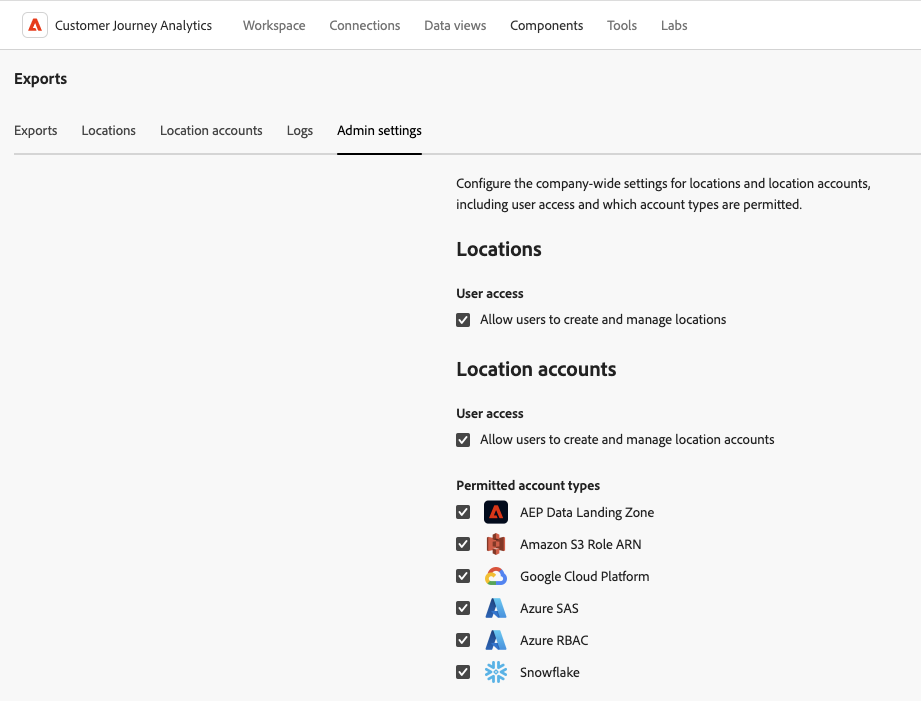

# Hantera platser och konton för molnexport

Du kan visa, redigera och ta bort platser för molnexport.

Mer information om hur du skapar en ny plats finns i [Konfigurera molnexportplatser](/help/components/exports/cloud-export-locations.md).

## Filtrera och söka efter platser

Om du vill hitta den information du behöver kan du antingen filtrera listan över platser eller söka efter en plats.

### Filtrera listan med platser

1. I Customer Journey Analytics väljer du [!UICONTROL **Komponenter**] > [!UICONTROL **Exportera**].

1. Välj fliken [!UICONTROL **Platser**].

1. Välj ikonen **Filter** .

   <!-- add screenshot -->

   Du kan filtrera efter följande kriterier:

   | Filter | Beskrivning |
   |---------|----------|
   | [!UICONTROL **Platstyp**]<!--should this be changed to Account type?--> | Kontotypen som platsen är associerad med. Följande kontotyper kan vara tillgängliga: <ul><li>[!UICONTROL **AEP Data Landing Zone**]</li><li>[!UICONTROL **Amazon S3-roll ARN**]</li><li>[!UICONTROL **Azure SAS**]</li><li>[!UICONTROL **Azure RBAC**]</li><li>[!UICONTROL **Google Cloud-plattform**]</li><li>[!UICONTROL **Snowflake**]</li></ul> |
   | [!UICONTROL **Konto**] | Namnet på kontot som platsen är associerad med. |
   | [!UICONTROL **Skapad av**] | E-postadressen till användaren som skapade platsen. |

   {style="table-layout:auto"}

### Sök efter platser

1. I Customer Journey Analytics väljer du [!UICONTROL **Komponenter**] > [!UICONTROL **Exportera**].

1. Välj fliken [!UICONTROL **Platser**].

1. (Villkorligt) Om du är systemadministratör kan du aktivera alternativet [!UICONTROL **Visa platser för alla användare**] om du vill visa platser som har skapats av alla användare i organisationen.

1. I sökfältet börjar du skriva in information som är associerad med den plats du söker efter. Du kan söka efter data från alla kolumner som är tillgängliga i tabellen.

## Redigera platser

En plats kan bara redigeras av den användare som skapade den eller av en systemadministratör.

Så här redigerar du en plats:

1. I Customer Journey Analytics väljer du [!UICONTROL **Komponenter**] > [!UICONTROL **Exportera**].

1. Välj fliken [!UICONTROL **Platser**].

1. (Villkorligt) Om du är systemadministratör kan du aktivera alternativet [!UICONTROL **Visa platser för alla användare**] om du vill visa platser som har skapats av alla användare i organisationen.

1. Välj den plats som du vill redigera.

   

1. Välj [!UICONTROL **Redigera**].

1. Gör önskade ändringar och välj sedan [!UICONTROL **Spara**].

## Ta bort platser

Om du tar bort en plats tas även alla exporter som använder platsen bort. Kontrollera bekräftelsedialogrutan när du tar bort för att se om inga exporter är associerade med platsen.

Så här tar du bort en plats:

1. I Customer Journey Analytics väljer du [!UICONTROL **Komponenter**] > [!UICONTROL **Exportera**].

1. Välj fliken [!UICONTROL **Platser**].

1. (Villkorligt) Om du är systemadministratör kan du aktivera alternativet [!UICONTROL **Visa platser för alla användare**] om du vill visa platser som har skapats av alla användare i organisationen.

1. Markera en eller flera platser som du vill ta bort.

   

1. Välj [!UICONTROL **Ta bort**].

   Dialogrutan Ta bort plats visas.

1. Kontrollera att platsen inte är kopplad till någon export innan du bekräftar borttagningen i dialogrutan Ta bort plats.

   

1. Bekräfta genom att välja [!UICONTROL **Ta bort**] igen.

## Redigera konton

Ett konto kan bara redigeras av den användare som skapade det eller av en systemadministratör.

Redigera ett konto:

1. I Customer Journey Analytics väljer du [!UICONTROL **Komponenter**] > [!UICONTROL **Exportera**].

1. Välj fliken [!UICONTROL **Platskonton**].

   

1. (Villkorligt) Om du är systemadministratör kan du aktivera alternativet [!UICONTROL **Visa konton för alla användare**] om du vill visa platser som har skapats av alla användare i organisationen.

1. Välj [!UICONTROL **Visa information**] för kontot som du vill redigera.

1. Gör önskade ändringar och välj sedan [!UICONTROL **Spara**].

## Visa kontonycklar

När du har skapat ett konto kan du visa alla associerade kontonycklar för det kontot. Du kan behöva visa den här informationen om du inte slutförde konfigurationen av kontot med din molnleverantör [när du ursprungligen konfigurerade kontot](/help/components/exports/cloud-export-accounts.md).

Så här visar du nycklar som är kopplade till ett exportkonto:

1. I Customer Journey Analytics väljer du [!UICONTROL **Komponenter**] > [!UICONTROL **Exportera**].

1. Välj fliken [!UICONTROL **Platskonton**].

   

1. (Villkorligt) Om du är systemadministratör kan du aktivera alternativet [!UICONTROL **Visa konton för alla användare**] om du vill visa platser som har skapats av alla användare i organisationen.

1. Markera ikonen med tre punkter på det konto som du vill redigera och välj sedan [!UICONTROL **Kontonycklar**].

## Ta bort konton

1. I Customer Journey Analytics väljer du [!UICONTROL **Komponenter**] > [!UICONTROL **Exportera**].

1. Välj fliken [!UICONTROL **Platskonton**].

   

1. (Villkorligt) Om du är systemadministratör kan du aktivera alternativet [!UICONTROL **Visa konton för alla användare**] om du vill visa platser som har skapats av alla användare i organisationen.

1. Markera ikonen med tre punkter på det konto som du vill redigera och välj sedan [!UICONTROL **Ta bort konto**].

1. Välj [!UICONTROL **Ta bort**] igen i bekräftelsedialogrutan.

## Konfigurera företagsinställningar (endast administratörer)

Systemadministratörer kan hindra användare från att skapa konton och platser eller begränsa vilka typer av konton som användare kan skapa och använda.

### Konfigurera om användare kan skapa och redigera konton

Som standard kan alla användare i organisationen skapa konton och redigera konton som de skapar i din Customer Journey Analytics-miljö, enligt beskrivningen i [konfigurera molnexportkonton](/help/components/exports/cloud-export-accounts.md).

Du kan hindra användare från att skapa konton. När du gör det kan användare fortfarande använda konton som de redan har skapat, men de kan inte längre redigera dem. Du kan ta bort konton som användare har skapat enligt beskrivningen i [Ta bort ett konto](#delete-an-account).

Så här begränsar du alla användare från att skapa och redigera konton:

1. I Customer Journey Analytics väljer du **[!UICONTROL Components]** > **[!UICONTROL Exports]** och sedan fliken [!UICONTROL **Administratörsinställningar**] .

1. Avmarkera alternativet [!UICONTROL **Tillåt användare att skapa och hantera platskonton**] i avsnittet [!UICONTROL **Platskonton**].

1. Välj [!UICONTROL **Spara**].

1. (Valfritt) Ta bort konton som användare har skapat och som du inte längre vill att de ska använda, enligt beskrivningen i [Ta bort ett konto](#delete-an-account).

### Konfigurera om användare kan skapa och redigera platser

Som standard kan alla användare i organisationen skapa platser och redigera platser som de skapar i din Customer Journey Analytics-miljö, enligt beskrivningen i [konfigurera platser för molnexport](/help/components/exports/cloud-export-locations.md).

Du kan hindra användare från att skapa platser. När du gör det kan användare fortfarande använda platser som de redan har skapat, men de kan inte längre redigera dem. Du kan ta bort platser som användare har skapat enligt beskrivningen i [Ta bort platser](#delete-a-location).

Så här begränsar du alla användare från att skapa och redigera platser:

1. I Customer Journey Analytics väljer du **[!UICONTROL Components]** > **[!UICONTROL Eports]** och sedan fliken [!UICONTROL **Administratörsinställningar**] .

1. I avsnittet [!UICONTROL **Platser**] avmarkerar du alternativet [!UICONTROL **Tillåt användare att skapa och hantera platser**].

1. Välj [!UICONTROL **Spara**].

1. (Valfritt) Ta bort alla platser som användare har skapat och som du inte längre vill att de ska använda, enligt beskrivningen i [Ta bort en plats](#delete-a-location).

### Begränsa vilka kontotyper som användare kan skapa och använda

Du kan begränsa vilka kontotyper som användare kan se under följande omständigheter:

* När [skapar nya konton](/help/components/exports/cloud-export-accounts.md).
* När du väljer vilka konton som ska användas vid export av filer med [fullständig tabellexport](/help/analysis-workspace/export/export-cloud.md).

När du begränsar kontotyper enligt beskrivningen i det här avsnittet, visas inte längre konton av den typ som du begränsar för användarna. Det innebär att nya konton av den typen inte kan skapas och att befintliga konton av den typen inte kan användas när filer exporteras med fullständig tabellexport.

Befintliga konton som är konfigurerade för schemalagd export måste dock tas bort om du vill begränsa användningen av dem.

#### Se till att konton inte används för schemalagd export

När du begränsar kontotyper döljs befintliga konton, inte tas bort.

Om scheman redan har konfigurerats för att skicka data till ett konto av den typ som du begränsar, kommer scheman att fortsätta att köras även efter att du har begränsat kontotypen och data kommer att fortsätta skickas till kontot. Om t.ex. en fullständig tabellexport är schemalagd att skicka data till en kontotyp som du begränsar, kommer schemat att fortsätta att köras.

Om du behöver säkerställa att konton av en viss typ inte används i schemalagda exporter kan du ta bort kontona innan du [begränsar kontotyperna](#limit-the-account-types-that-are-available-to-users).

Så här tar du bort konton:

1. Leta reda på kontona för den kontotyp som du vill begränsa och som används för schemalagd export.

1. Ta bort kontona enligt beskrivningen i [Ta bort ett konto](#delete-an-account).

1. Fortsätt med följande avsnitt: [Begränsa de kontotyper som är tillgängliga för användare](#limit-the-account-types-that-are-available-to-users).

#### Begränsa de kontotyper som är tillgängliga för användare

Så här begränsar du de kontotyper som är tillgängliga för användare när de skapar och använder konton:

1. I Customer Journey Analytics väljer du **[!UICONTROL Components]** > **[!UICONTROL Exports]** och sedan fliken [!UICONTROL **Administratörsinställningar**] .

1. Leta reda på avsnittet [!UICONTROL **Tillåtna kontotyper**].

   Följande kontotyper är tillgängliga som standard för användare. Avmarkera någon av de kontotyper som du vill hindra användare från att använda.

   * [!UICONTROL **AEP Data Landing Zone**]

   * [!UICONTROL **Amazon S3-roll ARN**]

   * [!UICONTROL **Google Cloud-plattform**]

   * [!UICONTROL **Azure SAS**]

   * [!UICONTROL **Azure RBAC**]

   * [!UICONTROL **Snowflake**]

1. Välj [!UICONTROL **Spara**].
