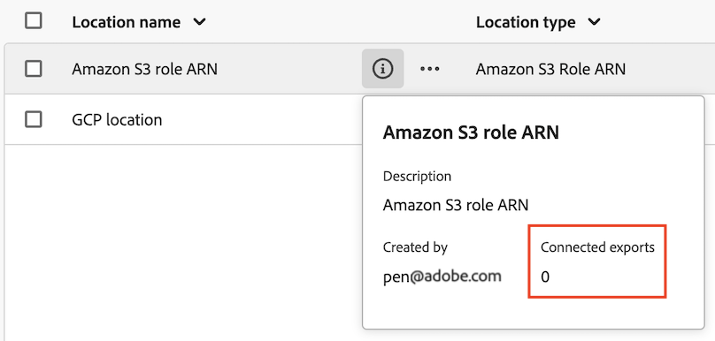

# Hantera platser och konton för molnexport

Du kan visa, redigera och ta bort platser för molnexport.

Mer information om hur du skapar en ny plats finns i [Konfigurera platser för molnexport](/help/components/exports/cloud-export-locations.md).

## Filtrera och söka efter platser

Om du vill hitta den information du behöver kan du antingen filtrera platslistan eller söka efter en plats.

### Filtrera listan med platser

1. I Customer Journey Analytics väljer du [!UICONTROL **Komponenter**] > [!UICONTROL **Export**].

1. Välj [!UICONTROL **Platser**] -fliken.

1. Välj **Filter** -ikon.

   <!-- add screenshot -->

   Du kan filtrera efter följande kriterier:

   | Filter | Beskrivning |
   |---------|----------|
   | [!UICONTROL **Platstyp**]<!--should this be changed to Account type?--> | Kontotypen som platsen är associerad med. Följande kontotyper kan vara tillgängliga: <ul><li>[!UICONTROL **AEP Data Landing Zone**]</li><li>[!UICONTROL **Amazon S3 Role ARN**]</li><li>[!UICONTROL **Google Cloud Platform**]</li><li>[!UICONTROL **Azure SAS**]</li><li>[!UICONTROL **Azure RBAC**]</li><li>[!UICONTROL **Snowflake**]</li></ul> |
   | [!UICONTROL **Konto**] | Namnet på kontot som platsen är associerad med. |
   | [!UICONTROL **Skapad av**] | E-postadressen till användaren som skapade platsen. |

   {style="table-layout:auto"}

### Sök efter platser

1. I Customer Journey Analytics väljer du [!UICONTROL **Komponenter**] > [!UICONTROL **Export**].

1. Välj [!UICONTROL **Platser**] -fliken.

1. På sökfliken börjar du skriva in information som är kopplad till den plats du söker efter. Du kan söka efter data från alla kolumner som är tillgängliga i tabellen.

## Redigera platser

1. I Customer Journey Analytics väljer du [!UICONTROL **Komponenter**] > [!UICONTROL **Export**].

1. Välj [!UICONTROL **Platser**] väljer du sedan den plats som du vill redigera.

   <!-- add screenshot? -->

1. Välj [!UICONTROL **Redigera**].

1. Gör önskade ändringar och välj sedan [!UICONTROL **Spara**].

## Ta bort platser

Om du tar bort en plats tas även alla exporter som använder platsen bort.

Innan du tar bort en plats kontrollerar du först om den används av någon export genom att markera informationsikonen bredvid platsnamnet.

Så här tar du bort en plats:

1. I Customer Journey Analytics väljer du [!UICONTROL **Komponenter**] > [!UICONTROL **Export**].

1. Välj [!UICONTROL **Platser**] väljer du en eller flera platser som du vill ta bort.

   <!-- add screenshot? -->

1. Välj [!UICONTROL **Ta bort**] väljer [!UICONTROL **Ta bort**] igen i bekräftelsedialogrutan.

## Redigera konton

1. I Customer Journey Analytics väljer du [!UICONTROL **Komponenter**] > [!UICONTROL **Export**].

1. Välj [!UICONTROL **Platskonton**] -fliken.

   

1. Välj [!UICONTROL **Visa detaljer**] på kontot som du vill redigera.

1. Gör önskade ändringar och välj sedan [!UICONTROL **Spara**].

## Ta bort konton

1. I Customer Journey Analytics väljer du [!UICONTROL **Komponenter**] > [!UICONTROL **Export**].

1. Välj [!UICONTROL **Platskonton**] -fliken.

   

1. Markera ikonen med tre punkter på det konto som du vill redigera och välj sedan [!UICONTROL **Ta bort konto**].

1. Välj [!UICONTROL **Ta bort**] igen i bekräftelsedialogrutan.
